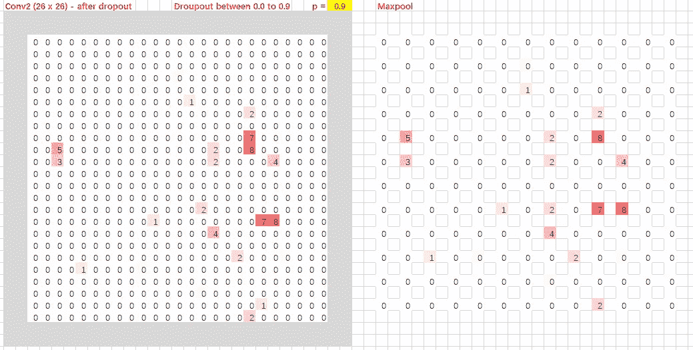
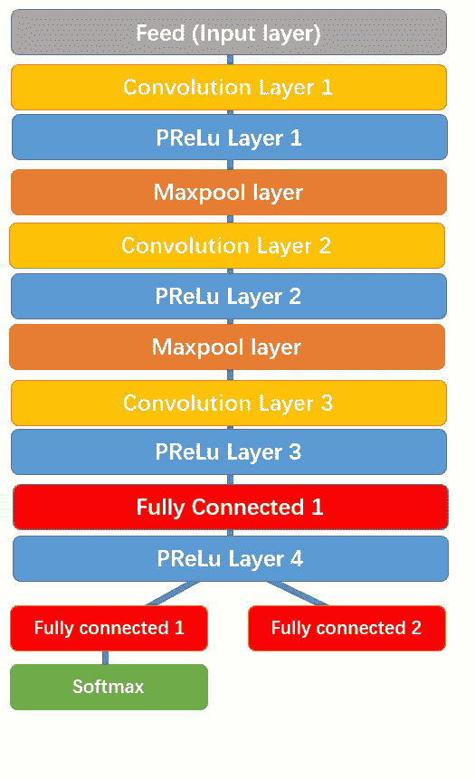
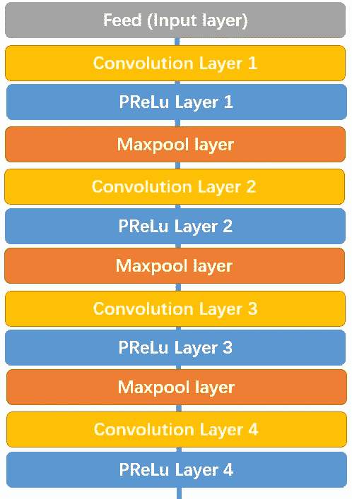
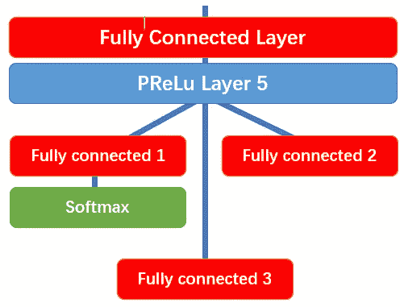

# 人脸检测神经网络是什么样子的？

> 原文：<https://towardsdatascience.com/face-detection-neural-network-structure-257b8f6f85d1?source=collection_archive---------2----------------------->

在我的[上一篇文章](https://medium.com/@reina.wang/mtcnn-face-detection-cdcb20448ce0)中，我探索了多任务级联卷积网络(MTCNN)模型，用它来通过我的网络摄像头检测人脸。在这篇文章中，我将研究神经网络的结构。

MTCNN 模型由 3 个独立的网络组成:P 网、R 网和 O 网:


Image 1: MTCNN Structure // [Source](https://arxiv.org/ftp/arxiv/papers/1604/1604.02878.pdf)

对于我们传入的每个图像，网络都会创建一个图像金字塔:也就是说，它会创建该图像的多个不同大小的副本。


Image 2: Image Pyramid // [Source](https://arxiv.org/ftp/arxiv/papers/1604/1604.02878.pdf)

在 P-Net 中，对于每个缩放的图像，一个 12×12 的内核在图像中运行，以搜索人脸。在下图中，红色方块代表内核，它缓慢地在图像中上下移动，搜索人脸。


Image 3: 12x12 kernel in the top right corner. After scanning this corner, it shifts sideways (or downwards) by 1 pixel, and continues doing that until it has gone through the entire image.

在这些 12x12 内核的每一个中，3 个卷积与 3x3 内核一起运行(如果你不知道卷积是什么，请查看[我的另一篇文章](https://medium.com/@reina.wang.tw/what-is-a-neural-network-6010edabde2b)或[本网站](http://setosa.io/ev/image-kernels/))。在每一个卷积层之后，一个预层被执行(当你把每一个负像素乘以一个特定的数字‘alpha’。“α”将通过训练来确定)。此外，maxpool 层放在第一个 prelu 层之后(maxpool 每隔一个像素取出一个像素，只留下附近最大的像素)。



Image 4: Max-pool // [Source](https://youtu.be/gbceqO8PpBg)

在第三卷积层之后，网络分裂成两层。来自第三层的激活被传递到两个单独的卷积层，以及其中一个卷积层之后的 softmax 层(softmax 为每个结果分配十进制概率，并且概率总计为 1。在这种情况下，它输出两个概率:在该区域中有**是**人脸的概率和有**不是**人脸的概率)。


Image 5: P-Net

卷积 4–1 输出一个面在每个边界框中的概率，卷积 4–2 输出边界框的坐标。

看一看 mtcnn.py 会给你展示 P-Net 的结构:

```
class PNet(Network):def _config(self):layer_factory = LayerFactory(self)layer_factory.new_feed(name='data', layer_shape=(None, None, None, 3))layer_factory.new_conv(name='conv1', kernel_size=(3, 3), channels_output=10, stride_size=(1, 1),padding='VALID', relu=False)layer_factory.new_prelu(name='prelu1')layer_factory.new_max_pool(name='pool1', kernel_size=(2, 2), stride_size=(2, 2))layer_factory.new_conv(name='conv2', kernel_size=(3, 3), channels_output=16, stride_size=(1, 1),padding='VALID', relu=False)layer_factory.new_prelu(name='prelu2')layer_factory.new_conv(name='conv3', kernel_size=(3, 3), channels_output=32, stride_size=(1, 1),padding='VALID', relu=False)layer_factory.new_prelu(name='prelu3')layer_factory.new_conv(name='conv4-1', kernel_size=(1, 1), channels_output=2, stride_size=(1, 1), relu=False)layer_factory.new_softmax(name='prob1', axis=3)layer_factory.new_conv(name='conv4-2', kernel_size=(1, 1), channels_output=4, stride_size=(1, 1),input_layer_name='prelu3', relu=False)
```

R-Net 具有类似的结构，但是具有更多的层。它以 P-网包围盒作为其输入，并改进其坐标。



Image 6: R-Net

类似地，R-Net 最终分成两层，给出两个输出:新边界框的坐标和机器对每个边界框的置信度。同样，mtcnn.py 包括 R-Net 的结构:

```
class RNet(Network):def _config(self):layer_factory = LayerFactory(self)layer_factory.new_feed(name='data', layer_shape=(None, 24, 24, 3))layer_factory.new_conv(name='conv1', kernel_size=(3, 3), channels_output=28, stride_size=(1, 1),padding='VALID', relu=False)layer_factory.new_prelu(name='prelu1')layer_factory.new_max_pool(name='pool1', kernel_size=(3, 3), stride_size=(2, 2))layer_factory.new_conv(name='conv2', kernel_size=(3, 3), channels_output=48, stride_size=(1, 1),padding='VALID', relu=False)layer_factory.new_prelu(name='prelu2')layer_factory.new_max_pool(name='pool2', kernel_size=(3, 3), stride_size=(2, 2), padding='VALID')layer_factory.new_conv(name='conv3', kernel_size=(2, 2), channels_output=64, stride_size=(1, 1),padding='VALID', relu=False)layer_factory.new_prelu(name='prelu3')layer_factory.new_fully_connected(name='fc1', output_count=128, relu=False) layer_factory.new_prelu(name='prelu4')layer_factory.new_fully_connected(name='fc2-1', output_count=2, relu=False) layer_factory.new_softmax(name='prob1', axis=1)layer_factory.new_fully_connected(name='fc2-2', output_count=4, relu=False, input_layer_name='prelu4')
```

最后，O-Net 将 R-Net 包围盒作为输入，并记下面部标志的坐标。



Image 7: O-Net

O-Net 最终分成 3 层，给出 3 种不同的输出:人脸在框中的概率、边界框的坐标和面部标志的坐标(眼睛、鼻子和嘴的位置)。以下是 O-Net 的代码:

```
class ONet(Network):def _config(self):layer_factory = LayerFactory(self)layer_factory.new_feed(name='data', layer_shape=(None, 48, 48, 3))layer_factory.new_conv(name='conv1', kernel_size=(3, 3), channels_output=32, stride_size=(1, 1),padding='VALID', relu=False)layer_factory.new_prelu(name='prelu1')layer_factory.new_max_pool(name='pool1', kernel_size=(3, 3), stride_size=(2, 2))layer_factory.new_conv(name='conv2', kernel_size=(3, 3), channels_output=64, stride_size=(1, 1),padding='VALID', relu=False)layer_factory.new_prelu(name='prelu2')layer_factory.new_max_pool(name='pool2', kernel_size=(3, 3), stride_size=(2, 2), padding='VALID')layer_factory.new_conv(name='conv3', kernel_size=(3, 3), channels_output=64, stride_size=(1, 1),padding='VALID', relu=False)layer_factory.new_prelu(name='prelu3')layer_factory.new_max_pool(name='pool3', kernel_size=(2, 2), stride_size=(2, 2))layer_factory.new_conv(name='conv4', kernel_size=(2, 2), channels_output=128, stride_size=(1, 1),padding='VALID', relu=False)layer_factory.new_prelu(name='prelu4')layer_factory.new_fully_connected(name='fc1', output_count=256, relu=False)layer_factory.new_prelu(name='prelu5')layer_factory.new_fully_connected(name='fc2-1', output_count=2, relu=False)layer_factory.new_softmax(name='prob1', axis=1)layer_factory.new_fully_connected(name='fc2-2', output_count=4, relu=False, input_layer_name='prelu5')layer_factory.new_fully_connected(name='fc2-3', output_count=10, relu=False, input_layer_name='prelu5')
```

注意，P-Net、R-Net 和 O-Net 的所有代码都导入了一个名为“LayerFactory”的类。本质上，LayerFactory 是一个类，由该模型的制作者创建，用于生成具有特定设置的层。有关更多信息，您可以查看 layer_factory.py。

点击[此处](https://medium.com/@reina.wang/mtcnn-face-detection-cdcb20448ce0)阅读实现 MTCNN 模型！

点击[此处](https://medium.com/@reina.wang/how-does-a-face-detection-program-work-using-neural-networks-17896df8e6ff)阅读 MTCNN 模式如何运作！

点击此处下载 MTCNN 论文和资源:

Github 下载:【https://github.com/ipazc/mtcnn 

研究文章:[http://arxiv.org/abs/1604.02878](http://arxiv.org/abs/1604.02878)