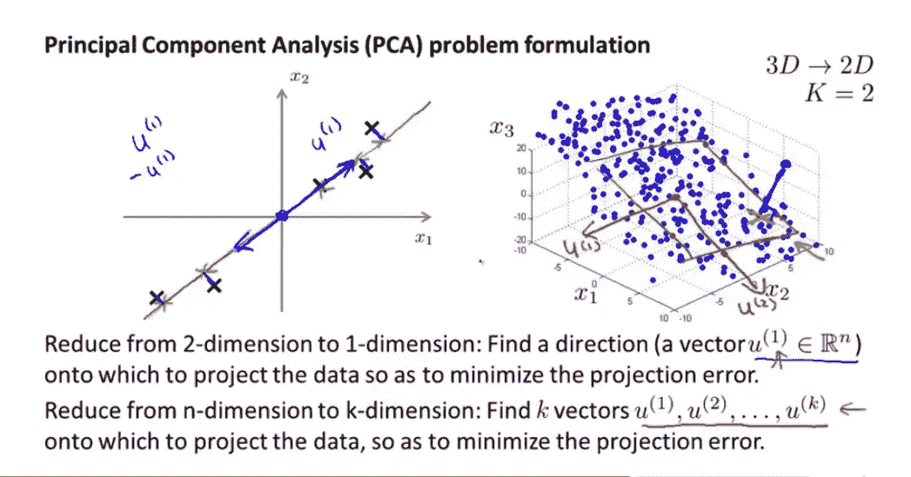
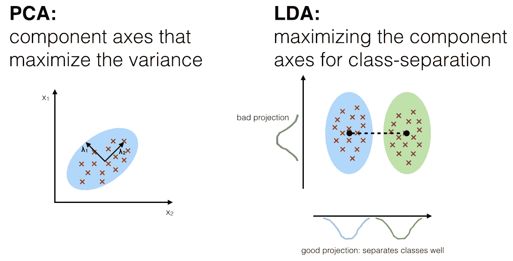
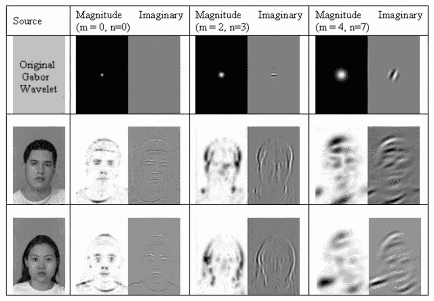
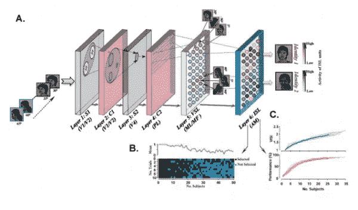
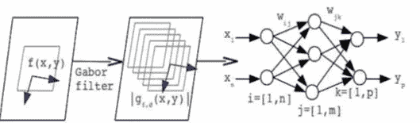
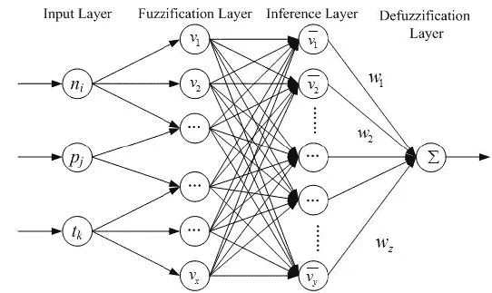

# 面向初学者的人脸识别

> 原文：<https://towardsdatascience.com/face-recognition-for-beginners-a7a9bd5eb5c2?source=collection_archive---------0----------------------->

ace 识别是一种识别技术，用于检测其图像保存在数据集中的个人的面部。尽管其他身份识别方法可能更准确，但人脸识别一直是研究的一个重要焦点，因为它的非干涉性质，因为它是人们进行个人身份识别的简便方法。

# 人脸识别方法:-

人脸识别有以下几种不同的方法

# ***1。几何基础/模板基础:-***

人脸识别算法分为基于几何或基于模板的算法。基于模板的方法可以使用统计工具来构建，如 SVM[支持向量机]、PCA[主成分分析]、LDA[线性判别分析]、核方法或迹变换。基于几何特征的方法分析局部面部特征及其几何关系。它也被称为基于特征的方法。

# ***2。零碎/整体:-***

元素之间的关系或功能的连接与整个面部没有经历到的数量，许多研究人员遵循这种方法，试图推导出最相关的特征。一些方法试图使用眼睛、特征的组合等等。一些隐马尔可夫模型方法也属于这一类，特征处理在人脸识别中非常有名。

# ***3。基于外观/基于模型:-***

基于外观的方法显示关于几幅图像的人脸。被认为是高维向量的图像。这种技术通常用于从图像分割中导出特征空间。与训练集比较的样本图像。另一方面，基于模型的方法试图对人脸建模。对模型实现的新样本和用于识别图像的模型参数。

基于外观的方法可以分为线性或非线性。Ex- PCA、LDA、IDA 用于直接方法，而核 PCA 用于非线性方法。另一方面，在基于模型的方法可以归类为 2D 或三维弹性束图匹配使用。

# ***4。基于模板/统计/神经网络:-***

## ***4.1 .模板匹配:-***

在模板匹配中，模式由样本、模型、像素、纹理等表示。识别函数通常是相关性或距离度量。

## ***4.2 .统计方法:-***

在统计学方法中，用特征表示的模式。判别函数中的识别函数。每个图像都代表了三维特征。因此，目标是选择和应用正确的统计工具进行提取和分析。

用于人脸识别的统计工具有很多。这些分析工具用在两个或多个组或分类方法中。这些工具如下-

## ***4.2.1 .主成分分析【PCA】:-***

使用和引用最多的统计方法之一是主成分分析。数学过程通过提取多维数据的主成分来执行维度缩减。



Dimension reduction from 3D to 2D image

## **T5 4 . 2 . 2 .离散余弦变换【DCT】:-**

它表示关于不同振荡频率的余弦函数和的一系列数据点。离散余弦变换基于傅立叶离散变换，因此，通过压缩变化，它可以用于变换图像，并允许有效的维数减少。

## ***4.2.3 .线性判别分析【LDA】:-***

LDA 广泛用于寻找特征的线性组合，同时保持类的可分性。与 PCA 不同，LDA 试图对级别之间的差异进行建模。对于每个级别，LDA 获得多个投影向量的差值。



PCA vs LDA

## ***4.2.4 .局部保持投影【LPP】:-***

他和代代木介绍了 LPP。它是保持局部结构和设计的 PCA 的最佳替代方案。模式识别算法通常搜索最近的模式或邻居。因此，维护 LLP 质量的地方可以加快认识。

## ***4.2.5.Gabor 小波:-***

在这种算法中，它表明来自哺乳动物大脑视觉皮层的神经生理学数据证据表明，视觉皮层中的简单细胞可以视为一族自相似的 2D Gabor 小波。Daugman 提出的 Gabor 函数是局部空间带通滤波器，其实现了 2D 空间和 2D 傅立叶域中信息的联合分辨率的理论极限。



Gabor Wavelet in different magnitude

## ***4.2.6 .独立分量分析【ICA】:-***

ICA 旨在将数据转换为统计上独立的数据点的线性组合。因此，其目标是提供独立而非不相关的图像表示。ICA 是 PCA 替代方案，它给出了更强大的数据表示。这是一种判别分析准则，可用于增强 PCA。

## ***4.2.7 .内核主成分分析:-***

Scholkopf 等人介绍了使用核函数来执行非线性 PCA。其基本方法是对输入应用非线性映射，然后在得到的特征子空间中求解线性 PCA。

## ***4.3 .神经网络:-***

神经网络继续使用模式识别和分类。Kohonen 是第一个证明神经元网络可以用来识别对齐和标准化的面孔的人。存在使用神经网络执行特征提取的方法。有很多方法可以结合 PCA 或 LCA 等工具，组成混合分类器用于人脸识别。这些如具有附加偏差前馈神经网络、具有 PCA 的自组织映射和具有多层感知的卷积神经网络等。这些可以提高模型的效率。



Deep Neural Network for Face Recognition

## ***4.3.1 .具有 Gabor 滤波器的神经网络:-***

该算法通过使用反向传播算法实现多层感知器来实现人脸识别。首先，有一个预处理步骤。每幅图像在对比度和光照阶段进行标准化。然后，通过 Gabor 滤波器处理每幅图像。伽柏滤波器有五个方向参数和三个空间频率，因此有 15 个伽柏波长。



Neural Networks with Gabor filters

## ***4.3.2 .神经网络和隐马尔可夫模型:-***

隐马尔可夫模型是一种用于人脸识别的统计工具。它们与神经网络一起使用。它在训练伪 2D HMM 的神经网络中生成。这个 2D HMM 过程的输入是 ANN 的输出，它为算法提供适当的维数缩减。

## ***4.3.3 .模糊神经网络:-***

用于人脸识别的模糊神经网络于 2009 年推出。这是一个使用多层感知器的人脸识别系统。这种方法背后的概念是捕捉非线性流形中的决策面，这是一个简单的 MLP 很难完成的任务。使用 Gabor 波长变换获得特征向量。



Fuzzy Neural Network

# 人脸识别的工作原理

人脸识别有很多种方法。这里我们使用 OpenCV 进行人脸识别。在人脸识别中，首先对图像进行预处理，然后训练人脸识别器来识别人脸。教完识别器后，我们测试识别器看看结果。OpenCV 人脸识别器有以下三种类型

## **1。特征脸人脸识别器**

EigenFaces 人脸识别器将所有字符的所有训练图像视为一个复合体，并尝试推断其组成部分。这些成分是必要的和有帮助的(抓住最大变化/改变的部分),并丢弃图像的其余部分，这样它不仅从训练数据中提取必要的元素，而且通过拒绝不太重要的片段来节省存储器。

## **2。鱼脸识别器**

Fisherfaces 算法不是获得代表所有人的所有面部的有用特征，而是移除区分一个人和其他人的有价值的特征。一个人的这种特征并不支配其他人，你有区别一个人和其他人的特征。

## **3。局部二元模式直方图**

我们知道本征脸和鱼脸都受光线影响，在现实生活中也是如此；我们不能保证完美的光线条件。LBPH 人脸识别器是克服这一缺点的改进。这个想法不是找到图像的局部特征。LBPH 算法试图找到图像的局部结构，它是通过将每个像素与其相邻像素进行比较来实现的。

# 如何运行人脸识别:-

```
**#import OpenCV module**
import cv2
import os
import numpy as np
import matplotlib.pyplot as plt
%matplotlib inline**#function to detect face**
def detect_face (img):**#convert the test image to gray image**
gray = cv2.cvtColor (img, cv2.COLOR_BGR2GRAY)**#load OpenCV face detector**
face_cas = cv2.CascadeClassifier ('-File name.xml-')
faces = face_cas.detectMultiScale (gray, scaleFactor=1.3, minNeighbors=4);**#if no faces are detected then return image**
if (len (faces) == 0):
return None, None**#extract the face**
faces [0]=(x, y, w, h)**#return only the face part**
return gray[y: y+w, x: x+h], faces [0]**#this function will read all persons' training images, detect face #from each image
#and will return two lists of exactly same size, one list** def prepare_training_data(data_folder_path):**#------STEP-1--------
#get the directories (one directory for each subject) in data folder** dirs = os.listdir(data_folder_path)
faces = []
labels = []
for dir_name in dirs:**#our subject directories start with letter 's' so
#ignore any non-relevant directories if any** if not dir_name.startswith("s"):
continue;**#------STEP-2--------
#extract label number of subject from dir_name
#format of dir name = slabel
#, so removing letter 's' from dir_name will give us label** label = int(dir_name.replace("s", ""))**#build path of directory containin images for current subject subject
#sample subject_dir_path = "training-data/s1"** subject_dir_path = data_folder_path + "/" + dir_name**#get the images names that are inside the given subject directory** subject_images_names = os.listdir(subject_dir_path)**#------STEP-3--------
#go through each image name, read image,
#detect face and add face to list of faces** for image_name in subject_images_names:**#ignore system files like .DS_Store** if image_name.startswith("."):
continue;**#build image path
#sample image path = training-data/s1/1.pgm** image_path = subject_dir_path + "/" + image_name**#read image** image = cv2.imread(image_path)**#display an image window to show the image** cv2.imshow("Training on image...", image)
cv2.waitKey(100)**#detect face** face, rect = detect_face(image)**#------STEP-4--------
#we will ignore faces that are not detected** if face is not None:**#add face to list of faces** faces.append(face)**#add label for this face** labels.append(label)
cv2.destroyAllWindows()
cv2.waitKey(1)
cv2.destroyAllWindows()
return faces, labels**#let's first prepare our training data
#data will be in two lists of same size
#one list will contain all the faces
#and other list will contain respective labels for each face** print("Preparing data...")
faces, labels = prepare_training_data("training-data")
print("Data prepared")**#print total faces and labels** print("Total faces: ", len(faces))
print("Total labels: ", len(labels))**#create our LBPH face recognizer** face_recognizer = cv2.face.createLBPHFaceRecognizer()**#train our face recognizer of our training faces** face_recognizer.train(faces, np.array(labels))**#function to draw rectangle on image
#according to given (x, y) coordinates and
#given width and heigh** def draw_rectangle(img, rect):
(x, y, w, h) = rect
cv2.rectangle(img, (x, y), (x+w, y+h), (0, 255, 0), 2)**#function to draw text on give image starting from
#passed (x, y) coordinates.** def draw_text(img, text, x, y):
cv2.putText(img, text, (x, y), cv2.FONT_HERSHEY_PLAIN, 1.5, (0, 255, 0), 2)**#this function recognizes the person in image passed
#and draws a rectangle around detected face with name of the subject** def predict(test_img):**#make a copy of the image as we don't want to chang original image** img = test_img.copy()**#detect face from the image** face, rect = detect_face(img)**#predict the image using our face recognizer** label= face_recognizer.predict(face)**#get name of respective label returned by face recognizer** label_text = subjects[label]**#draw a rectangle around face detected** draw_rectangle(img, rect)**#draw name of predicted person** draw_text(img, label_text, rect[0], rect[1]-5)
return img**#load test images** test_img1 = cv2.imread("test-data/test1.jpg")
test_img2 = cv2.imread("test-data/test2.jpg")**#perform a prediction** predicted_img1 = predict(test_img1)
predicted_img2 = predict(test_img2)
print("Prediction complete")**#create a figure of 2 plots (one for each test image)** f, (ax1, ax2) = plt.subplots(1, 2, figsize=(10, 5))**#display test image1 result** ax1.imshow(cv2.cvtColor(predicted_img1, cv2.COLOR_BGR2RGB))**#display test image2 result** ax2.imshow(cv2.cvtColor(predicted_img2, cv2.COLOR_BGR2RGB))**#display both images** cv2.imshow("Tom cruise test", predicted_img1)
cv2.imshow("Shahrukh Khan test", predicted_img2)
cv2.waitKey(0)
cv2.destroyAllWindows()
cv2.waitKey(1)
cv2.destroyAllWindows()
```

> 这个博客是为那些想通过学习什么是人脸识别，它的类型以及它是如何工作的来开始他们在计算机视觉或人工智能领域的载体的初学者而写的。