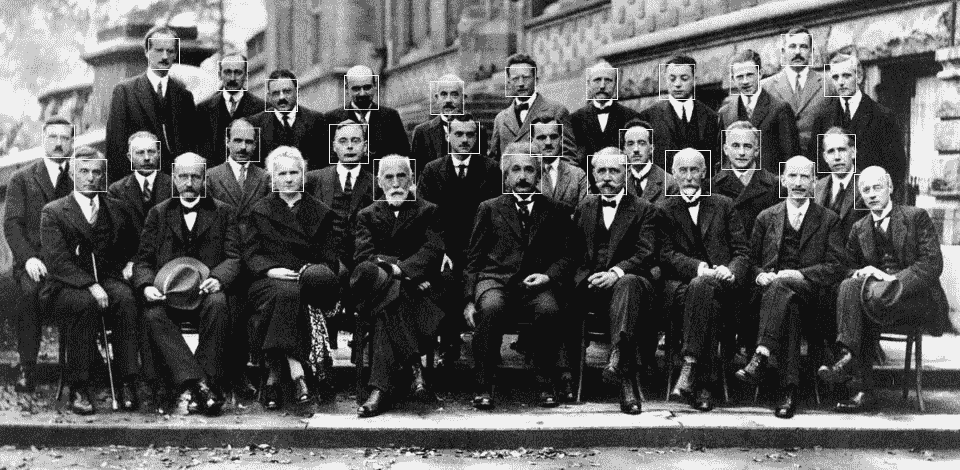
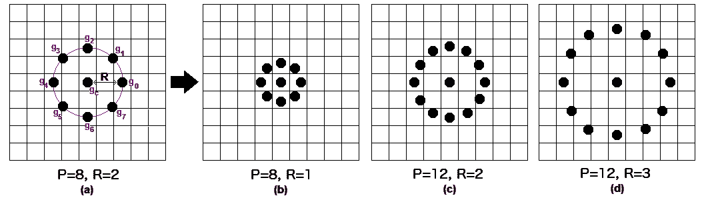
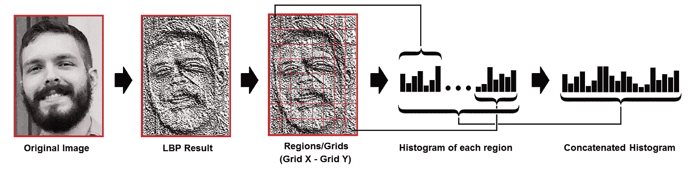
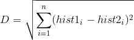

# 人脸识别:理解 LBPH 算法

> 原文：<https://towardsdatascience.com/face-recognition-how-lbph-works-90ec258c3d6b?source=collection_archive---------0----------------------->

人类每天都在自动进行人脸识别，几乎不费吹灰之力。

虽然这听起来对我们来说是一个非常简单的任务，但对计算机来说却是一个复杂的任务，因为它有许多变量会影响方法的准确性，例如:光照变化、低分辨率、遮挡等。

在计算机科学中，人脸识别基本上是根据人脸图像识别一个人的任务。在过去的二十年里，它变得非常流行，主要是因为新方法的发展和当前视频/摄像机的高质量。

注意**人脸识别**不同于**人脸检测**:

*   **人脸检测**:它的目的是找到图像中的人脸(位置和大小)，并可能提取它们以供人脸识别算法使用。
*   **面部识别**:面部图像已经被提取、裁剪、调整大小并通常转换为灰度，面部识别算法负责寻找最能描述图像的特征。

面部识别系统基本上可以在两种模式下运行:

*   **面部图像的验证或认证**:基本上是将输入的面部图像与要求认证的用户相关的面部图像进行比较。基本上就是 1x1 的对比。
*   **身份识别或面部识别**:它主要将输入的面部图像与数据集中的所有面部图像进行比较，目的是找到与该面部相匹配的用户。基本上是 1xN 的对比。

有不同类型的人脸识别算法，例如:

*   ****(1991)****
*   **[**【LBPH】**](https://en.wikipedia.org/wiki/Local_binary_patterns)**(1996)****
*   ******(1997)******
*   ****[**【尺度不变特征变换】**](https://en.wikipedia.org/wiki/Scale-invariant_feature_transform) **(1999)******
*   ****[**【加速健壮特性】 (冲浪)**](https://en.wikipedia.org/wiki/Speeded_up_robust_features) **(2006)******

****每种方法都有不同的方法来提取图像信息并执行与输入图像的匹配。然而，特征面和鱼面方法以及 SIFT 和 SURF 方法具有类似的方法。****

****今天我们要讨论一种最古老(不是最古老)也是最流行的人脸识别算法:**局部二值模式直方图(LBPH)** 。****

# ****目标****

****这篇文章的目的是尽可能简单地解释 **LBPH** ，一步一步地展示这个方法。****

****由于这是一种比较简单的人脸识别算法，我想每个人都可以理解它，没有大的困难。****

# ****介绍****

> ******局部二进制模式** (LBP)是一个简单但非常有效的纹理算子，它通过对每个像素的邻域进行阈值处理来标记图像的像素，并将结果视为二进制数。****

****它在 1994 年首次被描述(LBP ),并且已经被发现是纹理分类的强大特征。已经进一步确定，当 LBP 与方向梯度直方图(HOG)描述符结合时，它在一些数据集上显著提高了检测性能。****

****使用 LBP 结合直方图，我们可以用简单的数据向量来表示人脸图像。****

****因为 LBP 是视觉描述符，所以它也可以用于面部识别任务，正如在下面的逐步解释中可以看到的。****

******注**:你可以在这里阅读更多关于 LBPH:[http://www.scholarpedia.org/article/Local_Binary_Patterns](http://www.scholarpedia.org/article/Local_Binary_Patterns)****

# ****循序渐进****

****现在，我们对人脸识别和 LBPH 有了更多的了解，让我们更进一步，看看算法的步骤:****

1.  ******参数**:LBPH 使用 4 个参数:****

*   ******半径**:半径用于构建圆形局部二值模式，代表中心像素周围的半径。它通常设置为 1。****
*   ******邻居**:构建圆形局部二值模式的样本点数。请记住:包含的样本点越多，计算成本就越高。通常设置为 8。****
*   ******网格 X** :水平方向的单元格个数。单元越多，网格越细，得到的特征向量的维度越高。通常设置为 8。****
*   ******网格 Y** :垂直方向的单元格个数。单元越多，网格越细，得到的特征向量的维度越高。通常设置为 8。****

****现在不用担心参数，看完后面的步骤你就明白了。****

******2。** **训练算法**:首先，我们需要训练算法。为此，我们需要使用一个包含我们想要识别的人的面部图像的数据集。我们还需要为每张图像设置一个 ID(它可能是一个数字或人名)，因此算法将使用这些信息来识别输入图像并给你一个输出。同一个人的图像必须有相同的 ID。训练集已经构建好了，让我们看看 LBPH 的计算步骤。****

******3。应用 LBP 操作**:LBPH 的第一个计算步骤是创建一个中间图像，通过突出面部特征，以更好的方式描述原始图像。为此，该算法使用滑动窗口的概念，基于参数**半径**和**邻居**。****

****下图显示了此过程:****

********

****根据上面的图片，让我们把它分成几个小步骤，这样我们就可以很容易地理解它:****

*   ****假设我们有一张灰度的面部图像。****
*   ****我们可以得到这个图像的一部分，作为一个 3x3 像素的窗口。****
*   ****也可以表示为包含每个像素(0~255)强度的 3x3 矩阵。****
*   ****然后，我们需要取矩阵的中心值作为阈值。****
*   ****该值将用于定义来自 8 个邻居的新值。****
*   ****对于中心值(阈值)的每个邻居，我们设置一个新的二进制值。我们将等于或高于阈值的值设置为 1，将低于阈值的值设置为 0。****
*   ****现在，矩阵将只包含二进制值(忽略中心值)。我们需要将矩阵中每个位置的每个二进制值逐行连接成一个新的二进制值(例如 10001101)。注意:一些作者使用其他方法连接二进制值(例如顺时针方向)，但最终结果将是相同的。****
*   ****然后，我们将这个二进制值转换为十进制值，并将其设置为矩阵的中心值，这实际上是原始图像的一个像素。****
*   ****在这个过程(LBP 过程)的最后，我们有一个新的图像，它更好地代表了原始图像的特征。****
*   ******注**:LBP 程序被扩展为使用不同数量的半径和邻居，它被称为圆形 LBP。****

********

****可以通过使用**双线性插值**来完成。如果某个数据点在像素之间，它将使用最近的 4 个像素(2x2)的值来估计新数据点的值。****

******4。提取直方图**:现在，使用上一步生成的图像，我们可以使用**网格 X** 和**网格 Y** 参数将图像分成多个网格，如下图所示:****

********

****根据上面的图像，我们可以提取每个区域的直方图如下:****

*   ****由于我们有一个灰度图像，每个直方图(来自每个网格)将只包含 256 个位置(0~255 ),代表每个像素强度的出现。****
*   ****然后，我们需要连接每个直方图来创建一个新的更大的直方图。假设我们有 8×8 的网格，在最终的直方图中我们将有 8×8×256 = 16.384 个位置。最终的直方图表示图像原始图像的特征。****

****LBPH 算法差不多就是这样。****

******5。执行面部识别**:在这个步骤中，算法已经被训练。创建的每个直方图用于表示来自训练数据集的每个图像。因此，给定一个输入图像，我们对这个新图像再次执行这些步骤，并创建一个代表该图像的直方图。****

*   ****因此，要找到与输入图像匹配的图像，我们只需比较两个直方图，并返回直方图最接近的图像。****
*   ****我们可以使用各种方法来比较直方图(计算两个直方图之间的距离)，例如:**欧氏距离**、**卡方**、**绝对值**等。在本例中，我们可以根据以下公式使用欧几里德距离(这是众所周知的):****

********

*   ****因此，算法输出是直方图最接近的图像的 ID。该算法还应返回计算出的距离，该距离可用作'**置信度**'度量。**注意**:不要被“置信度”这个名称所迷惑，因为置信度越低越好，因为这意味着两个直方图之间的距离越近。****
*   ****然后，我们可以使用阈值和“置信度”来自动估计算法是否正确识别了图像。我们可以假设该算法已经成功识别了置信度是否低于定义的阈值。****

# ****结论****

*   ****LBPH 是最简单的人脸识别算法之一。****
*   ****它可以表示图像中的局部特征。****
*   ****有可能获得很大的成果(主要是在可控的环境下)。****
*   ****它对单调的灰度变换是鲁棒的。****
*   ****由 [OpenCV](https://opencv.org/) 库(开源计算机视觉库)提供。****

# ****LBPH 算法****

****我正在用 [**Go**](https://golang.org/) 编程语言实现 **LBPH** 算法。[项目](https://github.com/kelvins/lbph)可在 [**Github**](https://github.com/) 上获得，并在 [**MIT 许可**](https://github.com/kelvins/lbph/blob/master/LICENSE) 下发布，因此请随意为该项目做出贡献(欢迎任何贡献)。
**链接到项目**:[https://github.com/kelvins/lbph](https://github.com/kelvins/lbph)****

******注**:结论中提到的 **LBPH** 也是由 [**OpenCV 库**](https://opencv.org/) 提供的。OpenCV 库可以被许多编程语言使用(例如 C++、Python、Ruby、Matlab)。****

****如果你喜欢这个故事，请鼓掌。这激励我写更多关于人脸识别的故事。****

# ****参考****

*   ****阿霍宁、蒂莫、阿卜杜努尔·哈迪德和马蒂·皮蒂凯宁。**局部二值模式人脸描述:应用于人脸识别**。IEEE 模式分析与机器智能汇刊 28.12(2006):2037–2041。****
*   ****奥哈拉、提莫、马蒂·皮蒂凯宁和托皮·马恩帕。**多分辨率灰度和旋转不变纹理分类与局部二值模式**。IEEE 模式分析与机器智能汇刊 24.7(2002):971–987。****
*   ****阿霍宁、蒂莫、阿卜杜勒努尔·哈迪德和马蒂·皮蒂凯宁。**用局部二值模式进行人脸识别**。计算机视觉-eccv 2004(2004):469–481。****
*   ****LBPH OpenCV:[https://docs . OpenCV . org/2.4/modules/contrib/doc/facerec/facerec _ tutorial . html # local-binary-patterns-histograms](https://docs.opencv.org/2.4/modules/contrib/doc/facerec/facerec_tutorial.html#local-binary-patterns-histograms)****
*   ****本地二进制模式:[http://www.scholarpedia.org/article/Local_Binary_Patterns](http://www.scholarpedia.org/article/Local_Binary_Patterns)****