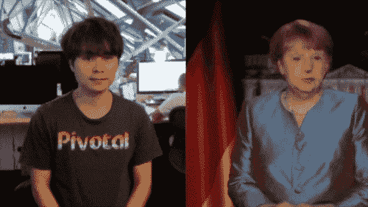
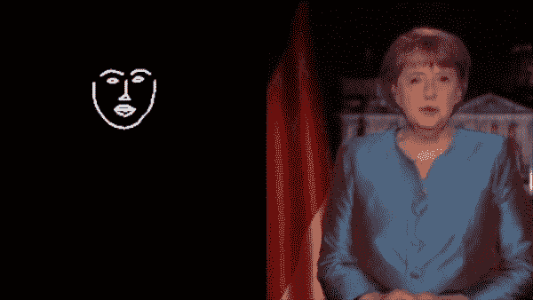
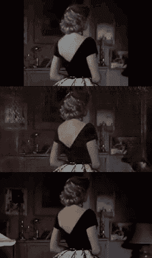
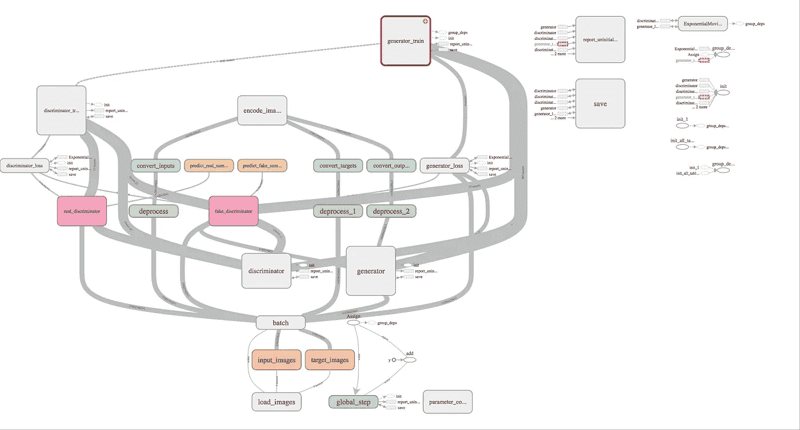
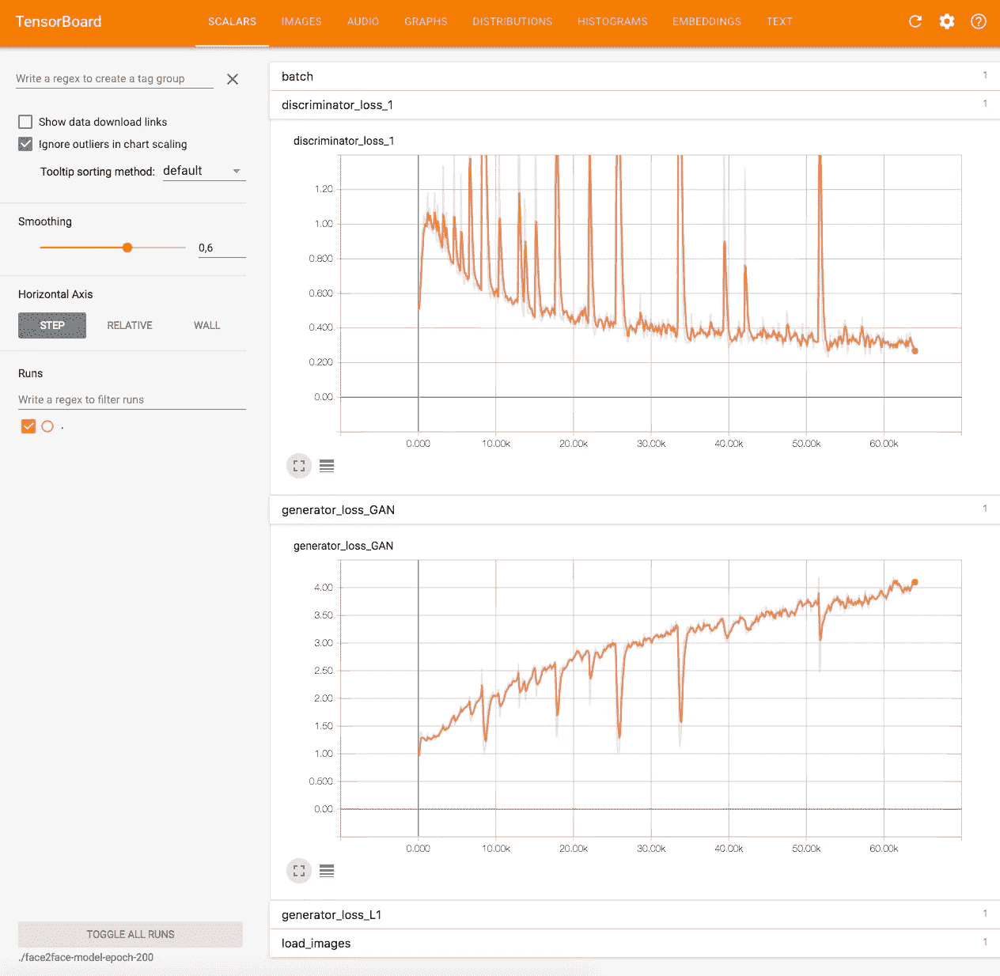
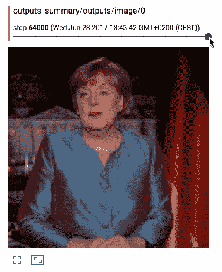
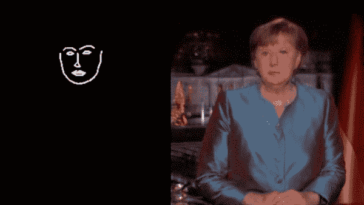

# face 2 face——模仿德国总理面部表情的 Pix2Pix 演示

> 原文：<https://towardsdatascience.com/face2face-a-pix2pix-demo-that-mimics-the-facial-expression-of-the-german-chancellor-b6771d65bf66?source=collection_archive---------0----------------------->

受吉恩·科岗工作室的启发，我制作了自己的 face2face 演示，可以在 2017 年德国总理发表新年演讲时将我的网络摄像头图像翻译成她的样子。它还不完美，因为这个模型还有一个问题，例如，学习德国国旗的位置。然而，这个模特已经很好地模仿了她的面部表情，考虑到我在这个项目上的有限时间，我对结果很满意。

这就是了😃

Face2face demo with the original video input.

这也是另一个版本，它把我的面部标志作为输入。

Face2face demo with the detected facial landmarks.

如果你有兴趣创建自己的演示或者只是自己运行它， [Github repositor](https://github.com/datitran/face2face-demo) y 包含了你需要的一切。当然，你应该继续阅读！😁

# 动机

几周前，我参加了在柏林艺术博物馆举行的[吉恩·科岗](http://genekogan.com/)关于 [pix2pix](https://phillipi.github.io/pix2pix/) 和深度生成模型的研讨会。在那里，他展示了几个利用生成模型的艺术项目。他展示的其中一个项目是他自己的，他使用面部追踪器创建了一个能够模仿特朗普的生成模型:

这种演示真的让我耳目一新，因为我在工作中通常不会接触这类项目。在这次研讨会后，我决定创建自己的项目，类似于 Gene 用面部追踪器做的项目，但用的是不同的人。

# 生成培训数据

我要做的第一件事是创建数据集。为此，我使用了 [Dlib 的姿势估计器](http://dlib.net/face_landmark_detection.py.html)，它可以检测一张脸上的 68 个标志(嘴、眉毛、眼睛等……)以及 OpenCV 来处理视频文件:

*   检测面部标志是两个阶段的过程。首先，使用[面部检测器](https://github.com/davisking/dlib/blob/master/examples/face_detection_ex.cpp)来检测面部，然后对检测到的面部应用姿态估计器。
*   姿势估计器是论文的一个实现:[一毫秒人脸对齐与回归树集合](https://pdfs.semanticscholar.org/d78b/6a5b0dcaa81b1faea5fb0000045a62513567.pdf)由瓦希德·卡泽米和约瑟芬·苏利文于 2014 年在 CVPR 发表
*   我遇到的一个问题是，在我第一次实现时，面部标志检测器非常滞后(非常低的每秒帧数-fps)。我发现输入框太大了。将帧的大小缩小到四分之一会大大提高 fps。在 Satya Mallick 的另一篇博客文章中，他也建议跳过帧，但我没有这样做，因为 fps 现在已经足够好了。但是，我可以在以后尝试这种方法来进一步提高性能。
*   我在 YouTube 上查找了几个潜在的视频，我可以用它们来创建从采访到名人演讲的数据。最后，我决定用[安格拉·默克尔(德国总理)的 2017 年新年致辞](https://youtu.be/mJEKql2QV48)。这个视频特别适合，因为相机的位置是静态的，所以我可以用她的脸和背景的相同位置得到很多图像。

One sample of the training data.

# 训练模型

幸运的是，在研讨会上，Gene 还指出了一些现有的生成模型的代码库，如 pix2pix。所以我不需要做很多研究。对于模型的训练，我使用了 Daniel Hesse 令人惊奇的 [pix2pix TensorFlow (TF)](https://github.com/affinelayer/pix2pix-tensorflow) 实现，这是有据可查的。丹尼尔也在他自己的博客上对 [pix2pix 做了很好的介绍。如果你没看过，你应该看看！*剧透:*还利用了 hello kitty！🐱](https://affinelayer.com/pix2pix/)

**备注:**

*   pix2pix 的最初实现实际上在 Torch 中，但我更喜欢 TensorFlow。
*   此外，如果你不知道 pix2pix 是什么或者一般的生成模型，你可以考虑 PCA 或自动编码器，它们的主要目标是重建。不过，与这些模型的主要区别在于，生成模型中的“重建”在生成输出数据时会涉及一些随机性。例如，如果您已经了解自动编码器的基本知识，那么[variable auto encoder](http://kvfrans.com/variational-autoencoders-explained/)是一个易于理解的生成模型。
*   Gene 也在为 Pix2Pix 编写教程。我认为它还没有完成，但在他的页面上你可以找到很多其他的展示案例，例如贾斯帕·范·洛宁的[神经城](https://jaspervanloenen.com/neural-city/)也很酷。

*   我发现的另一个[很酷的应用](https://hackernoon.com/remastering-classic-films-in-tensorflow-with-pix2pix-f4d551fa0503)是 Arthur Juliani 做的，他用 pix2pix 在 TensorFlow 中翻拍经典电影。这是我从他的文章中截取的电影[后窗](http://www.imdb.com/title/tt0047396/?ref_=nv_sr_1)的一个经过重新制作的短片:

Top: input video. Middle: pix2pix output. Bottom: original remastered version.

因此，在我克隆了 Daniel 的 repo 并用他的助手脚本处理数据后，主要的挑战是实际的训练本身，因为训练模型可能需要 1-8 个小时，这取决于 GPU 和实际设置，如时期数、图像等..关于 CPU 的培训马上被排除，因为这可能需要几个小时。和往常一样，由于我家里没有带 GPU 的机器(我知道是时候投资这样的 machine^^了)，我不得不依赖云服务。

Pix2Pix model graph in TensorFlow.

通常，我的第一选择是 AWS 和它的 G2 实例，但是这次我使用了 [FloydHub](https://www.floydhub.com/) 来代替。我必须承认，这很酷。我在《黑客新闻》上读到过，想尝试一下。好的一面是，目前当你在那里注册一个账户，你将获得 100 小时的免费 GPU，这是相当可怕的。他们也有一个非常好的 CLI 工具，比起 GUI 我更喜欢它(但是他们也有一个)。训练包含一个命令行的模型也非常容易。到目前为止，我唯一的批评是，在培训结束后，你不能像在 AWS 上那样 ssh 到容器中。有时候，你只需要改变一件事，而不需要重新上传所有的文件，如果你的文件很大，这尤其令人讨厌。不管怎样，从另一方面来说，你省钱了，但是总有好处和坏处。

然后，我终于对我生成的 400 张图片进行了实际的训练。就此而言，320 用于训练，其余用于验证。而且我用不同的历元数(5*，200，400)对模型进行了训练。训练时间因设置而异，从 6 分钟到 7 小时以上不等。

> *这更多是出于测试目的。在低位，安格拉·默克尔生成的输出非常像素化和模糊，但你已经可以很好地看到她的表情轮廓。

这是我做的一个实验的一些结果(纪元 200)。如您所见，鉴别器和生成器的学习过程非常嘈杂:

Plot for the discriminator and generator loss.

如果我们查看不同步骤的输出摘要，我们可以看到这可能是由标志引起的:

Output summary for different steps.

增加时期的数量有助于减少一点点的像素化，但是旗帜的问题仍然存在。

Detected facial landmarks and the generated output for epoch 400.

有趣的是，我注意到，根据我旋转头部的方式，旗子的位置也会发生变化。我想为了提高我的成绩，我可能需要用更多的数据来训练它。

# 为模型服务

训练完模型后，是时候在此基础上用 OpenCV 构建应用程序了。最大的挑战实际上是如何在应用程序中集成这个模型，因为 Daniel 的实现并不真正适合这个。他的实现对于训练来说是高度优化的，例如他使用[队列读入](https://www.tensorflow.org/versions/r0.12/api_docs/python/io_ops/input_pipeline)数据。这对训练真的很好，但我在为模特服务时没有看到这种必要性。此外，如您所知，在 TF 中保存模型时，会创建很多文件，如检查点、图本身的权重和元数据。但是在生产中，我们不需要任何这些元数据文件，因为我们只是希望我们的模型和它的权重很好地打包在一个文件中(如果你想知道如何做到这一点， [Morgan Giraud 写了一个关于这个的很好的教程](https://blog.metaflow.fr/tensorflow-how-to-freeze-a-model-and-serve-it-with-a-python-api-d4f3596b3adc))。因此，我不得不做了相当多的逆向工程，使它更适用于应用程序。

**注:**从 TF 1.0 开始，我们也可以使用`[tf.saved_model](https://www.tensorflow.org/api_docs/python/tf/saved_model)`保存模型。这是使用 [TensorFlow 服务](https://tensorflow.github.io/serving/)时的首选方式。但是，这种方法也会创建多个文件。通常，您会得到一个包含模型的图形定义的`save_model.pb`和一个保存其权重的`variables`文件夹。

如果你喜欢这个职位给我一个❤️.这是我第一个将深度学习用于艺术的项目。我还有一些想法想要解决。敬请关注。在 Medium [Dat Tran](https://medium.com/u/4ff6d2f67626?source=post_page-----b6771d65bf66--------------------------------) 或 twitter [@datitran](https://twitter.com/datitran) 上关注我，了解我的最新作品。