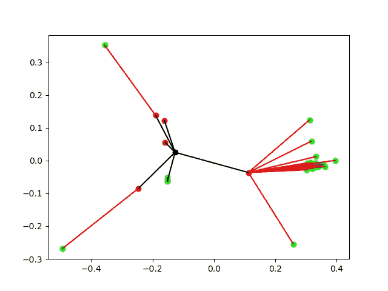
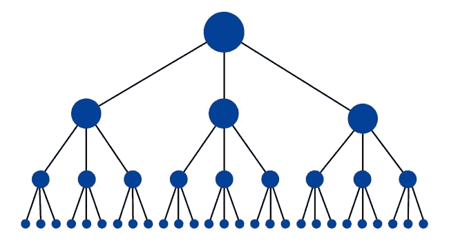
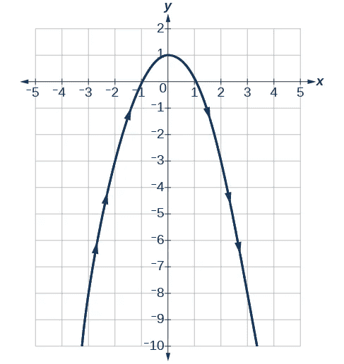
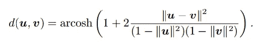
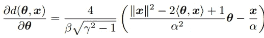
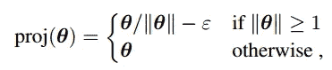
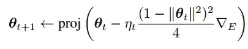
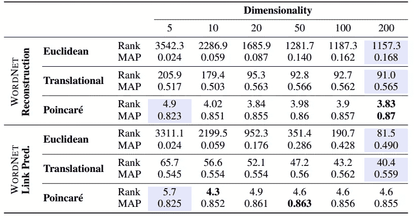

# 脸书研究中心刚刚发表了一篇关于学习层级表征的精彩论文

> 原文：<https://towardsdatascience.com/facebook-research-just-published-an-awesome-paper-on-learning-hierarchical-representations-34e3d829ede7?source=collection_archive---------3----------------------->

# 学习分层表示的庞加莱嵌入

Arxiv 链接:[https://arxiv.org/abs/1705.08039](https://arxiv.org/abs/1705.08039)

在初步阅读后，我的一位教授说:

> 这个想法很有趣，结果好得令人难以置信。

这是我给很多人看结果时他们的反应。

首先，我将向你展示我在 WordNet 的一部分上得到的结果，这样上面的不可行性图片就淡化了一点:

WordNet embeddings for Mammal (only three levels)

我只用过三级:

*   黑色一号在 0 级
*   红色的在第一层
*   绿色的在第二层。

我觉得结果不错。

在我以前的一篇文章中，[跨语言单词嵌入是什么？](https://medium.com/towards-data-science/cross-lingual-word-embeddings-what-they-are-af7987df6670)，我解释了单词嵌入。它们可以用于不同的任务，如信息检索、情感分析和无数其他任务。

类似地，我们可以嵌入图，并有像 node2vec 这样的方法，潜在空间嵌入可以帮助我们表示图，并随后进行社区检测和链接预测。
让我们从最初的 node2vec 论文开始研究这个问题→

> 在 node2vec 中，我们学习了节点到低维特征空间的映射，该映射最大化了保存节点的网络邻域的可能性。

像 word2vec 嵌入一样，我们可以使用 node2vec 嵌入来预测新的链接。假设我们有一个社交网络的数据，现在当我们嵌入节点时，通过一些距离度量，我们看到两个节点(用户)有一个小的距离，然后我们可以建议用户成为社交网络上的朋友。可能发生这种情况的一种情况是，当用户 2 是社交网络的新用户，并且获得与用户 1 相似的朋友时，给定重叠的朋友(图中的边)，用户 2 和用户 1 彼此认识的机会增加。

node2vec 嵌入有两个主要方面:

> 能够学习将来自相同网络社区的节点紧密嵌入在一起的表示，以及学习共享相似角色的节点具有相似嵌入的表示

Source: Google Images

现在考虑表示分层数据的情况，分层数据的结构像树一样

基于直觉，我们可以把它比作双曲线。
根居中，叶向外展开。

Source: Google Images

这一事实被报纸所利用:

> 为了利用这种结构特性来学习更有效的表示，我们建议不在欧几里得空间中而是在双曲空间中计算嵌入，即具有恒定负曲率的空间。非正式地，双曲空间可以被认为是树的连续版本，因此它自然地被装备来建模分层结构。

他们使用[庞加莱球模型](https://en.wikipedia.org/wiki/Poincar%C3%A9_disk_model)作为双曲空间的模型，因为它非常适合基于梯度的优化，因此也适合反向传播。

当然，当你谈论一个不同的空间时，距离的度量是不同的。在庞加莱球模型的情况下，两点`u`和`v`之间的双曲线距离由下式给出:

Source: Original paper

其中`||x||`是欧几里德范数。如果你看到维基百科给出的公式，你可能会注意到`1`已经取代了`|r|`，因为作者只取了一个半径为`1`的球。

现在，为了训练模型，我们基于这个距离创建一个优化函数，类似于 Mikolov 等人使用的负采样。

Source: Original paper

然后反向传播我们的方法来更新嵌入。

**∇e =(∂l(θ)/∂d(θ,x))*(∂d(θ,x)/∂d(θ)**

第一部分已经知道了，他们已经给出了第二部分的公式:

Source: Original Paper

他们使用了一个小技巧，这样在更新后嵌入的内容不会比模型大。为此他们部署了以下投影:

Source: Original Paper

然后，它们通过以下规则更新嵌入:

Source: Original Paper

# 结果

这是最有趣的部分

Source: Original Paper

我们可以看到，该模型在 5 维空间中实现的效果优于欧几里德模型在 200 维空间中实现的效果。

我希望你对结果感到敬畏。

**TL；博士**

他们使用双曲空间来嵌入分层数据的节点，并取得了一些超级棒的结果。

你可以在 twitter 上关注我，地址是 [@nishantiam](https://twitter.com/nishantiam) ，我在 github 上的地址是 [@nishnik](https://github.com/nishnik) 。