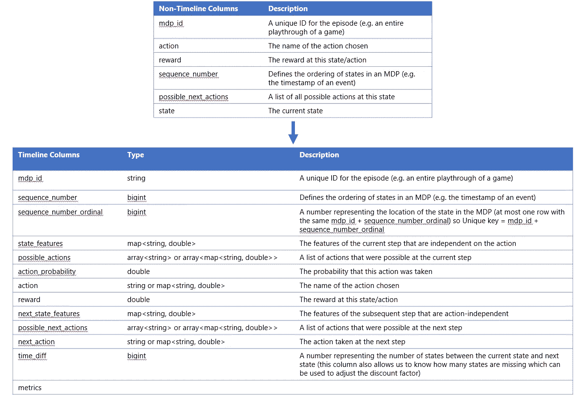

# 脸书的开源强化学习平台——深度探索

> 原文：<https://towardsdatascience.com/facebooks-open-source-reinforcement-learning-platform-a-deep-dive-313a3d9d528?source=collection_archive---------13----------------------->


脸书决定开源他们创建的平台，以解决他们正在研究的规模的端到端强化学习问题。所以我当然要试试这个。)让我们一起来看看他们是如何安装的，以及您自己应该做些什么来让它工作。

> *我开始创建一个全新的 Ubuntu 18.10 安装*
> 
> *还测试并验证了在 Linux 的 Windows 子系统上工作*

# 安装 Anaconda

让我们从安装 Anaconda 开始，这很容易通过导航到位于[https://conda.io/docs/user-guide/install/index.html](https://conda.io/docs/user-guide/install/index.html)的文档来完成，然后我们可以找到到 Linux 安装程序[https://www.anaconda.com/download/#linux](https://www.anaconda.com/download/#linux)的链接，这将为我们提供安装程序脚本:[https://repo . Anaconda . com/archive/Anaconda 3-5 . 3 . 0-Linux-x86 _ 64 . sh .](https://repo.anaconda.com/archive/Anaconda3-5.3.0-Linux-x86_64.sh.)

我们可以通过运行以下命令来下载并运行它:

```
curl https://repo.anaconda.com/archive/Anaconda3-5.3.0-Linux-x86_64.sh -o conda.sh
bash conda.sh
```

然后按照安装程序的步骤安装 Anaconda

完成后，通过以下方式将 conda 安装添加到您的`PATH`变量:

```
echo 'export PATH="$PATH":/home/<YOUR_USER>/anaconda3/bin' >> ~/.bashrc
. ~/.bashrc
```

> *注意:对于 Python 3 版本*，anaconda 的默认安装是/home/ubuntu/anaconda3

# 为我们的 Horizon 安装配置 Anaconda

脸书地平线需要几个特定软件的通道，我们可以很容易地将它们添加到 anaconda 中:

```
conda config --add channels conda-forge # ONNX/tensorboardX
conda config --add channels pytorch
```

# 安装 Horizon

> *要深入了解如何安装 Horizon，请查看 Git repo:*[*https://github . com/Facebook research/Horizon/blob/master/docs/installation . MD*](https://github.com/facebookresearch/Horizon/blob/master/docs/installation.md)

```
git clone https://github.com/facebookresearch/Horizon.git
cd Horizon/
conda install `cat docker/requirements.txt` # wait till it solved the environment, then select y
source activate base # Activate the base conda environmentpip install onnx # Install ONNX
export JAVA_HOME="$(dirname $(dirname -- `which conda`))" # Set JAVA_HOME to anaconda installation
cd # Go back to root# Install Spark 2.3.1
wget http://www-eu.apache.org/dist/spark/spark-2.3.1/spark-2.3.1-bin-hadoop2.7.tgz
tar -xzf spark-2.3.1-bin-hadoop2.7.tgz
sudo mv spark-2.3.1-bin-hadoop2.7 /usr/local/sparkexport PATH=$PATH:/usr/local/spark/bin # add to PATH so we can find spark-submit# Install OpenAI Gym
pip install "gym[classic_control,box2d,atari]"# Build Thrift Classes
cd Horizon/
thrift --gen py --out . ml/rl/thrift/core.thrift# Build Horizon
pip install -e . # we use "-e" for "ephemral package" which will instantly reflect changes in the package
```

# 地平线(全球概览)

# 介绍

Horizon 是一个端到端平台，其中*“包括模拟环境的工作流，以及用于预处理、培训和导出生产模型的分布式平台。”*——[(消息来源)](https://code.fb.com/ml-applications/horizon/)

从阅读[文件](https://research.fb.com/wp-content/uploads/2018/10/Horizon-Facebooks-Open-Source-Applied-Reinforcement-Learning-Platform.pdf)中，我们可以了解到该平台是基于以下考虑而创建的:

*   高效处理大型数据集的能力
*   能够自动高效地预处理数据
*   竞争算法性能
*   发布前的算法性能评估
*   服务于生产的柔性模型
*   平台可靠性

这听起来对我来说太棒了，所以让我们从如何利用这个平台开始，然后我们可以更深入地了解它的工作原理。

> *对于强化学习中用到的一些术语，可以随时查看我之前的* [*博文*](https://xaviergeerinck.com/rl-overview-terminology) *了解一下。*

# 入门指南

开始使用 Horizon 就像检查他们编写的[用法](https://github.com/facebookresearch/Horizon/blob/master/docs/usage.md)文档一样简单。这包括以下步骤

1.  创建培训数据
2.  将数据转换为时间线格式
3.  创建标准化参数
4.  训练模型
5.  评估模型

# 地平线—批量 RL(深潜)

现在，我们知道了 Horizon 平台的总体概念，让我们按照使用文档中所写的那样运行不同的步骤，并深入了解它们，发现幕后发生的事情。让我们从创建训练数据开始。

# 1.创建培训数据

我们的使用文档列出了我们应该通过以下命令创建训练数据:

```
# Create a directory where we will put the training data
mkdir cartpole_discrete# Generate training data
python ml/rl/test/gym/run_gym.py -p ml/rl/test/gym/discrete_dqn_cartpole_v0_100_eps.json -f cartpole_discrete/training_data.json
```

但是这实际上是做什么的呢？打开位于`ml/rl/test/gym/`中的`run_gym.py`文件，在`main()`方法中向我们展示了以下内容:

```
def main(args):
    parser = argparse.ArgumentParser(
        description="Train a RL net to play in an OpenAI Gym environment."
    )
    parser.add_argument("-p", "--parameters", help="Path to JSON parameters file.")
```

这向我们展示了当运行命令`python ml/rl/test/gym/run_gym.py`时，我们能够在控制台中看到我们的脚本的使用情况，运行该命令会导致:

```
Traceback (most recent call last):
  File "ml/rl/test/gym/run_gym.py", line 611, in <module>
    + " [-s <score_bar>] [-g <gpu_id>] [-l <log_level>] [-f <filename>]"
Exception: Usage: python run_gym.py -p <parameters_file> [-s <score_bar>] [-g <gpu_id>] [-l <log_level>] [-f <filename>]
```

向我们解释，如果我们给出由我们的`-p`参数定义的参数文件，它将加载这个 JSON 文件并将其加载到一个名为`params`的变量中，而如果我们添加`-f`参数，我们将能够将收集的样本作为一个 RLDataSet 保存到提供的文件中。

## main()方法

main 方法现在将继续做几件事情:

```
# Load our parameters from the json
with open(args.parameters, "r") as f:
    params = json.load(f)# Initialize a dataset variable of type `RLDataset` if the `file_path` parameter is set
#    `file_path`: If set, save all collected samples as an RLDataset to this file.
dataset = RLDataset(args.file_path) if args.file_path else None# Call the method `run_gym` with the parameters and arguments provided
reward_history, timestep_history, trainer, predictor = run_gym(
    params, args.score_bar, args.gpu_id, dataset, args.start_saving_from_episode
)# Save our dataset if provided through the -f parameter
if dataset:
    dataset.save()#  Save the results to a csv if the `results_file_path` parameter is set
if args.results_file_path:
    write_lists_to_csv(args.results_file_path, reward_history, timestep_history)# Return our reward history
return reward_history
```

运行使用文档`python ml/rl/test/gym/run_gym.py -p ml/rl/test/gym/discrete_dqn_cartpole_v0_100_eps.json -f cartpole_discrete/training_data.json`中显示的命令后，我们可以在由`-f`参数定义的`training_data.json`文件中看到以下结构。

```
{
    "ds": "2019-01-01",
    "mdp_id": "0",
    "sequence_number": 10,
    "state_features": {
        "0": -0.032091656679586175,
        "1": -0.016310561477682117,
        "2": -0.01312794549150956,
        "3": -0.04438365281404494
    },
    "action": "1",
    "reward": 1.0,
    "action_probability": 1.0,
    "possible_actions": [
        "0",
        "1"
    ],
    "metrics": {
        "reward": 1.0
    }
}
```

## RLDataset 类

这是由`-f`参数生成的，它将以`RLDataset`类提供的格式将结果保存到提供的文件中。检查位于`ml/rl/training/rl_dataset.py`的这个类向我们显示:

```
"""
Holds a collection of RL samples in the "pre-timeline" format.:param file_path: String Load/save the dataset from/to this file.
"""# === LINES REMOVED ===self.rows.append(
{
    "ds": "2019-01-01",  # Fix ds for simplicity in open source examples
    "mdp_id": str(mdp_id),
    "sequence_number": int(sequence_number),
    "state_features": state_features,
    "action": action,
    "reward": reward,
    "action_probability": action_probability,
    "possible_actions": possible_actions,
    "metrics": {"reward": reward},
}
```

## run_gym()方法

现在我们可以看到这些行被创建并保存在内存中的`RLDataset`类中。但是实际上是什么在使用它并填充它呢？让我们先来看看我们的`run_gym()`方法的总体情况:

```
env_type = params["env"]# Initialize the OpenAI Gym Environment
env = OpenAIGymEnvironment(
    env_type,
    rl_parameters.epsilon,
    rl_parameters.softmax_policy,
    rl_parameters.gamma,
)
replay_buffer = OpenAIGymMemoryPool(params["max_replay_memory_size"])
model_type = params["model_type"]use_gpu = gpu_id != USE_CPU# Use the "training" {} parameters and "model_type": "<MODEL>" model_type
# to create a trainer as the ones listed in /ml/rl/training/*_trainer.py
# The model_type is defined in /ml/rl/test/gym/open_ai_gym_environment.py
trainer = create_trainer(params["model_type"], params, rl_parameters, use_gpu, env)# Create a GymDQNPredictor based on the ModelType and Trainer above
# This is located in /ml/rl/test/gym/gym_predictor.py
predictor = create_predictor(trainer, model_type, use_gpu)c2_device = core.DeviceOption(
    caffe2_pb2.CUDA if use_gpu else caffe2_pb2.CPU, int(gpu_id)
)# Train using SGD (stochastic gradient descent)
# This just passess the parameters given towards a method called train_gym_online_rl which will train our algorithm
return train_sgd(
    c2_device,
    env,
    replay_buffer,
    model_type,
    trainer,
    predictor,
    "{} test run".format(env_type),
    score_bar,
    **params["run_details"],
    save_timesteps_to_dataset=save_timesteps_to_dataset,
    start_saving_from_episode=start_saving_from_episode,
)
```

`run_gym`方法似乎在使用我们从 JSON 文件中加载的参数来初始化 OpenAI Gym 环境。因此，让我们打开一个 JSON 文件，运行一个快速的`cat ml/rl/test/gym/discrete_dqn_cartpole_v0_100_eps.json`向我们展示:

```
{
  "env": "CartPole-v0",
  "model_type": "pytorch_discrete_dqn",
  "max_replay_memory_size": 10000,
  "use_gpu": false,
  "rl": {
    "gamma": 0.99,
    "target_update_rate": 0.2,
    "reward_burnin": 1,
    "maxq_learning": 1,
    "epsilon": 1,
    "temperature": 0.35,
    "softmax_policy": 0
  },
  "rainbow": {
    "double_q_learning": false,
    "dueling_architecture": false
  },
  "training": {
    "layers": [
      -1,
      128,
      64,
      -1
    ],
    "activations": [
      "relu",
      "relu",
      "linear"
    ],
    "minibatch_size": 64,
    "learning_rate": 0.001,
    "optimizer": "ADAM",
    "lr_decay": 0.999,
    "use_noisy_linear_layers": false
  },
  "run_details": {
    "num_episodes": 100,
    "max_steps": 200,
    "train_every_ts": 1,
    "train_after_ts": 1,
    "test_every_ts": 2000,
    "test_after_ts": 1,
    "num_train_batches": 1,
    "avg_over_num_episodes": 100
  }
}
```

其中显示了`Environment`、`Epsilon`、`Softmax Policy`和`Gamma parameters`都用于启动`OpenAIGymEnvironment`，其余参数传递给训练器。接下来，`run_gym`方法还将初始化一个 replay_buffer，创建训练器和预测器。此后它将运行`train_sgd`方法。

既然我们现在知道了我们的`run_gym()`方法，让我们进一步看看我们的`dataset`变量是如何进一步传递的:

*   `run_gym()`将获取由`main()`方法传递的方法作为`save_timesteps_to_dataset`参数
*   `run_gym()`将把它传递给`train_sgd()`方法
*   `train_sgd()`将它传递给`train_gym_online_rl()`方法。

## train_gym_online_rl()方法

现在定义了这个参数后，`train_gym_online_rl()`方法将通过`RLDataset`类中定义的`insert()`方法保存几个变量:

> *记住* `*RLDataset*` *类是在文件中定义的:*`*ml/rl/training/rl_dataset.py*`*`*insert*`*方法定义为:* `*RLDataset::insert(mdp_id, sequence_number, state, action, reward, terminal, possible_actions, time_diff, action_probability)*`*

*来源: [run_gym.py#L208](https://github.com/facebookresearch/Horizon/blob/bbea36948bd409f03ec449be4539bd6bd9006418/ml/rl/test/gym/run_gym.py#L208)*

*来源变量来自`run_gym.py`输出变量类型描述 i mdp_id `string`情节(例如游戏的整个播放过程)的唯一 ID EP _ time steps-1 sequence _ number`integer`定义 mdp(例如事件的时间戳)状态中状态的排序。action_to_log 动作`string`选择的动作名称奖励奖励`float`此状态下的奖励/动作终端终端`bool`未使用可能的动作可能的动作`list<string>`此状态下所有可能的动作列表。请注意，所采取的行动必须出现在此列表中。1.0 action_probability `float`如果策略是随机的，则采取此操作的概率，否则为空。请注意，我们强烈鼓励使用随机策略，而不是在每个时间步选择最佳行动。这种探索将改善评价，并最终导致更好地了解政策。1 time_diff `integer`未 Ised？ds `string`这个数据集的唯一 ID*

*我们的`run_gym.py`现在将运行`-p`文件(例如`ml/rl/test/gym/discrete_dqn_cartpole_v0_100_eps.json`)中指定的一定数量的剧集，其中它将(当它能够)使用`train_gym_online_rl()`方法来:*

*   *获取可能的操作*
*   *采取行动(基于它是否是离散行动类型)*
*   *浏览健身房环境并检索`next_state`、`reward`和`terminal`变量*
*   *基于`gym_env.policy`变量中的`policy`定义要采取的 next_action*
*   *增加获得的奖励*
*   *将观察到的行为插入重放缓冲区*
*   *每个`train_every_ts`从`replay_buffer`上取下`num_train_batches`并用这些训练`trainer`*
*   *注意:这个训练器是在`[create_trainer()](https://github.com/facebookresearch/Horizon/blob/bbea36948bd409f03ec449be4539bd6bd9006418/ml/rl/test/gym/run_gym.py#L208)`方法中创建的，该方法将创建一个 DDPGTrainer、SACTrainer、ParametericDQNTrainer 或 DQNTrainer*
*   *每个`test_every_ts`记录我们的模型在`logger`、`avg_reward_history`和`timestep_history`的表现*
*   *记录剧集结束的时间*

# *2.将我们的训练数据转换为时间线格式*

*在第 2 步中，我们将转换之前以以下格式保存的培训数据:*

```
*{
    "ds": "2019-01-01",
    "mdp_id": "0",
    "sequence_number": 10,
    "state_features": {
        "0": -0.032091656679586175,
        "1": -0.016310561477682117,
        "2": -0.01312794549150956,
        "3": -0.04438365281404494
    },
    "action": "1",
    "reward": 1.0,
    "action_probability": 1.0,
    "possible_actions": [
        "0",
        "1"
    ],
    "metrics": {
        "reward": 1.0
    }
}*
```

*对于他们所谓的`timeline`格式，这是一种给定一个表(state，action，mdp_id，sequence_number，reward，possible_next_actions)返回强化学习所需的表(mdp_id，state_features，action，reward，next_state_features，next_action，sequence_number，sequence_number_ordinal，time_diff，possible_next_actions)的格式，在 [Timeline.scala](https://github.com/facebookresearch/Horizon/blob/master/preprocessing/src/main/scala/com/facebook/spark/rl/Timeline.scala) 中定义，我们可以表示为:*

**

*这将执行一个 Spark 作业，通过 Hive 运行一个查询，并将结果返回到一个不同的文件中。*

```
*# Build timeline package (only need to do this first time)
mvn -f preprocessing/pom.xml clean package# Clear last run's spark data (in case of interruption)
rm -Rf spark-warehouse derby.log metastore_db preprocessing/spark-warehouse preprocessing/metastore_db preprocessing/derby.log# Run timelime on pre-timeline data
/usr/local/spark/bin/spark-submit \
  --class com.facebook.spark.rl.Preprocessor preprocessing/target/rl-preprocessing-1.1.jar \
  "`cat ml/rl/workflow/sample_configs/discrete_action/timeline.json`"# Merge output data to single file
mkdir training_data
mv cartpole_discrete_timeline/part* training_data/cartpole_training_data.json# Remove the output data folder
rm -Rf cartpole_discrete_timeline*
```

*执行之后，我们现在可以通过运行`head -n1 training_data/cartpole_training_data.json`来查看创建的文件:*

```
*{
	"mdp_id": "31",
	"sequence_number": 5,
	"propensity": 1.0,
	"state_features": {
		"0": -0.029825548651835395,
		"1": 0.19730168855281788,
		"2": 0.013065490574540607,
		"3": -0.29148843030554333
	},
	"action": 0,
	"reward": 1.0,
	"next_state_features": {
		"0": -0.02587951488077904,
		"1": 0.0019959027899765502,
		"2": 0.00723572196842974,
		"3": 0.005286388581067669
	},
	"time_diff": 1,
	"possible_next_actions": [1, 1],
	"metrics": {
		"reward": 1.0
	}
}*
```

> **有趣的是，Spark 引擎将允许我们利用完全由 CPU 操作运行的分布式集群。GPU 操作将在稍后阶段进行。允许我们完全利用 HDFS 上的一个集群和纯粹用于 GPU 计算的一个集群。**

# *3.正常化*

*为了减少噪音和更快地训练我们的神经网络，我们使用了“标准化”。Horizon 包含一个工具，该工具可自动分析训练数据集，并为每个要素确定最佳变换函数和相应的归一化参数。*

*要运行它，可以使用以下命令:*

```
*python ml/rl/workflow/create_normalization_metadata.py -p ml/rl/workflow/sample_configs/discrete_action/dqn_example.json*
```

*打开`/ml/rl/workflow/sample_configs/discrete_action/dqn_example.json`文件，我们可以看到一个类似的配置文件被传递给我们的健身房环境的主函数:*

```
*{
	"training_data_path": "training_data/cartpole_training_data.json",
	"state_norm_data_path": "training_data/state_features_norm.json",
	"model_output_path": "outputs/",
	"use_gpu": true,
	"use_all_avail_gpus": true,
	"norm_params": {
		"output_dir": "training_data/",
		"cols_to_norm": [
			"state_features"
		],
		"num_samples": 1000
	},
	"actions": [
		"0",
		"1"
	],
	"epochs": 100,
	"rl": {
		"gamma": 0.99,
		"target_update_rate": 0.2,
		"reward_burnin": 1,
		"maxq_learning": 1,
		"epsilon": 0.2,
		"temperature": 0.35,
		"softmax_policy": 0
	},
	"rainbow": {
		"double_q_learning": true,
		"dueling_architecture": false
	},
	"training": {
		"layers": [-1,
			128,
			64, -1
		],
		"activations": [
			"relu",
			"relu",
			"linear"
		],
		"minibatch_size": 256,
		"learning_rate": 0.001,
		"optimizer": "ADAM",
		"lr_decay": 0.999,
		"warm_start_model_path": null,
		"l2_decay": 0,
		"use_noisy_linear_layers": false
	},
	"in_training_cpe": null
}*
```

*因此，让我们打开`ml/rl/workflow/create_normalization_metadata.py`文件，在这里我们可以立即看到它的 main 方法以一个名为`create_norm_table`的函数开始。*

*`create_norm_table()`方法将接受参数(上面的 json)并利用`norm_params`、`training_data_path`、`cols_to_norm`和`output_dir`配置来创建规范化表。*

*这个规范化表是通过检查要规范化的列(在上面的 json 中是列`state_features`)构建的，它将通过`get_norm_metadata()`函数获取元数据。该函数将开始从我们的数据集中读取数据，并开始对要素及其值进行采样。一旦它收集到足够的样本(如`norm_params["num_samples]`配置所定义的)，它将继续。*

# *4.训练模型*

*由于现在一切都经过预处理，数据也标准化了，我们准备开始训练我们的模型。为此，我们可以运行以下命令:*

```
*python ml/rl/workflow/dqn_workflow.py -p ml/rl/workflow/sample_configs/discrete_action/dqn_example.json*
```

*它将利用 [dqn_workflow.py](https://github.com/facebookresearch/Horizon/blob/master/ml/rl/workflow/dqn_workflow.py) 文件选择正确的教练来训练它的模型。运行此命令将导致:*

```
*INFO:__main__:CPE evaluation took 0.23067665100097656 seconds.
INFO:__main__:Training finished. Processed ~3961 examples / s.
INFO:ml.rl.workflow.helpers:Saving PyTorch trainer to outputs/trainer_1543773299.pt
INFO:ml.rl.workflow.helpers:Saving Caffe2 predictor to outputs/predictor_1543773299.c2
INFO:ml.rl.caffe_utils:INPUT BLOB: input.1\. OUTPUT BLOB:11
INFO:ml.rl.training.dqn_predictor:Generated ONNX predict net:
INFO:ml.rl.training.dqn_predictor:name: "torch-jit-export_predict"
op {
  input: "input.1"
  input: "1"
  input: "2"
  output: "7"
  name: ""
  type: "FC"
}
op {
  input: "7"
  output: "8"
  name: ""
  type: "Relu"
}
op {
  input: "8"
  input: "3"
  input: "4"
  output: "9"
  name: ""
  type: "FC"
}
op {
  input: "9"
  output: "10"
  name: ""
  type: "Relu"
}
op {
  input: "10"
  input: "5"
  input: "6"
  output: "11"
  name: ""
  type: "FC"
}
device_option {
  device_type: 0
  device_id: 0
}
external_input: "input.1"
external_input: "1"
external_input: "2"
external_input: "3"
external_input: "4"
external_input: "5"
external_input: "6"
external_output: "11"INFO:ml.rl.preprocessing.preprocessor_net:Processed split (0, 4) for feature type CONTINUOUS
INFO:ml.rl.preprocessing.preprocessor_net:input# 0: preprocessor_net.py:287:Where_output0*
```

# *5.评估模型*

*模型是训练出来的，但是我们怎么测试呢？这可以通过附带的 cartpole 实验评估脚本来完成:*

```
*python ml/rl/test/workflow/eval_cartpole.py -m outputs/predictor_<number>.c2def main(model_path):
    predictor = DQNPredictor.load(model_path, "minidb", int_features=False) env = OpenAIGymEnvironment(gymenv=ENV) avg_rewards, avg_discounted_rewards = env.run_ep_n_times(
        AVG_OVER_NUM_EPS, predictor, test=True
    ) logger.info(
        "Achieved an average reward score of {} over {} evaluations.".format(
            avg_rewards, AVG_OVER_NUM_EPS
        )
    ) def parse_args(args):
    if len(args) != 3:
        raise Exception("Usage: python <file.py> -m <parameters_file>") parser = argparse.ArgumentParser(description="Read command line parameters.")
    parser.add_argument("-m", "--model", help="Path to Caffe2 model.")
    args = parser.parse_args(args[1:])
    return args.model*
```

*这将使用给定的模型运行我们的健身房环境，并以对数线的形式返回 x 评估的奖励分数。*

*这方面的一个例子是:*

```
*INFO:__main__:Achieved an average reward score of 9.34 over 100 evaluations.*
```

# *6.通过 Tensorboard 可视化*

*现在，最后一步是通过 Tensorboard 可视化一切，我们可以这样开始:*

```
*tensorboard --logdir outputs/*
```

*这将产生一个绑定到 [https://localhost:6006](https://localhost:6006) 的进程。*

# *渲染我们训练过的模型*

*一旦我们训练了我们的模型，我们就能够通过 Tensorboard 可视化它。然而，我们也希望能够在评估模型的同时查看模型的运行情况。为了能够从这开始，首先安装先决条件+依赖项，如下所示:[如何在 Windows 上用 Javascript 运行 open ai Gym](https://xaviergeerinck.com/running-openai-gym-on-windows-and-js)。*

*我们现在要做的另一件事是更改`eval_cartpole.py`文件，并在`run_ep_n_times()`方法中添加`render=True`，使其看起来像这样:*

```
*avg_rewards, avg_discounted_rewards = env.run_ep_n_times(
    AVG_OVER_NUM_EPS, predictor, test=True, render=True
)*
```

*当我们现在通过以下方式重新推出评估工具时:*

```
*python ml/rl/test/workflow/eval_cartpole.py -m outputs/predictor_<number>.c2*
```

*我们将能够看到我们的流程产生:*

**