# faced:使用深度学习的 CPU 实时人脸检测

> 原文：<https://towardsdatascience.com/faced-cpu-real-time-face-detection-using-deep-learning-1488681c1602?source=collection_archive---------4----------------------->

*在没有 GPU 的情况下，有可能实现具有实时性能的对象检测模型吗？* `faced`是一个概念证明，可以为 CPU 上运行于**实时** **的单个类对象(在本例中为人脸)构建自定义对象检测模型。**

[Face detection task](https://www.kairos.com/blog/face-detection-explained)

# 有什么问题？

在许多情况下，需要进行单个类对象检测。这意味着我们想要检测图像中属于特定类别的所有对象的位置。例如，我们可以为人脸识别系统检测人脸，或者为行人跟踪检测人。

此外，大多数时候我们希望实时运行这些模型**。**为了实现这一点，我们有一个以速率 *x* 提供样本的图像馈送，我们需要一个模型以小于速率 *x* 运行每个样本。**然后，一旦图像可用，我们就可以对其进行处理。**

如今，解决这一任务(以及计算机视觉中的许多其他任务)最容易获得和使用的解决方案是对先前训练的模型执行*(在大型数据集上训练的一般标准模型，如在 [Tensorflow Hub](https://www.tensorflow.org/hub/) 或 [TF 对象检测 API](https://github.com/tensorflow/models/blob/master/research/object_detection/g3doc/detection_model_zoo.md) 中找到的数据集)*

*有许多经过训练的对象检测架构(例如 FasterRCNN、SSD 或 YOLO)在运行于 GPU 上的实时性能**内实现了令人印象深刻的准确性。***

*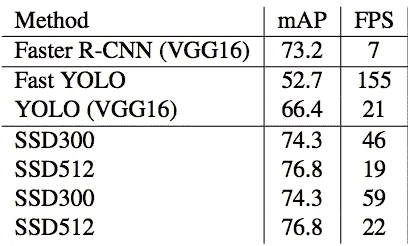*

*Extracted from SSD paper [here](https://arxiv.org/pdf/1512.02325.pdf)*

*GPU 很贵，但在训练阶段是必须的。然而，据推断**用专用 GPU 来实现实时性能是不可行的。如果没有 GPU，所有通用对象检测模型(如上所述)都无法实时运行。***

> **那么，如何重新审视单类对象的对象检测问题，以达到实时性能但在 CPU 上？**

# *主要观点:简单的任务需要较少的可学习的特征*

*上面提到的所有架构都是为检测多个对象类而设计的(在 [COCO](https://cocodataset.org/) 或 [PASCAL VOC](http://host.robots.ox.ac.uk/pascal/VOC//) 数据集上训练)。为了能够将每个边界框分类到其适当的类别，这些架构需要大量的特征提取。这意味着大量的可学习参数，大量的过滤器，大量的层。换句话说，这个网络很大。*

*如果我们定义更简单的任务(而不是多类包围盒分类)，那么我们可以认为网络需要学习更少的特征来执行任务。检测图像中的人脸显然比检测汽车、人、交通标志和狗(都在同一模型内)更简单。**深度学习模型为了识别人脸(或任何单个类对象)所需的特征量将少于同时检测几十个类所需的特征量。执行第一项任务所需的信息少于后一项任务。***

> ***单一类别对象检测模型将需要较少的可学习特征。参数越少意味着网络会越小。较小的网络运行速度更快，因为它需要更少的计算。***
> 
> ***那么，问题是:在保持准确性的情况下，我们可以在 CPU 上实现多小的实时性能？***

*这是`faced`的主要概念:**建立尽可能小的网络，在保持准确性的同时(希望)在 CPU 中实时运行。***

# *建筑*

*`faced`是两个神经网络的集合，都是使用 [Tensorflow](http://tensorflow.org) 实现的。*

## *主网络*

*`faced`主建筑大量基于 [YOLO](https://pjreddie.com/darknet/yolo/) 的建筑。基本上，它是一个完全卷积的网络(FCN ),通过一系列卷积层和池层(不涉及其他层类型)运行 288x288 输入图像。*

*卷积层负责提取空间感知特征。汇集层增加了后续卷积层的感受域。*

*该架构的输出是一个 9x9 的网格(相对于 YOLO 的 13x13 网格)。每个网格单元负责预测该单元内是否有人脸(相对于 YOLO，每个单元可以检测多达 5 个不同的对象)。*

*每个网格单元有 5 个关联值。第一个是包含面部中心的单元的概率 *p* 。另外 4 个值是被检测人脸的( *x_center，y_center，width，height)* (相对于单元格)。*

**

*Main architecture*

*确切的架构定义如下:*

*   *2x[288 x288 图像上的 8 个过滤卷积层]*
*   *最大池(288x288 到 144x144 功能图)*
*   *2x[144 x144 特征图上的 16 个过滤卷积层]*
*   *最大池(144x144 到 72x72 功能图)*
*   *2x[72x 72 特征图上的 32 个过滤卷积层]*
*   *最大池(72x72 到 36x36 功能图)*
*   *2x[36x 36 特征图上的 64 个过滤卷积层]*
*   *最大池(36x36 到 18x18 功能图)*
*   *2x[18x 18 特征图上的 128 过滤卷积层]*
*   *最大池(18x18 到 9x9 功能图)*
*   *4x[9x 9 特征图上的 192 滤波卷积层]*
*   *5 在 9x9 特征图上过滤卷积层，以形成最终网格*

*所有激活功能都是`leaky_relu`。*

> *`faced has` 6993517 个参数。YOLOv2 有 51，000，657 个参数。它的大小是 YOLO 大小的 13%!*

## *辅助网络*

*( *x_center，y_center，width，height)* 主网络的输出不如预期的准确。因此，实现了一个小的 CNN 网络，将包含人脸的小图像(用主架构输出裁剪)作为输入，并输出人脸的地面真实边界框的回归。*

*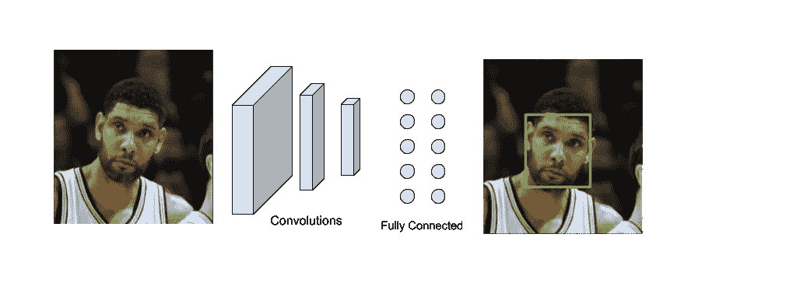*

*The network takes a crop containing a face and predicts the correct bounding box*

*它唯一的任务是补充和改进主架构的输出坐标。*

*该网络的具体架构无关紧要。*

# *资料组*

*两个网络都是在[宽脸数据集](http://mmlab.ie.cuhk.edu.hk/projects/WIDERFace/)上训练的。*

*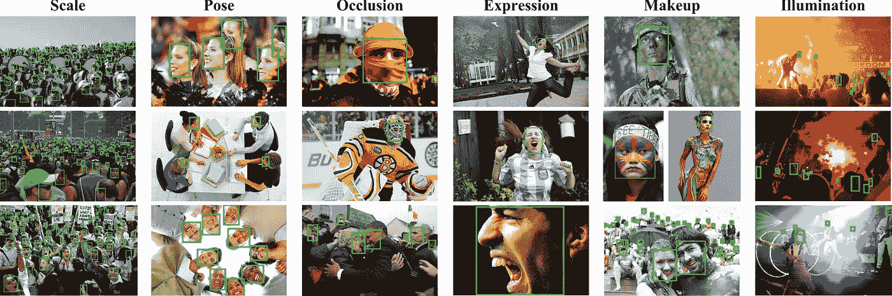*

*WIDER FACE multiple scenarios*

> *“更宽的人脸数据集是人脸检测基准数据集[…]。我们选择了 **32，203** 张图像，并标记了 **393，703** 张在比例、姿态和遮挡方面具有高度可变性的人脸，如样本图像中所描绘的那样。”*

# *培养*

*训练是在 Nvidia Titan XP GPU 上进行的。培训时间大约花了 20 个小时。[使用批量标准化](https://arxiv.org/abs/1502.03167)技术来帮助收敛，并使用漏失(40%比率)作为正则化方法来避免过拟合。*

# *推理和非最大抑制*

*当使用`faced`进行推理时，首先将图像尺寸调整为 288x288，以便输入网络。该图像位于 FCN 下方，给出了上面描述的 9x9 网格输出。*

*每个单元格有一个包含图像的概率 *p* 。通过可配置的阈值过滤单元格(即仅保留具有 *p > t* 的单元格)。对于那些保留的单元格，使用单元格的( *x_center，y_center，width，height)定位人脸。**

*在某些情况下，多个细胞可以竞争同一张脸。让我们假设一个面部中心位于 4 个细胞相交的精确位置。这 4 个单元可能具有高的 *p* (在单元内包含面中心的概率)。如果我们保留所有的单元并投影每个单元的面坐标，那么我们将会看到相同的面周围有 4 个相似的边界框。这个问题是通过一种叫做 [**非最大抑制**](https://www.pyimagesearch.com/2014/11/17/non-maximum-suppression-object-detection-python/) 的技术解决的。结果如下图所示:*

**

*Non max suppression example.*

# *表演*

*`faced`在推论上能够达到以下速度:*

*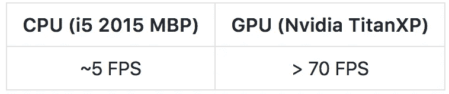*

*考虑到 YOLOv2 在 i5 2015 MBP 上甚至不能达到 1FPS，这已经很不错了。*

# *结果*

*来看看成果吧！*

*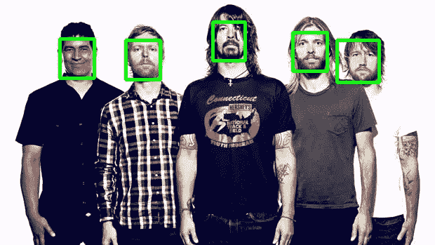****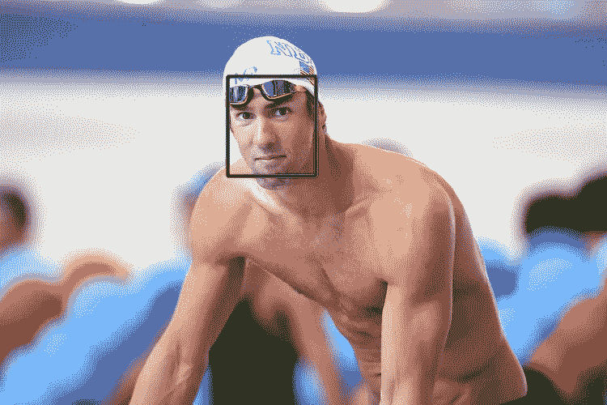**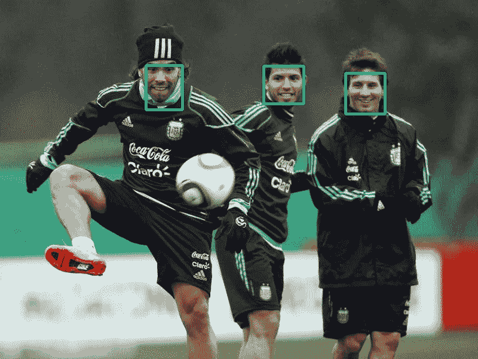**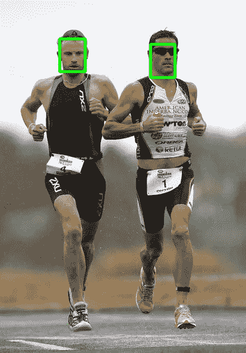**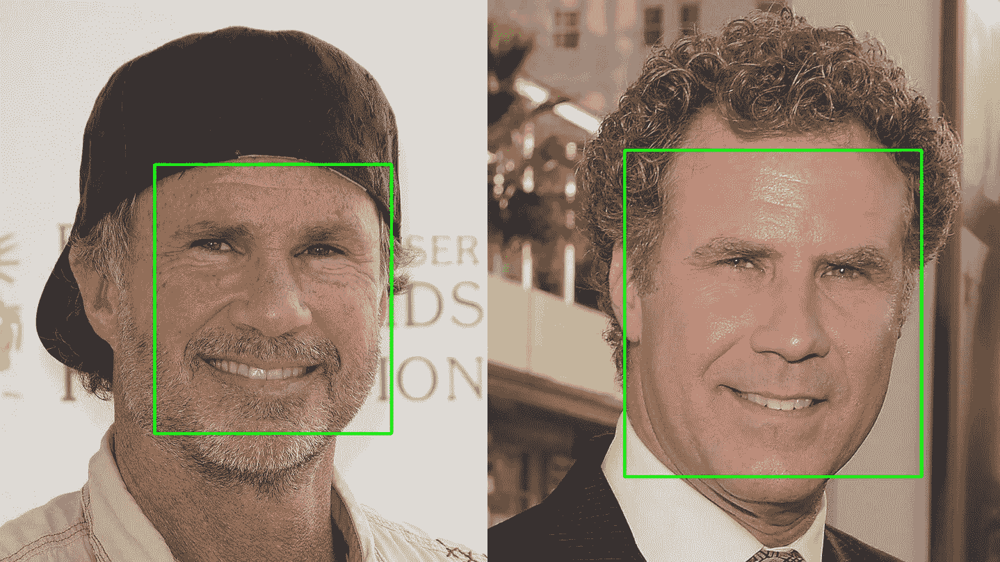*

*faced on images*

*现在我们来看一下`faced`和 [Haar Cascades](https://docs.opencv.org/3.4/d7/d8b/tutorial_py_face_detection.html) 的对比，Haar Cascades 是一种不使用深度学习的计算机视觉传统方法。这两种方法在相似的速度性能下运行。`faced`显示出显著的更高的准确性。*

*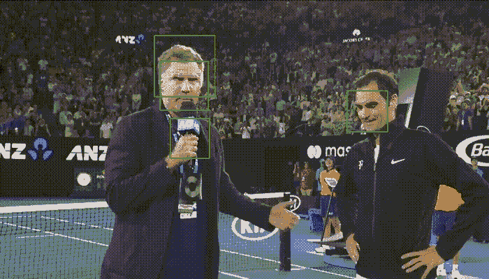**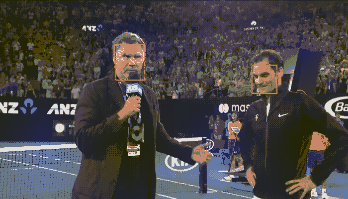*

*Haar Cascade [left] vs faced [right]*

# *如何使用 faced？*

*`faced`是一个非常简单的程序，既可以嵌入 Python 代码，也可以作为命令行程序使用。*

*请访问 github repo 获取更多说明:*

* [## iitzco/faced

### 🚀 😏使用深度学习的近实时 CPU 人脸检测- iitzco/faced

github.com](https://github.com/iitzco/faced) 

*喜欢这个项目？*在项目的回购上留下⭐！

# 结论

`faced`是一个概念证明，在这些模型对您的问题来说是多余的并且涉及到性能问题的场景中，您不需要总是依赖通用训练模型。**不要高估花时间设计专门针对你的问题的定制神经网络架构的能力。这些特定的网络将是比一般网络更好的解决方案。***