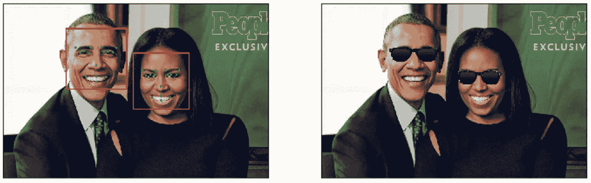
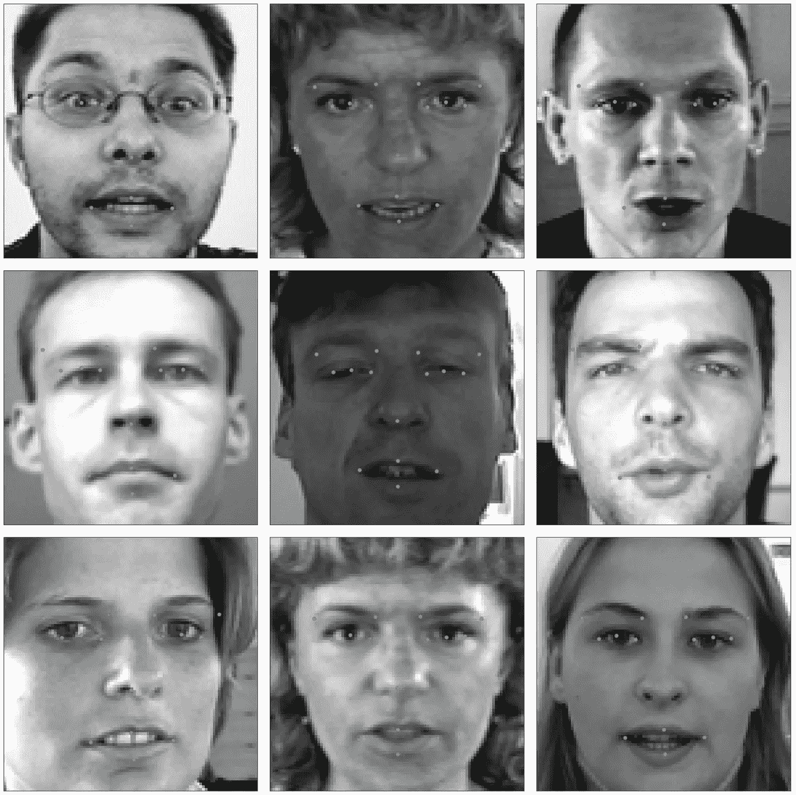
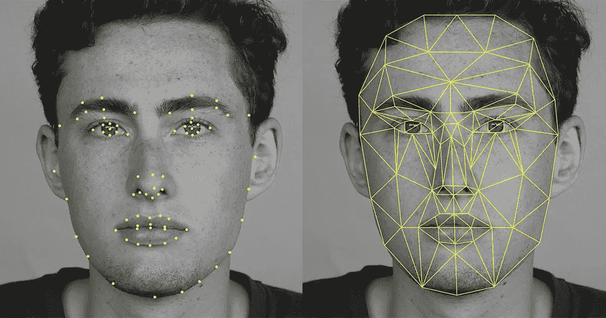

# 教程:使用深度学习和 OpenCV(面部标志检测)的自拍滤镜

> 原文：<https://towardsdatascience.com/facial-keypoints-detection-deep-learning-737547f73515?source=collection_archive---------4----------------------->

这是一个关于如何构建一个 python 应用程序的教程，该应用程序可以通过找到面部关键点(15 个独特的点)在检测到的脸上放置各种太阳镜(我称它们为“自拍过滤器”)。这些关键点标记了面部的重要区域——眼睛、嘴角、鼻子等。



# 项目描述

OpenCV 经常在实践中与其他机器学习和深度学习库一起使用，以产生有趣的结果。在 Keras 中使用卷积神经网络(CNN)和 OpenCV——我建立了几个自拍过滤器(非常无聊的)。

面部关键点可用于各种机器学习应用，从面部和情感识别到商业应用，如 Snapchat 推广的图像过滤器。

您可以在此访问完整的项目代码:

 [## acl21/Selfie_Filters_OpenCV

### 更新]:我将不再关注与回购相关的问题或邮件，因为我目前非常忙…

github.com](https://github.com/acl21/Selfie_Filters_OpenCV) 

# 工作示例

# 代码要求

代码在 Python 版本中，使用 OpenCV 和 Keras 库。

跟随[这篇中帖](https://medium.com/@akshaychandra21/how-to-install-opencv-and-keras-in-python-3-6-f5f721f0d0b3)在 Python 3 中安装 OpenCV 和 Keras。

# 数据描述

Kaggle 上的这个[数据集允许我们训练一个模型，在给定一张有脸的图像的情况下检测面部关键点。](https://www.kaggle.com/c/facial-keypoints-detection)



它是由蒙特利尔大学的 Yoshua Bengio 博士提供的。

数据集中的每个数据点包含按顺序的图像的空间分隔的像素值，并且数据点的最后 30 个值表示面上关键点的 15 对坐标。

所以我们只需要训练一个 CNN 模型来解决一个经典的深度学习回归问题。点击查看回归问题[的损失函数列表。](https://keras.io/losses/)

# 代码解释

## 步骤 1:训练卷积神经网络模型

**1.1 定义模型**

为了方便起见，我们首先在一个单独的 python 文件中定义模型架构—***my _ CNN _ model . py***

我们编写一个创建网络架构的方法。

**1.2 编译、保存、适配和加载**

我们现在编写方法来编译、保存、拟合和加载模型

**1.3 模型构建器(包装器)**

我们现在编写一个模型构建器，它加载数据并调用上述方法。

## 第二步:初始化东西

我们现在创建一个新的 python 文件— ***shades.py*** ，我们在其中编写代码来读取网络摄像头输入，检测人脸，使用我们构建的 CNN 模型，等等。

## 步骤 3:检测输入中的人脸

一旦您开始从网络摄像头读取输入，使用我们之前初始化的级联分类器对象检测输入中的人脸。

## 步骤 4:创建过滤器开关触发器

在这里，我使用了一个蓝色的瓶盖作为过滤器开关。为了检测蓝帽，我们编写代码来寻找图像中的蓝色轮廓。我们传递我们在步骤 2 中定义的 ***blueLower*** *和****blue upper***HSV 范围。

一旦我们创建了 ***blueMask*** ，即应该在视频中找到蓝色的东西，我们使用 OpenCV 的***cv2 . find contours()***方法来找到轮廓。

上面的代码检查框架中是否有轮廓(蓝色瓶盖),一旦发现，它检查轮廓的中心是否接触到我们在这一步中创建的“下一个过滤器”按钮。如果被触摸，我们更改过滤器(将 ***过滤器索引*** 增加 1)

## 步骤 5:使用模型检测面部关键点

我们使用之前初始化的面部层叠来定位帧中的面部。然后，我们对每一张脸进行循环，以预测面部关键点。

在我们将检测到的人脸传递给模型之前，我们有必要对输入进行归一化，因为归一化的图像是我们的模型所训练的图像，将其大小调整为 96 x 96 图像，因为这是我们的模型所期望的。上面的代码也是如此。

## 第六步:使用面部关键点在脸上添加阴影

一旦我们检测到面部关键点，我们就可以用它们来做各种很酷的事情。例如，您可以使用鼻子关键点来添加小胡子，嘴唇关键点来添加颜色，等等。

这里，我们使用了 4 个关键点来配置脸部阴影的宽度和高度。并且，***face _ resized _ color***有阴影并贴图回 ***帧*** 和***face _ resized _ color 2***有关键点并贴图回 ***帧 2*** 。然后我们把它们都展示出来。

最后，我们只是清理东西。

您可以在此访问完整的项目代码:

 [## acl21/Selfie_Filters_OpenCV

### 更新]:我将不再关注与回购相关的问题或邮件，因为我目前非常忙…

github.com](https://github.com/acl21/Selfie_Filters_OpenCV) 

# 执行

**1。下载数据**

从[这里](https://www.kaggle.com/c/facial-keypoints-detection/data)下载数据，并把它放在项目目录中名为‘data’的文件夹中。确保“数据”文件夹包含— ***training.csv*** 和 ***test.csv***

**2。建立 CNN 模型**

```
> python model_builder.py
```

这将调用***my _ CNN _ model . py***，因此请确保您的项目目录中有该文件。

**4。运行引擎文件**

```
> python shades.py
```

**5。抓起一个蓝色瓶盖**

玩得开心点。

# 结论

在本教程中，我们建立了一个深度卷积神经网络模型，对面部关键点[数据](https://www.kaggle.com/c/facial-keypoints-detection/data)进行训练。然后，我们使用该模型来预测在输入网络摄像头数据中检测到的面部的面部关键点。我们还使用轮廓创建了一个开关，它允许我们通过手势迭代其他过滤器。我鼓励您调整模型架构，亲自看看它是如何影响关键点检测的。

这个数据只有 15 个关键点，还有其他几个数据集在面部标注了超过 30 个关键点。



Awesome right?

[面部关键点检测的应用](https://wiki.tum.de/display/lfdv/Facial+Landmark+Detection#FacialLandmarkDetection-ApplicationsofFacialKeypointDetection):

*   面部特征检测改善了面部识别
*   男性/女性区别
*   面部表情区分
*   头部姿态估计
*   面部变形
*   虚拟改造
*   面部置换

希望这个教程是有趣的。谢谢你阅读它。

活也让别人活！
答