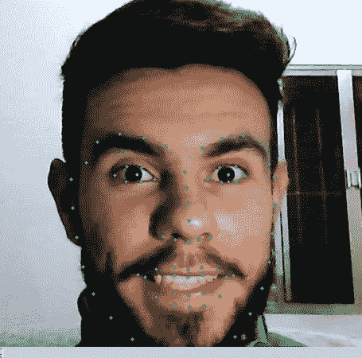
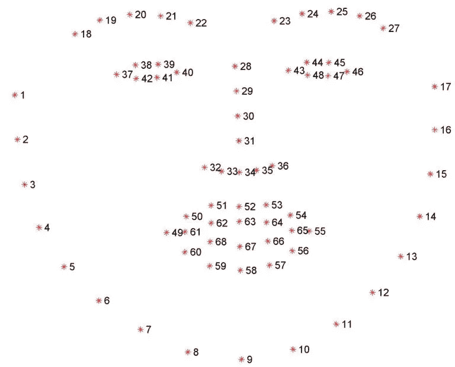

# 使用 Dlib + python 绘制面部地图(地标)

> 原文：<https://towardsdatascience.com/facial-mapping-landmarks-with-dlib-python-160abcf7d672?source=collection_archive---------5----------------------->



在照片或视频中识别人脸非常酷，但这不足以创建强大的应用程序，我们需要更多关于人脸的信息，如位置，嘴是张开还是闭合，眼睛是睁开还是闭合，抬头等等。在这篇文章中，我将(以一种快速而客观的方式)向你展示 Dlib，一个能够给你 68 分(landkmarks)的人脸库。

## 什么是 Dlib？

这是一个具有预训练模型的地标面部检测器，dlib 用于估计 68 个坐标(x，y)的位置，这些坐标映射了一个人脸上的面部点，如下图所示。



这些点是从使用了 [iBUG300-W](https://ibug.doc.ic.ac.uk/resources/facial-point-annotations/) 数据集的预训练模型中确定的。

## 给我看看代码！

在这个“Hello World”中，我们将使用:

*   numpy
*   opencv
*   [伊穆蒂尔斯](https://github.com/jrosebr1/imutils)

在本教程中，我将用 dlib 编写一个简单的例子。我们正在识别和绘制图像上的人脸点，在以后的文章中，我会详细介绍这个漂亮的库的使用。

正在安装依赖项。

```
pip install numpy opencv-python dlib imutils
```

从我们将要处理的图像捕获开始，我们将使用 OpenCV 在一个“无限”循环中捕获图像的网络摄像头，从而给人一种观看视频的感觉。

运行您的脚本，并确保您的网络摄像头的图像被捕获(它会为您打开一个窗口，显示网络摄像头的图像)。

拿到照片后，让我们来创造奇迹吧。

**提醒:**我们正在使用已经训练好的模型，我们将需要下载文件 shape _ predictor _ 68 _ face _ landmarks . dat，你可以在这里找到它。

之后，只需运行脚本，您就可以在 Dlib 中运行“hello_world ”,在以后的文章中，我将详细介绍如何提取图像中人脸的更多信息。

所有代码都在我的 [github](https://github.com/italojs/facial-landmarks-recognition) 上。

TKS。