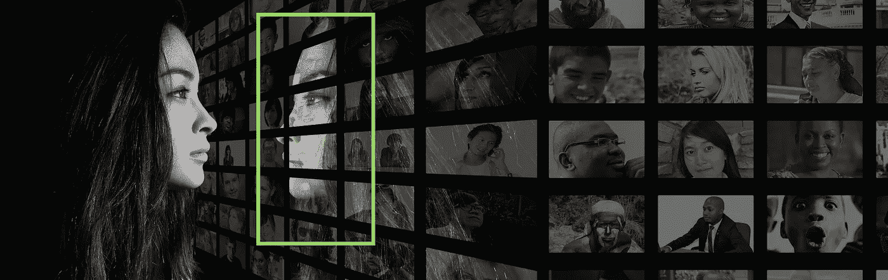
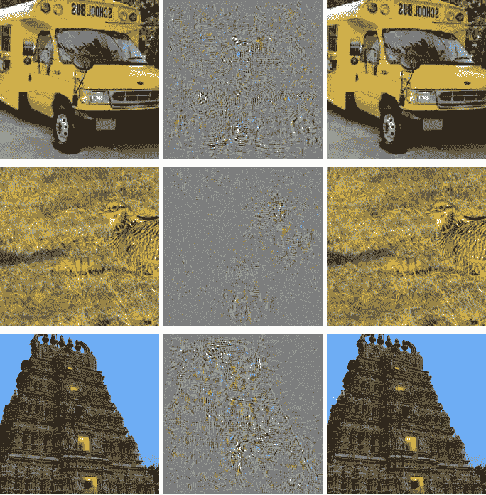
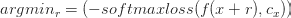
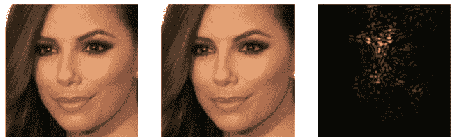

# 面部识别和对抗性攻击

> 原文：<https://towardsdatascience.com/facial-recognition-adversarial-attack-analytics-applied-on-wordpress-com-32b7622b8fb1?source=collection_archive---------3----------------------->

面部识别系统已经成为主流技术。最近，[苹果](https://support.apple.com/en-us/HT208108)和[三星](http://www.samsung.com/global/galaxy/galaxy-s8/security/)都推出了具有面部识别功能的手机。上周，美国运输安全管理局启动了一项名为[的试点项目](http://www.airport-technology.com/news/newsus-customs-and-border-protection-deploys-facial-recognition-biometric-technology-at-jfk-international-airport-5949041/)，允许美国公民基于面部识别作为主要验证系统快速通过机场。中国在使用面部识别进行身份认证方面处于世界领先地位。《经济学家》杂志估计，数百万中国人已经在智能手机上刷脸授权支付。随着使用面部识别进行身份验证的想法变得越来越流行，攻击这种系统的想法也越来越流行。

由于深度神经网络(DNNs)的使用，今天的面部识别系统[非常接近人类的表现](http://fortune.com/2015/03/17/google-facenet-artificial-intelligence/)。DNN 的一个弱点是对抗性攻击。

## 什么是对抗性攻击？

对抗性攻击试图误导网络来预测错误的类别。开创性的[论文](https://arxiv.org/pdf/1312.6199.pdf)(赛格迪等。艾尔。2014 arXiv:1312.6199v4)展示了人眼察觉不到的看似微小的扰动如何扰乱神经网络的例子。

*All Images to the right are classified as Ostrich. (IC:* [*https://arxiv.org/pdf/1312.6199.pdf)*](https://arxiv.org/pdf/1312.6199.pdf))

在上述示例中，DNN 能够成功识别左侧面板图像中的物体。然而，如果引入了精心选择的扰动(中图)，则新图像(右图)被错误分类。扰动非常小，以至于左面板和右面板用肉眼看起来完全一样。

如果一个人试图用别人的护照进入一个国家，他只需要稍微改变一下他的面部特征，DNN 的面部识别系统就会让他通过。

## 为什么世界级的 dnn 那么容易被忽悠？

首先让我确认以上结果不是来自低精度的低容量神经网络。即使是最复杂的模型也容易受到这种攻击。这里引用的论文使用了 2014 年的 GoogLeNet，从那时起，这些测试在其他 dnn 上重复进行。

如果模型和他们得到的一样好，那么深度学习模型更容易受到这种攻击吗？RBF 网络等一些模型不太容易受到[对抗性攻击](https://arxiv.org/pdf/1412.6572.pdf) (Goodfellow et al 2016，arXiv:1412.6572)。但是 RBF 网络的召回率要低得多。RBF 网络为了更高的精度牺牲了大量的召回率。在 DNS 的情况下，对抗性的例子是足够普遍的。伊恩·古德费勒(Goodfellow et al 2016，arXiv:1412.6572)已经向[展示了](https://arxiv.org/pdf/1412.6572.pdf)对于大多数 dnn 来说，找到对立的例子是可能的。这意味着，即使有一个训练有素的系统，一个坚定的黑客总是可以找到敌对的例子来欺骗面部识别系统。并且对立的例子对于人眼来说是绝对无法察觉的，这使得冒充的威胁变得非常真实。

## 我们如何产生一个对立的例子？

在面部识别的背景下，我们希望我们的对立示例能够成功建立两项任务——

1.  躲闪——主体避免被面部识别系统识别。
2.  模仿——受术者模仿他人。

在这两个任务中，转换应该是可行的，例如，化浓妆或戴面具是行不通的，因为这种转换在真实情况下会引起注意。

马哈茂德·谢里夫等人。艾尔。(谢里夫等人。al 2015) ( [论文](https://www.cs.cmu.edu/~sbhagava/papers/face-rec-ccs16.pdf))使用了一种优化方法来进行躲闪和模仿。为了躲避，他们优化

其中“r”是应用于图像的扰动。使用这种技术，他们能够成功地避开预先训练的 DNN。

*Small Imperceptible Changes Lead to successful Dodging (IC:* [*https://www.cs.cmu.edu/~sbhagava/papers/face-rec-ccs16.pdf)*](https://www.cs.cmu.edu/~sbhagava/papers/face-rec-ccs16.pdf))

在上面的例子中，左边的图像被正确分类，但是中间的图像没有。如右图所示，这两幅图像仅有小的扰动。

使用类似的技术，作者展示了一个非常可信的模仿。DNN 非常自信地成功认出了瑞茜·威瑟斯彭和拉塞尔·克罗。但同一网络将戴眼镜的里斯(中间部分)归类为拉塞尔。

*Reese Witherspoon (left) wearing glasses (middle) impersonating Russel Crowe (Right) (IC:* [*https://www.cs.cmu.edu/~sbhagava/papers/face-rec-ccs16.pdf)*](https://www.cs.cmu.edu/~sbhagava/papers/face-rec-ccs16.pdf))

## 我们如何防止这种攻击？

在这一点上，让我提醒一下，这些想法中有许多还不够实际。当 DNN 权重已知时，最好的对抗生成器工作。然而，对于我们只能访问响应的黑盒人脸识别系统，这样的攻击并不奏效。然而，识别系统和攻击每天都在变得更好。

生成对抗网络(GANs)可以通过使 DNNs 对对抗示例更健壮来很好地防御对抗攻击。虽然关于这个主题的研究还远未完成，但似乎创建高[容量网络](https://arxiv.org/pdf/1706.06083.pdf) ( Madry 等人 2017，arXiv:1706.06083)并使用 GAN 生成的示例进行训练，可以帮助创建对敌对图像鲁棒的面部识别系统。另一种方法是使用一种完全不同的网络，称为胶囊网络，Geoffrey Hinton 在题为“卷积神经网络有什么问题？”(YouTube 链接——https://www.youtube.com/watch?v=rTawFwUvnLE)

在过去的几年里，我们在 DNN 和面部识别系统领域取得了长足的进步。现在，随着面部识别成为主流，我们将看到从身份验证到监控的众多应用。新的想法可能伴随着未知的挑战。诸如躲避和冒充之类的攻击将会越来越频繁和复杂。但是，我确信我们将通过人类的聪明才智和一点技术来克服这些挑战。

*原载于 2017 年 11 月 16 日*[*e4c5blog.wordpress.com*](https://e4c5blog.wordpress.com/2017/11/16/facial-recognition-adversarial-attack/)*。*