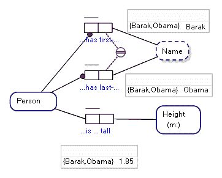
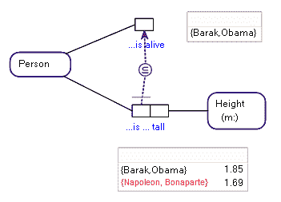
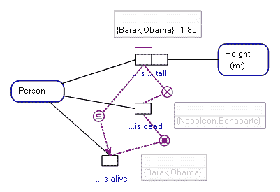
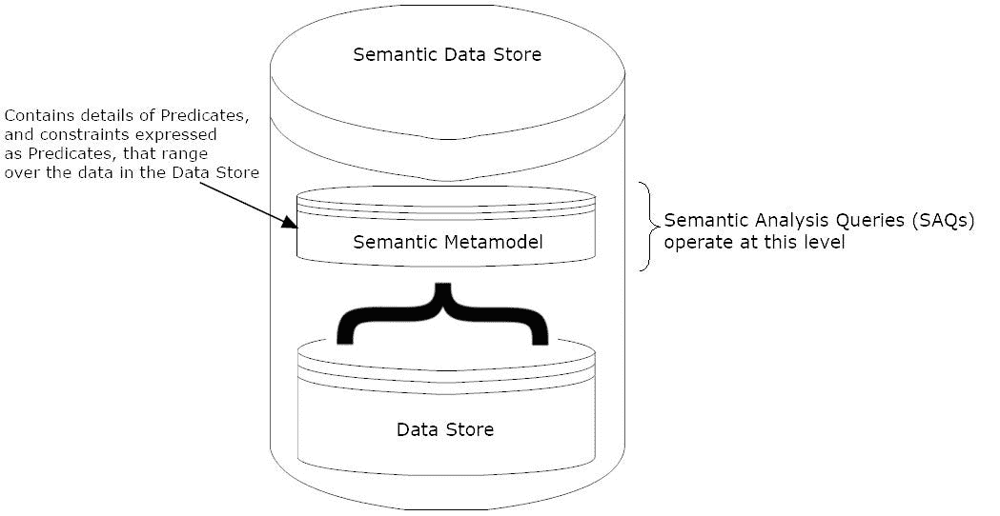

# 基于事实的人工智能。知识图的改进

> 原文：<https://towardsdatascience.com/fact-based-ai-improving-on-a-knowledge-graph-12c37481cce6?source=collection_archive---------8----------------------->

我的公司 Viev(2022 10 13:now Fact engine:[www . Fact engine . ai](http://www.factengine.ai))生产基于事实的建模软件 Boston(FBM)。我们认为，基于事实的建模将在下一波对话式用户界面(CUI)、语音用户界面(VUI)和人工智能(AI)中产生影响。

Cui 和 vui 在相对较短的时间内变得流行起来。苹果 Siri VUI 的推出预示着苹果、微软、谷歌和亚马逊之间在各自的计算机操作系统和智能扬声器中生产 VUI 的竞赛的开始，我提供的这类产品是自引入面向对象编程和关系数据库以来在信息产业中从未见过的[1]。竞争似乎很激烈，就实用性而言，vui 正迅速变得更加智能。这些技术被认为很快会在家用电器甚至汽车中变得普遍[2][3][15]。

在研究和应用方面，[聊天机器人](https://en.wikipedia.org/wiki/Chatbot)形式的 Cui 也处于快速增长的领域。脸书的 Messenger 应用程序和微软的 Skype 中的聊天机器人已经有了相当大的发展，据报道仅在 Messenger 平台上就有超过 100，000 个聊天机器人[16]。据报道，早期的消费者体验令人失望[16]。然而，似乎至少有一家企业报告其 chatbot 实施的月收入超过 100 万美元[16]，并且不断有关于其成功应用的报告即将发布[14]。我个人对聊天机器人的分析让我觉得缺失的元素是对对话语境的深刻理解和自然的对话流程。

所有 Cui/vui 的基本前提是，人们交谈和使用自然语言比用其他形式交流要容易得多。举例来说，我最近购买了一部基于 Android 的手机，现在很少通过连续按下虚拟按钮来打电话或发送短信，而是我只是对着手机说话，它就知道我想做什么。要给某人发短信，我只需简单地说，“好的，谷歌，给彼得发个短信”。谷歌助手用自然语言问我想说什么。我的语音信息被转换成文本。Google Assistant 问我是否愿意发送该消息。回答，“发送”，谷歌助手尽职尽责地发送短信。所有这些都不需要按我手机上的任何一个按钮。难以置信，除了因为这种技术现在如此之好，它是可信的。我觉得这项技术会一直存在下去。随着时间的推移，我觉得这项技术只会变得越来越好，甚至更容易使用，越来越成为那些接触到这项技术的人日常生活的一部分。

对于那些作为消费者非常熟悉该技术的人，尤其是开发该技术的人来说，这样的例子将很快变得不起眼。即使在今天，我仍然认为，因为这种技术是如此容易获得和令人满意，它不仅已经成为一种产品的区别特征，而且还是一种预期的技术。我相信消费者对 CUIs/VUIs 的需求将推动人工智能的快速采用，并且在很大程度上，已经做到了。

从计算机时代开始，人类就在思考用自然语言与机器对话的能力，甚至通过机器*用自然语言对话的能力*(即[图灵测试](https://en.wikipedia.org/wiki/Turing_test))来判断机器的智能。最近一篇有趣的文章重申了这一观点，并旨在巩固'[会话认知](https://medium.com/intuitionmachine/conversational-cognition-a-new-approach-to-agi-95486ffe581f)'作为人工智能的基准[5]。

图灵测试在人工智能领域如此普遍，以至于它催生了一年一度的罗布纳奖(Loebner Prize ),当评委们根本无法区分他们是在与机器对话还是与另一个人对话时，这项比赛就会结束。

如果我们认为人类提供了智能的最终基准，那么用这个基准来评判人工智能似乎是自然和公平的。

然而，当今 Cui 和 vui 的相对迅速崛起，只是表面上，并没有反映出为使这些技术可用而进行的长期研究和开发。从消费者的角度来看，这种技术相对较新，但从研究的角度来看，它是几十年研究的累积成果。

但这是我们感兴趣的研究的未来。技术领先在哪里？最佳技术将采用何种外形规格？这些是我将在这里提出的问题，并提供一个前进的方向。

如果我们接受所有 Cui 和 vui 代表某种形式的人工智能和不同程度的实际智能，那么我们可以将我们的讨论限制在谈论一般的人工智能。这一点，尤其是如果我们接受会话认知作为我们讨论中的价值基准的话。也就是说，我们不是在谈论关于计算机视觉或诸如此类的人工智能，而是那些管理与人对话的人工智能。

对人工智能的研究大体上有两个主流，一个是算法，另一个是基于我称之为直觉的。第一种是确定性的，在这种情况下，我们可以窥视人工智能的工作方式，并根据它的推理得出问题的答案；第二个问题的结构如此复杂，以至于我们可能永远不知道它是如何推导出解决方案的，只知道它确实(正确或错误地)[7][8]。

我在确定性人工智能中包括那些不仅包含某种描述的知识库，而且包含一组逻辑规则和算法的人工智能，这两者对于对人工智能的工作感兴趣的外部观察者来说是完全透明的。默认情况下，我包括所有那些对一阶逻辑(FOL)有算法感知的人工智能系统。这样的人工智能很少被媒体报道，如果有一个通用术语来代表它们，我也想不起来。

我在直觉人工智能中包括那些人工智能内部工作如此复杂的问题，以至于准确确定一个答案是如何得出的可能是耗时的，以至于更容易接受人工智能要么产生要么不产生想要的结果。这并不是说一个人不能在人工智能中分解一个事务的内部工作，而是说它会如此复杂以至于期望有人去尝试是不合理的。这些类型的人工智能确实有可识别的名称，如神经网络和那些结合了深度学习和机器学习的人工智能。为了简单起见，在这里我将它们都归入神经网络这个术语。

一个对这两种类型的人工智能漫不经心和因果关系的观察者很可能会说，神经网络的内部工作方式当然是众所周知的，否则它们是如何建立起来的。不过，更详细地说，这里我们只考虑令人生畏的复杂性，即分析一个适当复杂的基于神经网络的人工智能采取什么步骤来得出一个单一的答案。当然，有了无限的时间和资源，人们可以分析任何事情，然而，似乎我们只是根据神经网络的数据模型是否返回有利的结果来接受或拒绝神经网络。如果结果是有利的，我们可能不太倾向于分析为什么，每次迭代的问题解决。

例如，当谷歌发布一篇论文，宣布他们基于 AlphaZero 神经网络的人工智能在国际象棋的自动化游戏中取得“突破”时，世界级的玩家称这一结果是显著的[9]。其他人评论了“直觉”是如何与确定性游戏相抗衡的[10]。据我所知，没有人准确分析过 AlphaZero 的每一步棋是如何做出决定的。

在这方面，确定性人工智能和随机人工智能之间的区别是明显的。

对在线文献的粗略搜索很容易表明，目前在人工智能中解决确定性和随机系统的组合以产生更智能的整体方面有很多活动。

如果我们重新将我们的讨论集中在那些与人交谈的人工智能上，以及它们将如何模仿人类的话语能力，那么看看你自己的内心并思考人类需要多少能力来产生演讲和回答外部世界的问题是合理的，这是基于应用逻辑而不是依靠训练有素的思维路径。

例如，用合适的“嗨”来回应“你好”的问候可能在大脑的神经路径中根深蒂固，以至于很容易推断出这些功能是在神经网络人工智能中训练出来的。

更重要的是构建一个神经网络来思考“我今天需要一把伞吗？”、“外面下雨了”、“好的，是的，你今天需要一把伞”*和*扩展了这种能力，以提供需要遍历数十或数百个条件谓词才能得到合适结果的问题的答案。

这并不是说神经网络不能处理需要某种形式的谓词逻辑的问题，而是说无论人工智能如何处理自然语言的分析，如果人工智能在对话中具有适当的智能，它将需要与数据相关联的丰富语义信息的数据，包括合并了谓词逻辑的某种表达的数据。

## 一切都与数据有关

我最近在一篇关于艾的文章中强调了一句话，内容是:

人工智能方法大致有三个部分:产生数据、解释数据和对数据做出判断

我们到达这篇文章的核心，并讨论为什么我相信一些描述的基于事实的建模将是未来掌握对话认知的人工智能的核心，以及我个人将如何使用该方法来改进 Google 的知识图。

在他们的核心，每个人工智能都依赖于数据。正是语义信息在基于事实的模型中的丰富嵌入，包括一阶逻辑谓词的表达，使得基于事实的建模成为一种有吸引力的产品，以一种可以存储、分析和判断的方式来定义数据的结构。

从这一点开始，我们不再考虑*如何对数据做出*(确定性的或随机的)决策，而是关注什么是*数据*，包括存储为数据的逻辑谓词。

## 基于事实的建模

基于事实的建模是概念建模的一种形式，它捕捉作为“事实”呈现的信息结构。事实可以写成“人‘巴拉克·奥巴马’身高‘1.85’米”的形式，事实类型从该形式中捕获结构，“人身高(以米为单位)”。“人”可以被分析为一种实体类型。

我们将“高度(以米为单位)”表示为一种特殊类型的实体类型，表示单位度量值。然而，通常值是作为值类型来分析的，而“人‘巴拉克·奥巴马’的名字是‘巴拉克’”会将姓名表示为值类型。

在一种被称为[对象-角色建模](https://medium.com/@victormorgante/why-learn-object-role-modelling-4eebd93dcda2) (ORM)的基于事实的建模中，上述信息在概念上被捕获在下图中:

基于事实的建模和 ORM 与其他更简单的概念建模语言(例如，实体关系图和 UML 类图)的区别在于，ORM 在语义上丰富了它在事实类型中捕获的关于事实的信息。在相应的事实类型中捕获用自然语言重建事实的完整信息。

当考虑连接的对象类型(人、身高)时，“…是…高”谓词读数(上图)允许其事实类型推断为“人是身高(米)高”，样本人口/数据允许我们推断“巴拉克·奥巴马是 1.85 米高”这一事实。

ORM 允许我们用自然语言查询一个模型，并提出类似这样的问题:“巴拉克·奥巴马身高 1.85 米吗？”，相对容易，因为随模型一起捕获了丰富的语义信息。

同一个概念模型的实体关系图所能捕获的信息量是有限的，如下所示:

在所示类型的 ERD 中，没有捕获关于每个实体属性(例如，Person Height)对的底层谓词的额外语义信息。例如，使用那种类型的 ER 图，我们不知道身高是以米为单位的，并且我们没有额外的信息来形成自然语言中的“巴拉克·奥巴马身高 1.85 米”这一事实。

我觉得实体关系图和 UML 图有它们的位置，然而我们在这里寻求的是如何捕捉丰富的语义信息来创建一个具有对话认知的 AI。我觉得为了做到这一点，我们不仅需要捕获*数据*，还需要关于将数据绑定在一起的底层*谓词*的信息。

观察力敏锐的读者可能会思考图表在实现数据方面有什么价值。在这里，我们认识到，以图形(如 ORM 图)表示的基于事实的模型在数据存储级别上实现了有效的知识图形。让我们进一步检查基于事实的建模的效用。

如果我们在模型中加入一组有身高的人是活着的人的子集(例如，火化后的人当然没有我们通常理解的“身高”)，那么我们的例子就变成了需要谓词逻辑的例子。在 ORM 中，子集约束表示如下:

用问题“巴拉克·奥巴马有多高？”，应该回“巴拉克·奥巴马身高 1.85 米”。质疑“巴拉克·奥巴马身高 1 米 85 吗？”应回，“是”。但是用“拿破仑·波拿巴有 1.69 米高吗？”来询问同样型号的智能人工智能应该回敬，“不，因为拿破仑·波拿巴已经不在人世了”。

**NB** 如果我们接受 ORM 只迎合[开放世界语义](https://en.wikipedia.org/wiki/Open-world_assumption)，并且不记录某人活着并不一定意味着他们不活着，我们至少可以通过在实践中采用封闭世界语义来迎合相同的结果。或者干脆修改模型，反映一个人可能没死，有身高。

拥有语义丰富的数据加上逻辑谓词，允许人工智能使用自然语言中作为问题提出的语义查询来探索底层模型[12]。如何实现这一点是当前研究的主题，然而，研究和开发的环境扫描表明，如果要实现语义查询，就需要在数据存储内或数据存储上有语义知识，这一概念几乎没有阻力[11]。

## 展望未来的知识图谱

如果我们接受对话认知包括回答人工智能提出的问题的能力，那么我们可以检查现实世界中实现这种人工智能的尝试。

谷歌搜索有一个功能叫“知识图”(微软的 Bing 实现了类似的东西)，指的是底层技术。知识图是收集的关于各种感兴趣的主题的知识的集合；出于兴趣，‘名人’。知识图大概被概念化并存储为数据图。然而，我们知道数据的来源(T0)以一种更相关的方式(T3)存储(T2)。对我们来说，谷歌如何将收集到的数据存储到知识图中并不重要，重要的是它存储了什么*。*

例如，我们知道知识图表捕捉关于名人及其身高的信息。

让这些信息有些用处的是，你可以在谷歌上搜索“巴拉克·奥巴马有多高？”并且返回 1.85 米的合适结果。因为关于巴拉克·奥巴马的信息存储在知识图中，所以在搜索结果页面上会显示一个关于巴拉克·奥巴马的额外信息框。这样的搜索结果如下所示。

如果我们在谷歌上搜索“巴拉克·奥巴马身高 1.85 米吗？”我们分析的问题就变得很明显了。不显示知识图信息(如下)。如果我们期待一个确认，“是”，我们在写这篇文章的时候运气不好，伴随着我们对艺术水平的失望。

如果我们在谷歌上搜索“拿破仑有多高？”这个问题会变得更加复杂。一个搜索结果(至少在我的 iPad 上)显示了知识图谱信息，可能表明拿破仑还活着！(下图)需要进一步挖掘，点击“报价和概览”按钮来揭示死亡日期。显然，拿破仑仍然有 1.69 米高。可能发生，但是在这里我们寻找一个用自然语言提供的结果，来回答用自然语言提出的问题。

因此，我们知道，在 2018 年的前几个月，知识图不包含合适的谓词逻辑规则，这些规则允许我们在与实现价值对话认知的人工智能对话时找到合适的智能问答水平。

有些人可能会认为知识图表并不代表对话认知的尝试，但如果是这样，为什么要回答一个问题，“巴拉克·奥巴马有多高？”，一点都没有？人们已经在会话认知方面做了一些尝试。公平地说，微软的必应搜索引擎也好不到哪里去。“当今的技术水平”根本不能反映这种潜力。

## 需要改变什么？

我的感觉是，我们正处于分析和实施对话认知的早期阶段。我感觉用不了多久 Google/Bing 搜索就会返回“拿破仑没有 1.69 米高，因为他已经不在人世了”这样的答案。在我看来非常清楚的是，在当前的竞争环境下，如果微软必应返回这样的结果，毫无疑问，谷歌将很快效仿，反之亦然。当那发生时，我会第一个从椅子上摔下来；似乎不可避免。

我们需要一个支持语义查询和对话认知的架构。

## 会话认知的架构

现在你可能已经看到我的论文了。语义查询需要一个语义数据存储，其中数据和关于该数据的丰富语义信息都存储在一个逻辑数据存储中，包括一阶逻辑的条件谓词。为了实现对话式的价值认知，语义数据存储需要能够解析自然语言谓词以及底层数据的逻辑约束。

该架构最简单的形式如下图所示:

目前开发语义数据存储(SDS)的研究正在进行中。例如，波尔扎诺自由大学的[“知识表示数据库研究中心”](https://www.inf.unibz.it/krdb/)致力于开发他们所谓的知识表示数据库(KRDB)。

基于事实的建模，如对象-角色建模，是 SDS 的天然选择。事实类型读数可能包括“反向读数”；其中“零件在仓库的储箱中”，例如，有补充读数，“仓库在储箱中存储零件”和“储箱在仓库中存放零件”。更简单的事实建模形式只存储一个读数，甚至试图截断谓词，如“Person isFriendOf Person”。我不相信这种简单的谓词表示的价值。

我觉得重要的是，*如何存储自然语言中的完整谓词(作为图形、关系或数据层次)并不重要，因为如果我们采用基于事实的建模的元模型来存储谓词的语义，当涉及到数据库时，基于事实的建模是实现不可知的。*

同样重要的是，可以在 SDS 上进行两种形式的查询，一种是对数据的语义查询，另一种是对丰富语义数据的语义分析查询(SAQ ),它定义并管理底层数据，以便于语义查询。SAQ 返回逻辑谓词，帮助人工智能细化语义查询和结果。

例如，语义查询“Bin '1 '是否在仓库'主仓库'中存储零件' 456 '？”在它的执行中，可能需要通过基于事实的模型上的语义分析查询的解决方案，即初始查询涉及事实类型“Bin stores Part in Warehouse”及其底层数据。类似的 saq 可以解决这个问题，“哪个零件存储在仓库‘主仓库’的哪个箱中？”通过首先识别存储数据的适当谓词，返回满足请求的数据列表。

因为使用解析和自然语言处理的组合来解决这样的查询需要算法体操，所以实现这样的技术不是一件容易的事，但是我很清楚，如果不存储事实类型、事实类型读数和以谓词逻辑表示的条件规则，智能对话认知的目标将无法实现。我们的第一个目标是在 AI 底层的数据模型中存储适当的谓词。

实现语义数据存储的目标并不新鲜([13])，在我看来，这种数据库在人工智能领域的最终发展和流行是不可避免的。

一个开放的研究领域是如何最好地让人工智能更新其 SDS 的语义层。在我看来，如果我们要发展人工通用智能，这个要求是不可或缺的。

Viev 正在开发工具来帮助构建语义数据存储的语义层，我们将与人工智能社区合作，帮助实现对话式认知。

感谢您的阅读。我希望这篇文章对你有所帮助。如果时间允许，我将提供更多关于基于事实的建模和对象角色建模的信息。

— — — — — — — — — — — — — — — —

## 参考

1.  沃勒顿，m .，“语音战争:Siri vs. Alexa vs. Google Assistant”，【www.cnet.com】T2，[https://www . CNET . com/news/Voice-wars-Siri-vs-Alexa-vs-Google-Assistant/](https://www.cnet.com/news/voice-wars-siri-vs-alexa-vs-google-assistant/)，2018 年 2 月 24 日访问
2.  Westlake，“智能家居和联网汽车——语音激活”，[www.gearbrain.com](http://www.gearbrain.com/)，2018 年 2 月 24 日访问
3.  “市场上创新的语音控制设备”，[www.globalme.com，](http://www.globalme.com,)[https://www . global me . net/blog/best-Voice-Controlled-Devices-Market](https://www.globalme.net/blog/best-voice-controlled-devices-market)，于 2018 年 2 月 24 日访问
4.  “图灵测试”，[www.wikipedia.org](http://www.wikipedia.org/)，[https://en.wikipedia.org/wiki/Turing_test](https://en.wikipedia.org/wiki/Turing_test)，于 2008 年 2 月 25 日访问
5.  Perez，c .，“对话式认知:人工通用智能的新衡量标准”，[www.medium.com](http://www.medium.com/)，[https://medium . com/intuition machine/conversation-Cognition-A-New-approach-to-agi-95486 FFE 581 f](https://medium.com/intuitionmachine/conversational-cognition-a-new-approach-to-agi-95486ffe581f)，于 2018 年 2 月 25 日获取
6.  “罗布纳奖”，[www.wikipedia.org](http://www.wikipedia.org/)，[https://en.wikipedia.org/wiki/Loebner_Prize](https://en.wikipedia.org/wiki/Loebner_Prize)，于 2018 年 2 月 25 日获得
7.  Rankin K .，“人工智能核心的黑暗秘密”，《麻省理工技术评论》，[https://www . Technology Review . com/s/604087/The-Dark-Secret-at-The-Heart-of-AI/](https://www.technologyreview.com/s/604087/the-dark-secret-at-the-heart-of-ai/)，于 2018 年 2 月 23 日查阅
8.  Perez，c .，“深度学习是非平衡信息动力学”，[www.medium.com](http://www.medium.com/)，[https://medium . com/intuition machine/Deep-Learning-is-Non-balanced-Information-Dynamics-b 00 baa 16 b 135](https://medium.com/intuitionmachine/deep-learning-is-non-equilibrium-information-dynamics-b00baa16b135)，2018 年 2 月 25 日访问
9.  “AlphaZero:来自顶级 GMs，Stockfish 作者的反应”，[www.chess.com](http://www.chess.com/)，[https://www . chess . com/news/view/alpha zero-Reactions-From-Top-GMs-stock fish-Author](https://www.chess.com/news/view/alphazero-reactions-from-top-gms-stockfish-author)，于 2018 年 2 月 25 日访问
10.  佩雷斯，c .，“AlphaZero:直觉如何摧毁逻辑”，[www.medium.com](http://www.medium.com/)，[https://medium . com/Intuition machine/alpha zero-How-Intuition-disrupted-Logic-66a 4841 e 6810](https://medium.com/intuitionmachine/alphazero-how-intuition-demolished-logic-66a4841e6810)，于 2018 年 2 月 25 日访问
11.  林琳，王宏，王敏，“实例语义查询”，谷歌研究，
12.  “语义查询”，[www.wikipedia.org，](http://www.wikipedia.org,)[https://en.wikipedia.org/wiki/Semantic_query](https://en.wikipedia.org/wiki/Semantic_query)，2018-02-25 访问
13.  日期，C.J .，“约束和谓词:简要教程(第一部分)”，www.brcommunity.com，[http://www.brcommunity.com/articles.php?id=b065a](http://www.brcommunity.com/articles.php?id=b065a)
14.  案例研究:一个房地产机器人如何在 10 天内卖出 3 套公寓。，[www.medium.com](http://www.medium.com/)
15.  “语音助手正在使智能手机变得多余”，《二元地区杂志》，[https://then extweb . com/syndication/2018/02/24/Voice-assistants-making-smart phone-redundant/](https://thenextweb.com/syndication/2018/02/24/voice-assistants-making-smartphone-redundant/)
16.  Mai，m .,“从阴郁到迷人:Facebook Messenger 聊天机器人的演变”，《福布斯》，
    https://www . Forbes . com/sites/mariyayao/2017/10/12/From-droom-To-Glam-The-Evolution-Of-Facebook-Messenger-Chatbots/# 3b 3869263 Abd，于 2018 年 2 月 25 日查阅