# FADL2 L8:“神经”艺术风格转移

> 原文：<https://towardsdatascience.com/fadl2-l8-neural-artistic-style-transfer-a2e6780ab17b?source=collection_archive---------7----------------------->

最近完成了[杰瑞米·霍华德](https://medium.com/u/34ab754f8c5e?source=post_page-----a2e6780ab17b--------------------------------)的[实用深度学习](http://course.fast.ai/)的第八课(beta 版第二部分)。在这里，我将回顾一下重建本课 Jupyter 笔记本的一些工作和结果。< *这是* ***非常*** *粗糙* >

[ *注意:think part 2 已更名为“前沿深度学习”——应该很快就会公开发布。* **亦作*TL；dr:*** *滚动到底部观看视频*

我对笔记本的解读可以跟着这里:[https://github . com/WNoxchi/kauka SOS/blob/master/fai 02/L8 _ NeuralArtTrsfr _ code along . ipynb](https://github.com/WNoxchi/Kaukasos/blob/master/FAI02/L8_NeuralArtTrsfr_CodeAlong.ipynb)

在回顾了库导入和指定`limit_mem()`以便 TensorFlow 不会吃掉你的 GPU 所提供的一切之后，我必须学习 Python 中的‘picking’是什么。结果，多亏了 YouTube 上的 sentdex，这只是 Python 中的序列化。什么连载？显然，它是一个接一个地发送数据流…显然，当你进行大量的磁盘访问时，它是有用的(比如为 ML 读取数据)，尽管它不提供安全性，所以要小心网络流。

我试着写了一本小型拉丁语字典:

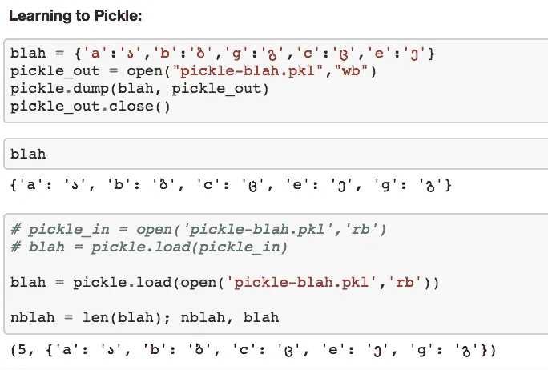

Learning to Pickle in Python (data serialization)

原来如此。我还没有看过 sentdex 更新的“[酸洗和缩放——用 Python p.6](https://www.youtube.com/watch?v=za5s7RB_VLw) 进行实用机器学习”视频，但如果我觉得有必要，我可能会看。

1。内容重建

**神经风格转移**

NST 正在创建一个新的图像，它保留了一个图像的“风格”和另一个图像的形式。例如，使用两幅输入图片创建一幅文森特·梵高风格的猫的图片:一幅猫的图片，另一幅代表梵高的绘画风格。

这里有几件事很重要。该算法并没有将梵高的风格应用到猫图像本身:它从一幅新图像(像一堆随机的像素)开始，并将其构建成所需的复合图像。

它需要一个已经足够好的模型来辨别两个输入图像的特征。所以，“眼睛在哪里”，“这是一张脸”，“这笔触是一个东西”等等。

第一步是初始化模型(这里是使用平均池并减去 FC 层的顶部块的修改的 VGG16 CNN):

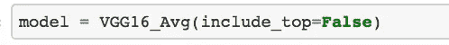

instantiating a VGG16 model using Average-Pooling instead of Max, and excluding the end-block of Fully-Connected layers (we want convolutional features, not classification here)

接下来，我们在 Keras 中定义一个计算图。一个计算图，就我目前的理解，是定义一系列对数据替身的操作。还没有数据传入，但一旦传入，程序就会知道该怎么做。我们这样做是为了定义目标图像

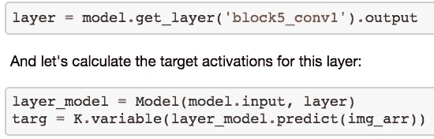

`targ` isn’t any ‘thing’ yet, but more of an operational placeholder for when this bit of computation occurs.

可以看到，`targ`是`img_arr`上`layer_model`的输出(预测)。`layer_model`是一个`Model`(`keras.models.Model`:[Keras Functional API](https://keras.io/models/model/))，由从其输入到`layer`的`model`层组成，我们将其定义为 VGG16 模型的第五个 Conv 块的第一个卷积层。`img_arr`是经过预处理的原始图像，其预处理方式与 VGG 作者在训练其模型时预处理其 ImageNet 数据的方式相同。

**注意** : `layer`是卷积子模型结束时的输出激活。`layer_model`是从原模型开始到`layer`定义的子模型。`targ`是目标激活。损失函数试图使`layer`和`targ`尽可能靠近。

这种措辞可能会令人困惑，但是当你在代码中浏览它时，它更有意义。我们在整个笔记本中使用 Keras 定义了几个这样的图形。

为了让算法衡量它做得有多好，它需要以某种方式量化它的进展:一个损失/目标函数。

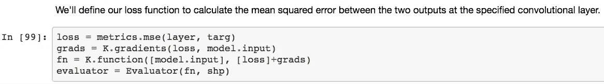

为此，我们将损失定义为输出层和目标图像之间的[均方误差](https://en.wikipedia.org/wiki/Mean_squared_error)。

`evaluator`是一个自定义的`Evaluator`类，允许程序单独访问损失函数和梯度，因为 Keras 一起返回它们，但优化器需要单独查看它们。

这个`evaluator`，连同迭代次数，以及随机图像`x`，进入`solve_image(•)`，完成优化损失的工作。

所有这些都是通过将原始图像的 conv 特征应用于随机生成的图像并更新损失函数来从原始图像中重建图像。

基本思想是:我们通过子模型运行原始图像和新的随机图像，并使用我们的损失函数来确定它们的匹配程度。我们使用来自`scipy.optimize.fmin_l_bgfs_b`的[线搜索](https://en.wikipedia.org/wiki/Line_search)算法作为优化器来最小化损失。当我们下一步从一个样式图像中合并样式时，我们将使用权重来平衡我们想要在多大程度上重新创建原始图像，而不是应用样式图像的样式。

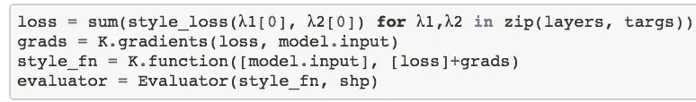

`loss` is the sum of `style_loss`-es for all layers & targets. `style_loss` is the mean-squared-error between the gramian matrix of the layer, and the gramian matrix of the target. The Gram Matrix is the dot-product of a matrix with its own transpose. ~ I think I remember in lecture, Howard saying no one really knows why it works … but it works.

所以我们最终得到的，用我的猫 Terek 作为原始图像:

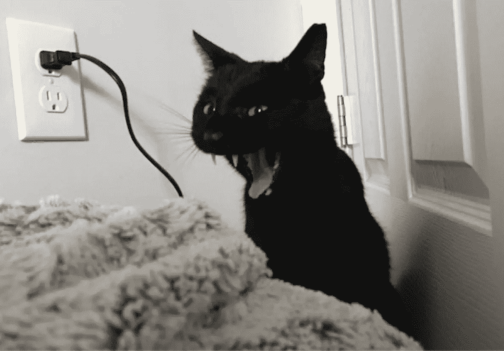

Terek.

以及生成随机像素的图像:

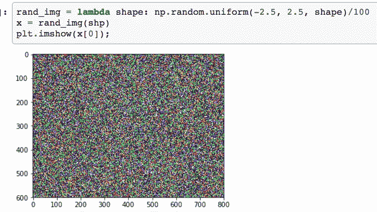

并通过`solve_image(•)`进行 10 次迭代:

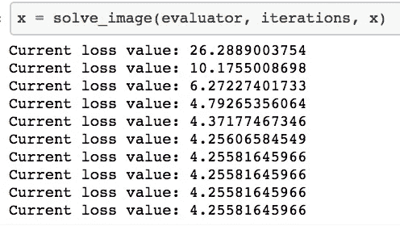

我们得到了这个不虔诚的怪物:

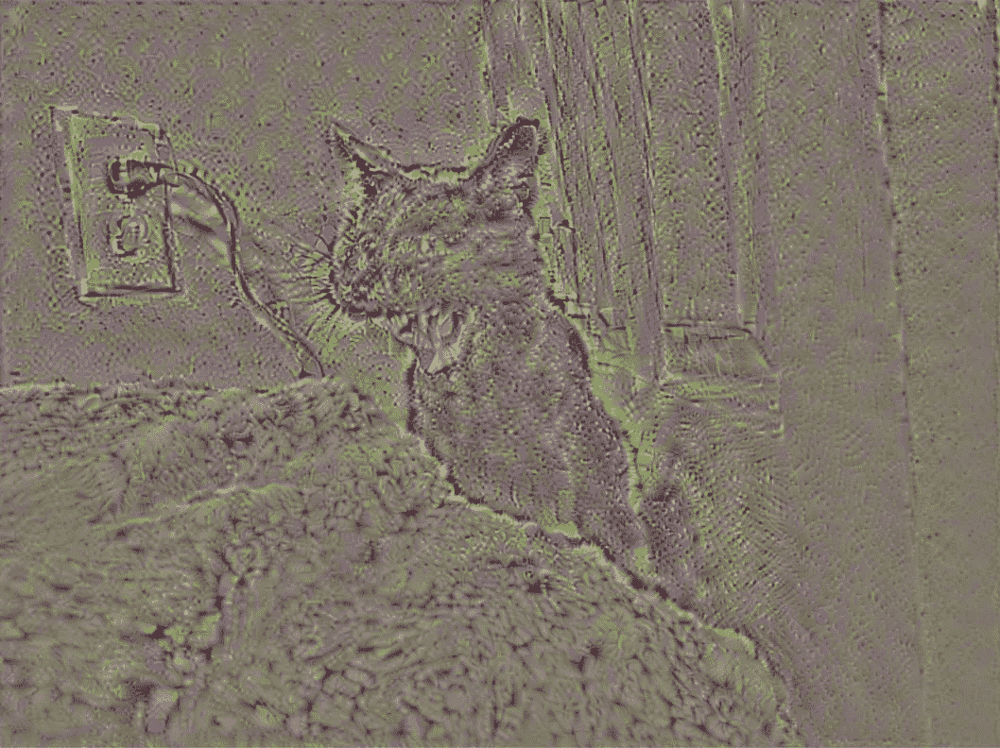

How cats actually see

Here’s an animation of it (the videos in this post were all first taken on Instagram as I was coding)

尽管这看起来很糟糕，但实际上非常有趣。请记住，这种算法是采用马赛克或随机像素，通过我们上面定义的 CNN 来重建猫的图片，并根据新(目标)图像和网络中原始激活之间的均方误差来优化网络的权重和激活。这意味着将根据卷积网络中表达的特征来构建目标图像。所以这个模型必须能够区分眼睛和背景等等。较低的卷积块将为我们提供更精细的特征，而稍后的卷积块将为我们提供模型中更多的宏特征。因此，我们可以通过使用更早的卷积层来获得看起来更像原始图像的输出。

2。风格重构

为了重塑风格，我们必须做更多的事情。我们通过计算多层的损失函数来改变它。引用原始笔记本:

> 在我们计算原始卷积输出的 MSE 之前，我们先将它们转换为信道的“格拉米矩阵”(即矩阵与其转置矩阵的乘积),然后再计算它们的 MSE。目前还不清楚为什么这有助于我们实现目标，但它确实有效。一种想法是 Gramian 显示了我们在卷积层的特征是如何相互关联的，并且完全删除了所有的位置信息。所以匹配通道的 Gram 矩阵只能匹配某种类型的纹理信息，而不能匹配位置信息。

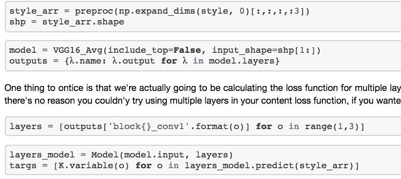

style_arr is the preprocessed style image. shp is the shape of style_arr. Note the major difference from before being that we’re building arrays from layers. Specifically 3 layers: for the 3 color-channels.

`loss` is the sum of `style_loss`-es for all layers & targets. `style_loss` is the mean-squared-error between the gramian matrix of the layer, and the gramian matrix of the target. The Gram Matrix is the dot-product of a matrix with its own transpose. ~ I think I remember in lecture, Howard saying no one really knows why it works … but it works.

这样做，我们就可以了解梵高这幅画的风格:

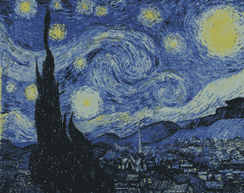

并将该样式应用于这个随机生成的目标图像:

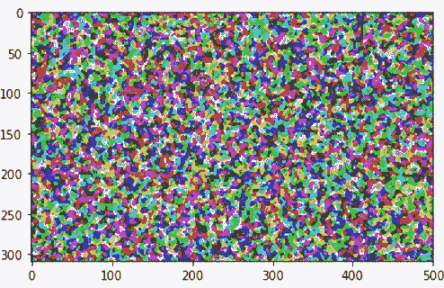

要在 10 次迭代后获得梵高风格的随机像素图像:

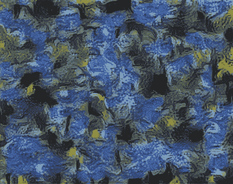

3。风格转移

最后是风格转移。我们得到了 1。投入再创造。2.风格休闲。现在把它放在一起:

这是以(最终)直观的方式完成的:通过加权和添加两个损失函数来组合这两种方法。和以前一样，我们获取一系列层输出来计算风格损失。计算内容损失只需要一个图层输出。层越低:内容重建越精确。当我们将内容重建与样式合并时:更早的层/更松散的重建将为样式留出更多空间，反之亦然。

这里我们有代码使`style_layers`成为块 1 到 5 的第二卷积层；以及`content_layer`块 4 conv 层 2 的输出(激活):

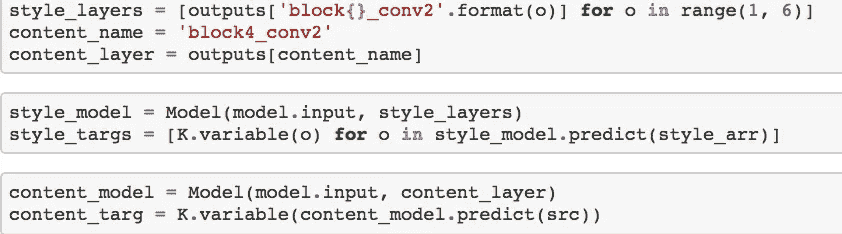

The style and content models become submodels of the full model’s input to the respective style and content outputs. NOTE: the style target outputs/activations correspond to their multiple layers. The style targets ultimate take in the style array (preprocessed style image) and likewise content target takes in the preprocessed source image (src).

这创建了三个独立的输出类型:原始图像，风格图像，以及我们正在训练的像素的随机图像。

最后，创建一个应用于样式输出激活的权重数组。这调整了图像重建和风格转换这两个层面的组合。注意:这是内容丢失的一个因素。系数越小(分母越大),样式对最终图像的影响就越大，直到它完全掩盖了任何原始内容。

必须在*全风格*和*全商务之间找到最佳平衡点。*

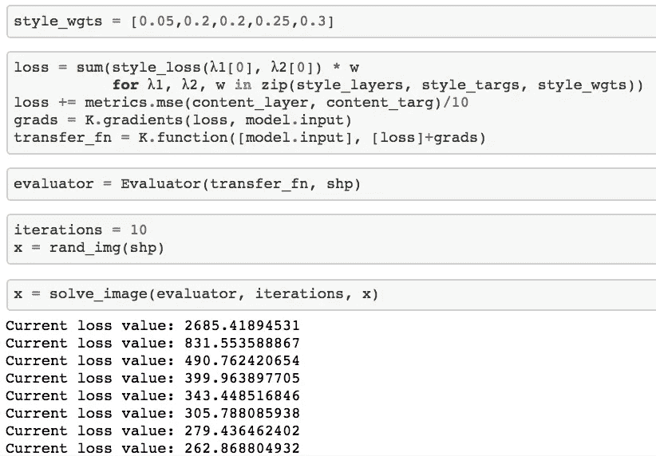

This does the thing

以下是一些结果:

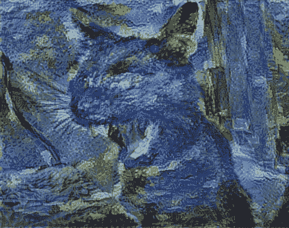

我偶然得到了一幅电源插头的印象派画作:

卷积神经网络需要固定的输入大小，因此内容、风格和输出图像必须具有相同的维度。因此，当我对我的猫的图片进行适当的裁剪时，我忘记了调整它，得到了左上角，和我用来设计风格的一幅小鸟画的尺寸一样。

Artistic inspiration brought to you by Snapchat…

最后，确保我做的事情是正确的:看看我是否能在相同的输入图像上得到与杰瑞米·霍华德相同的结果:

肯定有些不同，当然也有相似之处，我喜欢这是第一次运行。我肯定对做好*风格转移感到兴奋，就像你将在这里找到的一样:[https://github.com/titu1994/Neural-Style-Transfer](https://github.com/titu1994/Neural-Style-Transfer)*

足够幸运的是，看起来像“蒙版”等技术将在第 9 课中涉及，所以我甚至不需要额外学习。

所以，最后一点:这不是一个从头学习的帖子。为此:你必须浏览课文和原始笔记本。但是如果你正在做这个并且想要一些额外的想法，那么希望这是有帮助的。

我喜欢人工智能的另一点是它提供了粗略但精确的文件夹名称:

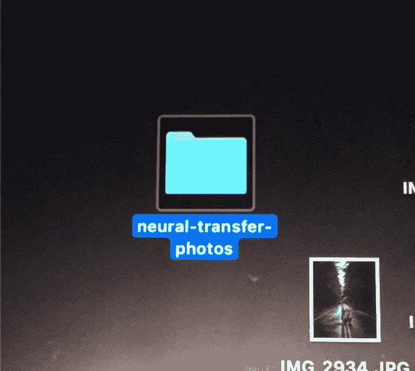

非常感谢[杰瑞米·霍华德](https://medium.com/u/34ab754f8c5e?source=post_page-----a2e6780ab17b--------------------------------)和[瑞秋·托马斯](https://medium.com/u/ee56d0bac1b7?source=post_page-----a2e6780ab17b--------------------------------)将 fast.ai 组装在一起