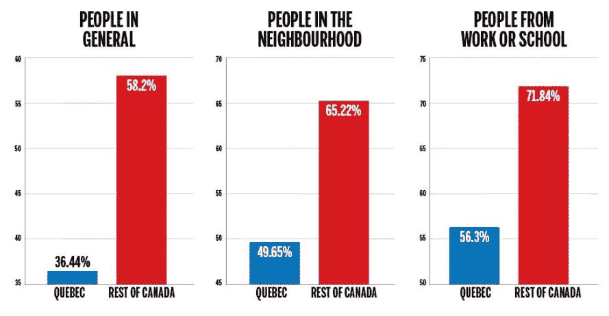

# 公平的警告:女人、财产和预算的孤岛

> 原文：<https://towardsdatascience.com/fair-warning-islands-of-women-property-and-budgets-88d5128ac7b9?source=collection_archive---------7----------------------->

你好！如果上周的简讯严重缺乏和低能量(悲伤)，那么本周的又回到了正轨！

如果你没见过猫敲钟觅食，你可能应该去看看。

[*报名每周日收件箱收到公平预警*](http://www.tinyletter.com/FairWarning)

# 在国内

我真的很喜欢《卫报》的这篇文章——投票支持英国退出欧盟的英国地区的情况会更糟。我真正喜欢的是以如此简单的方式显示数据的图形。这些地图清晰易懂，并能产生立竿见影的效果。

伦敦的豪宅业主似乎无法转移他们的房产(有人感到惊讶吗)，所以他们[转向 AirBnB](https://www.bloomberg.com/news/articles/2017-03-26/london-mansion-owners-turn-to-airbnb-as-buyers-turn-up-noses) 。

英国大部分地区(57.9%)没有本地报纸——这是来自这张[本地新闻地图](http://localnewsmapping.uk/)的令人震惊的统计数据，它显示了(或缺乏！)当地新闻来源。安德鲁·布莱特韦尔

# 在池塘那边

美国人对唐纳德·特朗普的看法简史。

CNN 制作了一张今年在美国成为目标的清真寺的地图。

很好的互动展示了蒙特利尔的建筑有多古老。

NPR 的《一张图中的美国工作日》很不错，尽管我不知道四处点击看看不同的行业有多吸引人。他们自己对数据进行了一些探索，这很好，因为我不确定我是否会寻找午餐时间的差异，或者将建筑工人与厨师进行比较。

《华盛顿邮报》查看了过去 40 年的预算，以比较不断变化的国家优先事项。同样在川普的预算上，美联社创造了一个[尺度来平衡预算的削减和增加](http://interactives.ap.org/2017/balancing-budget/)。只有五家机构将获得更多资金；其他一切都被削减了。

这是一张美国每平方英尺房产[价格的地图(H/T](http://www.visualcapitalist.com/interactive-map-price-per-square-foot-us-housing-markets/)[Charles Arthur](https://twitter.com/charlesarthur))——在 3D 环境下使用有点奇怪，但你可以通过拖动和使用鼠标滚轮放大和缩小来操纵它。

# 在别处

《卫报》的全球发展网络关注了千年发展目标的成功程度。2100 万额外的生命被挽救，4.71 亿人摆脱了贫困，但这是一幅复杂的画面。

根据饥荒预警系统网络，今年将有 7000 万人需要粮食援助。《经济学人》研究了非洲和也门即将发生的饥荒是如何有政治原因的。

《印度斯坦时报》选择了一种非常有趣的方式来形象化政治中的性别差距——去掉所有没有女性候选人的地理区域，剩下的就是女性孤岛。

# 零碎东西

[泰坦尼克号上的生死。](https://www.reddit.com/r/dataisbeautiful/comments/62a22r/death_and_life_on_the_rms_titanic_oc/)

这是查尔斯·密纳德的一个很棒的简介，他以拿破仑三月的形象化而闻名(这很特别)——但是他实际上做的远不止这些！同样值得一读的是——寻找画有密纳德画作的艺术品。

交互式图形的问题是[没有人真正使用它们](https://www.fastcodesign.com/3069008/the-problem-with-interactive-graphics)。这引发了我长久以来的思考，也是一个棘手的问题——你如何在图形设计和交互性方面拓展边界，同时确保用户从中获得最大收益？关键是个性化。

Steve Wexler 写了他如何[在看到一个很棒的图表示例后，学会了喜欢 Marimekko 图表](http://www.datarevelations.com/dr-strangechart.html)并理解它的用例。我不得不同意艾玛·威特版本的图表确实让任何其他的想象都相形见绌。

# 本周最差图表

啊，不:

这星期就这些了！感谢阅读。如果你喜欢这篇时事通讯，把它转发给别人，[鼓励你的朋友注册](http://tinyletter.com/fairwarning)，或者[请我喝杯咖啡](https://ko-fi.com/A101LKE)以示感谢。评论？回复这封邮件。如果你认为我们可以一起工作——让我们聊聊吧！在 Twitter 上找到我[@ soviewernes](https://twitter.com/sophiewarnes)。