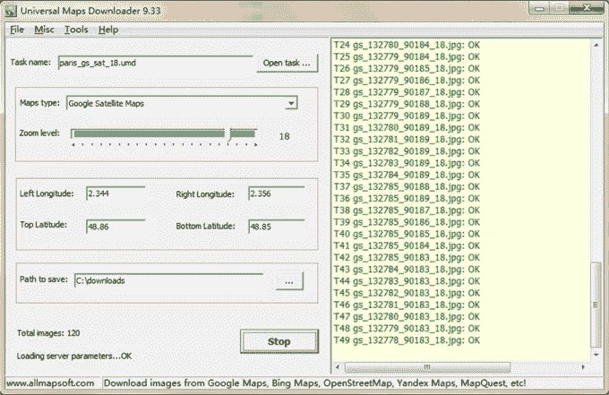
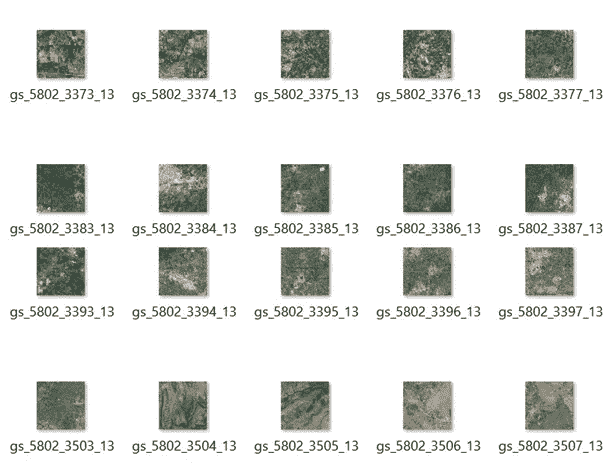
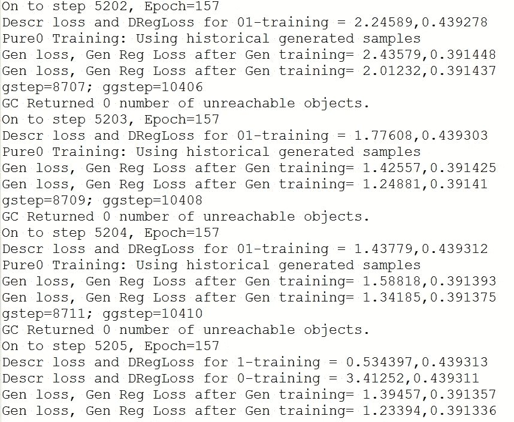
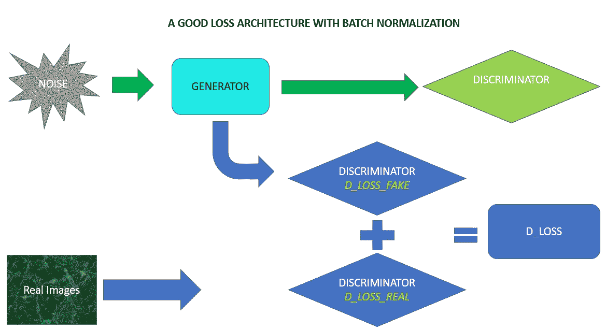
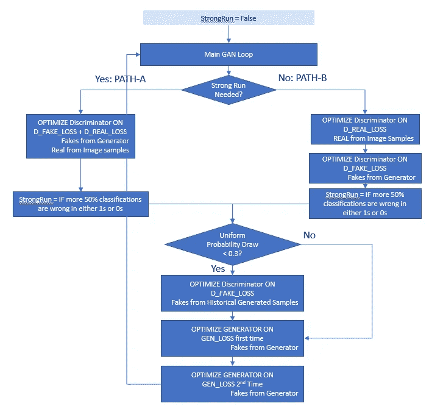
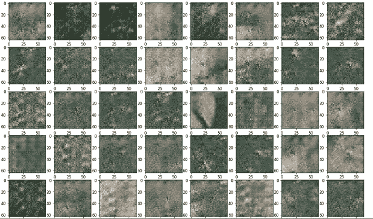
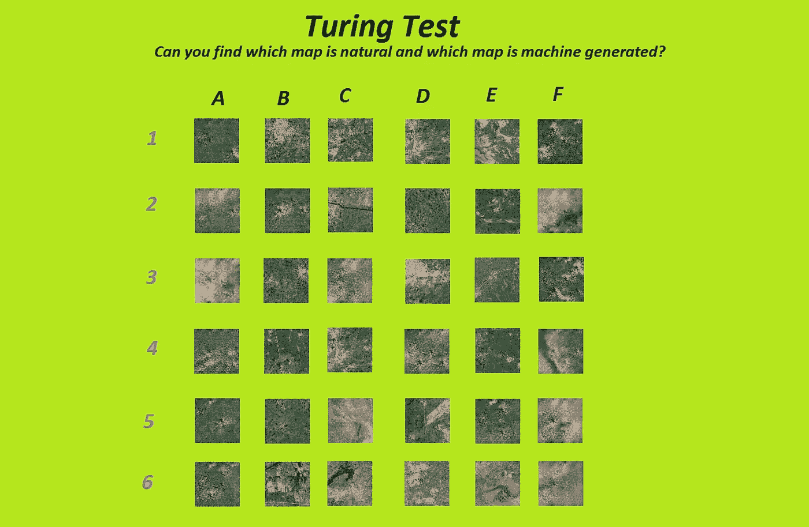

# 生成假卫星图像—训练 GAN

> 原文：<https://towardsdatascience.com/fake-satellite-images-training-a-gan-437424d3cb6b?source=collection_archive---------4----------------------->

## *学习 39 种不同的技巧，让 GAN 走向成功*

除了在 Coursera 上学习吴恩达的 ML 课程之外，我以前从未做过神经网络。发誓！那真是一门课程！转行。不是吗？

通常，每当我感到技术转向的威胁时，我就会提出一些结合了许多未知因素的宠物项目。它帮助我探索空间并获得一些舒适的感觉。正是在这条线上，我开始了我的宠物项目，训练一个甘生成航空卫星图像。所有涉及的技术—神经网络、CNN、GAN、Tensorflow、Python 等。对我来说都有些陌生。所以，从我的角度来看，这是一个有价值的项目。

第一步是获得一些低分辨率的卫星图像。我在网上找到的图片都很大。23000x12000 左右的样子。每当我打开 PIL 的 Python 图像处理库来调整它们的大小时，它都会崩溃。无论如何，将如此高分辨率的图像调整到 64x64 会破坏所有的细节。这似乎不是一个好主意。那时我发现了“通用地图下载器”软件，它可以从你选择的地理区域下载 256x256 的图像。免费版本只下载了 50 厘米低分辨率的卫星图像，这对于我的实验目的来说是可以的。



Courtesy: Screenshot of the Universal maps downloaded taken by me

这是一个干净的软件，做它承诺要做的事情。下面是软件下载的一些真实图片。对于寻找真实卫星图像的从业者来说，“[亚马逊地球](https://aws.amazon.com/earth/)”是一个非常有前途的资源。我相信它是从美国政府的[地球资源卫星项目](https://en.wikipedia.org/wiki/Landsat_program)获得图像的。



Map images downloaded by Universal maps downloader — Screenshot taken by me

我兼职工作了 5 个月，让这个项目运行。如果我有一些先验知识，并且全职使用 GPU 的话，花费的时间会少得多。我从头开始开发所有代码*，没有*重用任何存储库中的任何代码(除了来自 OpenAI 的 RelU 函数*)。所以这给了我一个犯很多错误的机会，我把这些都记录在这里供你参考。希望这有所帮助。*

本文档分为以下几个部分

1.  如何不训练一个甘
2.  云 GPU 提供商之间的快速比较:Crestle 与 FloydHub
3.  生成的图像
4.  图灵检定
5.  图灵测试答案

# **如何不训练一个甘**

我将这一部分组织成 4 个部分，每个部分讨论潜在的“错误”

1.  一般准则
    —未遵循标准架构
    —低估计算需求
    —未对 GPU 进行培训
    —未使用内存中的图像进行云 GPU 培训
    —未维护观察日志
    —未初始播种 RNG
    —混合单色/彩色图像，输入不佳
    —未标准化输入
    —未进行中间模型检查点
    —未转储生成的图像以检查学习情况
2.  TensorFlow 相关指南
    —不使用图像格式
    —缺少来自 API 的隐式规范化
    —使用 TF 读取/写入图像
    —创建孤立张量
    —在同一个调用中同时运行 opt 和 loss
3.  神经网络相关指南
    —未保持生成器/Discr 对称
    —未对最终生成器使用 TANH
    —未对偏差使用零初始化器
    —未使用 Xavier Init
    —未使用正确数量的滤波器组
    —未使用步进卷积代替汇集
    —未使用泄漏 Relu
    —未使用批处理归一化来加速计算
    —未使用正则化器
    —未选择正确的正则化器常数
    —在批处理中进行归一化
4.  培训相关指南
    —将所有 CPU 内核专用于培训
    —不将输入图像转换为-1 和+1
    —运行较少的迭代
    —非常高的学习率
    —重用 Adam 优化器对象
    —不使用历史图像进行培训
    —为历史目的生成单独的图像
    —不执行历史图像转换
    —将生成器置于鉴别器之上
    —强大的 Discr/强大的 Gen
    —具有批处理规范的 Net arch
    —取消

# **通用指南**

错误 1

**不遵循标准网络架构**

> DCGAN 是一个很好的架构，它们适用于 64x64 图像。Github 中有一些例子——open ai 和 Carpedm20 的 DCGAN Tensorflow 实现。
> 
> 不要尝试任何新颖的架构。只要实现基本的 DCGAN 正常工作。这本身会帮助你正确理解许多基础知识。

在没有完全实现 DCGAN 架构的情况下，我开始对网络进行随机更改。我有更少的层，每层有不同数量的滤波器组，等等。我想很快看到我得到的输出…但你在 GAN 中很快得到的只是 BS。你不会希望这样的。

错误 2

**低估计算需求**

> 深度学习需要大量的计算。不要低估这一点。
> 
> 如果你的笔记本电脑/台式机有发热问题，我不建议运行深度学习。你会把它融化的。不要把发热的笔记本电脑放在床上或易燃的地方。Table mate 是远程连接笔记本电脑的好选择。它由纤维制成，不会受热。
> 
> 对于计算，如果你有机会的话，GPU 无疑是最好的选择。

如果你受到笔记本电脑/台式机 CPU 或类似设备的限制，从一个适中的目标开始(比如说*较低的图像分辨率*)，一旦你清楚如何解决这个问题，就选择基于云的 GPU。

我从 256x256 的图像生成开始，并不知道我在做什么。在我的笔记本电脑上训练它需要一年的时间。糟糕的选择。

错误 3

**不在 GPU 上训练**

如果你不在 GPU 上训练你的 GAN，你可能哪里也去不了。初始形状的出现需要将近 1000 次迭代。

> 20000 次迭代的训练很常见。

如果你在 CPU 上运行，这些训练可以一起运行几天，在你决定取消一个模式崩溃(或)一个不稳定的训练路径之前，需要几个小时。

超参数调谐也非常困难。它会耗掉你所有的时间。不值得。

错误 4

**在云上使用 GPU 驱动的笔记本电脑进行培训时，不在内存中保存图像**

> 像 [FloydHub](http://www.floydhub.com) / [Crestle](http://www.crestle.com) 这样的云 GPU Jupyter 笔记本提供商往往有一个缓慢的 IO 子系统。他们可能使用亚马逊 S3 或某种 Blob 存储或一个新颖的文件系统来存储你的文件。这意味着，每次迭代从这些存储器中读取图像会非常慢。
> 
> 如果没有足够的内存，在处理当前批处理时，使用**异步 IO** 读取下一个批处理。将 GPU 计算与 IO 重叠也是一个好主意！

错误 5

**没有维护观察日志**

保持一个观察日志，记录你所做的所有改变，你所看到的效果等等。这确实有助于避免一次又一次地犯同样的错误。

你也可以把“待定清单”放在另一张纸上，这样你就不会错过你的想法。

错误 6

**未初始播种的 RNG**

> 在开始时用一个常数作为 RNG 的种子是很重要的，这样你就可以理解你的超参数变化实际上是如何影响学习的。

```
tf.set_random_seed(1234) *#Lets inspire some Determinism*
```

通过将连续运行的中间输出与配置变化进行比较，您可以看到学习是进行得更快了(还是变慢了(还是退化了)等等。

> 不确定 RNG，你不能对你的超参数变化做出任何推断。观察日志将不会有用。

错误 7

**在输入图像中混合单色和彩色图像(或)输入图像中的不良特征**

> 保持输入的一致性和丰富的特性

有时，我们可能会在输入中混合单色和彩色图像。由于单色只有一个通道，而彩色图像有三个通道，混合它们会在处理时导致错误。有时，当你创建一个有几千幅图像的数据集时，你的处理会在某一批中失败，你需要一段时间来解决这个问题。这是真的，尤其是如果你没有在初始化期间一次读取所有的图像。

错误 8

**未标准化输入**

标准化输入将避免大的 logit 值，这反过来会破坏梯度和学习过程。这是我学到的第一件事。如果您使用的图像值在 0 到 255 之间，请在 0 到 1 之间转换它们。

> 如果你想一想神经网络是如何工作的，图像值乘以权重，相加，并用于 sigmoid/Relu 激活。当结果值很大时，曲线在这些区域或多或少是平坦的，因此梯度很小，并且它不会推进学习。**梯度是学问。如果没有梯度，那么就没有学习**。

错误 9

**不检查模型，仅在所有迭代完成后保存**

> 任何可能出错的事情都会出错——墨菲定律。

为了确保故障恢复，总是每 500 次迭代左右检查一次模型。很容易从离开的地方恢复。Tensorflow 支持此操作的简单 API。模型保存会导致创建共享相同模型名称前缀的多个文件。您可以简单地单独使用 model-name 前缀来加载和保存模型。

> 确保在获得最终输出后，手动清除所有检查点。GAN 型号会留下巨大的磁盘空间。

```
saver = tf.train.Saver()
savePath = saver.save(session, 
                 outputFolder + "/" + thisRunTime + "." + str(step))....SavedModelCheckpoint = "/home/nbuser/output/1510295650.2870145.4000"
restorer = tf.train.Saver()
        restorer.restore(session, SavedModelCheckpoint)
```

错误 10

**不转储生成的图像以检查学习情况**

这相当简单明了。每 10 次迭代，总是转储一个随机生成的图像。你会知道训练的方向。

> 注意:生成的图像是一个“噪声”向量的函数。根据“噪声”矢量的不同，生成的图像可能看起来很好(也可能很差)。所以，如果你看到生成器有时生成愚蠢的图像，并不意味着它已经退化了。只是随机噪声向量可能是一个不太可能的向量。不要试图过多解读被甩的形象。

# **TensorFlow 相关指南**

错误 11

**在 TensorFlow 中没有使用正确的图像格式**

大多数与 NN 相关的图像操作，如 *tf.nn.conv2d* 、 *tf.nn.conv2d_transpose* 接受 4 维张量。4D 通常用于 RGB 图像阵列。

Tensorflow APIs 支持两种图像格式——NHWC 和 NCHW。

> *NHWC 布局*——【批次、高度、宽度、通道】
> 
> *NCHW 布局*——【批次、通道、高度、宽度】

根据您阅读输入文件的方式选择相关的选项。默认值是 NHWC，应该没问题。但是如果您的图像不同，请确保在 API 调用中指定了格式。

错误 12

**缺少 API 完成的“隐式”规范化**

Tensorflow 提供了*TF . image . convert _ image _ dtype*API，当您将“数据类型”从“uint8”转换为“float”时， ***会自动在 0 和 1*** 之间缩放图像。0–255 Int image 映射到 0–1 float image，反之亦然。如果你再把图像除以 255。，那你就要承受一些无声的痛苦了。

> 这是我在文档中没有正确阅读的内容。转储正在传送到网络的图像。这将给出一个好主意，如果事情按你认为的方式运行。

错误 13

**使用 Tensorflow APIs 读取/写入图像**

是的。不要用 TF 看图像。在 Tensorflow 中将图像读取为 Numpy 数组并不简单。至少，不像我希望的那样简单。一些文档谈到队列管理器(*为了什么？和做其他体操——对于做一件简单的事情来说，这太复杂了。在这方面，我可以理解“张量流很烂”的家伙。*

> 使用“matplotlib”将文件读取为 Numpy 数组。这是一个干净的选择。参见下面的代码片段，这是一个很好的例子。

```
**import** **matplotlib.pyplot** **as** **plt**
**import** **matplotlib.image****def** listFolder(folder) :
    f = []
    **for** (dirpath, dirnames, filenames) **in** walk(folder):
        jpgfiles = list(filter(**lambda** x : x.split(".")[-1] == "jpg" **or** x.split(".")[-1] == "jpeg", filenames))
        f.extend(jpgfiles)
    **return** f**class** **originalDistribution** :
    **def** __init__(self, imageInputFolder):
        self.srcFolder = imageInputFolder
        self.listOfFiles = listFolder(self.srcFolder)
        np.random.shuffle(self.listOfFiles) *#Inplace shuffling*
        **if** floydRun **or** crestleRun:
            self.imagesInMemory = np.asarray(list(map(**lambda** x : matplotlib.image.imread(self.srcFolder+"/"+x), self.listOfFiles)))/255.
        **else**:
            self.imagesInMemory = np.asarray(list(map(**lambda** x : matplotlib.image.imread(self.srcFolder+"**\\**"+x), self.listOfFiles)))/255.*And so on.......*
```

> 使用 matplotlib API 保存生成的图像，该图像是一个 numpy 数组

```
**import** **matplotlib.pyplot** **as** **plt**
**import** **matplotlib.image**plt.imsave(tempImages + "**\\**GEN_STEP_" + '**{:05d}**'.format(step) + ".png", genMap[0], format='png', vmin=-1, vmax=1)
```

> 使用 Tensorflow 占位符将读取的图像提供给 TF 图

```
inputTensorPlaceholder   = tf.placeholder(tf.float32, shape=(nSamples, inputheight, inputwidth, inputchannels)) ....._ = session.run([d_opt_1], feed_dict={ 
                        inputTensorPlaceholder: inputNumPy,
                        realBenchmarksPlaceholder:benchmarkones 
                                    })
```

错误 14

**创建孤立张量。**

这将导致你的程序内存泄漏，从而导致“应用程序失败”和一些“窗口冲击”。嘿！为什么 windows 不能直接运行它？Linux 将震撼它。不是吗？没有。孤儿张量吸内存！

> 下面是孤立张量的一个例子。我使用下面的函数为每次迭代从文件系统中读取“小批量”。从磁盘读取本身是一个坏主意，我们稍后会看到。但重要的一点是，这些张量只是呆在外面，没有被清理，等待会话结束。这将逐渐耗尽您的系统内存，尤其是当您运行 1000 次迭代时。这会毁了你的周末跑步。

```
# 
# DON'T USE THIS FUNCTION
# MEMORY LEAK AHEAD
# YOU HAVE BEEN WARNED!!
#**def** makeImageTensor(filename):
    fileTensor = tf.read_file(tf.convert_to_tensor(filename))
    intImage = tf.image.decode_jpeg(fileTensor, channels=inputchannels)
    floatImage = tf.image.convert_image_dtype(intImage, tf.float32)
    **return** floatImage .............#
# Repeatedly calling the code below will cause memory leak
#*inputImageTensorList = [makeImageTensor(x) for x in imageFiles]*
*inputImagesTensor = tf.stack(inputImageTensorList)*
*inputNumPy = inputImagesTensor.eval()
session.run([some list], 
            feed_dict={inputImageTensor: inputNumPy and so on...})*
```

错误 15

**在一次运行中同时运行优化器和损耗**

下面的代码是不确定的，因为 TensorFlow 没有指定其操作的执行顺序。因此，无法确定“d_opt_1”是在“d_real_loss”之前还是之后运行。那么，上报的“d_real_loss”是优化前的还是优化后的呢？

```
#
# This code below is NOT deterministic
#_, l, dregloss, dt1 = session.run([d_opt_1, d_real_loss, d_reg_loss, DiscriminatorGraph], 
                     feed_dict={  
                        inputTensorPlaceholder: inputNumPy, 
                        realBenchmarksPlaceholder:benchmarkones,
                               })
```

> 运行优化器后，始终在单独的 session.run()调用中运行“loss”。这样，你就可以确定，打印出来的损耗是经过优化的

# **神经网络相关指南**

错误 16

**未保持发电机和鉴别器对称**

DCGAN 论文没有全面讨论鉴频器架构(或者)可能只是一个参考。选择对称的架构。如果在生成器中有 7 层，确保在鉴别器中有相同的层。

这也可能与鉴别器和发生器的等功率配置有关。

错误 17

**最终发电机输出不使用 TANH】**

TANH 激活返回-1 到+1。这是 DCGAN 中建议的，在 OpenAI 代码中也可以看到。不知道为什么。用一样的，开心就好。

错误 18

**用非常数、非零初始值设定项初始化偏差**

> 所有的偏差变量必须用一个“常数”初始化器初始化，初始值为“0”。

这将允许算法学习它自己的偏差。在没有任何显著原因的情况下，最初保持较大的偏差会使训练过程极其缓慢，因为偏差会对成本产生如此大的影响，以至于其他变量将不会正确地看到它们的效果(*以及梯度*)。

```
gb1 = tf.get_variable("gb1", shape=[SecondChannels], dtype=tf.float32, initializer=tf.constant_initializer(0.0),
                              regularizer = g_reg)
```

错误 19

**不使用类似 Xavier / Glorot-Bengio 初始化的细微初始化**

> 批处理规范化确实可以弥补糟糕的初始化的影响。但是一个好的初始化，像 Xavier init 总是受欢迎的举措。所以，不要忽视。

Xavier init 的简单直观的解释可以在 Andy Jones 的博客中找到。

```
g_dc1_fanin = 5*5*FirstChannelsg_dc1_fanout = 5*5*ThirdChannelsg_dc1_scale = np.sqrt(6./(g_dc1_fanin + g_dc1_fanout))dc1filter   = tf.get_variable("dc1filter", shape=[5,5,SecondChannels, FirstChannels], dtype=tf.float32, initializer=tf.random_uniform_initializer(minval=-g_dc1_scale,maxval=g_dc1_scale), regularizer = g_reg)
```

错误 20

**未使用足够数量的滤波器组**

DCGAN 从 4×4 分辨率开始，发生器中有 1024 个滤波器组，逐渐减少滤波器组的数量，同时提高分辨率。

在鉴频器端，由于对称性，也需要类似数量的滤波器组。

> 我认为滤波器组的数量与所用滤波器的尺寸成正比。这在鉴别器上下文(或)图像分类上下文中是真实的。如果您为 5x5 选择 1024 个存储体，那么您将不得不为 11x11 滤波器选择 4096 个存储体。11x11 可以捕获比 5x5 更多的模式，因此我们需要更多数量的滤波器组来捕获所有变化。这是我的想法。

错误 21

**不使用交错卷积，而是使用合并层**

DCGAN 论文明显不鼓励使用池层，而是提出使用“*步长卷积*和“*分数步长转置卷积*分别用于下采样和上采样。

错误 22

**鉴别器中未使用泄漏 Relu**

> 泄漏的 RelU 导致一个强大的鉴别器。不要在鉴别器中错过这个。
> 
> 根据 DCGAN 论文，这在发电机中是不需要的。但是我的观察日志显示 LRelu 在生成器中确实产生了非常好的结果。但是，由于某种原因，最后成功运行的人从来没有使用它。所以，也可以用发电机来测试泄漏的 Relu！

错误 23

**不使用批量标准化来加速计算**

DCGAN 建议对生成器和鉴别器都进行批处理规范化。

批处理规范化有助于克服错误的初始化，并可以加速训练过程。

> 从学习模型生成图像时使用相同的批量很重要(*训练后阶段*)。如果您使用不同的批量大小，批量统计将会不同，学习的批量标准相关参数将*而不是*适用
> 
> (或)您必须在训练时保存批量统计数据，并对这些统计数据进行加权平均，在生成非标准批量图像时使用这些参数进行批量标准化。
> 
> (或)使用 OpenAI 引入的虚拟批处理规范化，而规范化总是针对外部预配置的批处理

错误 24

**不使用正则化子**

Tensorflow 不强制设置正则项。这取决于你去找一个正则化。

> 当您运行数千次迭代时，不执行正则化会破坏训练过程的稳定性。

出于某种原因，我找不到关于如何在 TensorFlow 中应用正则化的像样的文档。所以，我只是参考资料来理解它是如何做到的。下面我也总结了一下。

```
#
# Declare a Regularizer. 
# d_reg is a function which can be called with weights. 
# It returns a Graph that computes L2 regularization. 
# Choose the Constant wisely according to the number of parameters
# to be optimized.
#d_reg = **tf.contrib.layers.l2_regularizer**(scale=DREG_SCALE, scope="REG-DISCR")#
# Pass the declared regularizer when creating Variables. 
# Depending on which scope the variables are created, Regularizer
# will also be associated with the same call
#c1filterVar = tf.get_variable("c1Filter", shape=[5,5,inputchannels,c1Banks], dtype=tf.float32, initializer=tf.random_uniform_initializer(minval=-c1scale, maxval=c1scale), **regularizer=d_reg**)#
# get_reg_loss: Uses TF API to get all regularization related 
# losses corresponding to the "scope" and then add them up using
# tf.add_n() API
# NOTE: The "add_n" is what ties all the loose L2 regularizer graphs
# together into 1 meaningful
#**def** get_reg_loss(regscope):
    **return tf.add_n**(**tf.losses.get_regularization_losses**(scope=regscope))#
# Call the get_reg_loss() with the scope of the variables 
# that you want to regularize.
# d_reg_loss = get_reg_loss(regscope="DISCR")#
# Add the loss to the regular loss
#
d_loss = d_real_loss + d_fake_loss + d_reg_loss
```

错误 25

**没有选择好的正则化常数**

> 使用正则化时，始终打印最终损失分解。这将告诉我们正则化损失占总损失的比例。如果正则化损失在训练开始时很大，您可能需要减少常数

以下是我的配置

```
Number of Generator Parameters     = 19,154,627
Number of Discriminator Parameters = 19,616,609
Discriminator Regularizer Scaling Constant = 0.0001
Generator     Regularizer Scaling Constant = 0.0001
```

错误 26

**在生成器的最后一层/鉴别器的第一层进行批量归一化**

对发生器末端的单个双曲正切单元的输入进行批量归一化将确保输入到双曲正切单元的输入具有 0 的平均值和有限的方差。这一点也不理想，因为我们希望激活在-1 和+1 之间展开。所以，不要批量归一化生成器中的最后一层。

```
dc5relu = tf.nn.relu(batchNormalize(tf.nn.bias_add(dc5, gb5), "BN_DC5Filter"))#Contrast the above with the belowdc6relu = tf.nn.tanh(tf.nn.bias_add(dc6, gb6))
```

这同样适用于第一层鉴别器。这将确保生成的图像中的差异传播到下游的所有层。

错误 27

**没有做足够的工作来减轻棋盘效应**

在生成器管道的末端，TANH 层之前，运行几个卷积转置层，步长为 1x1，分辨率不变，以消除 2x2 和其他步长卷积引入的棋盘效应。我多跑了一层。但是如果你有很好计算能力，你可以多运行几次。确保在鉴别器层中反射相同的光线以保持对称性。我记得在 OpenAI 代码中看到过这个。

# 培训相关指南

错误 28

**将所有 CPU 内核专用于训练**

如果你使用 CPU 进行训练，不要为训练分配所有的核心。张量流可以配置。请参见下面的片段。

```
#
# My laptop has 4 cores. The code below provides the context for the # main training loop.
# Leaving 1 core free for OS and other apps.
# This will ensure machine is interactive despite GAN training
#**with** tf.Session(config=tf.ConfigProto(intra_op_parallelism_threads=2, inter_op_parallelism_threads=1)) **as** session:
```

错误 29

**不将输入图像变换到-1 到+1 范围**

认识到生成的图像来自-1 和+1 是很重要的。输入图像归一化后通常从 0 到 1。你还需要 1 级转换才能将它移动到-1 到+1。见下文。

```
inputImagesTensor = (inputTensorPlaceholder * 2.) - 1.
```

错误 30

**运行较少的迭代次数**

> 看看别人都发表了什么。20，000 次迭代是常见的。即使在你的笔记本电脑上运行了 12 个小时，你也不会在 500 或 700 次迭代中得到任何东西。

学习任何有意义的东西都需要大量的迭代。

错误 31

**使用非常高的学习率**

非常高的学习率会破坏训练过程的稳定性。

即使您使用了批量标准化和良好的初始化，使用像 0.001 这样的学习率也会使整个训练过程不稳定，这取决于您的批量大小。

> 可以注意到，较高的“批量”通常可以支持较高的训练速率。后来，我发现这一点在“高效背景”文件中也有讨论。

如果您使用 512 作为您的批量大小，0.001 可以是一个很好的学习率。如果你的批量大小是 64，坚持使用 0.0002 (DCGAN 推荐)

```
Image Resolution = 64 x 64
Mini Batch size  = 64
Generator Learning Rate     = 0.0002
Discriminator Learning Rate = 0.00015
```

错误 32

**重用 Adam 优化器对象**

Adam 优化器是一种状态优化器，与梯度下降优化器相比，建议用于 GAN 训练。但是，重用 Adam Optimizer 对象可能会导致无意义的行为，因为它具有有状态的性质。

Adam optimizer 将梯度计算为过去梯度的指数衰减加权平均值。这个想法是为了加速学习最小值，更快地穿越平坦区域等等。

> 为每个损失最小化使用单独的 Adam 优化器对象。例如，在我使用的方案中，我使用了 4 个优化器对象。一个用于 D_REAL_LOSS，另一个用于 D_FAKE_LOSS，另一个用于 D_REAL_LOSS + D_FAKE_LOSS，另一个用于 GEN_LOSS。

错误 33

**不使用历史图像训练鉴别器**

这是我从 Soumith Chintala 的 [GAN 提示和技巧博客](https://github.com/soumith/ganhacks)中学到的。也是 AIDL·脸书集团的史蒂夫·梅西纳建议的。

> 偶尔向鉴别器提供历史图像有助于打破鉴别器和生成器之间的重复循环，并稳定整个训练过程。

这个在学习过程中绝对有价值。我在主训练循环中花了 30%的时间进行这种训练。只有在包括这一步之后，学习的最初症状才开始出现。

错误 34

**生成用于历史目的的单独图像**

> 确保保存用于历史记录的图像在您已经生成的批次中重复使用。

如果您正在为历史目的生成一个单独的图像，那么它将不会像预期的那样工作，因为批处理规范化是有效的。因此，谨慎的做法是从生成的批处理中选择一个图像并使用它。

错误 35

**将生成图像的历史记录输入鉴别器时不转换图像**

训练过程有时会从缓存生成的历史图像中向鉴别器馈送样本(*并非总是如此，因为这是有条件运行的*)。当我们这样做时，我们需要注意“图形”路径 ***可能*** 期望一个从 0 到 1 值的图像。这个看你的训练逻辑了。因此，如果您的逻辑需要，在将生成的图像存储到历史缓存之前，将其转换为 0 到 1 之间的值。

```
hc = np.random.randint(0, nSamples) *#history candidate*
candidateForHistory = genMap[hc]
candidateForHistory = candidateForHistory + 1.
candidateForHistory = candidateForHistory / 2.
GCache.addImage(candidateForHistory, step)
```

错误 36

**优先考虑发生器而不是鉴别器**

最初，人们更多地关注优化生成器，而不是鉴别器。这是错误的，因为鉴别器是 GAN 中最重要的部分。鉴别器带路，通过提供健康的梯度来教导生成器。

在 GAN 训练结束时，鉴别器滤波器组也可以用于对象检测和开发有效的分类器。由于他已经被大量的虚假图像轰炸，他也不太容易受到对抗性攻击，我想是这样的。

错误 37

**强力鉴别器/强力发生器**

可以通过增加更多层或增加滤波器组的数量来增加鉴频器的功率。这可能导致模式崩溃，因为鉴别器可能会快速通过并将发电机推到非常糟糕的区域(*梯度差*)，发电机无法从这些区域出来。

同样强大的发电机将没有鉴别器来引导他。歧视者，谁必须领导的方式和教学，现在被制服。这个配置也不好。

> 稳定的 GAN 训练的理想设置是鉴别器和发生器功能相同，并反复相互学习。



Losses seen in a Successful GAN training. Gen is trained Twice

在上面的图中，我们可以看到发电机总是被训练两次。鉴别器有时分别针对纯 1 损耗和纯 0 损耗进行优化，有时针对 1 和 0 的总损耗进行优化。这个想法是根据损失的进展在两者之间交替，并在训练中保持平衡。更多关于“自由训练”下的精确策略

错误 38

**使用批量标准化时选择了错误的张量图架构**


Image courtesy: Self made PPT

如果我们在鉴别器中使用批量规范化，上面的架构将会爆炸。为什么？

考虑送入鉴别器的 3 个批次。3 个批次的“批量”和“统计”不同。同意吗？它们的μ适马将影响鉴别器网络内部执行的批量归一化。每批将被不同地标准化。

因此，您会看到，所报告的 D_LOSS 并不表明“Discriminator”能够很好地阻挡 0。所以，你会预计 G_LOSS 是巨大的。但是…然后你会看到 G_LOSS 报告也少了。这是因为批次统计的差异。

与包含“0”和“1”图像的批次相比，完全相同的“0”图像在单独馈送到鉴别器时具有不同的批次统计。这个架构将 ***而不是*** 设置鉴频器和发生器之间的战斗。训练将会退化，什么也学不到。啊！



Image courtesy: Self made PPT

上述架构不易受批量定额相关问题的影响，因为批量统计数据不会改变。看一看！

错误 39

**自由训练**

Goodfellow 博士在 GAN 的原始论文中描述的训练过程谈到在每一步中训练鉴别器“k”次，而在每一步中只训练发生器一次。这是为了确保鉴别器在学习曲线中领先。然而，这种技术依赖于鉴别器和发生器的相对强度。此外，随着训练的进行，鉴别器或发生器很可能变得过于强大，主训练循环不能适应这些动态变化。

在我的训练计划中，我选择了一个动态的计划。我不确定它如何适用于不同的图像数据集。所以，不保证！

> 在我的设置中，我选择两种不同的路径来训练鉴别器。一条路径使得鉴别器对生成器非常强。让我们称这条路径为-A。另一条路径可能会也可能不会使鉴别器对生成器更强。当 50%的阳性标记被识别为“阴性”或 50%的阴性标记被识别为“阳性”或两者都有时，我选择路径 A。如果没有，我继续更轻的路径-B，为发电机提供呼吸空间。这确保了没有一个变得非常强大，在鉴别器和生成器之间总是有一个平衡，并且它们的学习是交织在一起的。下图显示了确切的逻辑。
> 
> 此方案的 Adam 优化器的“Beta1”比率必须设置为较小的值，而不是 0.9。这是因为当我们在训练期间在路径 A 和路径 B 之间切换时，连续的运行可能在迭代方面相距很远。我把它设置为 0.5，它工作得很好。



Image courtesy: Self made PPT

# ***快速对比 Crestle 和 Floyd Hub***

如果你是一名实验开发者，就去 www.crestle.com。

如果您是一家企业，正在寻求支持、各种平台和专用 GPU 实例，请选择 www.floydhub.com。

两者都以“秒”为单位计算使用量。太好了！

Crestle 提供 GPU (K80)驱动的笔记本电脑，价格仅为竞争对手的一小部分，如 [FloydHub](http://www.floydhub.com) ( *0.34 美元(现在为 0.59 美元)对*1.14 美元)。Crestle 在你的浏览器中提供了一个 unix 命令行(*称为 Jupyter 控制台*)，可以用来创建你需要的目录，压缩输出文件，解压输入文件，安装你需要的包等等。这叫灵活性，亲爱的。你可以使用 Jupyter 笔记本界面上传你的输入，它只是“干净”。你可以在几分钟内开始。但是使用 Crestle，你需要知道你在一个 Amazon Spot 实例内部。尽管您的文件在 Crestle 中跨运行持久化(这本身就是一个很好的特性)，但是您的运行可能会突然中断。哎呀！

与“Floyd Hub”相比，它提供了名为 floyd-CLI 的 Python 包，这是“加载”数据和代码所需要的。这在一开始看起来很傻……但是……Floyd 支持下载/上传的恢复，如果你使用的是不稳定的互联网连接或者你没有备用电源，这将非常有用！Floyd CLI 也在服务器端处理文件的压缩和解压缩。Floyd hub 还以更高的价格提供更好的支持和专用实例。

Floyd Hub 支持使用“装载”将一个作业的输出重新用作另一个作业的输入。与“Crestle”提供的界面相比，这确实是一个复杂的界面。Crestle 只是为你打开了文件系统，你可以按照自己喜欢的方式来读/写。没有挂载，没有命名空间混淆等等。对于像我这样懒惰的简单开发人员来说，Crestle 是一个明显的赢家。

我为我的 GAN 作品选择了 Crestle。我的公司(www.tavant.com)报销所有这些费用。但是，少即是多。不是吗？

# 生成的图像



Image courtesy: Screenshot of generated images taken by me

# 想参加图灵测试吗？



Screenshot of images taken by me

# **图灵测试答案**

请稍微滚动一下……

> 答:假像排列成 *N* 的图案