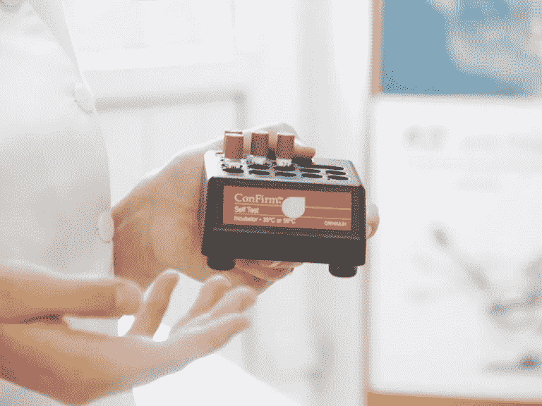

# 假阳性和假阴性

> 原文：<https://towardsdatascience.com/false-positive-and-false-negative-b29df2c60aca?source=collection_archive---------4----------------------->

当你学习假设检验时，有两种错误经常出现——**假** **正** 和**假** **负***技术上分别称为*第一类错误*和*第二类错误*。*

*起初，我并不热衷于这些概念，我不明白它们怎么会有用。然而，这些年来，我开始改变想法。我对这些错误理解得越多，遇到得越多，它们就越让我兴奋和感兴趣。看到它们在现实世界中的应用和用途帮助我从一个不感兴趣的学生变成了一个热情的老师。*

*你知道那些疯狂地谈论一个没人理解或想理解的主题的老师吗？对，现在就是我了！这很棒，所以我想通过这篇文章向你展示这两个错误是如何在不同的和有趣的现实生活环境中产生实际影响的，从而让你达到我的兴奋程度。那么希望，看完之后，你会跃跃欲试地把所有关于**假** **正** 和**假****负** *的事情告诉你爱的人。他们真幸运！**

*惊呼者:本文不是来教你如何区分两者的。如果你想了解如何做到这一点，我在这里 **做了一个关于这个主题的讲解视频。***

# *让错误成为你的朋友。*

*你认为哪个错误更严重？*

***一个假阳性***(I 型错误)* —当你拒绝一个*真*零假设——或者一个**假阴性***(II 型错误)——*当你接受一个*假*零假设？*

*我在很多地方看到这个问题的答案是:**一个误报。我不相信这是 100%真实的。***

*正确的科学方法是形成一个无效假设，让你试图拒绝它，给我一个积极的结果。所以，假设我想看看这篇特定的文章是否比我发布的其他文章的平均表现更好。*

*考虑到这一点，我会选择零假设:*

*“我的文章被阅读的次数将与我发布的类似文章的次数相差*减去* *或**

**如果我拒绝零假设，这意味着两件事之一。**

***1。* *这篇文章表现中等偏上——太棒了！这是我的正面结果。***

***2。* *我犯了一个 I 型错误。我拒绝了一个为真的无效假设。我的测试显示我的表现高于平均水平，但事实上，我没有。我得到一个假阳性。***

**是的，在这里我的假阳性有一个坏的结果，我会不可避免地认为我的文章比它是更好的，从那时起，我所有的文章都以同样的风格写，最终伤害了我的博客流量。这无疑会对我的职业生涯和自尊心产生负面影响。**

# **那**假** **负**呢？**

**如果说这篇文章是博客写作的杰作，但我的测试表明它并不平庸，这种情况就会发生。当然，短期内我不会尝试用这种风格写文章。然而，我是一个有动力的人，会从他的“错误”中学习，所以尝试不同的技巧，有可能创造出更好的作品。**

**这不是最好的结果，我可能错过了一个机会，但这绝不像**假阳性那样具有毁灭性。****

**现在，这是一个最坏的情况是**假阳性的情况，**然而，一个关键的事实是*我*以一种特定的方式陈述了零假设。如果我交换了无效假设和替代假设，错误也会被交换。**

## **让我展示给你看。**

**我的新无效假设:**

**“我的文章被阅读的次数将会比我发表的类似文章的次数多”**

**在**假** **正**的情况下，我会拒绝一个为真的零假设。所以，测试会显示我的杰作实际上是平庸或更糟。还记得这句话吗？这就是上一个例子中的**假** **负**。**

**这表明这两种误差是可以互换的。所以，都是关于你书房的设计；你可以改变一些事情来帮助你避免更大的问题。**

# **在积极中寻找积极。**

**在申请数据科学行业的工作时，一个经常出现的面试问题是:**

**“你能提供一个**假** **正**比**假** **负的结果更好的例子吗？**(反之亦然)**

**当然，你*可以*使用上面的例子，然而，一些学者不太喜欢听到交换假设的想法。我只是想证明一个观点，当涉及到这个概念时，一切都不是那么非黑即白。**

**另外，我有更多的例子给你，你可以向你的潜在雇主展示你真的很了解自己。你很快就会赢得他们的支持！**

**这些例子都有因科学或法律而无法切换的假设(见，没那么非黑即白)。然而，它们确实给我们带来了假阴性不理想的情况。当然，我们仍然有点叛逆，但这样做是在科学和法律的范围内，所以，谁能阻止我们！**

# **对宝宝还是不对宝宝？**

****

**当你做验孕测试时，你是在问:“我怀孕了吗？”**

**然而，在假设检验中，你有你的零假设:**

**“我没有怀孕”**

**拒绝假设给你一个“+”祝贺！你怀孕了！**

**接受假设会给你一个“对不起，祝你下次好运!”**

**生物学决定了这一点，所以恐怕不能切换。虽然测试可能会出现故障，而且**假** **正**确实会发生；在这种情况下，一个**假阳性**就是你实际上没有怀孕时的那个小“+”。一个**假** **负，过程**会是“–”当你肚子里有个小宝宝在成长。******

****这是一个很好的例子，因为更好的情况完全取决于你的情况！****

****想象一下，有人为了一个孩子努力了很长时间，然后奇迹般地怀孕测试呈阳性。他们在心理上为生孩子做好准备，在短暂的狂喜之后，以某种方式，他们发现他们实际上并没有怀孕！****

****这是一个可怕的结果！****

****对于那些真的不想要孩子、没有准备好要孩子的人来说是假阴性，当他们用阴性结果向自己保证时，饮酒和吸烟会对她、她的家庭和她的孩子造成难以置信的伤害。****

****然而，交换一下这些女性的情况，你会得到尽管不理想，但好得多的结果。****

## *****琐事时间！*****

****怀孕测试已经发展到最小化假阴性的可能性。这确实改善了测试，因为虽然你不太可能去看医生来确认阴性结果，但对阳性结果来说是明智的。有许多医学原因导致假阳性，但假阴性只出现在测试的错误执行中。****

# ****艾滋病测试****

********

****这里有一个更明确的例子。****

****想象一下，一个病人正在接受艾滋病毒测试。****

****无效假设是:****

****“病人没有感染艾滋病毒。”****

****一个**假** **阳性**的结果起初会让病人心碎；不得不面对这一消息并告诉家人和朋友的创伤不是你希望发生在任何人身上的情况，但在接受治疗后，医生会发现她没有病毒。再说一次，这不会是一次特别愉快的经历。但是没有艾滋病毒最终是一件好事。****

****另一方面，**假阴性**意味着患者携带艾滋病毒，但检测结果显示为阴性。这种情况的影响是可怕的，患者将错过重要的治疗，并有很高的风险将病毒传播给他人****

****毫无疑问，这里的**假** **负**才是更大的问题。对个人和社会都是如此。****

## *****琐事:*****

*****许多医生称艾滋病结果为“反应性”，而不是阳性，因为存在假阳性。在患者被确定为 HIV 阳性之前，会进行一系列的检测。这并不全是基于一份血液样本。*****

# ****阳性，直到证明为阴性****

********

****在许多国家，法律规定刑事案件中的嫌疑人是:“在被证明有罪之前是无辜的”。****

****这来自拉丁语****

*****‘我有遗嘱，有判决，无否定；*无效遗嘱检验的性质。****

****也就是说:“证据在于肯定的人，而不是否定的人；因为，根据事物的本质，否认事实的人不能提供任何证据。”*****

****因此，零假设是:****

****“嫌疑人是无辜的。”****

****很简单，一个**假阳性**会导致一个无辜的一方被判有罪，而一个**假阴性**会产生一个无罪的有罪判决。****

****如果缺乏证据，接受零假设比拒绝零假设更有可能发生。因此，如果法律规定嫌疑人是“有罪的，直到被证明是无辜的。”假设是“嫌疑人有罪”接受虚假的零假设会导致许多无辜的人被监禁。****

****因此，对许多人来说，冒着(可能)让五名罪犯逍遥法外的风险保护一名无辜者似乎是值得的。****

****就法律这么回事，普遍的共识是，假的****正的**会是更大的问题。将一个无辜的人投入监狱的想法令人不安，因为一旦被定罪，证明他们事实上是无辜的并不简单。虽然假阴性会导致有罪的一方逍遥法外，但它可能会导致案件重新审理，或者如果这个人是一个惯犯，他将在以后被定罪。******

## *******琐事:*******

*******直到最近，墨西哥还在使用“除非证明无罪，否则有罪”的制度。结果，法官甚至不愿审理大多数刑事案件，因为他们害怕将太多无辜的人投入监狱。自 2008 年以来，墨西哥的刑事司法系统一直在向“无罪，除非被证明有罪”过渡。*******

# ******你的每一次呼吸，我都会看着你。******

************

******酒精测试是必要的麻烦。没人想被拦下做酒精测试，但也没人想被醉酒司机撞死。秋千和回旋处。******

******无效假设:“你低于酒精限度。”******

******再一次，很简单，一个**假阳性**将表明你甚至没有碰过酒精饮料就已经超过了限度。当你喝醉了，或者至少超过限度时，假阴性结果会显示你是清醒的。******

******这两个问题都是由于影响呼吸酒精样本的各种因素造成的。为了抵消**假阳性**(失去执照，接受罚款或坐牢)的问题，法律规定，一个人可以提供血液或尿液样本来证明自己的清白(如果他们是无辜的)。******

******考虑到这一点，假阴性显然是更大的问题。允许酒后驾车的人在假设他们清醒的情况下继续开车，显然对他们和周围的人都是危险的。虽然损失几个小时的时间是很小的代价，如果这有助于让更多的人不上路的话。******

## *******琐事:*******

*******人们被视为合法驾车受损的常见酒精水平范围为 0.00%至 0.08%。世界上最常见的基准是 0.00%，也称为零容差，和 0.05%。开曼群岛的限额最高，为 0.1%。这并不意味着对酒后驾车有更高的容忍度，所以在喝完一瓶杰克·丹尼尔酒上路之前，请记住，当地警察确实是通过频繁检查来执行法律的。*******

# ******一个人的垃圾是另一个人的财富。******

************

******最后我想说的是垃圾邮件。******

******许多网站会告诉你类似这样的话:“请检查你的垃圾邮件文件夹。我们刚刚发送给您的电子邮件可能会在那里结束。”******

******电子邮件提供商越来越多地使用数据挖掘算法来过滤垃圾邮件。这是一个值得单独写一篇文章的话题。然而，我们讨论的是电子邮件放错地方的情况。******

******几周前，我给我妹妹发了一封邮件，她的邮件提供商把它标为垃圾邮件，这让我大吃一惊。他们怎么敢！我能想到的唯一解释是，我用我的个人邮箱给我姐姐的公司邮箱发了邮件。所以，算法看不到我妹妹想要我的邮件的证据(也许它知道一些我不知道的东西……)。因此，它接受了零假设:******

******"这封邮件是垃圾邮件。"******

******如果算法拒绝零假设，电子邮件就会通过。一个**假阳性**将意味着你的收件箱里有来自尼日利亚王子的奇怪的电子邮件，他们想要娶你，或者久违的亲戚询问你的银行细节，这样他们就可以把你曾祖母的表姐的继女的猫的大笔遗产寄给你。******

******假阴性很可能是更大的问题。你可能会错过你兄弟姐妹的面试邀请或假日快照，只是因为它们被淹没在大量的垃圾邮件中——你在删除之前半心半意地浏览了一下。******

******不过这取决于个人偏好，有些人对手机上的通知非常恼火，只看到一封毫无意义的邮件，以至于几封放错地方的私人邮件只是小小的代价。******

## *******花絮:*******

*******你在脸书上发送的好友请求超过 95%都会被接受，因为你通常会联系你认识的人。这是不正确的垃圾邮件帐户，这是脸书检测他们的方式之一。然而，最近机器人采取了一种策略，他们假装是有吸引力的女性，并将男性用户作为他们的受害者。因为男性用户平均来说会接受这些好友邀请，所以检测机器人需要更长的时间。*******

******这是一些常见的假阳性和假阴性的例子。正如你所看到的，更可取的错误实际上取决于情况本身、你的个人偏好或研究是如何设计的(如果需要，你可以改变假设)。所以，我希望你不要遵循一般的假设，即**假阳性**会导致更大的问题，并且现在更好地准备产生可靠的例子来支持它。******

******现在，我敢打赌，读完这篇文章后，你对假阳性和假阴性的兴趣已经从 0%上升到 100%。如果你想了解这方面的一些科学知识，你可以查看我们的视频*I 型误差与 II 型误差*。******

******祝您愉快！******

******如果你喜欢这篇文章，请随意看看我的其他文章。[“起步的好处”听起来是个不错的起点！](https://iliyavalchanov.substack.com/p/the-upside-of-starting)******

## ******参考资料:******

******南·瓦格纳(1917 年 6 月 1 日)。[*【瓦格纳法律语录网页】*](http://www.wagonerlaw.com/DKlegalquotes.html) 。Wagonerlaw.com。检索到*2010–10–13*。******