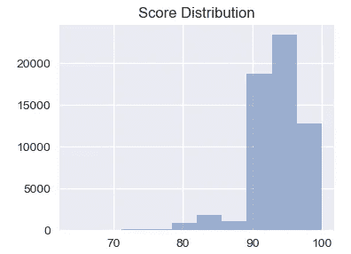
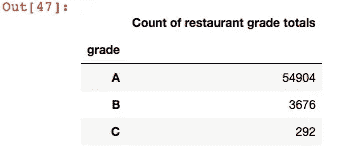
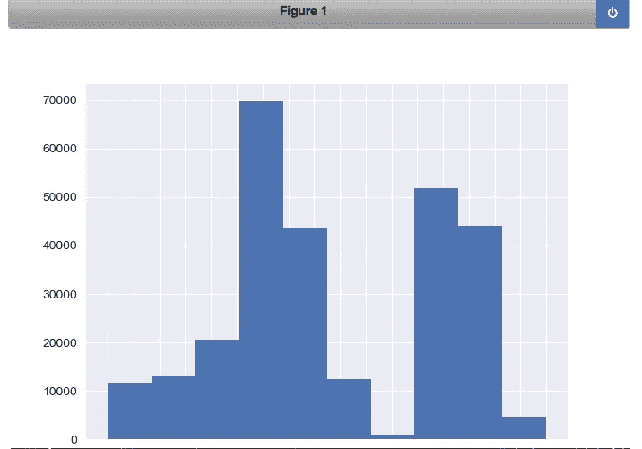
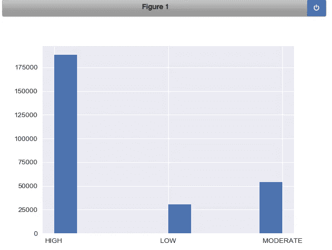
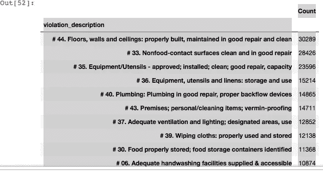
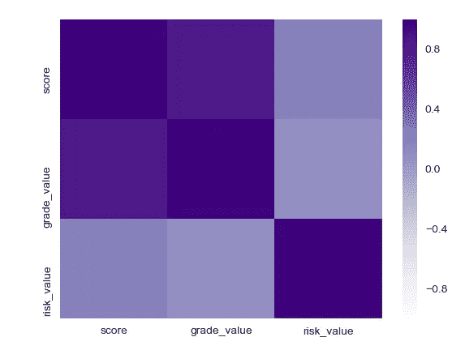
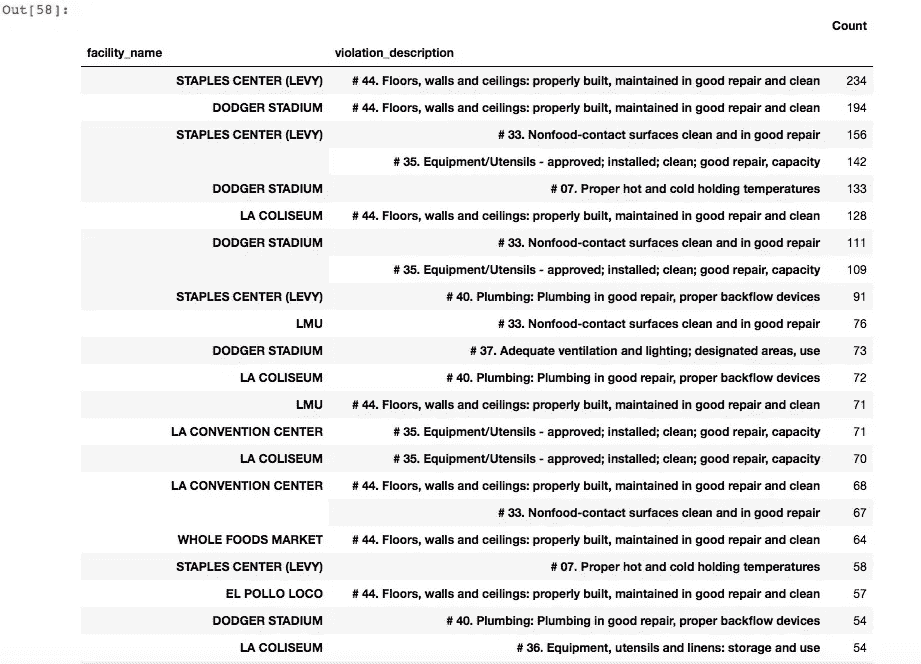
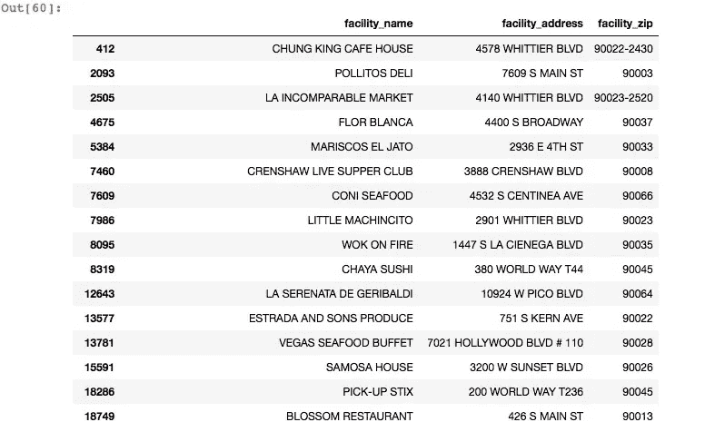
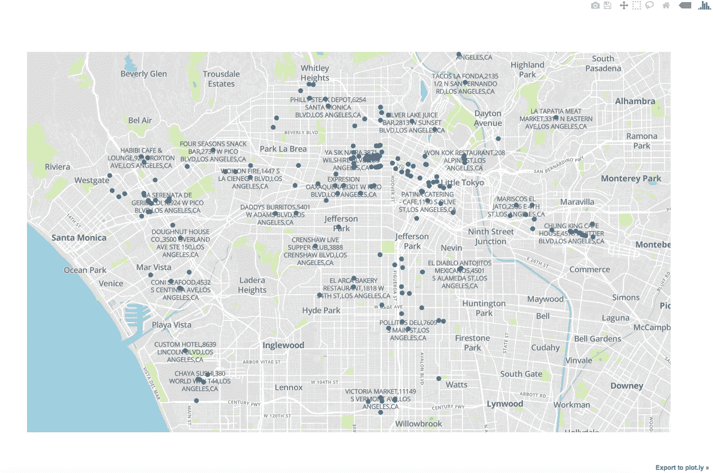
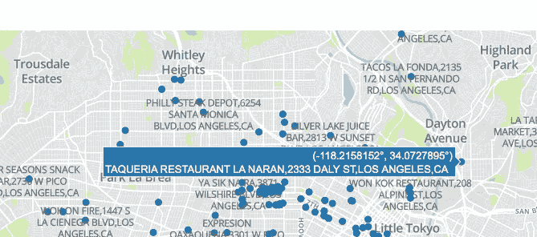

# 在高速公路上挨饿:可视化，映射洛杉矶餐馆检查

> 原文：<https://towardsdatascience.com/famished-on-the-freeway-visualizing-mapping-la-restaurant-inspections-cb6bc8338111?source=collection_archive---------11----------------------->

**使用 Python，Matplotlib，Plotly 分析，查看地图上的分级餐厅**


“pizza and nachos chip” by [Roberto Nickson (@g)](https://unsplash.com/@rpnickson?utm_source=medium&utm_medium=referral) on [Unsplash](https://unsplash.com?utm_source=medium&utm_medium=referral)

你好。我使用 Python，matplotlib，Plotly 来分析加州洛杉矶县餐馆检查结果数据集，并通过绘制 C 级餐馆来可视化。也许你可以在高速公路上(或者更有可能的是，在堵车时:)仔细阅读这些信息。以下是一个概述:

*   从 ka ggle-inspections，violations 文件导入[数据集](https://www.kaggle.com/cityofLA/la-restaurant-market-health-data)
*   创建数据框架
*   按违规数量、类型等进行分析、排序。
*   分组、按等级计数、风险并以图形方式显示
*   提取低等级(C)的餐馆及其地址
*   从谷歌地图中获取他们的地理坐标(纬度，经度)以在地图中使用，将它们存储到[创建]地图
*   在地图上标出那些餐馆的位置

开始之前:

*   确保您有 Python 编辑器或笔记本可用于分析
*   拥有一个[谷歌地图 API](https://www.wpgmaps.com/documentation/creating-a-google-maps-api-key/) 令牌(获取餐馆位置的坐标)
*   有一个[地图框令牌](https://www.mapbox.com/help/define-access-token/)(将坐标映射到地图上)

```
Start a new notebook file:**#TSB - Hari Santanam, 2018**
***#import tools required to run the code***
from mpl_toolkits.mplot3d import Axes3D
from sklearn.preprocessing import StandardScaler
import matplotlib.pyplot as plt
import numpy as np 
import os
import pandas as pd 
import requests
import logging
import time
import seaborn as sns
```

读取两个数据集文件:

*   **检查**文件是所有被检查的餐厅、菜场的清单
*   **违规**文件是发现的所有违规和相应设施的列表(一个设施可能有多个违规)

```
***#read in file with all inspections and put in dataframe***
df1 = pd.read_csv('../input/restaurant-and-market-health-inspections.csv', delimiter=',')
nRow, nCol = df1.shape
***#print number of rows and columns***
print({nRow}, {nCol})***#read in file with all health VIOLATIONS and put in dataframe***
df2 = pd.read_csv('../input/restaurant-and-market-health-violations.csv')
```


Output of file rows x columns

用原始检查分数创建一个数据框架，并绘制在直方图上:

```
***#Put these two lines before each plot/graph, otherwise it sometimes #re-draws over the same graph or does other odd things***from matplotlib import reload
reload(plt)
%matplotlib notebook
***#draw the histogram for scores***
df2['score'].hist().plot()
```



Histogram for score distribution — x-axis is score value bins, y-axis is count for each value bin

为标签描述键入以下内容:

```
***#search for missing grade, i.e, that is not A or B or C***
df1[~df1['grade'].isin(['A','B','C'])]
***#one record (record # 49492) popped up, so we fix it by assigning it a grade C***
df1.loc[49492,['grade']] = 'C'***#find out the distribution of the grades, i.e, how many records in each grade******#basically, group dataframe column grade by grade letter, then count and index on that, and print it***
grade_distribution = df1.groupby('grade').size()
pd.DataFrame({'Count of restaurant grade totals':grade_distribution.values}, index=grade_distribution.index)
```



## 注意，上面的总数加起来是 58，872，这是文件中的总行数，这意味着没有没有等级的行。

按餐厅类型(座位类型)分组，并计数和绘制图表

```
***#group by restaurant type and count # in each category
#then sort from highest # to lowest, then create a bar graph***
temp = df1.groupby('pe_description').size()
description_distribution = pd.DataFrame({'Count':temp.values}, index=temp.index)
description_distribution = description_distribution.sort_values(by=['Count'], ascending=True)
df2['pe_description'].hist().plot()
```



Grouped by pe_description field (ex: “Restaurant (seats 31–60, high risk”)

用原始检查分数创建一个数据框架，并绘制在直方图上:

```
***#the previous charts and graphs show breakdown of various types food restaurants with risk
#broken down to high, medium, low.
#This procedure use the split function to break the pe_description field into the sub-string
#after the 2nd space from the end - ex: string x = "Aa Bb Cc", when split applied like this: x.split(' ')[-2] ->sub-string after(not before) 2nd space '=>Bb'***def sub_risk(x):
    return x.split(' ')[-2]
***#apply function to get only high, medium, low*** df2['risk'] = df2['pe_description'].astype(str).apply(sub_risk)***#group, count by risk level***
temp = df2.groupby('risk').size()                                       ** *#plot the histogram for the 3 levels of risk***
df2['risk'].hist().plot()
```



Count by Risk type (High, Medium, Low) , extracted from restaurant type field string

用原始检查分数创建一个数据框架，并绘制在直方图上:

```
***#show first 10 rows of the violations file dataframe*** 
df2.head(10)
***#groupb by violation_description, count and sort them from largest violation by count to smallest***
violation_description = df2.groupby('violation_description').size()
pd.DataFrame({'Count':violation_description.values},index = violation_description.index).sort_values(by = 'Count',ascending=False)
```



Screen shot — Counts for each type of violation

创建一个函数，将字符串定义的值转换为数字，并制作一个热图:

```
***#create a simple proc for heat map for risk - low, moderate, high***
def convert_risk_value(x):
    if x == 'LOW':
        return 10
    elif x == 'MODERATE':
        return 5
    else:
        return 0
***#create simple proc to map grade to value* **   
def convert_grade_value(x):
    if x == 'A':
        return 10
    elif x == 'B':
        return 5
    else:
        return 0
***#call (apply) procs created above*** 
df2['risk_value']=df2['risk'].apply(convert_risk_value)
df2['grade_value']=df2['grade'].apply(convert_grade_value)
df3 = df2.loc[:,['score', 'grade_value', 'risk_value']]
corr = df3.corr()
corr = (corr)
reload(plt)
%matplotlib notebook
sns.heatmap(corr, xticklabels = corr.columns.values, yticklabels=corr.columns.values, cmap="Purples", center=0)
```



Screen shot — Heat map — score, grade_value and risk_value

从最常见的违规开始按降序显示违规计数:

```
***#violations listing from most common, descending - violation description, violation code, counts***
violation_desc=df2.groupby(['violation_description','violation_code']).size()
pd.DataFrame({'Count':violation_desc.values}, index=violation_desc.index).sort_values(by = 'Count', ascending=False)
```


Screen shot — Violation count by description and code

显示违规最多的设施点:

```
***#list facilities with most violations and type of violation
#create a dataframe with facility and violation columns, aggregate by size, then count and sort them***
violation_desc2 = df2.groupby(['facility_name','violation_description']).size()
pd.DataFrame({'Count':violation_desc2.values}, index=violation_desc2.index).sort_values(by='Count', ascending=False)
```



Screen shot — Facilities with the most violations and type of violation

分离并提取等级为“C”的餐厅进行映射。使用 loc 函数，然后删除重复项，这样每个餐馆名称只出现一次。我们稍后将在地图中使用它。

```
***#get a list of all the restaurants with grade C***
df4 = df2.loc[(df2['grade'] == 'C'),['facility_name','facility_address','facility_zip']]***#only want each restaurant listed once, since many of them have multiple violations, or may be listed more than once for multiple inspections or other reasons***
df4=df4.drop_duplicates(['facility_name'])***#print***
df4
```



Screen shot — list of restaurants with grade C

下面，我们列出上面的地址(C 级餐馆)并添加城市和州(所有地址都相同)作为完整地址(位置#、街道、城市、州)。这是必需的，因为在国家和世界的其他地区可能有同名的街道和城镇，作为调用 google maps api 的参数，它将为我们提供地理坐标(纬度、经度),然后我们将这些坐标叠加在加利福尼亚州洛杉矶县的地图上。

```
***#visualize bad restaurants (grade C)on a map, so that if you are in that area, you can avoid them :)***
***#some of them might have remediated their violations, or may be operating under "new management" or maybe even turned over a new leaf - we just don't know***
addresses_to_avoid = df4['facility_address'].tolist()
addresses_to_avoid = (df4['facility_name'] + ',' + df4['facility_address'] + ',' + 'LOS ANGELES' + ',CA').tolist()
```

添加一些控制台处理，一些常数:

```
***#some logging and console handling system items***
logger = logging.getLogger("root")
logger.setLevel(logging.DEBUG)
ch = logging.StreamHandler()      #console handler
ch.setLevel(logging.DEBUG)
logger.addHandler(ch)***#some constants for our upcoming function***
address_column_name = 'facility_address'
restaurant_name = 'facility_name'
RETURN_FULL_RESULTS = False
BACKOFF_TIME = 30                 ***#for when you hit the query limit******#api key needed for the call to google maps -if you are wondering #what this is, you missed the 1st couple of paragraphs, please go #back and re-read***API_KEY = 'your api key here'
output_filename = '../output-2018.csv'     
***#output file stores lat,lon***
```

创建一个函数，从上面的列表中调用每个地址，并通过调用 google maps 来获取将用于叠加在加利福尼亚州洛杉矶地图上的坐标。

```
logger = logging.getLogger("root")
logger.setLevel(logging.DEBUG)
ch = logging.StreamHandler()      #console handler
ch.setLevel(logging.DEBUG)
logger.addHandler(ch)address_column_name = 'facility_address'
restaurant_name = 'facility_name'
RETURN_FULL_RESULTS = False
BACKOFF_TIME = 30API_KEY = 'Your API key here'
output_filename = '../output-2018.csv'
#print(addresses)***#adapted from Shane Lynn - thanks***
def get_google_results(address, api_key=None, return_full_response=False):
    geocode_url = "[https://maps.googleapis.com/maps/api/geocode/json?address={](https://maps.googleapis.com/maps/api/geocode/json?address={)}".format(address)
    if api_key is not None:
        geocode_url = geocode_url + "&key={}".format(api_key)

        #ping google for the results:
        results = requests.get(geocode_url)
        results = results.json()             

        if len(results['results']) == 0:
            output = {
                "formatted_address" : None,
                "latitude": None,
                "longitude": None,
                "accuracy": None,
                "google_place_id": None,
                "type": None,
                "postcode": None
            }
        else:
            answer = results['results'][0]
            output = {
                "formatted_address" : answer.get('formatted_address'),
                "latitude": answer.get('geometry').get('location').get('lat'),
                "longitude": answer.get('geometry').get('location').get('lng'),
                "accuracy": answer.get('geometry').get('location_type'),
                "google_place_id": answer.get("place_id"),
                "type": ",".join(answer.get('types')),
                "postcode": ",".join([x['long_name'] for x in answer.get('address_components') 
                                  if 'postal_code' in x.get('types')])
            }

        #append some other details
        output['input_string'] = address
        output['number_of_results'] = len(results['results'])
        output['status'] = results.get('status')
        if return_full_response is True:
            output['response'] = results

        return output
```

调用这个函数，如果一切顺利，它将把结果写到指定的文件中。注意:这个调用经常会遇到 Google 强加的“查询限制”,所以您要么必须手动调用它们(从文件中过滤后),要么从输出文件中删除它们。

```
***#for each address in the addresses-to-avoid list, call the function we just created above, to get the coordinates, and add to a new list called results2***
results2=[]
for address in addresses_to_avoid:
    geocode_result = get_google_results(address, API_KEY, return_full_response=RETURN_FULL_RESULTS)
    results2.append(geocode_result)***#now, convert the list with our geo coordinates into a csv file that will be called by another program to overlay on a map.***pd.DataFrame(results2).to_csv('/Users/hsantanam/datascience-projects/LA-restaurant-analysis/restaurants_to_avoid.csv', encoding='utf8')
```

我们差不多完成了。我本可以用相同的代码创建一个函数，但是为了便于阅读和理解，我用一个新的程序创建了这个函数，这个程序为地图设置配置，从输出文件中调用我们刚才创建的地址坐标数据，并在浏览器选项卡上绘制它。这是它的输出:

这是最后的结果——上面代码的可视化地图输出。



Restaurants with C grade — mapped out for LA county, CA — opens in default browser, new tab



Popups with name, coordinates, address appear when you hover over any location dot

感谢您耐心通读此文:)。你现在可能饿了——如果你碰巧在这个地区，找一家餐馆吃饭，只是不要在那些等级不好的餐馆里！

github 到这里的链接是[这里是](https://github.com/HariSan1/LA-restaurant-inspections-analysis)。

如果你感兴趣，可以看看我的其他文章:

[](https://medium.com/google-cloud/using-google-datalab-and-bigquery-for-image-classification-comparison-13b2ffb26e67) [## 使用 Google Datalab 和 BigQuery 进行图像分类比较

### 样本数据，简单用法

medium.com](https://medium.com/google-cloud/using-google-datalab-and-bigquery-for-image-classification-comparison-13b2ffb26e67) [](https://medium.com/google-cloud/using-google-cloud-ml-engine-to-train-a-regression-model-e2a582de389e) [## 使用 Google Cloud ML 引擎训练回归模型

### 在 Google Cloud Datalab 中提交一个培训模型作业

medium.com](https://medium.com/google-cloud/using-google-cloud-ml-engine-to-train-a-regression-model-e2a582de389e) [](https://medium.com/@hari.santanam/using-keras-to-predict-fashion-dataset-and-see-images-used-by-machine-learning-5f4a889fb1b0) [## 使用 Keras 预测时尚数据集并查看机器学习使用的图像

### 人工智能使用图像识别学习过程来处理成千上万的图像，并“学习”哪些图像属于哪个…

medium.com](https://medium.com/@hari.santanam/using-keras-to-predict-fashion-dataset-and-see-images-used-by-machine-learning-5f4a889fb1b0) [](https://medium.com/@hari.santanam/value-proposition-of-ai-for-it-1c8903c0ec25) [## 人工智能对 IT 的价值主张

### 人工智能对于公司内部的大多数业务领域来说都很棒。它有望带来新的洞察力、预测和分析，这使得…

medium.com](https://medium.com/@hari.santanam/value-proposition-of-ai-for-it-1c8903c0ec25)