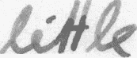
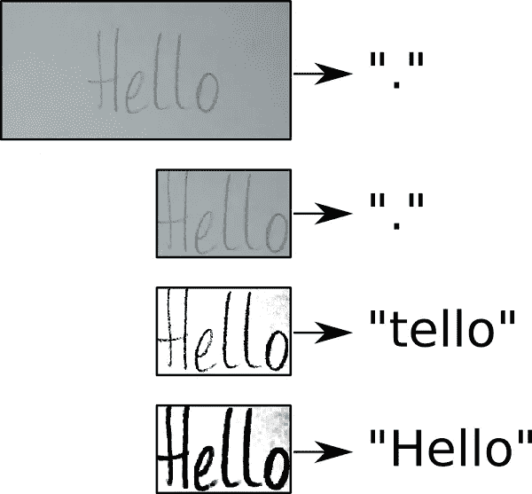
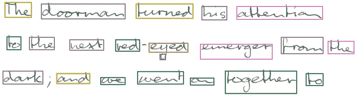
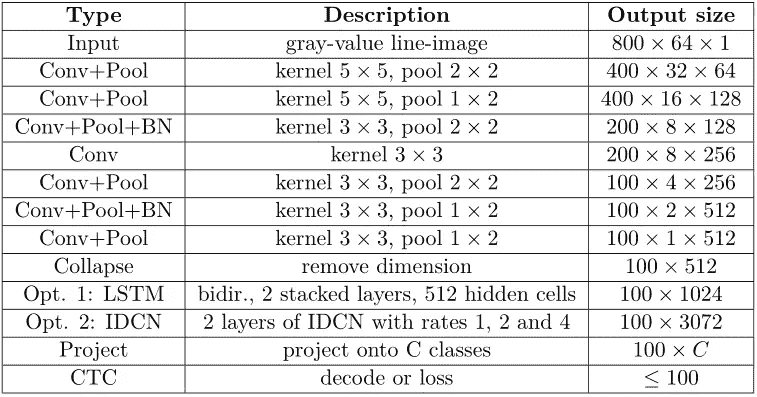

# FAQ:使用 TensorFlow 构建手写文本识别系统

> 原文：<https://towardsdatascience.com/faq-build-a-handwritten-text-recognition-system-using-tensorflow-27648fb18519?source=collection_archive---------2----------------------->

本文是关于如何使用 TensorFlow 实现一个[文本识别模型的文章的后续。它基于 SimpleHTR 库的一个](/2326a3487cd5)[旧代码版本](https://github.com/githubharald/SimpleHTR/tree/97c2512f593760b14669b37a159ead2f1e54961b)。

有些问题我想在这里讨论一下。我们来看看以下三个一:

1.  如何识别图像/数据集中的文本？
2.  如何识别包含在行或整页中的文本？
3.  如何计算识别文本的置信度得分？

# 1 如何识别图像/数据集中的文本？

在 IAM 数据集上训练预训练模型。来自 IAM 的一个样本如图 1 所示。该模型不仅学习如何阅读文本，还学习数据集样本的外观。如果您浏览 IAM 单词图像，您会注意到这些模式:

*   图像具有高对比度
*   单词被紧凑地裁剪
*   大胆的写作风格

Fig. 1: A sample from the IAM dataset.

如果你给一个图像输入一个非常不同的风格，你可能会得到一个不好的结果。让我们看一下图 2 所示的图像。

Fig. 2: A sample for which the model recognizes the text “.”.

该模型识别文本“”在这张图片中。原因是模型从未见过这样的图像:

*   低对比度
*   单词周围有很多空间
*   线条非常细

让我们来看两种改善识别结果的方法。

# 1.1 预处理图像

让我们从一个简单的方法开始，让图像看起来更像来自 IAM 数据集的样本。我们将使用上面的图像来尝试这一点(见图 3)。首先，让我们来修剪它。该模型仍然识别“.”。然后，我们增加对比度。现在，模型给出了一个好得多的结果:“tello”。这几乎是正确的。如果我们通过应用形态学操作来加粗线条，模型最终能够识别正确的文本:“Hello”。

Fig. 3: Preprocessing steps and the recognized text for each of them.

这种裁剪可以用一种[分词算法](https://github.com/githubharald/WordDetector)来完成。增加对比度和应用形态学操作是通过以下 Python 代码实现的。

# 1.2 创建 IAM 兼容的数据集和训练模型

获得良好读取结果的最佳方法当然是根据您的数据重新训练模型。虽然创建数据集可能相当费力，但绝对值得。您需要将图像-文本对转换成 IAM 兼容的格式。下面的代码显示了如何进行这种转换。DataProvider 类的 getNext()方法在每次调用时返回一个样本(文本和图像)。createIAMCompatibleDataset()函数创建文件 words.txt 和目录 sub，所有图像都放在这个目录中。如果您想要转换数据集，您必须修改 getNext()方法(目前它只是为所提供的单词创建机器打印的文本，以显示示例用法)。

转换后，将文件 words.txt 和目录 sub 复制到 SimpleHTR 项目的数据目录中。然后可以通过执行 python main.py - train 来训练模型。

# 2 如何识别成行或整页的文字？

该型号可输入 128×32 的图像，最多可输出 32 个字符。所以，用那个模型识别一个或者两个单词是可能的。但是，更长的句子甚至整页都无法直接阅读:

*   行:要么将行分割成单词，要么将文本识别模型放大，以便它可以处理整行
*   整页:将页面分割成单个的单词，然后分别阅读每一页

我们先来看看预处理，它既可以用于行级文本处理，也可以用于页面级文本处理。

# 2.1 预处理图像

如果该行的单词容易分割(单词之间的间隙大，单词的字符之间的间隙小)，那么可以使用类似于 R. Manmatha 和 N. Srimal 提出的简单的单词分割方法(参见图 4 的例子)。然后，将分割后的单词分别输入文本识别模型。对于更复杂的文档，可以使用基于深度学习的[分词方法。](https://github.com/githubharald/WordDetectorNN)

Fig. 4: Word-segmentation on page-level.

# 2.2 扩展模型以适合完整的文本行

如果在行级别上工作，您可以轻松地扩展模型，以便输入更大的图像和输出更长的字符串。

表 1 显示了我用于文本行识别的架构。它允许更大的输入图像(800×64 ),并且能够输出更大的字符串(长度可达 100)。此外，它包含更多的 CNN 层(7)，并在两层中使用批量标准化。

Table 1: Architecture for reading on line-level. Use option 1 (LSTM) for the recurrent network. Abbreviations: bidirectional (bidir), batch normalization (BN), convolutional layer (Conv).

# 3 如何计算识别文本的置信度得分？

获得被识别文本的概率的最简单的方法是使用 CTC 损失函数。损失函数将字符概率矩阵和文本作为输入，并输出损失值 L。损失值 L 是看到给定文本的负对数可能性，即 L=-log(P)。如果我们将字符概率矩阵和识别的文本提供给损失函数，然后取消对数和减号，我们得到识别文本的概率 P:P = exp(-L)。

以下代码显示了如何为一个玩具示例计算识别文本的概率。

# 结论

这篇文章展示了如何处理不同的数据集以及行级甚至页面级的读取。此外，还讨论了计算置信度得分的简单方法。

# 参考

*   [原文](/2326a3487cd5)
*   [本文所基于的文本识别模型代码](https://github.com/githubharald/SimpleHTR/tree/97c2512f593760b14669b37a159ead2f1e54961b)
*   [最新版本的文本识别模型](https://github.com/githubharald/SimpleHTR)
*   [经典分词算法代码](https://github.com/githubharald/WordDetector)
*   [基于深度学习的分词模型代码](https://github.com/githubharald/WordDetectorNN)
*   [基于深度学习的分词模型描述](https://githubharald.github.io/word_detector.html)

最后，概述一下我的[其他媒体文章](https://harald-scheidl.medium.com/c4683d776120)。