# 奇异明天的迷人故事

> 原文：<https://towardsdatascience.com/fascinating-tales-of-a-strange-tomorrow-72048639e754?source=collection_archive---------4----------------------->

# 人工智能:科学与小说

我们的旅行始于 1956 年 3 月“禁忌星球”电影的上映，这部电影的主角是机器人**罗比**，他是公认的第一个出现在银幕上的科幻机器人。几个月后，由**[【1】](https://en.wikipedia.org/wiki/John_McCarthy_(computer_scientist))领导的一小组计算机科学家在新罕布什尔州的达特茅斯学院举办了为期 6 周的研讨会。**

**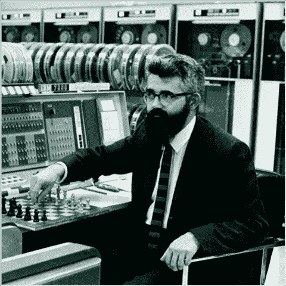****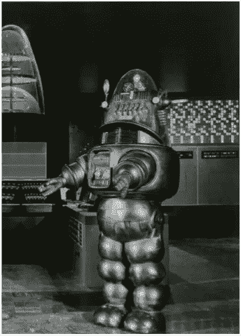

John McCarthy (Turing Award 1971) & Robbie the Robot** 

**这次研讨会的主题是“**人工智能**”，这是麦卡锡自己创造的一个术语，他是这样定义的:**

> ***“学习的每一个方面或智力的任何其他特征，原则上都可以如此精确地描述，以至于可以制造一台机器来模拟它”。***

**如果达特茅斯的工作室实际上是由约翰·麦卡锡看了《禁忌星球》然后回家想:“让我们来建造罗比”而引发的，那不是很棒吗？不过，这可能根本不是真的。哦好吧。**

**不管怎样，这个小组开始工作，为我们所知的人工智能奠定了基础。事实上，大多数参与者将他们的整个职业生涯都奉献给了推动人工智能的发展，在这个过程中获得了不下四个图灵奖:1969 年的**马文·明斯基**[【3】](https://en.wikipedia.org/wiki/Marvin_Minsky)，1971 年的约翰·麦卡锡，**希尔伯特·西蒙**[【4】](https://en.wikipedia.org/wiki/Herbert_A._Simon)&**艾伦·纽厄尔**[【5】](https://en.wikipedia.org/wiki/Allen_Newell)1975 年。**

**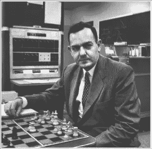****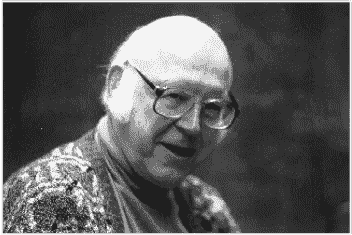

Herbert Simon (Turing Award 1975, Nobel Prize in Economics 1978) ad Allen Newell (Turing Award 1975)** 

**在人工智能的早期，这些聪明的科学家做出了一些预测，比如:**

**1958 年，希尔伯特·西蒙和艾伦·纽厄尔:“***10 年内数字计算机将是世界象棋冠军。*****

**1965 年，希尔伯特·西蒙:“***20 年内，机器将能做任何人能做的工作。*****

**1967 年马文·明斯基: ***在一代人之内，创造‘人工智能’的问题将得到实质性解决*。****

**1970 年马文·明斯基:“ ***在 3 到 8 年的时间里，我们将拥有一台拥有普通人一般智力的机器。*****

**哎呀。**

# **人工智能的冬天来了**

**预测未来总是有风险的事情，但这仍然提出了一个令人生畏的问题:对于人工智能在合理的时间框架内会(或不会)实现什么，如此聪明的头脑怎么会如此大错特错？不要担心，我们稍后会回答这个问题。**

> **不幸的是，多次未能取得重大进展成为了人工智能的商标。**

**期望很高，结果很少或根本没有，资金被削减，项目被放弃。不出所料，这些多重的 **AI winters** 让除了最铁杆支持者之外的所有人望而却步。**

**这种幻灭最明显的象征来自马文·明斯基本人。2001 年，他做了一个名为“**的报告:现在是 2001 年:哈尔在哪里？当然指的是斯坦利·库布里克电影《2001:太空漫游》中的哈尔电脑。更重要的是，早在 1968 年，明斯基就在电影制作期间给库布里克提了建议。在这次演讲中，他明确地提出了“**常识问题**”:*“今天没有任何程序可以区分狗和猫，或者识别典型房间中的物体，或者回答 4 岁儿童可以回答的问题！”*****

**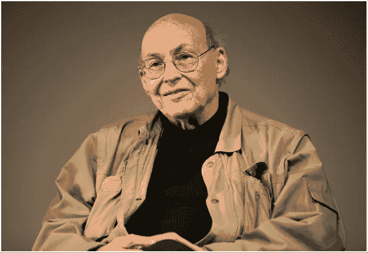****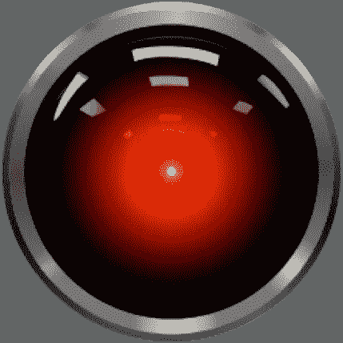**

**Marvin Minsky (Turing Award 1969) & HAL 9000**

**一句话:在实验室环境中玩人工智能很酷，但在现实世界中它永远不会有所成就。结案了。**

# **与此同时，在美国西海岸…**

**当人工智能研究人员在实验室里绝望的时候，一些初创公司正在重塑世界:亚马逊、谷歌、雅虎，后来脸书和其他几家公司加入进来，它们正在以疯狂的速度发展自己的网络平台。在这个过程中，他们获得了数以百万计的用户，积累了大量的数据。很快就清楚了，这些数据是一座金矿，**如果真的可以开采的话**！**

**使用商用硬件，这些公司的工程师开始寻求设计和构建数据处理平台，使他们能够**处理原始数据并提取商业价值，这些价值可以转化为收入** …这始终是快速增长的初创公司的一个关键目标！**

**2004 年 12 月达到了一个重要的里程碑，当时 Google 发布了著名的 **Map Reduce** 论文[【6】](https://research.google.com/archive/mapreduce.html)，其中他们描述了*一个编程模型和一个用于处理和生成大型数据集的相关实现*。不甘示弱的雅虎实现了本文描述的想法，并于 2006 年 4 月发布了他们项目的第一个版本:**Hadoop**[【7】](https://hadoop.apache.org/)诞生了。**

> **等待火柴的汽油:机器学习爆炸发生了，剩下的，正如他们所说，是历史。**

# **快进几年**

**2010 年左右:**机器学习现在是商品**。客户有广泛的选择，从 DIY 到机器学习即服务。数据世界一切都很棒。但真的是这样吗？是的，机器学习帮助我们让很多应用程序变得“更聪明”，但是**我们在人工智能方面取得重大进展了吗？**换句话说，我们离“建设哈尔”更近了吗？嗯……不。让我们试着理解为什么。**

**构建机器学习应用的第一步被称为“**特征提取**”。简而言之，这是数据科学家探索数据集的一个步骤，以找出哪些变量对预测或分类数据有意义，哪些没有意义。虽然这仍然主要是一个冗长的手动过程，但现在已经很好地理解了它，并且可以很好地处理结构化或半结构化数据，如 web 日志或销售数据。**

**然而，**对于复杂的人工智能问题**如计算机视觉或计算机语音并不适用，原因很简单，因为要正式定义**的特征**是什么:例如，是什么让猫成为猫？猫和狗有什么不同？还是来自狮子？**

> **简单来说，传统的机器学习并不能解决这类问题，这就是为什么需要新的工具。进入神经网络！**

# **回到未来**

**新工具？几乎没有！1957 年，Frank Rosenblatt 设计了一个机电神经网络，感知器[【8】](https://en.wikipedia.org/wiki/Perceptron)，他训练它识别图像(20x20“像素”)。1975 年，Paul Werbos 发表了一篇描述“反向传播”[【9】](https://en.wikipedia.org/wiki/Backpropagation)的文章，这是一种允许更好更快地训练神经网络的算法。**

**因此，如果神经网络已经存在了这么长时间，那么它们肯定要对失败的人工智能尝试负部分责任，对吗？他们真的应该复活吗？为什么他们会突然成功？**

**确实是非常合理的问题。让我们首先快速了解一下神经网络是如何工作的。一个**神经元**是一个简单的构造，它将多个**加权输入**相加产生一个**输出**。神经元被组织在**层**中，其中层‘n’中每个神经元的输出作为层‘n+1’中每个神经元的输入。第一层称为**输入层**，输入数据，比如图像的像素值。最后一层称为**输出层**并产生结果，比如图像的类别号(“这是一只狗”)。**

**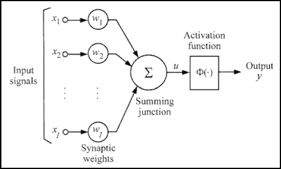****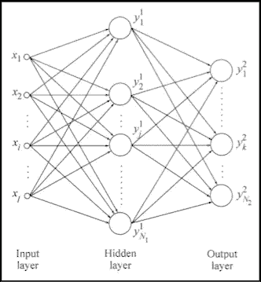

The basic structure of a neural network (Source: “Deep Learning”, Goodfellow & Bengio, 2016)** 

> **神经网络的美妙之处在于它们能够**自我组织**:给定足够大的数据集(比如，图像作为输入，类别标签作为输出)，神经网络能够自动学习**如何产生正确的答案****

**由于一个迭代训练过程，它能够**发现允许图像被分类的特征**，并反复调整权重以达到最佳结果，即具有最小错误率的结果。**

**训练阶段及其自动特征发现非常适合解决非正式问题，但这里有一个问题:它们涉及**许多**数学运算，随着**数据大小**的增加(想想高分辨率图片)以及随着**层数**的增加，这些运算往往会呈指数增长。这个问题被称为“**维数灾难**”，这也是神经网络几十年来停滞不前的主要原因之一:根本没有足够的**计算能力**来大规模运行它们。**

**也没有足够的数据可用。神经网络需要大量数据才能正确学习。数据越多越好！直到最近，收集和存储大量的数字数据还是不可能的。你记得穿孔卡片或软盘吗？**

**一项重大突破发生在 1998 年，当时 Yann Le Cun 发明了**卷积神经网络**[【10】](https://en.wikipedia.org/wiki/Convolutional_neural_network)，这是一种新型的多层网络(因此被称为“深度学习”)。**

> **简而言之，CNN 能够有效地提取特征，同时减少输入数据的大小:这允许更小的网络用于分类，这大大降低了网络训练的计算成本。**

**这种方法非常成功，以至于银行采用 CNN 驱动的系统来实现支票手写识别的自动化。对于神经网络来说，这是一个令人鼓舞的成就…但是最好的还在后面！**

**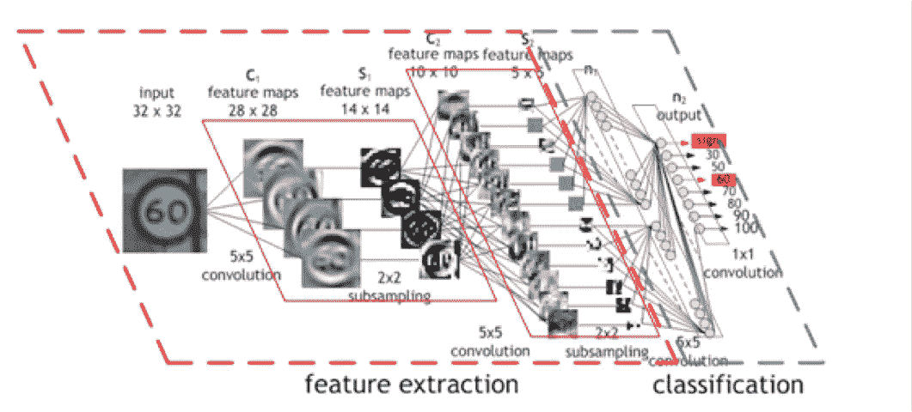**

**Architecture of a Convolutional Neural Network (Source: NVIDIA blog)**

# **神经帝国反击了**

**到 2000 年代末，三个几乎同时发生的事件使得大规模神经网络成为可能。**

**首先，**大型数据集**变得广泛可用。文本、图片、电影、音乐:一切都突然数字化了，可以用来训练神经网络。今天，ImageNet[【11】](http://image-net.org)数据库拥有超过 1400 万张带标签的图像，世界各地的研究人员每年都用它来竞争建立最成功的图像检测和分类网络(稍后将详细介绍)。**

**然后，研究人员能够利用**图形处理单元**(GPU)的**惊人的并行处理能力**来训练大型神经网络。你能相信赢得 2015 年和 2016 年 ImageNet 竞赛的分别有 152 层和 269 层吗？**

**最后但同样重要的是，**云计算**为开发人员和研究人员带来了**弹性**和**可扩展性**，允许他们根据培训需要使用尽可能多的基础设施……而不必长期构建、运行或支付费用。**

> **这三个因素的结合有助于神经网络实现其 60 年的承诺。**

**最先进的网络现在能够比任何人更快**和更准确**地**分类图像(误差小于 3%，而人类为 5%)。像亚马逊 Echo 这样的设备能够理解自然语言并和我们交流。自动驾驶汽车正在成为现实。人工智能应用的列表每天都在增长。********

****你不想添加你的吗？****

****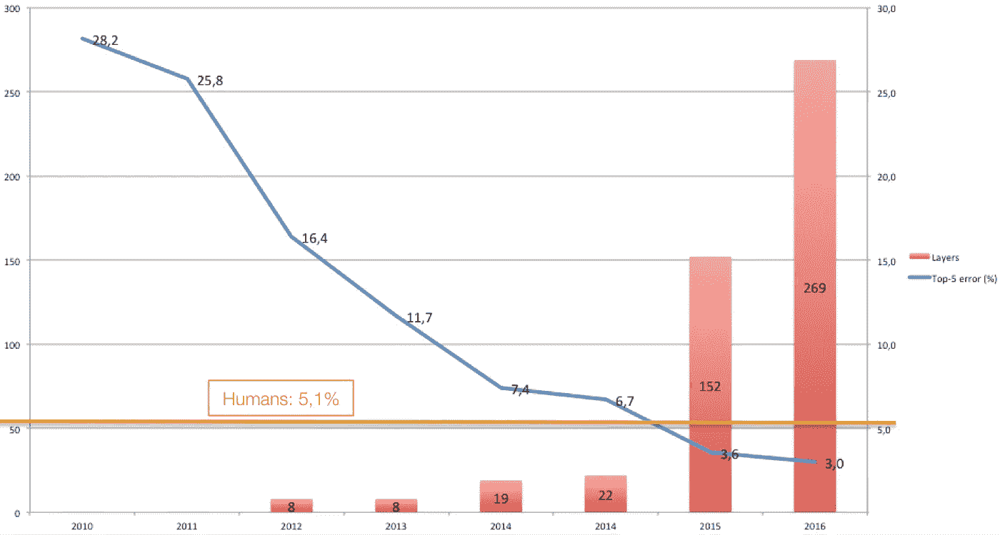****

****Number of layers and error rate of ILSVRC winners****

# ****AWS 如何帮助您构建深度学习应用程序****

****AWS 提供了您开始构建深度学习应用程序所需的一切:****

****种类繁多的**亚马逊 EC2 实例**来构建和训练你的模型，随你选择**CPU**[【13】](https://aws.amazon.com/about-aws/whats-new/2016/11/coming-soon-amazon-ec2-c5-instances-the-next-generation-of-compute-optimized-instances/)**GPU**[【15】](https://aws.amazon.com/blogs/aws/new-p2-instance-type-for-amazon-ec2-up-to-16-gpus/)甚至**FPGA**[【16】](https://aws.amazon.com/blogs/aws/developer-preview-ec2-instances-f1-with-programmable-hardware/)。****

******深度学习亚马逊机器映像**[【17】](https://aws.amazon.com/marketplace/pp/B01M0AXXQB)，预装工具和库集合:mxnet[【18】](http://mxnet.io/)(AWS 官方支持)，Theano，Caffe，TensorFlow，Torch，Anaconda 等等。****

****高级别的**人工智能服务**[【19】](https://aws.amazon.com/amazon-ai/)用于图像识别(**亚马逊识别**)、语音转文本(**亚马逊 Polly** )和聊天机器人(**亚马逊 Lex** )。****

> ****选择权在你，**开始吧**帮助科学赶上小说！****

# ****新的希望？****

****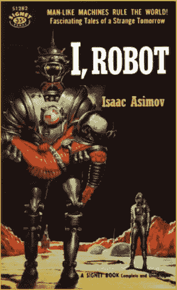****

****人工智能每天都在进步。人们只能想知道接下来会发生什么！****

****机器会学习如何理解人类——而不是相反吗？****

****它们会帮助人类相互理解吗？****

****他们最终会统治世界吗？****

****谁知道呢？****

****无论发生什么，这些都将是奇妙明天的迷人故事。****

*****注:这是我最近一次主题演讲的编辑稿。原始幻灯片可用* [*此处*](https://www.slideshare.net/JulienSIMON5/fascinating-tales-of-a-strange-tomorrow-74449554) *。*****