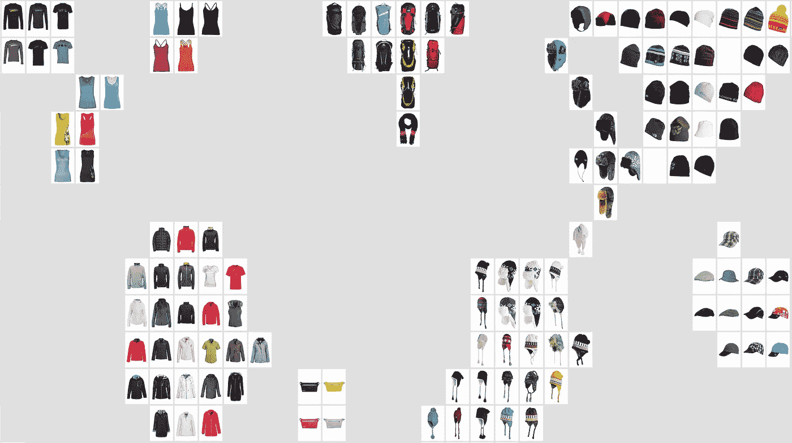

# 时尚 DNA:零售世界中的结构特征映射

> 原文：<https://towardsdatascience.com/fashion-dna-structural-feature-mapping-in-the-world-of-retail-fdba4f1c4070?source=collection_archive---------5----------------------->

Image source: [Zalando Research](https://research.zalando.com/welcome/mission/research-projects/#7)

> 当将人工智能应用于时尚世界时，其中涉及的服装和其他物品具有许多不同的个体属性，必须定义有意义的结构。

根据项目的相似性来定义它似乎是很自然的:每个项目在抽象空间中都有其明确的位置，相似的项目就在附近。在 [Zalando Research](https://research.zalando.com/) ，他们创造了*时尚 DNA* ，通过收集目录中杂乱无章的信息并将其映射到一个抽象的数学空间——“时尚空间”,使他们的产品属性更容易理解。在那里，物品由一个向量，或者它的“DNA”来表示，并被用来给混乱的时尚产品集合带来秩序。

Zalando Research 的研究负责人 Roland Vollgraf 将参加在阿姆斯特丹举行的[机器智能峰会，分享这一领域的专业知识。在 6 月 28 日至 29 日的峰会之前，我与他进行了交谈，以了解更多信息。](https://www.re-work.co/events/machine-intelligence-summit-amsterdam-2017)

你能简单介绍一下你在 Zalando 的工作吗？

我是 Zalando 研究中心的首席研究员。我在机器学习和人工智能领域领导着一个由 15 名科学家组成的研究团队。

**你认为是什么主导因素推动了机器学习在时尚行业的最新发展和应用？**

很明显，在线零售业务中产生了大量的数据，再加上不断增长的计算能力(目前主要由现代图形处理器提供)。

**时尚 DNA 现在或未来潜在的哪些应用最让你兴奋？**

我们的时尚 DNA 是将时尚物品映射到数学上方便的欧几里得空间。因此，它为搜索或推荐等各种应用程序的分类提供了一个通用索引。然而，映射并不一致。我个人认为看到特征空间中的白点是最令人兴奋的，也就是说，在我们当前的文章都没有直接映射到的点上。在那里可以找到哪些假设的新鞋或裙子？

**总体而言，您认为未来哪些行业会受到机器学习的最大干扰？**

在我看来，在不久的将来，自动驾驶汽车将是最具颠覆性的人工智能技术。结果，这可能会让自己开车和拥有一辆车完全过时——我相信这种情况会彻底改变我们城市的面貌。

**未来 5 年，我们可以期待看到时尚行业的哪些发展？**

其中，将会有全新的面向客户的在线零售应用。想想更好、更智能的搜索体验，比如对话式搜索，允许在与系统对话时询问灵感。计算机视觉和图像处理技术深度学习的进步将允许虚拟试穿应用程序，用户拍摄的自拍可以用她在网上购买的任何类型的服装进行逼真的增强。

> Roland Vollgraf 将在 6 月 28 日至 29 日在阿姆斯特丹举行的**机器智能峰会上发表演讲，同时还有 [**自动驾驶汽车机器智能峰会**](https://www.re-work.co/events/machine-intelligence-in-autonomous-vehicles-summit-amsterdam-2017) 。会见领先的专家并向他们学习人工智能将如何影响交通、制造、医疗保健、零售等领域。**

**这项活动的门票有限。[立即注册参加。](https://www.re-work.co/events/machine-intelligence-summit-amsterdam-2017)**

***本次采访中表达的观点可能不代表 RE WORK 的观点。因此，有些观点甚至可能与 RE WORK 的观点相左，但发布这些观点是为了鼓励辩论和全面的知识共享，并允许不同的观点呈现给我们的社区。***