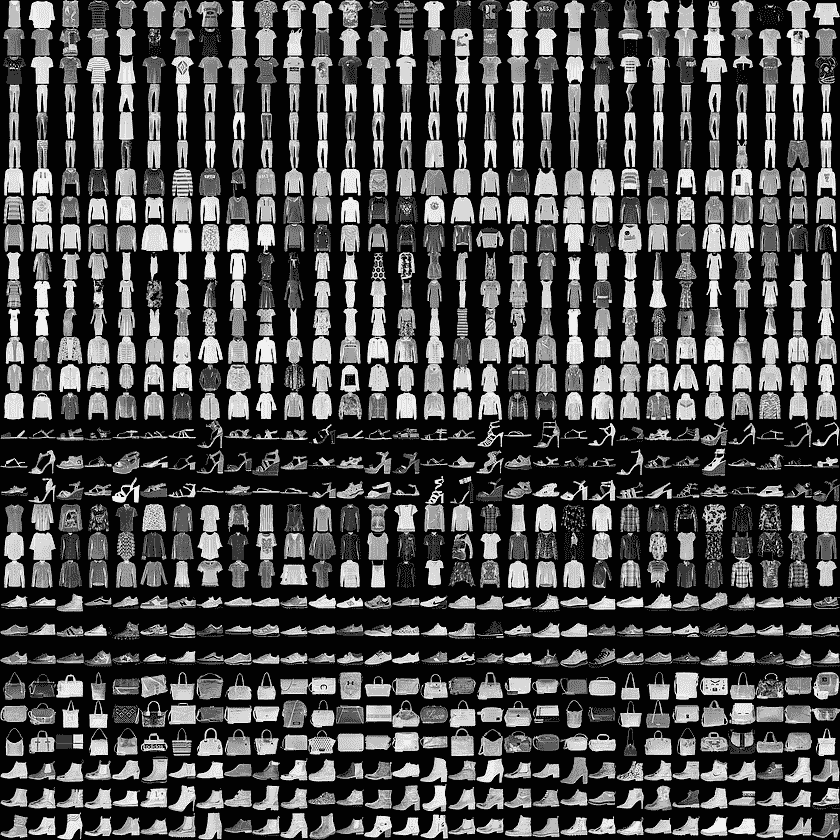
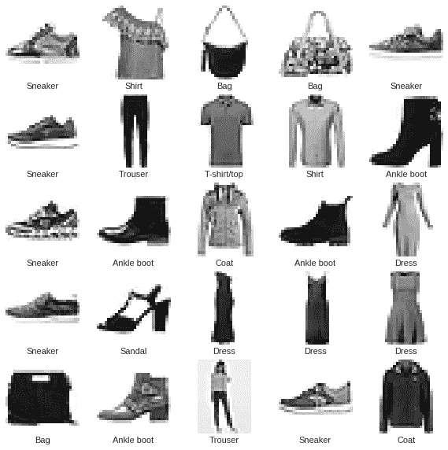

# 时尚 MNIST 分类与 TensorFlow 特色 Deepmind 十四行诗

> 原文：<https://towardsdatascience.com/fashion-mnist-classification-with-tensorflow-featuring-deepmind-sonnet-aeb3987d826e?source=collection_archive---------5----------------------->

在这篇文章中，我们将看看如何使用 TensorFlow (TF)和 Deepmind 的十四行诗库在时尚 MNIST 数据集上执行一个简单的分类任务。

这篇文章也可以作为合作笔记本使用。请随意将笔记本复制到您的驱动器上，并修改代码。


[Run in Colab](https://colab.research.google.com/drive/0BztMifQrkZdTQjh3cWVsSUs4OGs?resourcekey=0-NNX5nsJgR-p-0_e09ZHz3g)

我写这篇文章的目的有两个:

1.  展示如何在一个简单的机器学习(ML)任务中使用 TF 提供的附加功能。
2.  作为 Deepmind 的[十四行诗](https://deepmind.github.io/sonnet/)库的一个简单入门示例。

大部分解释都是以代码中注释的形式出现的，所以可以考虑和文章一起阅读代码。这篇文章是在假设读者对 ML 和 TF 框架有基本了解的情况下撰写的。也就是说，我试图提供外部链接到所使用的技术术语。

首先让我们安装 sonnet。通过命令行进行简单的 pip 安装就可以了，但是要确保安装了 TensorFlow 并且版本> = 1.5

```
$ pip install dm-sonnet
```

假设安装了其他库，我们将导入所需的 python 库。

```
**[Out]**
Tensorflow version: 1.10.0-rc1
```

# 时尚 MNIST 数据集

更传统的 MNIST 数据集已经被过度使用到了一定程度(99%以上的准确率)，不再是一个有价值的分类问题。 [Zalando Research](https://research.zalando.com/) 为机器学习研究提供了一个新起点，在 28x28 的图像中捕捉 10 种不同的服装，而不是 10 个数字。这 10 种服装的各种变化构成了[时尚 MNIST](https://github.com/zalandoresearch/fashion-mnist) 数据集。



**A Sample from the Fashion MNIST dataset (Credit: Zalando, MIT License)**

使用[Keras](https://www.tensorflow.org/guide/keras)(tensor flow 的高级 API)我们可以通过一个函数调用直接下载时尚 MNIST。由于它相对较小(70K 记录)，我们将把它直接加载到内存中。

## 预处理数据集

由于数据集是为 ML 研究手工制作的，我们不需要进行[数据争论](https://en.wikipedia.org/wiki/Data_wrangling)。我们需要的唯一预处理是均值居中和方差归一化。所得的数据分布将具有球形结构，导致梯度下降收敛的步骤数量较少。参考 LeCun，Yann A .等人的[第 5.3 节“有效反推”](http://yann.lecun.com/exdb/publis/pdf/lecun-98b.pdf)关于为什么我们需要进行居中和归一化以实现梯度下降的更快收敛的精确解释。

```
**[Out]** Downloading data from [https://storage.googleapis.com/tensorflow/tf-keras-datasets/train-labels-idx1-ubyte.gz](https://storage.googleapis.com/tensorflow/tf-keras-datasets/train-labels-idx1-ubyte.gz)
32768/29515 [=================================] - 0s 0us/step Downloading data from https://storage.googleapis.com/tensorflow/tf-keras-datasets/train-images-idx3-ubyte.gz 
26427392/26421880 [==============================] - 1s 0us/step Downloading data from https://storage.googleapis.com/tensorflow/tf-keras-datasets/t10k-labels-idx1-ubyte.gz 
8192/5148 [===============================================] - 0s 0us/step 
Downloading data from https://storage.googleapis.com/tensorflow/tf-keras-datasets/t10k-images-idx3-ubyte.gz 
4423680/4422102 [==============================] - 0s 0us/step Training Data ::: Images Shape: (60000, 28, 28), Labels Shape: (60000,) 
Test Data ::: Images Shape: (10000, 28, 28), Labels Shape: (10000,) Random 25 Images from the Training Data:
```



# 构建模型

使用 Deepmind 的十四行诗库，我们将建立两个模型，一个是简单的多层感知器(MLP)，另一个是卷积网络。然后，我们将设置训练设备，以便在两个模型之间切换是一个简单的配置参数。

顺便说一下， [Keras](https://keras.io/) 是另一个高级 API，从 TF v1.9 开始，它就紧密集成到 TF 中。快速原型对于任何 ML 研究项目都是有用的，Keras 和 Sonnet 在这方面都非常有用。诚然，Keras 是一个更加成熟的项目，并且有 TF 团队的官方支持。此外，互联网上有大量的 Keras 教程和项目，再增加一个没有任何意义。另一方面，十四行诗很少在 Deepmind 之外使用，但对于任何跟踪他们的研究的人来说都是必须知道的。

## 深度思维十四行诗

Sonnet 是来自 Deepmind 的 TensorFlow 库，它抽象出了建模的过程。sonnet 的宗旨是将模型的组件封装为 python 对象(模块),然后可以在需要时插入到 TF 图中，从而为代码重用提供无缝机制。这样的设计让我们不必担心内部配置，如变量重用、重量共享等。有关详细指南，请参考他们的官方[文档](https://deepmind.github.io/sonnet/)。此外，它们的源代码有很好的文档记录，值得一读，尤其是在尝试实现某些东西时。

在我们的例子中，我们将创建两个模块:`FMNISTMLPClassifier`和`FMNISTConvClassifier`。顾名思义`FMNISTMLPClassifier`用的是 MLP，`FMNISTConvClassifier`用的是卷积神经网络。然后，我们将在 TensorFlow 中设置训练设备，然后插入我们想要训练的模型。

# 组装训练器材。

*训练器械*包含以下部件:

1.  数据通过输入管道输入到模型中
2.  执行梯度下降的优化算法。
3.  将由优化器优化的损失函数。
4.  正在接受训练的模型。

## 输入管道

在 TensorFlow 中，向模型提供数据的首选方式是使用`[tf.data](https://www.tensorflow.org/api_docs/python/tf/data)`模块。它允许我们以简单和可重用的方式对输入数据进行转换。`tf.data`模块允许我们设计输入管道，比如聚合来自多个来源的数据，以可插拔的方式添加复杂的数据操作任务等。在这个例子中，我们展示了它的基本功能，鼓励读者浏览官方的[指南](https://www.tensorflow.org/guide/datasets)。

我们希望输入管道具有以下三个属性:

1.  能够在训练和测试数据集之间无缝切换，允许我们在每个[时期](/epoch-vs-iterations-vs-batch-size-4dfb9c7ce9c9)后执行评估。
2.  打乱数据集，以避免从磁盘上的数据排序中了解到意外的关联。
3.  对随机梯度下降的数据集进行批处理。

在单个时期中，训练循环将包含覆盖整个数据集的多个小批量训练，然后是对测试数据集的准确度评估。

## 【计算机】优化程序

Adam(自适应矩估计)优化器是随机梯度下降的变体。在许多其他技术中，Adam 对每个参数使用自适应学习率。这允许与不常见的特征相关联的参数具有积极的学习率，而与常见特征相关联的参数具有低学习率。有关不同 SGD 优化器的详细说明，请阅读这篇精彩的[帖子](http://ruder.io/optimizing-gradient-descent/)。

## 损失函数

对模型的输出执行 softmax 后，评估交叉熵损失。更多详情[此处](http://ml-cheatsheet.readthedocs.io/en/latest/loss_functions.html)。

## 模型

这里我们将使用我们用 Sonnet 构建的模型。我们将设置培训，以便根据配置参数值交换两种型号(MLP 和康文网络)。

让我们把所有的组件放在一起。

```
**[Out]**
Epoch 1 ::: Training Time: 27.48s, Training Loss: 0.35541, Training Accuracy: 0.82533, Test Accuracy: 0.86060 
Epoch 2 ::: Training Time: 26.22s, Training Loss: 0.27885, Training Accuracy: 0.88165, Test Accuracy: 0.88280 
Epoch 3 ::: Training Time: 25.68s, Training Loss: 0.25212, Training Accuracy: 0.89918, Test Accuracy: 0.88710 
Epoch 4 ::: Training Time: 25.82s, Training Loss: 0.21601, Training Accuracy: 0.91033, Test Accuracy: 0.89750 
Epoch 5 ::: Training Time: 26.27s, Training Loss: 0.18370, Training Accuracy: 0.91778, Test Accuracy: 0.90500 
Epoch 6 ::: Training Time: 25.84s, Training Loss: 0.19794, Training Accuracy: 0.92612, Test Accuracy: 0.89190 
Epoch 7 ::: Training Time: 26.45s, Training Loss: 0.15230, Training Accuracy: 0.93163, Test Accuracy: 0.90500 
Epoch 8 ::: Training Time: 25.84s, Training Loss: 0.15200, Training Accuracy: 0.93763, Test Accuracy: 0.90360 
Epoch 9 ::: Training Time: 25.85s, Training Loss: 0.12375, Training Accuracy: 0.94403, Test Accuracy: 0.90550 
Epoch 10 ::: Training Time: 26.06s, Training Loss: 0.11385, Training Accuracy: 0.95010, Test Accuracy: 0.91050
```

就是这样，我们训练了一个卷积神经网络模型，对时尚 MNIST 数据集进行分类，测试准确率 **91.050%** 。要训练基于 MLP 的模型，只需在`train`函数调用中将`'conv'`改为`'mlp'`。

这篇文章的完整代码可以在 GitHub 上找到:


[View on GitHub](https://github.com/surajx/Fashion-MNIST-Sonnet)

# 参考

1.  [LeCun，Yann A .等人《有效的反向投影》](http://yann.lecun.com/exdb/publis/pdf/lecun-98b.pdf)
2.  [Deepmind 十四行诗](https://deepmind.github.io/sonnet/)
3.  [时尚 MNIST](https://github.com/zalandoresearch/fashion-mnist)
4.  [来自 TF 指南的基本分类](https://www.tensorflow.org/tutorials/keras/basic_classification)
5.  [CS231n 斯坦福课程笔记](http://cs231n.github.io/convolutional-networks/)
6.  [ML 备忘单损失函数](http://ml-cheatsheet.readthedocs.io/en/latest/loss_functions.html)
7.  [TF 指标](https://steemit.com/machine-learning/@ronny.rest/avoiding-headaches-with-tf-metrics)

*最初发布于*[*https://www . surajx . in/2018/08/fashion-mnist-class ification-with-tensor flow-featured-deep mind-sonnet/*](https://www.surajx.in/2018/08/fashion-mnist-classification-with-tensorflow-featuring-deepmind-sonnet/)*。*