# 时尚-MNIST 与深度学习工作室:一种不墨守成规的方法走向深度学习

> 原文：<https://towardsdatascience.com/fashion-mnist-with-deep-learning-studio-a-nonconformist-approach-towards-deep-learning-52dbe3c0f703?source=collection_archive---------2----------------------->

随着你成为深度学习或机器学习的实践者，你会看到由 1998 年 [Yann LeCun](https://medium.com/u/586743efc8fb?source=post_page-----52dbe3c0f703--------------------------------) 引入的 10 类手写数字组成的 MNIST 数据集在科学论文、博客帖子等中反复出现。

MNIST 如此受欢迎的原因与其规模有关，它允许深度学习和机器学习从业者快速检查和原型化他们的算法。所有机器学习库(例如 scikit-learn)和深度学习框架(例如 [TensorFlow](https://www.tensorflow.org/) 、 [Pytorch](https://pytorch.org/tutorials/beginner/blitz/cifar10_tutorial.html) )都提供了开箱即用的 MNIST 助手函数和便利示例，这也是对这一点的补充。

MNIST Dataset

但是，现在[扎兰多研究](https://research.zalando.com/welcome/mission/research-projects/fashion-mnist/)正在谈论用**时尚-MNIST** 取代 MNIST。原因如下所列:

*   MNIST 太容易了。查看[我们的并行基准测试。](http://fashion-mnist.s3-website.eu-central-1.amazonaws.com/)和[“大多数 MNIST 数字对仅通过一个像素就可以很好地区分出来”](https://gist.github.com/dgrtwo/aaef94ecc6a60cd50322c0054cc04478)
*   MNIST 被滥用了。看看[“伊恩·古德菲勒希望人们远离 mnist。”](https://twitter.com/goodfellow_ian/status/852591106655043584)

*   MNIST 不能代表现代 CV 任务。查看[“弗朗索瓦·乔莱:关于 MNIST 的想法不会转移到真实的简历上。”](https://twitter.com/fchollet/status/852594987527045120)

让我们更多地谈论时尚-MNIST。**时尚-MNIST** 是 Zalando 文章图像的数据集——由 60，000 个样本的训练集和 10，000 个样本的测试集组成。每个示例都是 28x28 灰度图像，与 10 个类别的标签相关联。Zalando 打算将时尚 MNIST 作为原始 [MNIST 数据集](http://yann.lecun.com/exdb/mnist/)的直接替代，用于机器学习算法的基准测试。它共享训练和测试分割的相同图像大小和结构。

下面是数据的一个例子(*每个类有三行*):

Fashion-MNIST Dataset

关于时尚 MNIST 的背景历史已经讲得够多了，是时候从理论跳到实践了。在这篇文章中，我将向整个深度学习社区演示如何使用时尚-MNIST 数据集和 [**深度学习工作室**](http://deepcognition.ai/) ，一个由**深度认知(**从根本上改变了深度学习的完成方式)创建的深度学习平台。我很快就能够**上传**时尚-MNIST 数据集、**训练**卷积神经网络模型和**使用 **WEBAPP** 部署**模型。

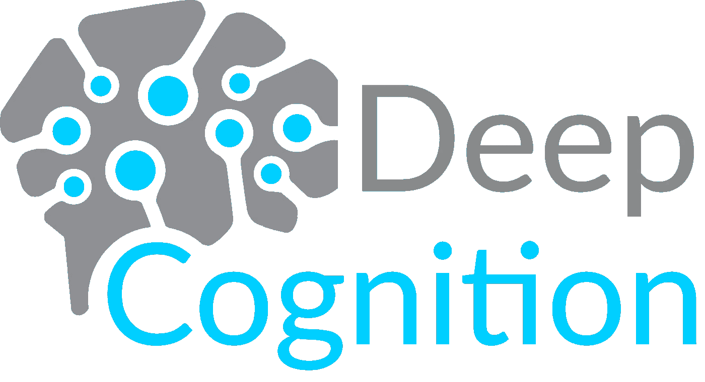

"**信息**:我根据[深度学习工作室](http://deepcognition.ai/)准备的时尚-MNIST 数据集在我的 GitHub 存储库中可用，所以你们也可以从那里下载数据集"

步骤 1:项目创建

当我登录到运行在云中的 Deep Learning Studio 后，我点击了+按钮来创建一个新项目。

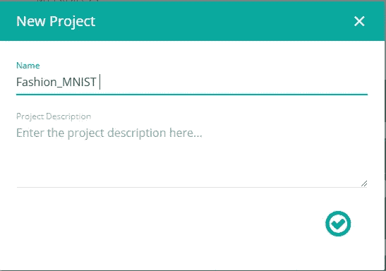

步骤 2:数据集分割

我将不同服装的 70，000 幅图像的整个数据集分别分成 80%、10%、10%的训练集、验证集和测试集，并将内存中的加载数据集设置为“完整数据集”。相同的图像如下所示。

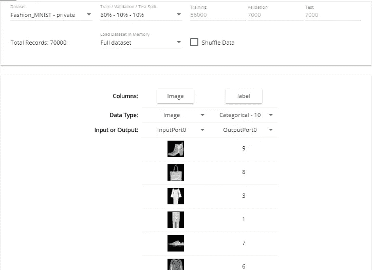

70，000 个示例被分配到以下标签之一:

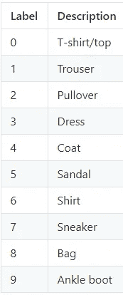

步骤 3:创建卷积神经网络

然后，我创建了一个卷积神经网络，如下图所示，只需简单地拖放层。

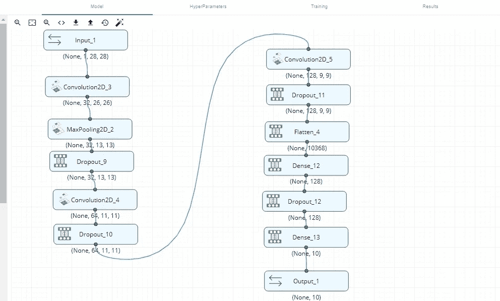

**信息**:如果你们中的任何人对模型背后的代码感兴趣，可以在我的 GitHub 库中找到，相同的链接可以在参考资料部分找到。

步骤 4:超参数调整

我保持纪元编号=100，批量=512，损失函数为分类交叉熵

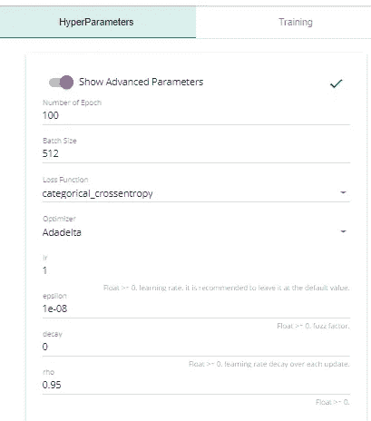

步骤 5:训练模型

在调整超参数之后，我开始训练我的模型，并且在训练我的 CNN 模型之后，我得到了 0.9513 的训练精度、0.9272 的验证精度、0.1357 的训练损失和 0.2025 的验证损失

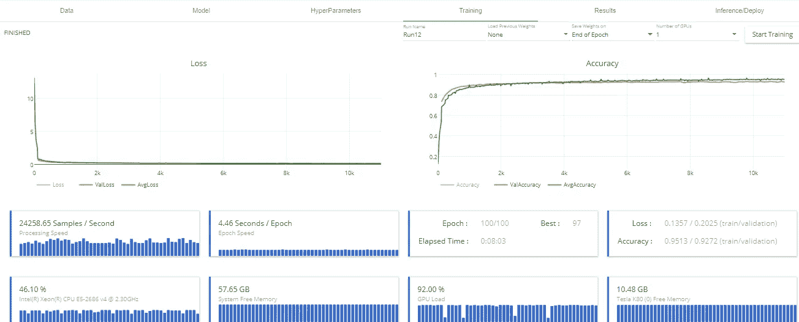

训练损失、训练准确度、验证损失和验证准确度的单独图表如下所示:

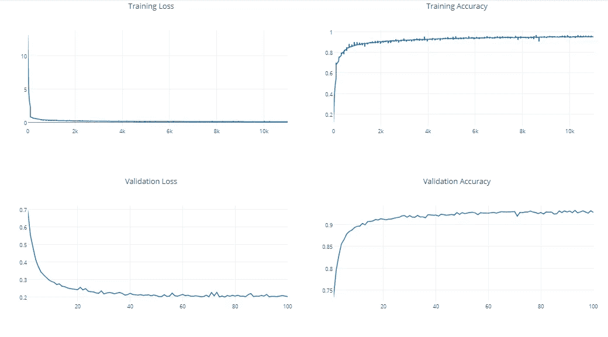

第六步:推理

推断是使用训练模型来推断/预测测试样本的阶段，包括与预测值的训练类似的正向传递。与训练不同，它不包括反向传递来计算误差和更新权重。这通常是一个生产阶段，在此阶段，您部署模型来预测真实世界的数据。而深度学习工作室只需点击一下，就可以轻松完成这一切推理阶段。

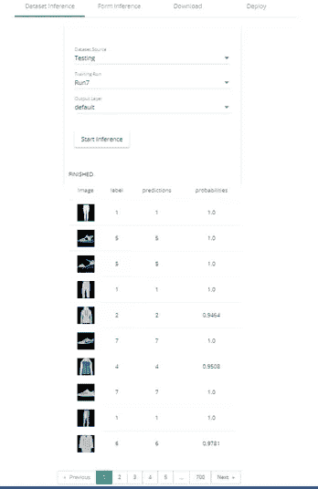

Inference

步骤 7:部署模型

Deep Learning Studio 的这一特性是独一无二的，因为它允许我以 WEBAPP 的形式访问我部署的模型。

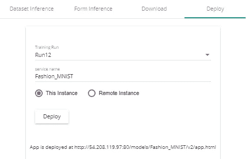

Deploying Model as WEBAPP

在我单击 Deploy 并向实例提供服务名之后，就会生成一个 URL。然后，我看到我的模型通过预测不同的时尚服装图片发挥作用。

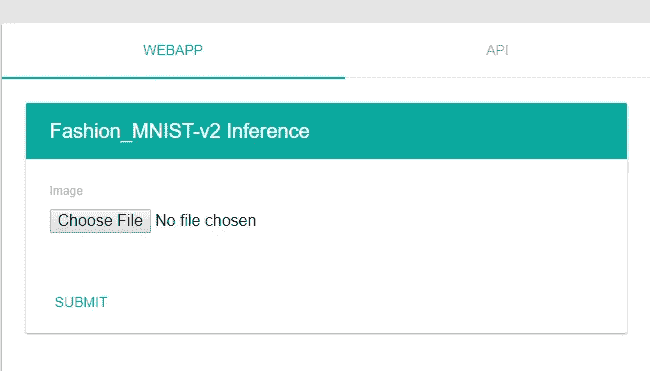

1\. choose file

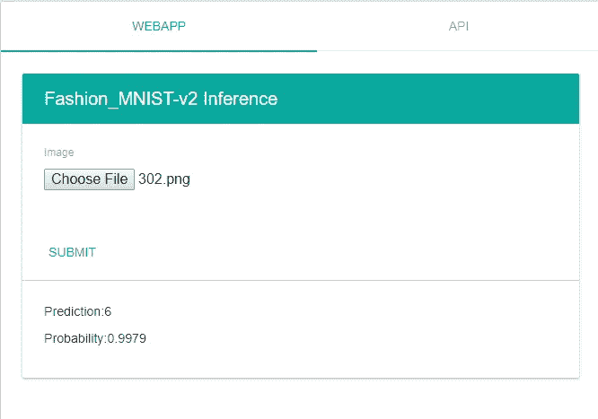

2\. giving the prediction

所以，这就是如何使用时尚 MNIST 和深度学习工作室，我能够在我的 CNN 模型上获得 95%的准确率。既然现在你们都知道我是如何从上到下执行这个项目的每一个步骤，因此通过这篇文章，我想鼓励我所有的读者、深度学习/机器学习实践者和爱好者提出自己的模型或使用相同的模型，并在其上发布 LinkedIn 或 twitter 帖子(** **但不要忘记标记我:)或** [**深度认知**](https://medium.com/u/561cb78751ed?source=post_page-----52dbe3c0f703--------------------------------) **)，甚至写一篇关于它的文章来分享你的结果，与整个人工智能社区分享。我将急切地等待你的帖子。

感恩时间:如果没有来自 [Mahesh Kashyap](https://medium.com/u/e641842d35dd?source=post_page-----52dbe3c0f703--------------------------------) 和 [deepcognition.ai 社区](http://community.deepcognition.ai/)的持续和智力支持，这一切都是不可能的。因此，向 [Deep Cognition](https://medium.com/u/561cb78751ed?source=post_page-----52dbe3c0f703--------------------------------) 团队致敬，他们付出了巨大的努力来创建一个改变游戏规则的最简单的深度学习平台。

参考资料:

1.  代码和时尚 MNIST 数据集可以从我的 repo [这里](https://github.com/ElephantHunters/Fashion-MNIST-WITH-Deep-Learning-Studio)获取。
2.  要通过视频教程了解更多关于深度学习工作室的信息，请查看此处的。
3.  如果你想阅读更多关于深度学习工作室的文章，作者不是别人，正是[法维奥·巴斯克斯](https://medium.com/u/e8ec6fa4d7d4?source=post_page-----52dbe3c0f703--------------------------------)点击[这里](https://towardsdatascience.com/@faviovazquez)。
4.  如果你有兴趣阅读 Zalando 时尚研究-MNIST 发表的论文，请点击这里查看。

**感谢您的关注**

你利用你的时间阅读我的作品对我来说意味着一切。我完全是这个意思。

如果你喜欢这个故事，那就疯狂鼓掌吧👏 **)** 按钮！这将有助于其他人找到我的工作。

还有，**跟我上** [**中**](https://medium.com/@naveenmanwani)**[**Linkedin**](https://www.linkedin.com/in/naveen-manwani-65491678/)**如果你想！我很乐意。****