# 天空中的眼睛——使用迁移学习和数据增强的图像分类

> 原文：<https://towardsdatascience.com/fast-ai-deep-learnings-part-i-eye-in-the-sky-417e97c3e6bb?source=collection_archive---------13----------------------->

## 很快。人工智能深度学习第一部分

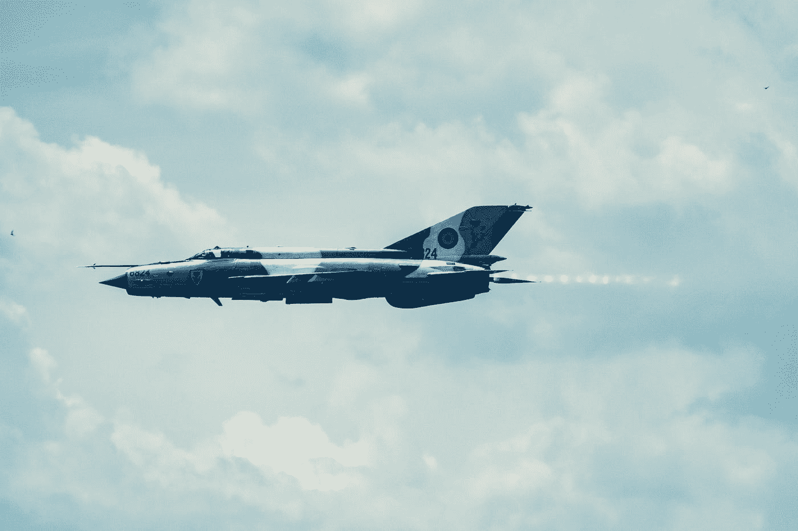

“Side shot of a fighter jet speeing through the air.” by [Dan](https://unsplash.com/@dann?utm_source=medium&utm_medium=referral) on [Unsplash](https://unsplash.com?utm_source=medium&utm_medium=referral)

成为一名战斗机飞行员是我童年的梦想，看着飞机直到它们离开我的视线仍然是一件令人兴奋的事情。当我在考虑一个数据集，开始应用我从 [fast.ai](http://course.fast.ai/) 学到的计算机视觉知识时，这就是我玩它们的动机。

这是我的**系列的第一部分*快。艾深学*** 。对于那些不知道的人来说， [fast.ai](http://course.fast.ai/) 是一门关于深度学习的在线课程，由前 Kaggle 总裁和#1 竞争对手 [Jeremey Howard](https://twitter.com/jeremyphoward?ref_src=twsrc%5Egoogle%7Ctwcamp%5Eserp%7Ctwgr%5Eauthor) 教授。在我完成了 Andrew NG 在 Coursera 上的[深度学习专业化](https://www.coursera.org/specializations/deep-learning)之后，我觉得他自上而下的方法是一个完美的补充。

我将给出飞机与直升机分类的端到端实现，让我们看看 CNN 架构如何区分机翼与桨叶。完整的执行代码可以在 github 上找到[。](https://github.com/murali-munna/deep-learning-fastai)

# 1.数据准备

我想到不使用任何现有的数据集，所以我自己从谷歌上下载了图片。我用过*火狐的谷歌图片下载器，*这是一个下载图片的便捷扩展工具。我还发现这个 [python 包](https://github.com/hardikvasa/google-images-download)对于自动处理多个标签非常有用。总共有 216 架飞机和 350 架直升机，让我们看看数据集中的样本图片。

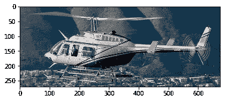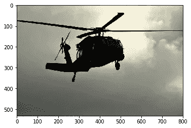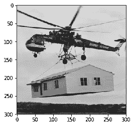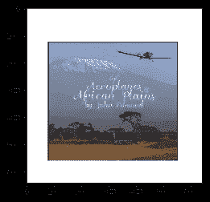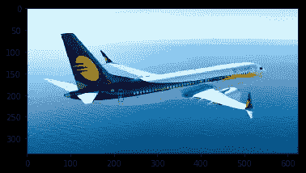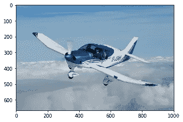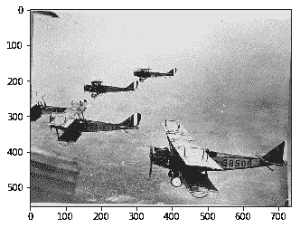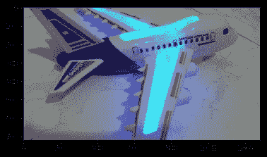

我们的数据集看起来足够多样化(至少飞机),图片范围从常规客运航班、螺旋桨、战斗机、玩具飞机、战斗直升机和巨大的搬家工人。让我们看看我们的 NN 如何对付他们。

# 2.带 ResNet34 的快速模型

我们将使用 ResNet34 预训练模型，它赢得了 2015 年的 ImageNet 竞赛。由于 ImageNet 包含多样化的点击图片，这种架构将很好地适合这个问题。你可以通过[这篇优秀的文章](http://teleported.in/posts/decoding-resnet-architecture/)来解码 ResNet 架构，其基本理念是使用更深层次的网络，而不会经历收敛方面的退化。

> “你不应该使用较小的网络，因为你害怕过度适应。相反，你应该在你的计算预算允许的情况下使用尽可能大的神经网络，并使用其他正则化技术来控制过拟合”

利用 5 个时期、8 的批量大小和 0.01 的学习率，我们能够实现大约 90%的准确度。

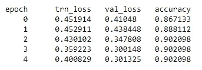

Accuracy after training for five epochs

## **2a。分析结果**

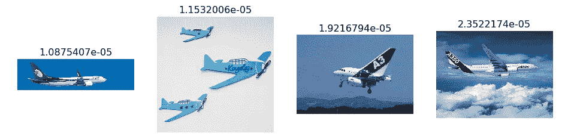

Most correctly classified planes

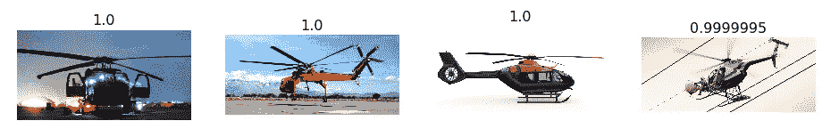

Most correctly classified helicopters

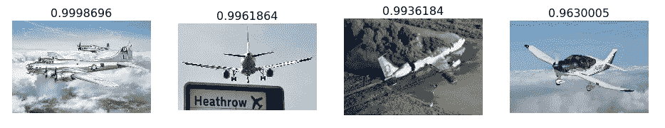

Most incorrectly classified planes

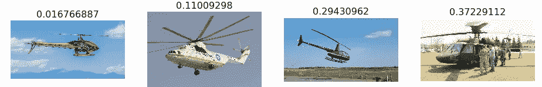

Most incorrectly classified helicopters

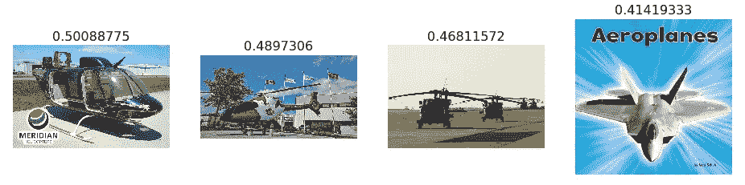

Most uncertain predictions

虽然有些飞机很难辨认(着火的那架和‘希思罗’那架)，但分类错误的直升机似乎和正确的没什么区别。

# 3.学习率探测器

学习率决定了您希望更新权重的快慢。虽然对于像我们这样的小数据集(~500 张图像)，这没有多大关系，但是学习速率会显著影响模型性能/收敛。

我们将使用论文中开发的技术，[用于训练神经网络的循环学习率](http://arxiv.org/abs/1506.01186)，其中我们简单地从最小值开始增加学习率，直到损失停止减少。根据下面的图，我们将使用 1e-2 的 LR。

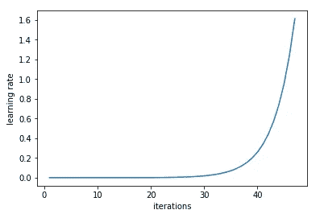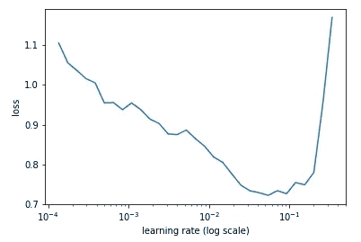

Left: Increasing learning rate every iteration. Right: Identifying the learning rate where there is still a decreasing loss

# 4.数据扩充

如果我们为更多的时期训练模型，它将开始过度拟合(训练损失变得更少，而验证损失不会)。该模型将开始学习特定于这些数据点的特征，而不是进行归纳。为了克服这一点，我们将使用数据扩充来创建更多的数据。对于这个问题，我们将使用水平翻转和缩放(高达 1.1 倍)。确保你做了相关的增强——对于字母/数字，任何翻转都没有意义，而对于卫星图像，我们可以根据需要翻转和旋转图像。

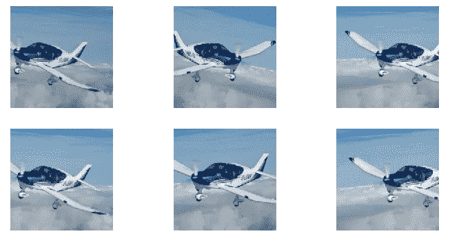

Augmenting through horizontal flipping and zooming

我们可以看到，通过这个增广数据后，准确率提高到了 92.3%。*请注意，我们仍然使用预训练的权重，并且只训练最终的 FC 层。*

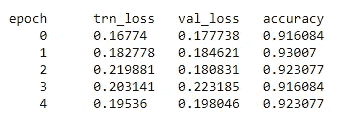

Accuracy after 5 epochs with augmentation

# 5.微调以及差分学习速率退火

**学习速率退火:**虽然我们发现 1e-2 是理想的学习速率，但我们实际上已经开始使用它，并随着训练的进行逐渐降低它。这是因为，随着我们越来越接近最佳体重，我们应该迈出更小的步伐。

**带重启的随机梯度下降:**使用上述技术一个历元周期，我们将从 10e-2 再次重启学习速率并继续该过程。这背后的想法是鼓励我们的模型跳出这个最优空间，找到(如果有的话)一个稳定准确的最优空间。将这两者结合起来，学习率就像这样增长—

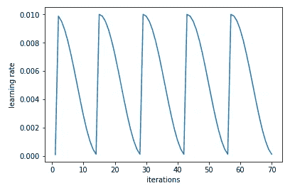

SGDR: Each cycle corresponds to one epoch

**解冻预训练层:**现在，由于我们已经训练了足够多的最终层，我们将解冻预训练的 ResNet 层并对其进行微调。由于这些层已经在 imageNet 照片上进行了训练，并且初始层将具有更多通用功能，因此我们将使用不同的学习速率来仔细调整它们。因此，初始层将像以前一样使用 1e-4，中间层使用 1e-3，FC 层使用 1e-2。

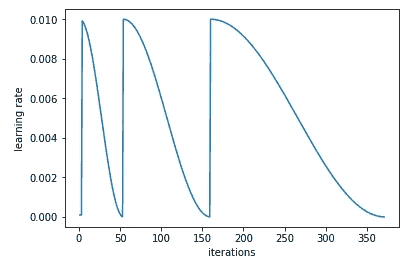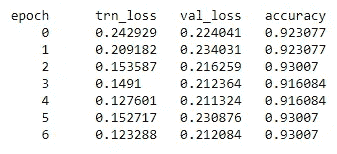

Final Accuracy after 3 cycles with 1 epoch, 2 epoch and 4 epoch each

我们看到准确率没有太大变化，但提高到了 93%。我们仍然看到验证损失是 0.21，而训练损失是 0.12，我觉得还有改进模型的空间，但我们现在就到此为止。*我认为有更多种类的飞机，但没有足够的例子来学习这些特征(这就是为什么我认为我们看到下面很多飞机被错误分类)。*

**测试时间增加:**这是在验证/测试时使用增加功能的一个很好的方法。TTA 不仅对你的验证集中的图像进行预测，还对它们的几个随机增强版本进行预测。然后，它从这些图像中提取平均预测值，并加以利用。**我们实现了 94.4%的准确率，**考虑到这种简单而有效的技术，这是一个相当不错的进步。

# 6.分析最终结果

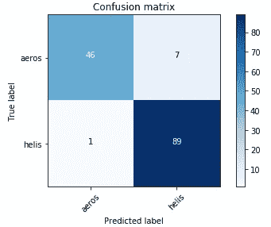

查看混淆矩阵，有 7 架飞机被预测为直升机(这些似乎是初始模型本身之后不正确的)，我们在预测直升机方面做得很好。也许有了更多的飞机图像，我们可能会达到更高的精度。

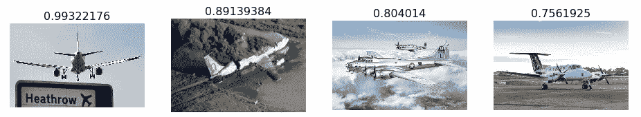

Final most incorrect aeroplanes

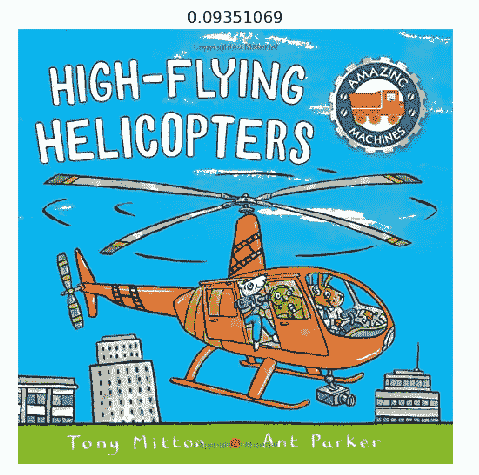

Final incorrect helicopter

非常感谢你一直读到最后。我们已经使用迁移学习、数据增强和差分学习速率退火对飞机和直升机进行了分类，在一个小数据集(~500 张图像)的情况下，达到了 94.4%的相当不错的准确度。如果你喜欢，请鼓掌并分享，如果有任何不清楚或可以改进的地方，也请在评论中告诉我。

*代号:*[*https://github.com/murali-munna/deep-learning-fastai*](https://github.com/murali-munna/deep-learning-fastai)

*要了解数据科学初学者的实用技巧，请查看这篇文章。*

 [## 数据科学初学者实用技巧。揭穿几个神话！

### 当我开始我的旅程和我现在的位置时，我通过职业经历学到了很多东西…

towardsdatascience.com](/practical-tips-for-beginners-in-data-science-debunking-few-myths-30537117a4e4) 

*在*[*LinkedIn*](https://www.linkedin.com/in/muralimohanakrishnadandu/)上联系我