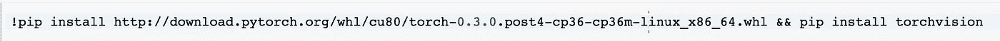
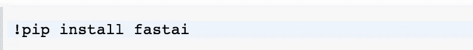
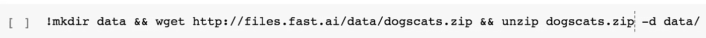

# Google Colab 上的 Fast.ai 第一课(免费 GPU)

> 原文：<https://towardsdatascience.com/fast-ai-lesson-1-on-google-colab-free-gpu-d2af89f53604?source=collection_archive---------3----------------------->

在这篇文章中，我将演示如何为 fastai 使用 google colab。

## 关于谷歌可乐的一点…([https://colab.research.google.com/](https://colab.research.google.com/))

Google colab 是 Google 内部的数据科学研究工具，已经有一段时间了。他们早些时候向公众发布了该工具，其崇高目标是传播机器学习教育和研究。虽然已经有一段时间了，但有一个新功能会引起很多人的兴趣。

> 一次可以免费使用 GPU 作为后端 12 个小时。

GPU 计算免费？你在开玩笑吗？

这些是我脑海中立即闪现的问题，我试了一下。事实上，它工作得很好，非常有用。请仔细阅读本次[讨论](https://www.kaggle.com/getting-started/47096)，了解关于此次发布的更多细节。讨论中的几个要点。

1.  *后端使用的 GPU 是 K80(此时此刻)。*
2.  *12 小时的限制适用于 VM 的连续分配。这意味着我们可以通过连接到不同的虚拟机来使用 GPU 计算，即使在 12 小时结束后也是如此。*

Google Colab 有很多不错的功能，协作是其中一个主要功能。我不打算在这里介绍这些特性，但这是一个很好的探索，尤其是当你和一群人一起工作的时候。

因此，让我们开始使用 fastai 和这项服务。

## 入门指南

1.  你需要[注册](https://colab.research.google.com/)并申请访问权限，才能开始使用 google colab。
2.  获得访问权限后，您可以使用“文件”->“上传笔记本”来上传笔记本。我已经上传了第一课的笔记本。请访问本[笔记本](https://drive.google.com/file/d/1Yhmmws6eelhXs2WQHJ7BUMQO9Wu5MoQj/view?usp=sharing)以供参考。设置单元格将在共享笔记本中可用。
3.  为您的笔记本电脑启用 GPU 后端。运行时->更改运行时类型->硬件加速器->GPU。
4.  要交叉检查是否启用了 GPU，您可以运行共享笔记本中的第一个单元。

Cross Check to see if GPU is enabled

**安装 Pytorch**

由于默认环境没有 Pytorch，我们必须自己安装它。请记住，每次连接到新虚拟机时都必须这样做。所以不要删除单元格。

Installing Pytorch

**安装 fastai**

fastai 也一样。我们将使用 pip 来安装 fastai。

Installing fastai

除此之外，还有一个缺失的库 libSM，所以我们必须安装它。

**下载数据**

我们可以下载猫和狗的数据集，并使用几个 bash 命令对其进行解压缩

Downloading Data

完成这些步骤后，我们就可以在 Google Colab 上学习第一课了。在我们庆祝之前让我们讨论一些问题。

## 过程顺利吗？？？

目前还没有。但这是意料之中的。我们来看一些小问题。

1.  当试图连接到 GPU 运行时，它有时会抛出一个错误，说它不能连接。这是由于大量的人试图使用这项服务，而不是 GPU 机器的数量。根据之前分享的 kaggle 讨论，他们计划添加更多的 GPU 机器。
2.  有时，运行时只是间歇性地死亡。这可能有许多潜在的原因。
3.  可用的内存容量大约是 13GB，这对于空闲的内存来说太好了。但是对于像第 1 课中的 resnet 这样的大型网络，大多数时候都会出现内存警告。当用解冻和不同的学习率尝试最终的完整网络时，我几乎总是遇到问题，我怀疑是由于内存。

## 结论:

谷歌确实在帮助降低深度学习的准入门槛。而像这样的工具，会帮助很多买不起 GPU 资源的人。我真的希望这将是一个全面的服务很快，并保持免费。

我会继续更新这个帖子，因为我想出了如何处理这些小问题，并使这个过程顺利。如果有人能够解决这些小问题，请在评论中告诉我。