# ！！！DOGS VS CATS 图像分类器！！！

> 原文：<https://towardsdatascience.com/fast-ai-season-1-episode-2-1-e9cc80d81a9d?source=collection_archive---------8----------------------->

## 建立一个最先进的图像分类器

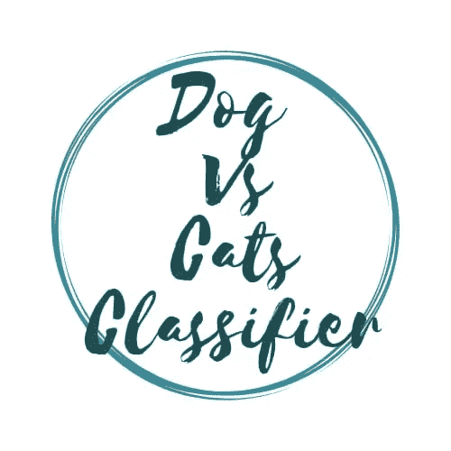

几个月来我一直在浏览 fast.ai。我不得不承认在这个过程中我学到了很多东西和很棒的技术。我会确保更新我博客中的所有内容。感谢[](https://twitter.com/jeremyphoward)**和 [**瑞秋·托马斯**](https://twitter.com/math_rachel) 为 AI 民主化所做的努力。感谢牛逼的 [**fast.ai**](https://twitter.com/fastdotai) 社区的所有快速帮助。**

**下图描绘了我到目前为止的旅程，这使它成为一个有趣的旅程。**

**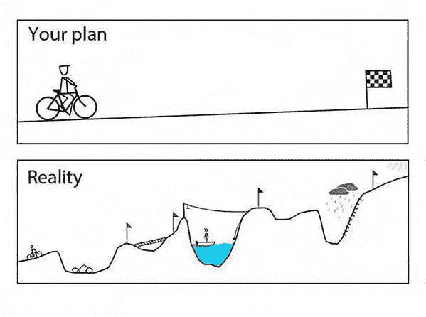**

**[Image](https://www.jborden.com/wp-content/uploads/2015/08/bestlaidplans.jpg)**

**为了充分利用这个博客系列，请按照以下顺序随意探索这个系列的第一部分**

1.  **[狗 Vs 猫图像分类](/fast-ai-season-1-episode-2-1-e9cc80d81a9d)**
2.  **[犬种图像分类](/fast-ai-season-1-episode-2-2-dog-breed-classification-5555c0337d60)**
3.  **[多标签图像分类](/fast-ai-season-1-episode-3-a-case-of-multi-label-classification-a4a90672a889)**
4.  **[使用神经网络的时间序列分析](/fast-ai-season-1-episode-4-1-time-series-analysis-a23217418bf1)**
5.  **[IMDB 电影数据集上的自然语言处理情感分析](https://geneashis.medium.com/nlp-sentiment-analysis-on-imdb-movie-dataset-fb0c4d346d23)**
6.  **[电影推荐系统的基础](/fast-ai-season-1-episode-5-1-movie-recommendation-using-fastai-a53ed8e41269)**
7.  **[从零开始协同过滤](/fast-ai-season-1-episode-5-2-collaborative-filtering-from-scratch-1877640f514a)**
8.  **[使用神经网络的协同过滤](/fast-ai-season-1-episode-5-3-collaborative-filtering-using-neural-network-48e49d7f9b36)**
9.  **[像尼采一样写哲学](https://geneashis.medium.com/fast-ai-season-1-episode-6-1-write-philosophy-like-nietzsche-using-rnn-8fe70cfb923c)**
10.  **[不同神经网络在 Cifar-10 数据集上的性能](https://geneashis.medium.com/fast-ai-season-1-episode-7-1-performance-of-different-neural-networks-on-cifar-10-dataset-c6559595b529)**
11.  **[检测图像中最大物体的 ML 模型 Part-1](https://medium.com/hackernoon/single-object-detection-e65a537a1c31)**
12.  **[检测图像中最大物体的 ML 模型 Part-2](https://medium.com/hackernoon/single-object-detection-part-2-2deafc911ce7)**

**所以，振作起来，专注于 Fastai 课程的第一部分第二课。**

# ****狗 VS 猫分类器:****

**这篇博文讨论了狗和猫的分类模型。这是杰瑞米·霍华德在 FastAI 课程第一部分第二课中讲授的。**

**导入将在此模型中使用的如下所有库。**

```
!pip install fastai==0.7.0
!pip install torchtext==0.2.3!pip3 install http://download.pytorch.org/whl/cu80/torch-0.3.0.post4-cp36-cp36m-linux_x86_64.whl 
!pip3 install torchvisionimport fastai
from matplotlib import pyplot as plt# Put these at the top of every notebook, to get automatic reloading # and inline plotting
%reload_ext autoreload
%autoreload 2
%matplotlib inline# This file contains all the main external libs we'll use
# from fastai.imports import *from fastai.transforms import *
from fastai.conv_learner import *
from fastai.model import *
from fastai.dataset import *
from fastai.sgdr import *
from fastai.plots import *
```

**使用以下命令检查 GPU 是否已启用:-**

**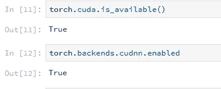**

**上述命令的输出应该返回 True。**

**在深入研究之前，我想提几个可能有用 Linux 命令。**

**使用前缀为“！”的命令马克。**

1.  **`!ls`是一个列出当前目录中文件的命令。**
2.  **`!pwd`代表打印工作目录。将打印工作目录的路径**
3.  **`!cd` 代表变更目录。**

**以上三个命令有助于在目录间导航。**

**使用以下命令下载了狗和猫的图像。**

**<< !wget [http://files.fast.ai/data/dogscats.zip](http://files.fast.ai/data/dogscats.zip)>>**

**文件夹的结构应该如下所示**

**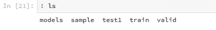**

**设置存储数据的路径**

```
PATH = "data/dogscats/"
sz=224
```

**使用以下命令检查文件是否已经下载**

**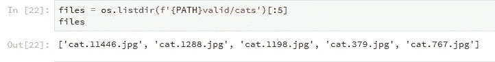****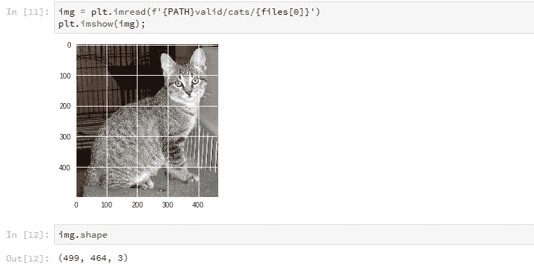**

**上面的`f ’` 代表 f 弦。这是一种在 Python 中格式化字符串的新方法。想了解更多关于 f 弦的信息，请点击 realpython.com 的[链接。](https://realpython.com/python-f-strings/)**

**分类任务将利用预训练模型。预训练模型是已经由其他人对类似类型的数据进行了训练的模型。因此，不是从头开始训练模型，而是使用已经在 ImageNet 上训练过的模型。ImageNet 是由 120 万幅图像和 1000 个类组成的数据集。`ResNet34` 是将要使用的模型版本。这是一种特殊类型的卷积神经网络。`ResNet34` 获得 2015 年 ImageNet 大赛冠军。ResNet 的细节将在即将发布的博文中讨论。**

**下面几行代码显示了如何使用 fastai 训练模型。**

**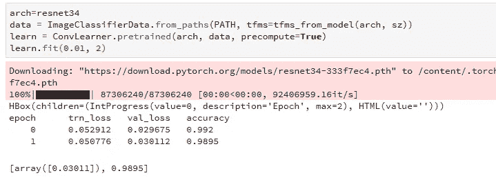**

**使用的架构`resnet34` 已经保存在 arch 变量中。数据保存在数据变量中，因为它在前面指定的路径中查找数据。`tfms` 是数据扩充的一部分，稍后将详细讨论。**

**`pre-trained`方法从 arch 模型(`resnet34`)创建新的神经网络。拟合方法使用学习率和指定的时期数来训练模型。并且已经获得了`0.9895`的精度。**

****梯度下降****

**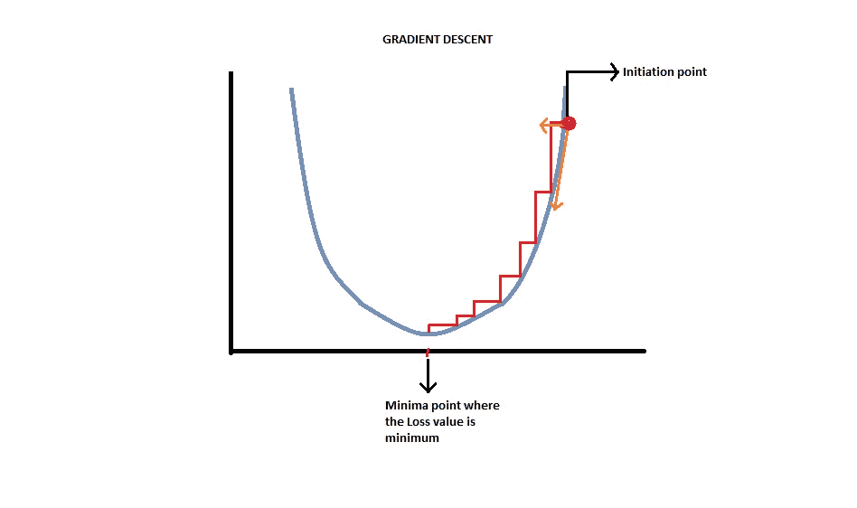**

**我来解释一下上面的图像。最初选择的参数是随机的。此时的损失很大。高损失表明在训练期间,“结果/预测值”和“目标值/标签”之间的差异更大。因此，应该遵循一种方法，使用这种方法应该使这种差异最小。收敛或达到局部最小值意味着此时损失最小，因此结果和目标值/标签之间的差异最小。这个过程被称为**梯度下降。****

****学习率:-****

**上述拟合函数中的**学习率(LR)** 是最重要的参数之一，应仔细选择，以使模型快速有效地达到最优解。基本上说的是如何快速到达函数中的最优点。如果 LR 很低，则过程很慢，如果 LR 太高，则很有可能超过最小值。因此，必须仔细选择 LR，以确保收敛(达到局部最小值)以有效的方式发生。下图描述了上述概念。**

**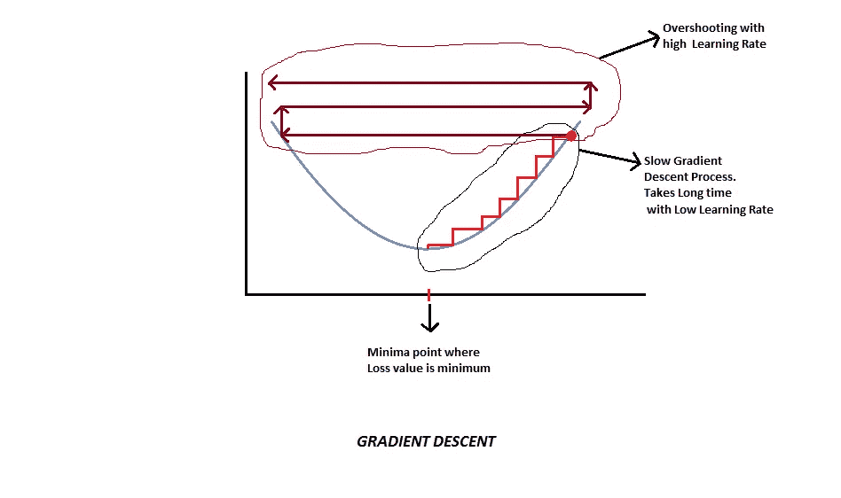**

****如何选择最佳学习率？****

**！！！别担心，杰瑞米·霍华德会支持你的。杰里米提到了一个很好的方法来计算学习率，它被称为**

****学习率查找器。****

**请检查下面的代码。**

**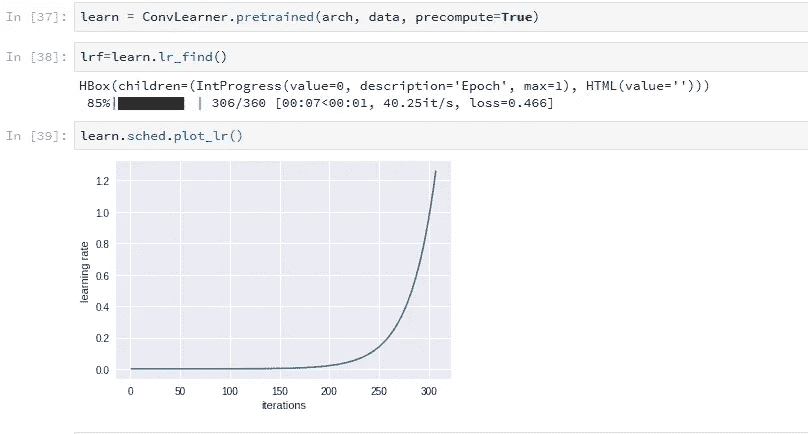****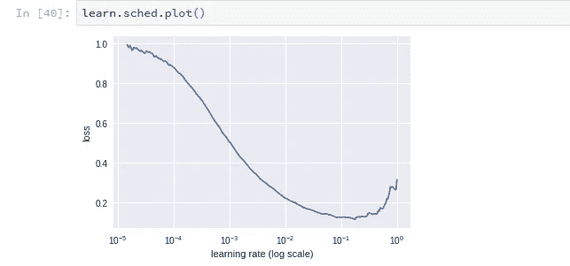**

**使用`lr_find()`可以获得最佳学习率。如学习率与迭代图所示，LR 在每次小批量后增加，并呈指数增加。在第二个图中，即损耗对学习率，观察到损耗随着学习率的增加而减少一段时间，当学习率为 0.1 时，损耗处于最小值，之后它开始再次上升(这意味着 LR 如此之高，以至于它已经超过最小值，损耗变得更糟)。**

****选择最佳学习率**，步骤如下:-**

1.  **确定上面损失与学习率图表中的最低点(即 0.1)**
2.  **后退 1 级(即 0.01)，选择该值作为学习率。**

****后退 1 级背后的概念:-****

**虽然在这一点上损失最小，但是在这一点上选择的学习速率太高，并且继续使用这一学习速率将不会收敛。请查看下图进行解释。**

****

****注意:-** 学习率查找器是最重要的超参数之一，如果调整/选择得当，将会产生最佳效果。**

****改进模型****

**改进模型的一个方法是给它更多的数据。因此，我们使用数据增强。**等等，但是** **为什么要数据增强？****

**我们的模型通常有几百万个参数，当训练更多的数时，有很大的可能性，它可能开始过度拟合。过度拟合意味着模型过度学习训练数据集中图像的特定细节，并且它可能无法在验证数据集或测试数据集上很好地概括。换句话说，当验证数据集的精度小于训练数据集的精度时(或者在训练数据集上计算的损失远小于在验证数据集上计算的损失)，就发生了过拟合。因此**过度拟合**可以通过向模型提供更多数据来避免，因此使用数据扩充。**

****注意:-** 数据增强并不是创造新的数据，而是让卷积神经网络从一个非常不同的角度学习如何识别狗或猫。**

**对于数据扩充，我们在`tfms_from_model()`函数中将`transforms_side_on`传递给`aug_tfms`。`transforms_side_on` 通过水平翻转将给出不同版本的图像。它让神经网络看到图像，就好像它是从侧面角度拍摄的一样，少量旋转它们，稍微改变它们的对比度、亮度，稍微放大一点，移动一点。这些变化可以在下图中看到。**

**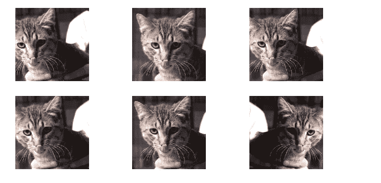**

**要进行数据扩充，请编写以下代码**

```
tfms = tfms_from_model(resnet34, sz, aug_tfms=transforms_side_on, max_zoom=1.1)
data = ImageClassifierData.from_paths(PATH, tfms=tfms)
```

**虽然为数据扩充创造了空间，但是数据扩充不起作用，因为它最初被设置为`precompute=True .`**

**让我详细解释以下代码及其与上述语句的关系:-**

```
data = ImageClassifierData.from_paths(PATH, tfms=tfms)
learn = ConvLearner.pretrained(arch, data, precompute=True)
learn.fit(1e-2, 1)
```

**当使用`ConvLearner.pretrained(…)` 声明架构时，**预计算**被设置为真，这表示实现来自预训练网络的激活。预训练网络是已经学会识别某些事物的网络。对于我们的狗与猫的研究，使用的预训练网络已经学会了对 ImageNet 数据集中 120 万张图像的 1000 个类别进行分类。因此，采取倒数第二层(因为这是一层，有所有必要的信息来计算出图像是什么)，并保存这些激活。为每个图像保存这些激活，这些被称为**预计算激活。**现在，当创建新的分类器时，利用这些预先计算的激活，并基于这些激活快速训练模型。因此要实现这个 set **precompute=True。****

****注意:-** 当`**precompute=True**` 时，数据扩充不起作用，因为它当前使用的是特定版本的扩充 cat，或者换句话说，即使每次显示的是不同版本的 cat，特定版本 cat 的激活已经预先计算好了。第一次运行时，预计算激活需要一两分钟。**

**当使用预计算激活训练时，精确度是`98.8%` :-**

**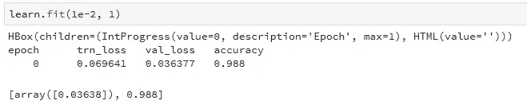**

**要进行数据扩充，设置`**precompute=False**` 并检查准确性。在下面的代码中`**cycle_len**` 是一个重要的参数，将在本文后面详细讨论。**

****

**精确度增加了一点到`99.1%` ，好消息是，它没有过度拟合，训练损失进一步减少。为了进一步改进模型，让我们关注:-**

****SGDR(重启随机梯度下降)****

**SGDR 说，当我们越来越接近最小值时，让我们降低学习率。随着我们的训练(即更多的迭代次数)降低学习率的想法被称为学习率退火。有步进式和余弦退火。在这个过程中，杰瑞米·霍华德使用余弦退火。**

**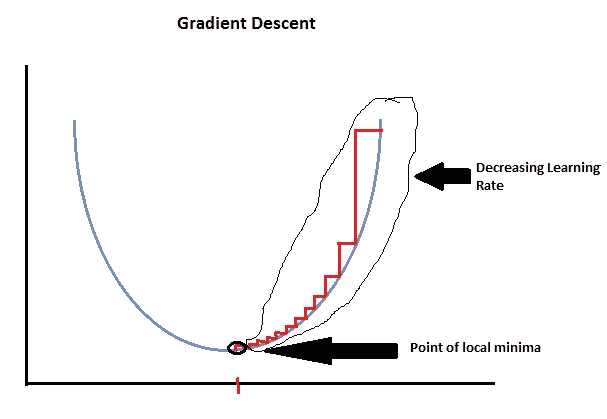****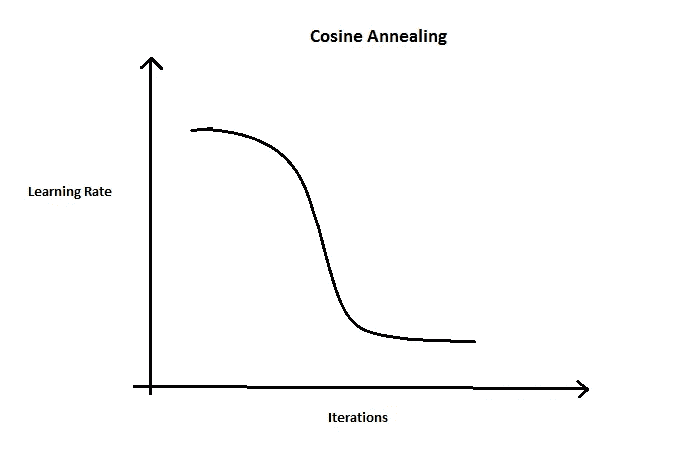**

**在余弦退火中，当不在最小值附近时，我们使用较高的学习率进行训练。当接近局部最小值时，切换到较低的学习速率，并在此基础上进行几次迭代。**

**上图显示了一个简单的损失函数。实际上，数据集是在一个非常高维的空间中表示的，有许多相当平坦的点，这些点不是局部极小值。假设我们的表面看起来像下面的图表**

**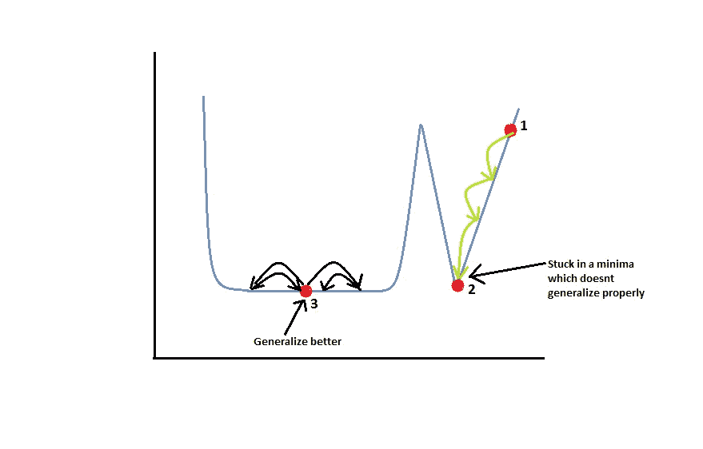**

**从 1 号红点开始，达到了 2 号红点所示的全局最小值，但是这里不能很好地概括。如果使用这种解决方案，在稍微不同的数据集的情况下，它不会导致好的结果。另一方面，红点 3 将在稍微不同的数据集的情况下很好地概括。我们的**标准学习率退火方法**将下降到一个点，在高维度中有很大的机会陷入尖峰区域，在那里它不会更好地概括，因此不是一个好的解决方案。相反，可以部署一个**学习速率调度器**，它将重置并执行余弦退火，然后再次跳转，这样它将从点 2 跳转到点 3，以此类推，直到它到达一个泛化能力非常好的点。**

> **每次学习率被重置，它将再次增加学习率，这将导致离开表面的讨厌的尖峰部分，并最终跳到一个漂亮光滑的碗，这将更好地概括。**

**上述过程被称为 **SGDR** (重启随机梯度下降)。这个 SGDR 最好的部分是一旦达到一个“像表面一样光滑的曲线”,它就不会再开始了。它实际上是在空间的这个好地方逗留，然后不断变得更善于找到合理的好位置。请检查下图。**

**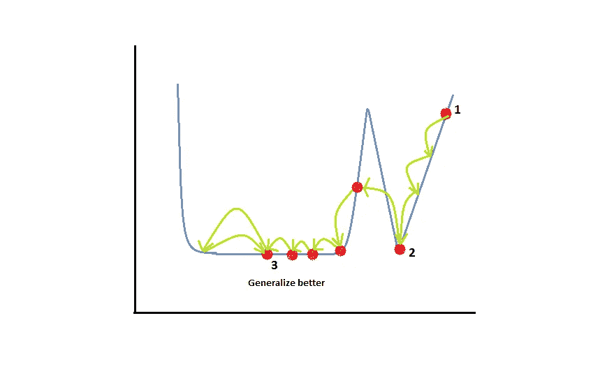**

**使用 **SGDR** 和**学习率查找器**会给我们更好的结果。从学习率搜索器中，试着视觉上找到一个好的学习率，否则在 SGDR 它不会跳到一个平滑的表面上。借助`**cycle_len**` 参数重置学习率。这基本上意味着在每 1 个时期后重置学习率。下图显示了重置是如何发生的**

**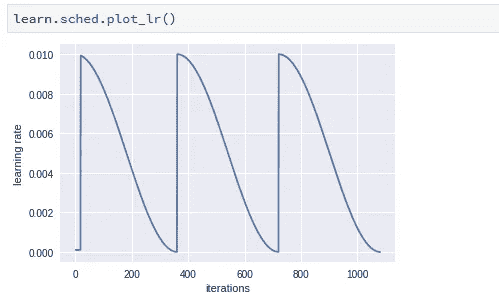**

****注意:-** 学习率的重置发生在每一个时期之后，因为`cycle_len=1`和学习率在每一个小批量之后保持变化。y 轴是学习率，其中 0.010 是我们从学习率查找器获得的学习率。所以 SGDR 会在 0 到 0.010 之间调整学习率。**

**建议在中间步骤继续保存模型。为此，请使用以下命令:-**

```
learn.save('224_lastlayer')
learn.load('224_lastlayer')
```

**该模型保存在 **dogscats** 文件夹下的 models 文件夹中，如下所示**

**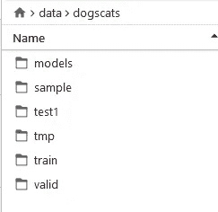**

**所有预计算的激活都保存在`tmp` 文件夹中。因此，如果出现奇怪的错误，可能是由于半完成预计算激活或其他方式，继续删除`tmp` 文件夹，并检查错误是否已经消失。这是快速开关它的方法。**

****注意:-** 预计算激活不需要任何培训。这些是预训练模型用我们下载的重量创建的。**

****我们还能做些什么来让模型变得更好？****

**到目前为止，预训练激活已经下载并直接使用。CNN 内核中预先训练的激活或预先计算的权重保持不变(即，尚未进行预先计算的权重的重新训练)。预先训练的模型已经知道如何在早期阶段找到边缘、曲线、梯度，然后找到重复的模式，最终找到主要特征。到目前为止，只有新的层被添加到顶部，模型学会了如何混合和匹配预先训练的功能。如果在 Imagenet 上训练的模型被扩展到诸如“卫星图像分类”的情况，其中特征完全不同，则需要重新训练大多数层，因为特征完全不同。因此，需要探索一个新概念，命名为:-**

****微调和差分学习率****

**要学习一套不同的功能或告诉学习者卷积滤波器需要改变，只需`**unfreeze**` 所有层。**冻结的**层是其权重没有被训练或更新的层。**

***！！！好吧好吧艾尔莎，我会让它去解冻层！！！*😍 😍**

**解冻图层将使图层权重对训练或更新开放。但是与后面的层相比，最初的层需要很少或任何训练。这普遍适用，因为初始层的工作是学习边缘和曲线，而后面的层学习重要的特征。因此，对于不同的层集合，学习速率被设置为不同的。这个概念被称为**差异学习率。****

```
learn.unfreeze()
lr=np.array([1e-4,1e-3,1e-2])
```

**进行必要的更改后，按如下所示训练模型。**

**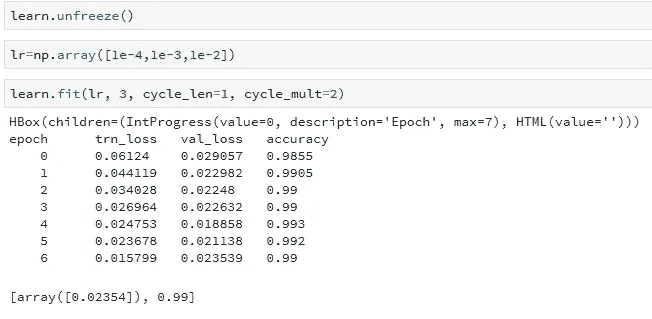**

**前面讨论了`cycle_len=1` 和`number_of_cycles=3`参数。再次提醒一下，`cycle_len=1` 是历元的数量，`number_of_cycles=3` 表示学习者将做 3 个周期，每个周期 1 个历元。现在一个新的参数被引入，命名为`cycle_mult=2`。此`cycle_mult` 参数在每次循环后乘以每次循环的长度。这里的倍增因子是 2。于是`(1+2*1 +2*2 )epoch` = `7 epoch`。也就是说，如果周期长度太短，它开始下降，找到一个合理的好点，然后弹出，再次下降，弹出。它实际上从来没有找到一个好点，这既是一个很好的最小值，也是一个很好的概括。这是一个机会的问题。它没有探索表面。所以要探索地表更要设定`cycle_mult=2`。现在，图表看起来更具探索性**

**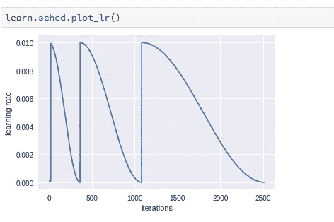**

**据观察，到目前为止，精度已经提高到`99.0%` ，损耗也大幅降低。还有最后一个方法可以让模型变得更好。它被称为**

****测试时间增加(TTA)****

**在验证/测试数据集上，所有输入都必须是正方形。这有助于 GPU 快速处理。如果验证数据集中的输入图像具有不同的维度，则处理速度不会很快。为了保持一致，在中间画出正方形。如下例所示:-**

**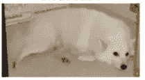**

**如果上面的图片在中间是方形的，模型将很难预测它是狗还是猫，因为它是唯一进入验证数据集的身体。为此(**测试时间增加**)使用了 TTA。它将随机进行四次数据增强，以及未经增强的原始中心裁剪图像。然后取所有这些图像上所有预测的平均值。这是我们最后的预测。**

****注:-** 仅适用于测试和验证数据集。**

**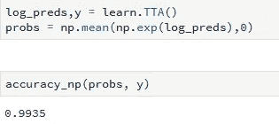**

**如上所示，应用 TTA 后的精度为`99.35%`。**

**为了得到我们的分类器的概要，画一个混淆矩阵。混淆矩阵用于分类，以了解有多少预测正确或不正确，如下图所示。**

**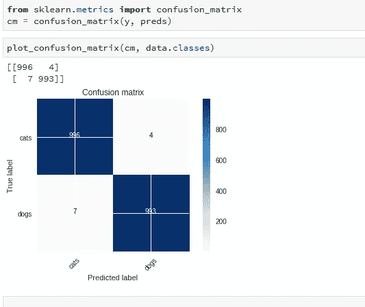**

****混淆矩阵的解释:-****

**混淆矩阵说明了我们的分类器有多好。如上所述，深蓝色区域已经被正确分类。996 张猫图片已被分类为猫，993 张狗图片已被正确分类为狗。7 张狗图片被归类为猫，4 张猫图片被归类为狗。因此，我们的分类器做得非常好。**

**希望这篇文章对你有所帮助。在我未来的博客文章中，我们将深入探讨。因为涵盖了很多重要的概念，你现在可能会有这种感觉。**

**！！坚持住，更多有趣的东西即将到来。直到那时再见😉！！**

***附注——如果你有兴趣，请在这里* *查看代码* [*。*](https://github.com/CaptainAshis/Deep_Learning-Experiment/blob/master/Dog%20Vs%20Cats/dogs%20vs%20cats.ipynb)**

****甲乙丙** - *一直在鼓掌。* ***👏 👏👏👏👏*😃😃😃😃😃😃😃😃😃*👏 👏👏👏👏 👏*****

**编辑 1:-TFW·杰瑞米·霍华德同意你的帖子。😃😃😃😃😃😃**

**为了充分利用这个博客系列，请按照以下顺序随意探索这个系列的第一部分**

1.  **[狗 Vs 猫图像分类](/fast-ai-season-1-episode-2-1-e9cc80d81a9d)**
2.  **[犬种图像分类](/fast-ai-season-1-episode-2-2-dog-breed-classification-5555c0337d60)**
3.  **[多标签图像分类](/fast-ai-season-1-episode-3-a-case-of-multi-label-classification-a4a90672a889)**
4.  **[利用神经网络进行时间序列分析](/fast-ai-season-1-episode-4-1-time-series-analysis-a23217418bf1)**
5.  **[对 IMDB 电影数据集的 NLP 情感分析](https://geneashis.medium.com/nlp-sentiment-analysis-on-imdb-movie-dataset-fb0c4d346d23)**
6.  **[电影推荐系统的基础](/fast-ai-season-1-episode-5-1-movie-recommendation-using-fastai-a53ed8e41269)**
7.  **[从零开始协同过滤](/fast-ai-season-1-episode-5-2-collaborative-filtering-from-scratch-1877640f514a)**
8.  **[使用神经网络的协同过滤](/fast-ai-season-1-episode-5-3-collaborative-filtering-using-neural-network-48e49d7f9b36)**
9.  **[像尼采一样写哲学](https://geneashis.medium.com/fast-ai-season-1-episode-6-1-write-philosophy-like-nietzsche-using-rnn-8fe70cfb923c)**
10.  **[不同神经网络在 Cifar-10 数据集上的性能](https://geneashis.medium.com/fast-ai-season-1-episode-7-1-performance-of-different-neural-networks-on-cifar-10-dataset-c6559595b529)**
11.  **[检测图像中最大物体的 ML 模型 Part-1](https://medium.com/hackernoon/single-object-detection-e65a537a1c31)**
12.  **[ML 模型检测图像中最大的物体 Part-2](https://medium.com/hackernoon/single-object-detection-part-2-2deafc911ce7)**