# “犬种图像分类”

> 原文：<https://towardsdatascience.com/fast-ai-season-1-episode-2-2-dog-breed-classification-5555c0337d60?source=collection_archive---------10----------------------->

## 建立一个最先进的图像分类器。

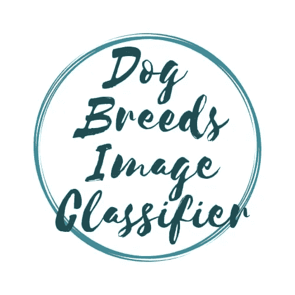

欢迎来到第二集的第二部分，我们将讨论**狗的品种分类**问题。我们有 120 种狗的图片需要分类。在我们开始之前，我想感谢**和 [**雷切尔·托马斯**](https://twitter.com/math_rachel) 为民主化人工智能所做的努力。感谢牛逼的 [**fast.ai**](http://www.fast.ai/) 社区和[**Sam Charrington**](https://twitter.com/samcharrington)for the online[**TWiML&AI x fast . AI 学习小组会议**](https://www.youtube.com/playlist?list=PLILZm3MRkvH8Tfx91Z0CHtYluSOTEJdkr) 。**

**为了充分利用这个博客系列，请按照以下顺序随意探索这个系列的第一部分:- [狗和猫的图像分类](/fast-ai-season-1-episode-2-1-e9cc80d81a9d)**

1.  **[犬种图像分类](/fast-ai-season-1-episode-2-2-dog-breed-classification-5555c0337d60)**
2.  **[多标签图像分类](/fast-ai-season-1-episode-3-a-case-of-multi-label-classification-a4a90672a889)**
3.  **[利用神经网络进行时间序列分析](/fast-ai-season-1-episode-4-1-time-series-analysis-a23217418bf1)**
4.  **[IMDB 电影数据集上的 NLP 情感分析](https://geneashis.medium.com/nlp-sentiment-analysis-on-imdb-movie-dataset-fb0c4d346d23)**
5.  **[电影推荐系统的基础](/fast-ai-season-1-episode-5-1-movie-recommendation-using-fastai-a53ed8e41269)**
6.  **[从零开始协同过滤](/fast-ai-season-1-episode-5-2-collaborative-filtering-from-scratch-1877640f514a)**
7.  **[使用神经网络的协同过滤](/fast-ai-season-1-episode-5-3-collaborative-filtering-using-neural-network-48e49d7f9b36)**
8.  **[像尼采一样写哲学](https://geneashis.medium.com/fast-ai-season-1-episode-6-1-write-philosophy-like-nietzsche-using-rnn-8fe70cfb923c)**
9.  **[不同神经网络在 Cifar-10 数据集上的性能](https://geneashis.medium.com/fast-ai-season-1-episode-7-1-performance-of-different-neural-networks-on-cifar-10-dataset-c6559595b529)**
10.  **[检测图像中最大物体的 ML 模型 Part-1](https://medium.com/hackernoon/single-object-detection-e65a537a1c31)**
11.  **[检测图像中最大物体的 ML 模型 Part-2](https://medium.com/hackernoon/single-object-detection-part-2-2deafc911ce7)**

**没看过前一集的，请点击这里查看[第 2.1 集](https://medium.com/@GeneAshis/fast-ai-season-1-episode-2-1-e9cc80d81a9d)。为了节省您的时间，我将在这里快速浏览最后一集。下面是我们构建一个最先进的分类器的步骤**

1.  **启用数据扩充并设置 `PRECOMPUTE = TRUE.`**
2.  **使用 `lr_find()` 找到损失仍在明显改善的最高学习率**
3.  **从预先计算的几个时期的激活中训练最后一层。**
4.  **用`CYCLE_LEN=1`训练数据增强的最后一层(即`PRECOMPUTE=FALSE`)2-3 个历元。**
5.  **解冻所有层。**
6.  **将前几层设置为比下几层更低的学习速率，并对其进行训练。**
7.  **再次使用`lr_find()`。**
8.  **用 `cycle_mult=2`训练全网，直到过拟合。**

**所以在这篇博文中，我们将讨论狗的品种识别。到这个 kaggle 数据集的链接出现在[这里](https://www.kaggle.com/c/dog-breed-identification)。主要目的是对 120 个品种的狗图像进行分类。**

****1。下载数据并导入包。****

**所以要开始，我们必须下载数据。为了轻松获得这些数据，我们将使用 kaggle api。要了解更多关于这个 API 的信息，请点击查看[。但是底线是](https://github.com/Kaggle/kaggle-api)**

*   ****安装 kaggle api****
*   ****导入它****
*   ****并用它将数据下载到你想要的路径**。下面的快照中已经执行了提到的步骤。**

**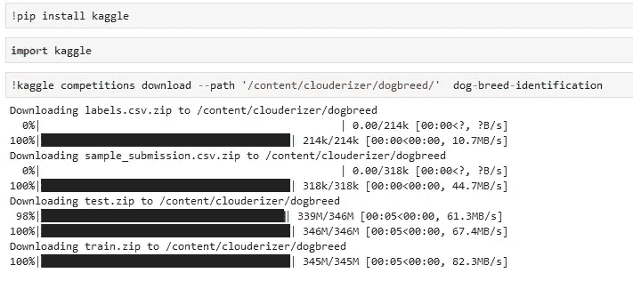**

**Downloading data done right**

**接下来，让我们导入所有必需的包:-**

**`[glob](https://www.npmjs.com/package/glob)`包将使用 shell 使用的模式匹配文件。在下面的代码中，我们可以看到 glob 有助于获取上述路径中的所有文件。在下面的要点中从第 7 行开始提到了输出。**

****2。检查 GPU 可用性并解压缩下载的文件****

**要确保 GPU 对您可用，请运行以下命令。这些应该返回 true。**

**Cuda done right**

**下载完所有文件后，下面的代码有助于解压这些文件。**

**unzipppp**

****3。使用熊猫熟悉数据****

**import PANDAS as 🐼**

**现在让我们检查数据。拉开 `train and test zip files`的拉链后，我们会知道它有 120 种狗的图片。`Sample_submission.csv` files 告诉我们竞赛在提交过程中期望的文件内容。让我们看看`labels.csv` 文件的内容。**

**它包含狗的所有图像的`image_id`和狗所属的`breed or labels`。`labels.csv`为训练和测试数据集中的图像提供品种。这种变通方法使生活变得更加轻松。**

**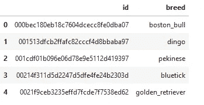**

**让我们检查一下一个特定品种有多少只狗。**

**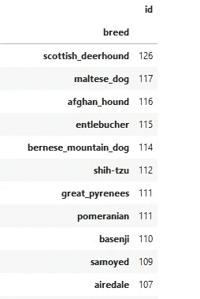**

**上面的输出显示了 120 种狗的品种，并以降序显示了对应于每种狗的图像数量。对不起，我不能在一张快照中容纳所有的品种。**

**通常，我们有一个训练、验证和测试数据集。我们在训练数据集上训练我们的模型，同时在验证数据集上预测它。这涉及到参数调整，以提高验证数据集的准确性。最后，当我们确信我们的模型是好的，我们用它来预测未知的数据集，即测试数据集。这个过程有助于防止过度拟合。**

**vaidation dataset done right**

**上面的第一行设置了 label.csv 文件的路径。第 2 行打开文件并计算数据集除标题之外的行数，因此减 1。这为我们提供了 csv 文件中的行数或图像数。第 3 行中的`get_cv_idxs(n)` 将随机返回 20%的数据，用作**验证数据集**。这将返回我们将用作验证数据集的文件的索引。让我们交叉核对这一个。**

**！！！似乎是合法的！！！验证数据集的大小实际上是总数据集大小的 20%。**

**现在，我们将使用预先训练好的`resnext_101_64` 架构来构建我们的模型。**

**当我写这篇博客的时候，fastai 库中没有预训练的`resnext_101_64`架构的权重，所以我们必须将其下载到这个位置`'/usr/local/lib/python3.6/dist-packages/fastai/weights'` ，然后运行我们的模型，否则它会抛出一个错误消息`weights not found` 。按照下面代码中解释的步骤进行操作。**

> **获得预训练模型权重的步骤**

*   **使用中提到的链接(第 3 行)将预训练模型下载到任何位置。**
*   **将其移动到上述位置。(第 20 行)**
*   **将上述位置作为您的当前目录。(第 23 行)**
*   **并解压文件。(第 27 行)**
*   **回到你存放数据的地方。(第 41 行)**

**resnext101 weights**

****注意:-** *将来，如果发生新的 fastai 代码更新，可能会考虑上述步骤，因此该步骤可能是可选的。***

**在继续下一步之前，决定图像的大小、使用的架构以及要考虑的批量大小。**

****4。按照 FASTAI 格式设置数据****

**为了按照 fastai 格式设置数据，我们编写以下代码。请注意，之前我们曾经为[狗与猫分类器](/fast-ai-season-1-episode-2-1-e9cc80d81a9d)做了`ImageClassfierData.from_paths()`，因为我们在单独的文件夹中指定了数据。在这种情况下，文件夹的名称就是标签的名称。**

**但是在这里，我们将数据(图像)呈现在 train 和 test 文件夹中，文件名汇总在`labels.csv`文件中。labels.csv 文件包含训练和测试数据集中每个图像的标签/品种，因此我们选择如下所示的`ImageClassfierData.from_csv(...)` 。**

****参数** `**ImageClassfierData.from_csv(...)**` **为:****

*   **`PATH`是数据的根路径(用于存储训练模型、预计算值等)。还包含所有的数据。**
*   **`'train'` —包含训练数据的文件夹。**
*   **`labels.csv`文件中有不同狗狗图片的标签。**
*   **`val_idxs` 有验证数据。它指示已经放入验证数据集中的 labels.csv 中的索引号。**
*   **`test_name='test'` 是`test` 数据集。**
*   **文件名实际上在末尾有一个`.jpg`，在`labels.csv`文件中没有提到，因此我们有`suffix=’.jpg’`。这将把`.jpg`添加到文件名的末尾。**
*   **`tfms` 是我们要申请的数据增强的转换。**

**上面已经创建了数据对象。使用`data` 对象，我们可以检查`train_ds`(训练数据集)。要知道使用数据对象还能访问什么，写`data.` 并按 tab 键。将出现一个下拉菜单，显示`data` 对象的属性。下面提到的`fnames` 告诉我们训练数据集中存在的文件名。**

**让我们检查图像是否位于正确的位置:-**

**图像的输出如下所示。正如我们所看到的，狗的图像占据了大部分的画面，因此不用担心变换(`tfms`)阶段的裁剪或缩放技术。**

**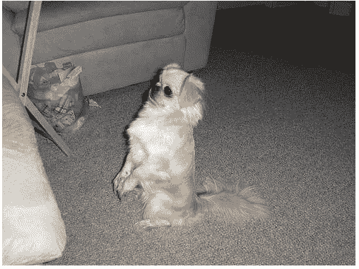**

**下面的第 6 行将文件名映射到文件的大小，并将其存储在`size_d`中。`size_d` 是一个字典，其中键是文件名，值是每个文件的维度。第 8 行有`zip(*)` 命令，帮助解压行和列，并保存在`row_sz` 和`col_sz`中。**

**图像的大小是:-**

**检查下面 1 号线`train dataset`和`test dataset` 以及 5 号线`number of data classes/dog breeds`和`what are the first five breed of dogs`的尺寸。**

**在进一步讨论之前，让我们检查一下我们正在建模的数据的维度。这只是为了检查的目的。因此:-**

**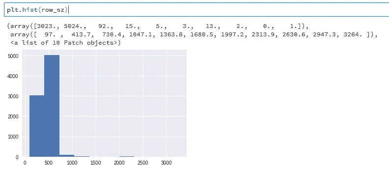**

**在上面的直方图中，我们可以看到，我们有 5000 个尺寸约为 500 像素的图像，很少有图像大于 1000 像素。在下面的直方图中，我们只检查尺寸低于 1000 像素的图像。它还显示了有多少特定尺寸的图像。**

**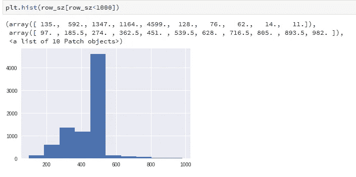**

****5。建立一个最先进的分类器。****

**等待结束了。最终呈现在你面前的是最先进的分类器。**

**对于最先进的分类器，需要遵循几个步骤。它们如下:**

> ****5.1)启用数据扩充并设置 PRECOMPUTE =TRUE。****

**出于一致性目的，让我们调整数据的大小。`get_data()`有正常的几行代码。第一个是`Setup data augmentation`，另一个是`Format your data` ，我们把 image_size 和 batch_size 传递给这个函数。当我们开始处理新的数据集时，如果我们先处理小图像，那么一切都会变得非常快。因此我们从尺寸`sz=224 and bs=64` 开始。之后我们可以增加尺寸。如果在增加大小时我们看到`Cuda Out of Memory error`，重启内核，将批处理大小设置为较小的值，然后再次运行。**

***现在让我们用 precompute=True* 设置神经网络:-**

**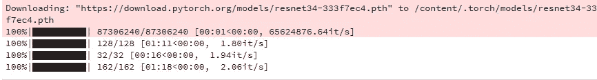**

**当使用`ConvLearner.pretrained(…)`声明架构时，预计算被设置为 True，这表示它实现了来自预训练网络的激活。预训练网络是已经学会识别某些事物的网络。对于我们的狗品种识别案例研究，使用的预训练网络(`RESNEXT101_64`)已经学会对 ImageNet 数据集中 120 万张图像的 1000 个类别进行分类。因此，采取倒数第二层(因为这是一层，有所有必要的信息来计算出图像是什么)，并保存这些激活。卷积神经网络有称为“激活”的东西激活是丰富的功能。激活是一个数字，表示“这个特性在这个地方，具有这个置信度(概率)”。为每个图像保存这些激活，这些被称为预计算激活。现在，当创建新的分类器时，利用这些预先计算的激活，并基于这些激活快速训练模型。因此要实现这个设置`precompute=True`。**

**预训练方法从`arch` 模型中创建我们的新神经网络。同时，它做如下两件事:-**

*   **它所做的是，它保留除最后一层之外的所有层(最后一层是输出层，在 Imagenet 的情况下，它给出 1000 个类别内的概率)。**
*   **最后一层被添加的几个层所取代，这些层以输出层结束，输出层给出了所有 120 种犬种的概率。**

**所以最初一切都是`frozen` 和`precompute=True`，因此我们所学的都是我们添加的图层。与`precompute=True` 一样，
数据增强没有做任何事情，因为我们每次都显示完全相同的激活。`precompute=True`所做的是预先计算图像有多少看起来像激活的东西。`Precomputed activations`是我们不打算训练的每个冻结层中使用的激活函数的输出。这有助于我们在最后加速新添加的完全连接层的训练。我们只预计算网络倒数第二层的激活。在所有层上执行都是存储密集型的。**

> ****5.2)使用** `**lr_find()**` **找到损失仍在明显改善的最高学习率****

**以下命令有助于找到最佳学习率。**

**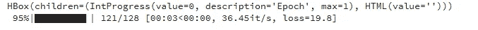**

**该命令产生如下图所示的图形，该图显示了学习率随着迭代次数的增加而增加的事实。**

**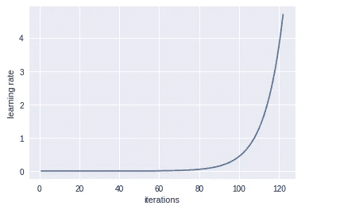**

**该命令绘制了损耗与学习率的关系，给出的结果表明，随着学习率的增加，损耗达到最小值，然后出现一个点，在该点之后，损耗超过最小值，因此损耗变得更大。因此，我们必须选择一个与最小损失相对应的学习率。但是此时的学习率已经太高了，所以我们从学习率表上的最小损失点后退一步，选择它作为最佳学习率。这里是`0.01`。**

**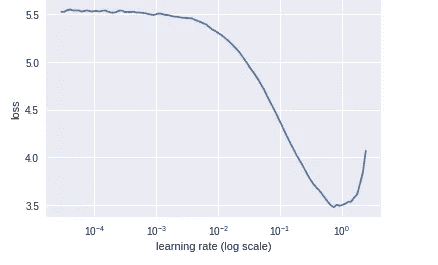**

> **5.3) **从几个时期的预计算激活中训练最后一层。****

**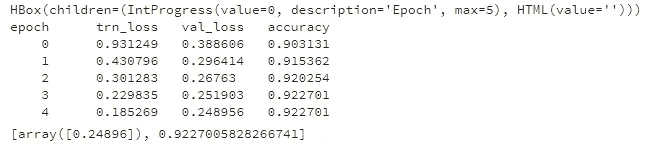**

**这里，我们选择最佳学习率(`0.01`)并训练 NN 的最后一层(因为预计算=真且第一层被冻结)，即它们的权重将被更新，以最小化模型的损失。使用这种技术，我们达到了`92%`的精度。但是有一点点过度拟合，因为我们的验证损失大于训练损失。为了避免这种情况，我们引入了`Dropout` 、`Data Augmentation`和`training on larger images`。**

> **5.4) **在 CYCLE_LEN=1 的 2-3 个历元内，训练最后一层的数据扩充。****

*   ****辍学****

**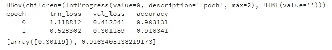**

**`ps` 是漏失参数。它指的是随机丢弃 50%的神经元。这有助于神经网络防止过度学习，从而防止过度拟合。正如我们可以看到的，此时我们的精度已经下降到了`91.6%`，但好消息是我们的验证损失小于训练损失，这是一个明确的迹象，表明我们没有过度拟合。**

*   ****数据扩充****

**为了进一步改进模型，我们需要更多的数据，因此通过设置`learn.precompute=False`打开数据扩充。通过设置`precompute=False,`,我们仍然只训练我们在最后添加的层，因为它被冻结了，但是数据增加现在正在工作，因为它实际上从头开始经历和重新计算所有的激活。cycle_len 的概念在[上一集](https://medium.com/@GeneAshis/fast-ai-season-1-episode-2-1-e9cc80d81a9d)已经详细讨论过了。**

**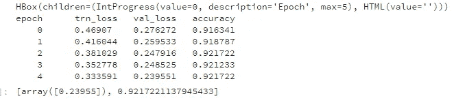**

**后**数据增加**我们看到`92.17%`的精确度增加，没有任何过度拟合。**

****注意:-** An `epoch` 是一次通过数据，a `cycle` 是一个周期中出现的时期数。所以这里 cycle 基本上和 epoch 是一样的。**

*   ****在较大的图像上训练是防止过度拟合的最好方法。****

**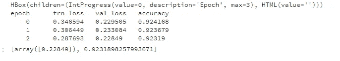**

**现在我们看到了拟合不足的情况，因为验证损失比训练损失低得多。我们的主要目标应该是使 val_loss 和 trn_loss 尽可能接近，同时注意精度。**

**`Cycle_len=1`可能太短了。让我们设置`cycle_mult=2`以找到更好的参数。这将有助于防止不合身。当我们拟合不足时，这意味着`cycle_len=1`太短(在它有机会放大并选择最佳参数之前，学习率被重置)。`cycle_mult`的概念已经在[这里详细讨论过](https://medium.com/@GeneAshis/fast-ai-season-1-episode-2-1-e9cc80d81a9d)。**

**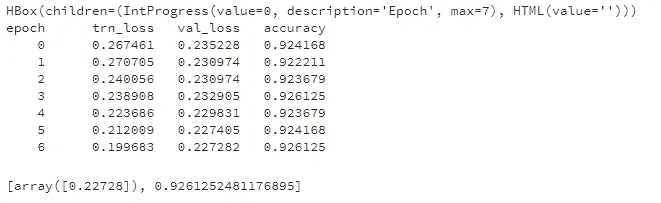**

**让我们为更多的时代训练它。**

**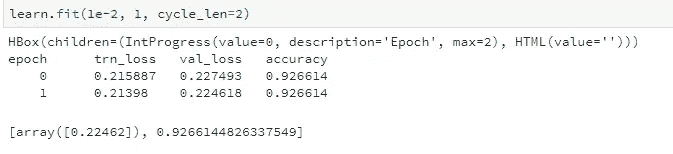**

**！！！但是等等！！！**

**如果您仔细观察输出，我们的 val_loss 仍然略高于 trn_loss。这是否意味着它的过度拟合，对我们的神经网络有害。让我们来听听专家的意见，看看为什么一点点过度拟合是好的。查看下面的链接。**

** [## 确定你什么时候过度适应，什么时候不适应，什么时候刚刚好？

### 过拟合 if:训练损失>验证损失恰到好处 if 训练损失~验证损失问题:我们应该如何…

forums.fast.ai](http://forums.fast.ai/t/determining-when-you-are-overfitting-underfitting-or-just-right/7732/5?u=ashis) 

除此之外，这个数据集类似于 ImageNet 数据集。所以训练卷积层帮助不大。因此，我们不打算解冻所有的层。最后，我们正在做`TTA` ( [测试时间增加](https://medium.com/@GeneAshis/fast-ai-season-1-episode-2-1-e9cc80d81a9d))并得到预测概率。

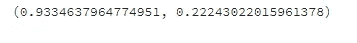

在最后一步，我们计算精度和损失。很高兴看到我们的模型在测试数据集上获得了`93.3%`的准确性，这简直是**令人兴奋的**。

这就是我们如何得到最先进的结果，我的朋友。

附:随着我继续学习其他课程，这篇博文将会更新和改进。如果你对源代码感兴趣，请点击 *查看* [*。*](https://github.com/CaptainAshis/Deep_Learning-Experiment/blob/master/Dog%20Breed%20Identification%20Kaggle/dog_breed_updated.ipynb)

**甲乙丙** - *一直在鼓掌。👏 👏👏👏👏*😃😃😃😃😃😃😃😃😃*👏 👏👏👏👏 👏*

感谢大卫·罗宾逊的激励😃😃😃😃😃😃

为了充分利用这个博客系列，请按照以下顺序随意探索这个系列的第一部分

1.  [狗 Vs 猫图像分类](/fast-ai-season-1-episode-2-1-e9cc80d81a9d)
2.  [犬种图像分类](/fast-ai-season-1-episode-2-2-dog-breed-classification-5555c0337d60)
3.  [多标签图像分类](/fast-ai-season-1-episode-3-a-case-of-multi-label-classification-a4a90672a889)
4.  [利用神经网络进行时间序列分析](/fast-ai-season-1-episode-4-1-time-series-analysis-a23217418bf1)
5.  [IMDB 电影数据集上的 NLP 情感分析](https://geneashis.medium.com/nlp-sentiment-analysis-on-imdb-movie-dataset-fb0c4d346d23)
6.  [电影推荐系统的基础](/fast-ai-season-1-episode-5-1-movie-recommendation-using-fastai-a53ed8e41269)
7.  [从零开始协同过滤](/fast-ai-season-1-episode-5-2-collaborative-filtering-from-scratch-1877640f514a)
8.  [使用神经网络的协同过滤](/fast-ai-season-1-episode-5-3-collaborative-filtering-using-neural-network-48e49d7f9b36)
9.  [像尼采一样写哲学](https://geneashis.medium.com/fast-ai-season-1-episode-6-1-write-philosophy-like-nietzsche-using-rnn-8fe70cfb923c)
10.  [不同神经网络在 Cifar-10 数据集上的性能](https://geneashis.medium.com/fast-ai-season-1-episode-7-1-performance-of-different-neural-networks-on-cifar-10-dataset-c6559595b529)
11.  [检测图像中最大物体的 ML 模型 Part-1](https://medium.com/hackernoon/single-object-detection-e65a537a1c31)
12.  [检测图像中最大物体的 ML 模型 Part-2](https://medium.com/hackernoon/single-object-detection-part-2-2deafc911ce7)

如果您有任何问题，请随时联系 [fast.ai 论坛](http://forums.fast.ai/)或 Twitter:[@ ashiskumarpanda](https://twitter.com/ashiskumarpanda)**