# “多标签图像分类的一个例子”

> 原文：<https://towardsdatascience.com/fast-ai-season-1-episode-3-a-case-of-multi-label-classification-a4a90672a889?source=collection_archive---------6----------------------->

## 建立一个最先进的多标签图像分类器。


欢迎来到第三集 [Fastdotai](http://www.fast.ai/) ，在这里我们将接手**多标签分类**的案例。在我们开始之前，我想感谢 [**【杰瑞米·霍华德】**](https://twitter.com/jeremyphoward) 和 [**雷切尔·托马斯**](https://twitter.com/math_rachel) 为民主化人工智能所做的努力。

为了充分利用这个博客系列，请按照以下顺序随意探索这个系列的第一部分

1.  [狗 Vs 猫图像分类](/fast-ai-season-1-episode-2-1-e9cc80d81a9d)
2.  [犬种图像分类](/fast-ai-season-1-episode-2-2-dog-breed-classification-5555c0337d60)
3.  [多标签图像分类](/fast-ai-season-1-episode-3-a-case-of-multi-label-classification-a4a90672a889)
4.  [使用神经网络的时间序列分析](/fast-ai-season-1-episode-4-1-time-series-analysis-a23217418bf1)
5.  [IMDB 电影数据集上的自然语言处理情感分析](https://geneashis.medium.com/nlp-sentiment-analysis-on-imdb-movie-dataset-fb0c4d346d23)
6.  [电影推荐系统的基础](/fast-ai-season-1-episode-5-1-movie-recommendation-using-fastai-a53ed8e41269)
7.  [从零开始协同过滤](/fast-ai-season-1-episode-5-2-collaborative-filtering-from-scratch-1877640f514a)
8.  [使用神经网络的协同过滤](/fast-ai-season-1-episode-5-3-collaborative-filtering-using-neural-network-48e49d7f9b36)
9.  [像尼采一样写哲学](https://geneashis.medium.com/fast-ai-season-1-episode-6-1-write-philosophy-like-nietzsche-using-rnn-8fe70cfb923c)
10.  [不同神经网络在 Cifar-10 数据集上的性能](https://geneashis.medium.com/fast-ai-season-1-episode-7-1-performance-of-different-neural-networks-on-cifar-10-dataset-c6559595b529)
11.  [检测图像中最大物体的 ML 模型 Part-1](https://medium.com/hackernoon/single-object-detection-e65a537a1c31)
12.  [ML 模型检测图像中最大的物体 Part-2](https://medium.com/hackernoon/single-object-detection-part-2-2deafc911ce7)

没看过前几集的，请点击这里查看 [2.1](https://medium.com/@GeneAshis/fast-ai-season-1-episode-2-1-e9cc80d81a9d) 、 [2.2](/fast-ai-season-1-episode-2-2-dog-breed-classification-5555c0337d60) 。

今天我们将处理**多标签分类**，这里我们有多个标签作为目标变量。在深入**多标签分类**之前，我们先了解:-

> **CNN(卷积神经网络)是如何工作的？**

CNN 架构有不同的部分。让我们详细地讨论它们，之后，我们将把它们结合起来，详细地讨论 CNN 的架构。所以让我们从输入开始，也就是图像

1.  **图像:-**

最初，我们有一个图像。图像实际上是一个数字网格。看起来像这张图片

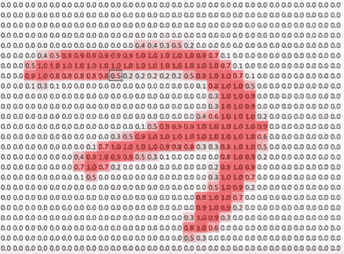

This is how a gray-scale image representing # 7 looks like . The pixel values has been standardized between 0 and 1.

**2。内核/过滤器:-**

在图像的顶部，我们有一个内核。在这种情况下，核/过滤器是 3d 张量的 3×3 切片，有助于我们执行卷积。

这个 3 乘 3 切片内核在图像上滑动，并产生特征图。

3.**激活:-**

特征图由激活组成。激活是一个数字，计算方法如下

*   取相同维度的输入切片。
*   确保您的内核与输入片段的维度相同。
*   将步骤 1 中得到的输入与步骤 2 中得到的内核进行逐元素相乘
*   然后总结一下。
*   它产生一个数字，比如“N”。
*   在此基础上应用 ReLu(校正线性单位)激活功能。基本上 ReLu 就是`max(0,N).`的意思
*   我们得到的数字被称为“激活”。

4.**张量:-**

假设我们的网络经过了训练，在训练结束时，它已经创建了一个卷积滤波器，其核值已经学会识别垂直和水平边缘。Pytorch 不会将这些过滤器值保存为两个不同的 9 位数组。它将值存储为张量。张量是一个高维数组。张量有一个额外的轴，可以帮助我们把这些过滤器堆叠在一起。

**5。隐藏层:-**

除了输入层和输出层之外的所有层都称为隐藏层。构成激活图的层就是这样一个隐藏层。它一般被命名为 **Conv1** 和 **Conv2 和**是核卷积的结果。

然后我们得到了一个非重叠的 2 乘 2 最大池。它通过高度和宽度将分辨率减半。一般命名为 **Maxpool** 。

除此之外，我们还有**密集层/全连接层**。对于 max-pool 层中出现的每一个激活，我们创建一个权重，对应于被称为**的全连接层。**然后对每一个权重的每一次激活做一个和积。这将产生一个单一的数字。

**使用额外全连接层的缺点** :-这会导致过度拟合，也会降低处理速度。

**注意:-内核的尺寸和图像/激活图的切片的尺寸应该总是相同的。对于多通道输入，创建多通道内核。这有助于更高维的线性组合。**

**内核值是如何更新的？**

基本上，我们从一些随机核值开始，然后在训练期间使用随机梯度下降来更新核值，以便使核中的值有意义。以这种方式，在几个时期之后，我们到达初始层内核正在检测边缘、角的位置，并且随后更高层内核正在学习识别更重要的特征。

> **我对使用 KERAS 对 MNIST 数据集进行分类的简单 CNN 的看法**

> **代表代码的简图(概括地说是 CNN)**

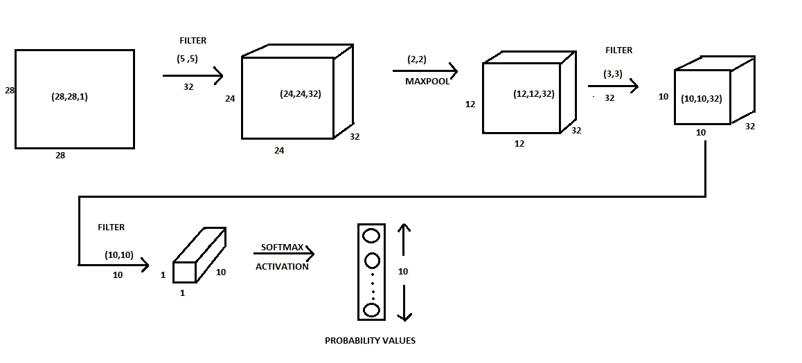

CNN in detail

所以我们从(28，28，1)输入图像开始。

1.  我们使用过滤器/内核来减少或增加激活图的深度/宽度，并减少激活图的高度和宽度。当我们用 32 个维数为(5，5)的核卷积维数为(28，28，1)的输入图像时，我们得到(24，24，32)的输出。
2.  使用{(n-f+1)，(n-f+1)，(#Kernels)}计算输出维度，其中

*   n=图像尺寸
*   f =内核维数
*   #内核数=内核数
*   所以我们得到{(28–3+1)，(28–3+1)，(#Kernels)}=(24，24，32)

**3。**我们在深度学习中使用非线性函数/ReLU 激活函数。但是为什么呢？看看下面这个 Quora 帖子。

[](https://www.quora.com/Why-does-deep-learning-architectures-only-use-the-non-linear-activation-function-in-the-hidden-layers) [## 为什么深度学习/架构只使用隐藏的非线性激活函数…

### 回答(第 1 题，共 9 题):“为什么使用非线性激活函数？”在没有非线性激活函数的情况下，神经网络…

www.quora.com](https://www.quora.com/Why-does-deep-learning-architectures-only-use-the-non-linear-activation-function-in-the-hidden-layers) 

**4。**发帖称，我们使用最大池将内核的高度和宽度减少了 2 倍。

*   因此，激活图(24，24，32)减少到(12，12，32)。

**5。**这个(12，12，32)激活图与 32 个维数为(3，3)的核以及现在的输出维数按照公式{(n-f+1)，(n-f+1)，(#核)} = {(12–3+1)，(12–3+1)，32}=(10，10，32)进行卷积。

6。这个(10，10，32)激活图与 10 个具有维度(10，10)的核进行卷积，现在输出维度按照公式

{(n-f+1)，(n-f+1)，(# Kernels)} = {(10–10+1)，(10–10+1)，10}=(1，1，10)。

**7。**最后，我们已经达到了激活的(1，1，10)维。这是倒数第二层。它吐出 10 个随机数。

**8。**然后我们在此基础上使用 softmax 激活将数字转换成概率。

**9。**[**soft max Activation**](https://jamesmccaffrey.files.wordpress.com/2016/03/softmaxequation.jpg?w=640)返回范围从(0，1，2，3，…9)的 10 个数字的概率值，并且它还倾向于特别强烈地拾取一个事物。Softmax 只出现在最后一层。这些将是我们的**预测值**。因为这些是概率值，所以结果是 1。我们将把这些预测值与我们的目标值进行比较。请检查上述附加代码(keras.ipynb)的第 9 行，以了解目标值如何保存在**一个热编码**表单中。**数字 5** 表示如下。

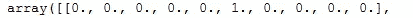

**10。**之后，我们将使用**损失函数**尽量减少 10 个预测值和 10 个目标值之间的损失。为了计算损失函数，我们使用**梯度下降的概念**。使用梯度下降保持更新参数/内核值。

11。最后，考虑最小损耗点对应的参数。并且在对测试数据集进行预测期间使用这些参数/核值。这是**单一标签分类**的概念，如狗对猫或狗的品种分类。现在我们来看一个**多标签分类**的案例。

多标签分类的最好例子是 kaggle 竞赛[星球:从太空了解亚马逊](https://www.kaggle.com/c/planet-understanding-the-amazon-from-space/data)。所以让我们分两步来做。

1。 **下载数据，导入所需的包。**

使用以下命令**下载**数据

```
! pip install kaggle 
import kaggle
! kaggle competitions download -c planet-understanding-the-amazon-from-space
!pip install fastai==0.7.0
!pip install torchtext==0.2.3!pip3 install http://download.pytorch.org/whl/cu80/torch-0.3.0.post4-cp36-cp36m-linux_x86_64.whl 
!pip3 install torchvision
```

导入包并检查目录中是否存在这些文件

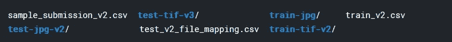

`train_v2.csv` file 具有训练数据集中存在的文件的名称以及对应于它们的`labels` 。

2。 **用熊猫熟悉数据**

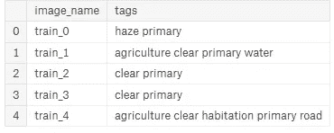

> **单标签和多标签分类的区别**

在单一标签分类中，图像是猫或狗，如下图所示

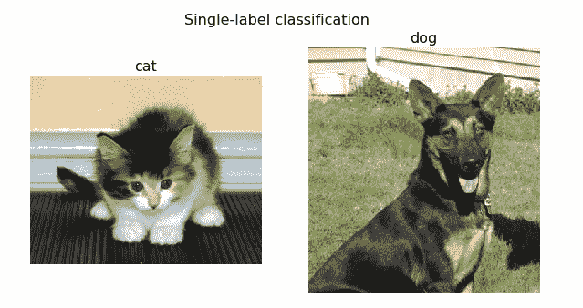

让我们检查多标签分类:-

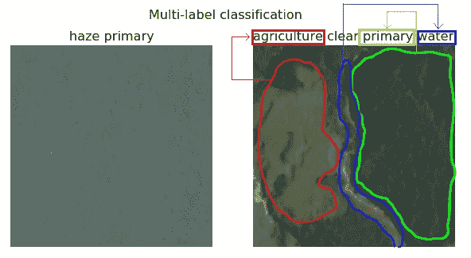

正如我们可以看到的输出，在多标签分类的情况下，图像被分为两部分

*   **天气**——资料中提到的天气有很多种。从中我们可以看到上面快照中的**霾**和**晴**。
*   **要素**—上图中的要素列表为**主要、农业、水。**

**原生**代表原生雨林。

**农业**代表用于农业用地的空地。

**水**代表河流或湖泊。

基本上，在多标签分类中，每个图像属于一个或多个类别。在上面的例子中，第一幅图像属于两类:**霾**和**原生**雨林。第二幅图像属于 4 类:**初级**、**清晰、农业**和**水**。Softmax 不是一个很好的分类这些图像的激活函数，因为它倾向于将一个图像分为一个类别，而不是多个类别。因此，Softmax 适用于单标签分类，不适用于多标签分类。

**Fastai 在** `**train_v2.csv**` **文件中查找标签，如果发现任何样品有一个以上的标签，它会自动切换到多标签模式。**

如[第 2.2 集](/fast-ai-season-1-episode-2-2-dog-breed-classification-5555c0337d60)所述，我们创建了一个占训练数据集 20%的验证数据集。下述命令用于创建验证数据集:-

3。 **获取 FASTAI 格式的数据**

这些步骤与我们在前两集所做的相同。`get_data(sz)`有两行代码:-

*   tfms_from_model 有助于数据扩充。`aug_tfms=transforms_up_down`表示垂直翻转图像。它实际上做的不止这些。正方形图像实际上有 8 种可能的对称性，这意味着它可以旋转 0、90、180、270 度，并且可以翻转其中的每一种。这是我们对正方形对称性所能做的一切的完整列举。它被称为`dihedral` 集团。这段代码将完成完整的 8 组翻转，即`dihedral` 组旋转和翻转加上小的 10 度旋转，一点缩放，一点对比度和亮度调整。要了解更多信息，请查看`fastai` 文件夹中的`transforms.py`文件。下面附上了`transforms.py`中执行二面角旋转的片段。请检查我们在`transforms.py`文件中应用的其他转换。

*   **参数** `**ImageClassfierData.from_csv(...)**` **为:**

它有助于按照 fastai 格式读取文件。

*   `PATH`是数据的根路径(用于存储训练模型、预计算值等)。还包含所有的数据。
*   `'train'` —包含训练数据的文件夹。
*   `labels.csv`文件有行星图像的标签。
*   `val_idxs` 有验证数据。它指示已经放入验证数据集中的 labels.csv 中的索引号。
*   `test_name='test'` 是`test` 数据集。
*   文件名实际上在末尾有一个`.jpg`，在`labels.csv`文件中没有提到，因此我们有`suffix=’.jpg’`。这将把`.jpg`添加到文件名的末尾。
*   `tfms` 是我们要申请的数据增强的转换。
*   `bs`= 64 张图像的批量大小。

**py torch 中数据加载器与数据集的概念:-**

我们在之前的[剧集](/fast-ai-season-1-episode-2-1-e9cc80d81a9d)中遇到的数据集将返回单个图像，而数据加载器将返回一小批图像。我们只能得到下一个小批量。为了将数据加载器转换成迭代器，我们使用了一个标准的 python 函数 iter。那是一个迭代器。要获取下一个迷你批次，请将 iter 传递给 next。它将返回下一批图像和标签。下文对此进行了描述

```
x,y = next(iter(data.val_dl))
y
```

上述命令是一个**验证集数据加载器**，将返回一个**图像和标签的小批量**。`y`标签给出了下面的输出

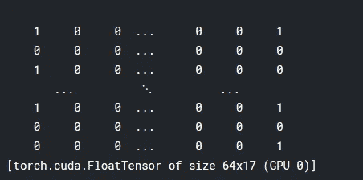

正如我们所看到的，在这 64 个样品的小批量中有 17 个标签。在上面的`get_data(bs)`函数中已经明确提到了`bs=64` 。要理解这些热编码标签的含义，请查看下面的代码

```
list(zip(data.classes, y[0]))
```

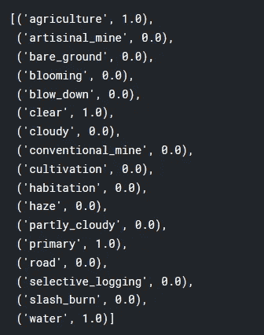

data.classes 具有实际的标签名称，而`y[0]`给出了特定样本所属的所有标签的名称。如上所示，输出表示第一幅图像具有标签**农业、清洁、初级**和**水**。标签的一个热编码表示已经在下面的图像中被表示。标签的一次性编码由 Pytorch 框架在内部处理。

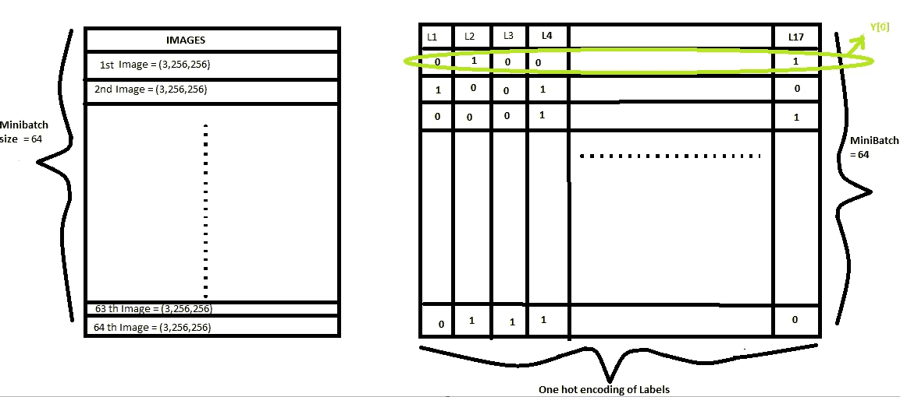

Data Representation

这个标签的热编码表示是**实际**值。神经网络提取 17 个这样的值(在这种情况下),这些值被称为**预测值**。我们使用损失函数和梯度下降的概念来最小化**实际**和**预测**值之间的误差。

在某些情况下，图像不是那么清晰。在这种情况下，为了掌握图像的所有特征，可以使用 1.5/1.6/1.7 的倍增系数来增加图像的亮度，如下所示。

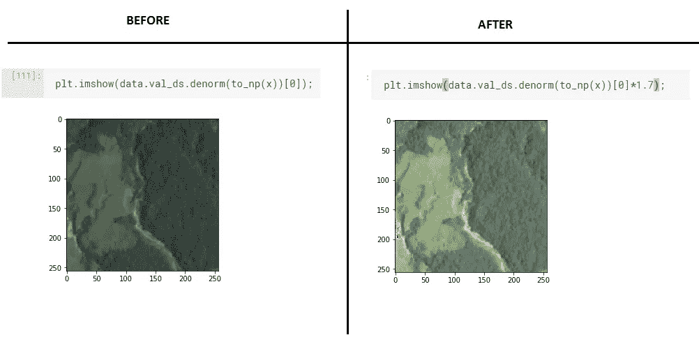

使用这些行星数据的最大好处是它与 ImageNet 不同。在现实世界中处理数据时，我们没有类似于 ImageNet 数据集的数据。

这里，我们首先将数据大小调整为(64，64)而不是原始大小(256，256)。我们不会在狗与猫分类的情况下开始这么小，因为预训练的 resnet 网络开始时几乎完美，所以如果我们将所有东西的大小调整为(64，64)并重新训练权重，它将破坏先前预训练为好的权重。大多数 ImageNet 模型是在(224，224)或(299，299)之上训练的。我们开始这么小的主要原因是 ImageNet 图像与这个星球竞赛数据集不相似。已经在 ImageNet 数据集上训练的 Resnet 网络的主要收获是可以检测边缘、拐角、纹理和重复图案的初始层。

它是这样工作的

获取所需大小的数据，即(64，64)。

```
sz=64
data = get_data(sz)
data = data.resize(int(sz*1.3), '/tmp')
```

4。 **设置神经网络，寻找最佳学习率**

```
from planet import f2metrics=[f2]
f_model = resnet34learn = ConvLearner.pretrained(f_model, data, metrics=metrics) 
```

f2 指标将在这篇博文的后面讨论。此外，在这个模型中，由于没有提到`precompute=True`，因此默认情况下它采用`precompute=False`。要了解这一点，点击`shift+Tab`，它将显示所有参数及其默认值。在这个时间点当`precompute=False` ，

*   我们的数据扩充是在的**。**
*   倒数第二层之前的所有层都被**冻结**。
*   在倒数第二层之后，我们将**额外完全连接的** **层**附加到最后，然后我们就有了最终输出。

现在，让我们来看看最好的学习率发现者。

```
lrf=learn.lr_find()
learn.sched.plot()
```

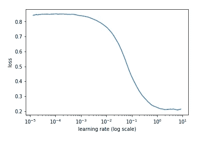

正如我们在**损失** **对学习率**的图表中看到的，最佳学习率可以接近 0.2。怎么会？

*   如前所述，y 轴上的损失在 0.2 处最小，对应的学习率在 x 轴上是 10⁰ =1。
*   正如前面讨论的，我们可以在损失最小的点之前获得最佳学习率，因此是 0.2。

现在使用最好的学习率`0.2`，让我们训练我们的模型，如下面的代码所示。

5。 **从几个时期的预计算激活中训练最后一层。**

```
lr = 0.2
learn.fit(lr, 3, cycle_len=1, cycle_mult=2)
```

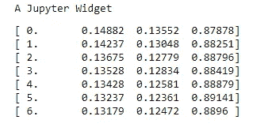

`Cycle_len` 和`Cycle_mult` 的概念在[第 2.1 集](/fast-ai-season-1-episode-2-1-e9cc80d81a9d)中已经详细讨论过了。到目前为止，我们只训练我们最后连接的额外的完整层。

训练所有的层直到最后，

*   为层的子集设置不同的学习率。
*   解冻冻结层。
*   开始训练所有层。

要学习一组不同的特征或告诉学习者需要改变卷积滤波器，只需`**unfreeze**` 所有层。**冻结的**层是其权重没有被训练或更新的层。要了解解冻和冻结图层的工作原理，请查看第 2.1 集。由于行星竞赛中的图像不同于 ImageNet 数据集:-

*   所以学习率高。
*   而且前面几层比后面几层需要学的更多。

6。解冻层并训练所有层。

```
lrs = np.array([lr/9,lr/3,lr])
learn.unfreeze()
learn.fit(lrs, 3, cycle_len=1, cycle_mult=2)
```

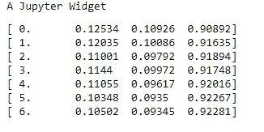

下面我们可以看到，在每一个周期后，损失大幅下降。

```
learn.save(f’{sz}’)
learn.sched.plot_loss()
```

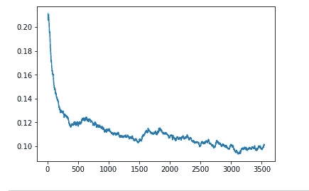

7。 **改进我们的模型，防止过度拟合:-**

从现在开始，我们将把图像尺寸增加到(128，128)并进一步增加到(256，256)以便

*   减少过度拟合。
*   减小 **trn_loss** 和 **val_loss 之间的间隙。**
*   训练神经网络的早期层(通过**解冻**它们),因为预训练的权重来自 ImageNet 模型，该模型与行星竞争数据集没有太多相似之处。

```
sz=128
learn.set_data(get_data(sz))
learn.freeze()
learn.fit(lr, 3, cycle_len=1, cycle_mult=2)
```

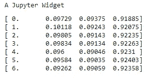

```
learn.unfreeze()
learn.fit(lrs, 3, cycle_len=1, cycle_mult=2)
learn.save(f'{sz}')
```

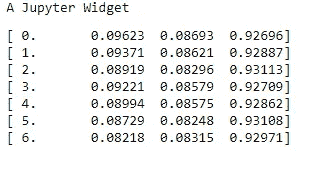

```
sz=256
learn.set_data(get_data(sz))
learn.freeze()
learn.fit(lr, 3, cycle_len=1, cycle_mult=2)
```

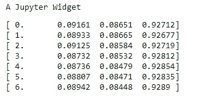

```
learn.unfreeze()
learn.fit(lrs, 3, cycle_len=1, cycle_mult=2)
learn.save(f'{sz}')
```

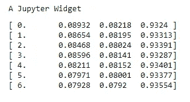

最后我们做一个 TTA( [**测试时间扩增**](/fast-ai-season-1-episode-2-2-dog-breed-classification-5555c0337d60) )来得到。

```
multi_preds, y = learn.TTA()
preds = np.mean(multi_preds, 0)
f2(preds,y)
```

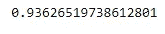

Accuracy

***瞧，我们得到一个*** `***93.6%***` ***的准确度，这对于多标签分类来说太好了。***

***如果你陪我到这一步，给自己一个击掌。***

***？？？？？？？？？？有问题的，请举手？？？？？？？？？？***

??? ???

**Qs 1:-下面的命令中** `**data.resize()**` **是做什么的？**

```
data = data.resize(int(sz*1.3), '/tmp')
```

如果初始输入是(1000，1000 ),那么读取该 jpeg 并将其大小调整为(64，64)比训练 convnet 每批所花费的时间要多。resize 的作用是，它表示不会使用任何大于 sz*1.3 的图像。所以仔细检查并创建新的`size=sz*1.3`的 jpegs。这一步不是必需的，但它加快了进程。

**问题 2:-为什么行星卫星图像竞赛中这里使用的度量是** `**f2**` **而不是精度？**

有很多方法可以将我们在狗和猫的分类中看到的混淆矩阵转化为准确度分数。那些是

*   精确
*   回忆
*   f-β

根据这个竞赛标准，准确性是根据 f-Beta 分数来判断的。在 f-Beta 评分中，Beta 表示你对假阴性和假阳性的权重是多少？在 f-β中，β值是 2。当我们建立神经网络时，我们将它作为一个`metrics` 来传递。查看下面的代码。

```
from planet import f2metrics=[f2]
f_model = resnet34learn = ConvLearner.pretrained(f_model, data, metrics=metrics)
```

**Qs 3:-多标签和单标签分类的区别？**

单标签分类问题的输出激活函数是 Softmax。但是如果我们必须预测特定图像中的多个标签，如下文最后一列所示

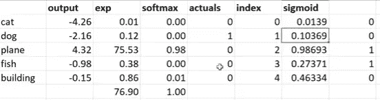

那么 Softmax 是一个可怕的选择，因为它有强烈选择特定标签的倾向。对于多标签分类问题，我们使用的激活函数是 **Sigmoid。**fastai 库如果观察到多标签分类问题，会自动切换到 Sigmoid。Sigmoid 公式是 e^x/(1+e^x)。Sigmoid 图看起来像:-

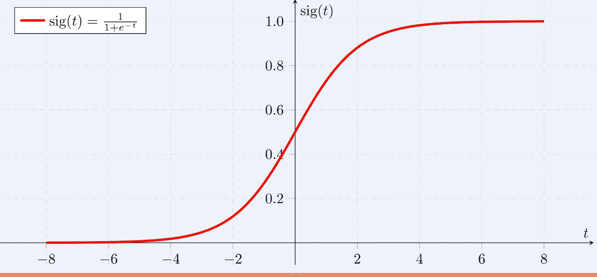

基本上，Sigmoid 图表示的是，如果激活小于 0.5，则 Sigmoid 将返回低概率值，如果激活大于 0.5，则 Sigmoid 将返回高概率值。多件事怎么可能有高概率。

**问题 4:-蛋鸡训练如何进行？**

这些层次非常重要，但其中预先训练的权重并不重要。所以最想训练的是后面几层。早期的层已经接近我们想要的，即检测边缘和角落。

因此，在狗与猫的情况下，当我们从预训练的模型创建模型时，它会返回一个模型，其中所有卷积层都被冻结，一些随机设置的完全连接层被添加到末端并被解冻。所以当我们说 fit 的时候，首先，它在最后训练随机初始化的全连接层。如果某样东西真的很接近 Imagenet 数据集，那往往就是我们需要的。因为早期的层已经善于发现边缘、梯度、重复图案等。然后，当我们解冻时，我们将早期层的学习速率设置得非常低，因为我们不想对它们进行太多的更改。

而在卫星数据中，早期的层似乎比后期的层更好，但我们仍然需要对它们进行相当大的改变，这就是为什么我们的学习速率比最终的学习速率小 9 倍，而不是像前一种情况那样小 1000 倍。

**问题 5:-为什么我们不能直接从解冻所有层开始？**

我们可以做到，但是需要更多的时间。首先，通过解冻最终层并保持初始层冻结，我们正在训练最终层学习更重要的功能。卷积层包含预先训练的权重，因此它们不是随机的。对于那些接近 ImageNet 的东西，它们真的很好，但是如果它们不接近 ImageNet，它们总比没有好。我们所有的 FC 层都是完全随机的，因此你总是想通过先训练它们来使完全连接的层比随机层更好，因为否则如果你直接去解冻，那么我们将在早期层权重仍然随机时摆弄早期层权重。

需要记住的几点是

*   **训练就是更新核值的权重和 FC 层的权重。根据权重和先前层激活输出来计算激活。**
*   `**learn.summary()**` **命令用来可视化模型。**

*如果你喜欢，那么****ABC****(****永远被击节*** *)。* ***👏 👏👏👏👏*😃😃😃😃😃😃😃😃😃*👏 👏👏👏👏👏*** *)*

如果您有任何问题，请随时在 [fast.ai 论坛](http://forums.fast.ai/)或 Twitter 上联系: [@ashiskumarpanda](https://twitter.com/ashiskumarpanda)

*附:随着我继续学习其他课程，这篇博文将会更新和改进。如果你对源代码感兴趣，可以在这里查看*[](https://github.com/CaptainAshis/Deep_Learning-Experiment/blob/master/Planet%20Earth%20Competition/Amazonian-multi-label.ipynb)**。**

*为了充分利用这个博客系列，请按照以下顺序随意探索这个系列的第一部分:- [狗和猫的图像分类](/fast-ai-season-1-episode-2-1-e9cc80d81a9d)*

1.  *[犬种图像分类](/fast-ai-season-1-episode-2-2-dog-breed-classification-5555c0337d60)*
2.  *[多标签图像分类](/fast-ai-season-1-episode-3-a-case-of-multi-label-classification-a4a90672a889)*
3.  *[使用神经网络的时间序列分析](/fast-ai-season-1-episode-4-1-time-series-analysis-a23217418bf1)*
4.  *[对 IMDB 电影数据集的 NLP 情感分析](https://geneashis.medium.com/nlp-sentiment-analysis-on-imdb-movie-dataset-fb0c4d346d23)*
5.  *[电影推荐系统基础](/fast-ai-season-1-episode-5-1-movie-recommendation-using-fastai-a53ed8e41269)*
6.  *[从零开始协同过滤](/fast-ai-season-1-episode-5-2-collaborative-filtering-from-scratch-1877640f514a)*
7.  *[使用神经网络的协同过滤](/fast-ai-season-1-episode-5-3-collaborative-filtering-using-neural-network-48e49d7f9b36)*
8.  *[像尼采一样写哲学](https://geneashis.medium.com/fast-ai-season-1-episode-6-1-write-philosophy-like-nietzsche-using-rnn-8fe70cfb923c)*
9.  *[不同神经网络在 Cifar-10 数据集上的性能](https://geneashis.medium.com/fast-ai-season-1-episode-7-1-performance-of-different-neural-networks-on-cifar-10-dataset-c6559595b529)*
10.  *[检测图像中最大物体的 ML 模型 Part-1](https://medium.com/hackernoon/single-object-detection-e65a537a1c31)*
11.  *[检测图像中最大物体的 ML 模型 Part-2](https://medium.com/hackernoon/single-object-detection-part-2-2deafc911ce7)*

*编辑 1:-TFW·杰瑞米·霍华德同意你的帖子。💖💖 🙌🙌🙌 💖💖。*