# “使用神经网络进行时间序列分析”

> 原文：<https://towardsdatascience.com/fast-ai-season-1-episode-4-1-time-series-analysis-a23217418bf1?source=collection_archive---------6----------------------->

## 使用神经网络建立一个先进的时间序列预测模型。

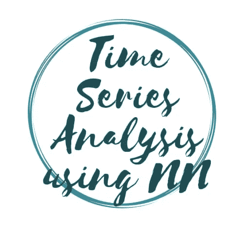

欢迎来到第四集 [Fastdotai](http://www.fast.ai/) ，在这里我们将处理**结构化和时间序列数据**。在我们开始之前，我想感谢 [**【杰瑞米·霍华德】**](https://twitter.com/jeremyphoward) 和 [**雷切尔·托马斯**](https://twitter.com/math_rachel) 为民主化人工智能所做的努力。

为了充分利用这个博客系列，请按照以下顺序随意探索这个系列的第一部分:- [狗和猫的图像分类](https://machinelearningmarvel.in/dogs-vs-cats-image-classifier/)

1.  [狗 Vs 猫图像分类](/fast-ai-season-1-episode-2-1-e9cc80d81a9d)
2.  [犬种图像分类](/fast-ai-season-1-episode-2-2-dog-breed-classification-5555c0337d60)
3.  [多标签图像分类](/fast-ai-season-1-episode-3-a-case-of-multi-label-classification-a4a90672a889)
4.  [利用神经网络进行时间序列分析](/fast-ai-season-1-episode-4-1-time-series-analysis-a23217418bf1)
5.  [对 IMDB 电影数据集的 NLP 情感分析](https://geneashis.medium.com/nlp-sentiment-analysis-on-imdb-movie-dataset-fb0c4d346d23)
6.  [电影推荐系统的基础](/fast-ai-season-1-episode-5-1-movie-recommendation-using-fastai-a53ed8e41269)
7.  [从无到有的协同过滤](/fast-ai-season-1-episode-5-2-collaborative-filtering-from-scratch-1877640f514a)
8.  [使用神经网络的协同过滤](/fast-ai-season-1-episode-5-3-collaborative-filtering-using-neural-network-48e49d7f9b36)
9.  [像尼采一样写哲学](https://geneashis.medium.com/fast-ai-season-1-episode-6-1-write-philosophy-like-nietzsche-using-rnn-8fe70cfb923c)
10.  [不同神经网络在 Cifar-10 数据集上的性能](https://geneashis.medium.com/fast-ai-season-1-episode-7-1-performance-of-different-neural-networks-on-cifar-10-dataset-c6559595b529)
11.  [ML 模型检测图像中最大的物体 Part-1](https://medium.com/hackernoon/single-object-detection-e65a537a1c31)
12.  [检测图像中最大物体的 ML 模型 Part-2](https://medium.com/hackernoon/single-object-detection-part-2-2deafc911ce7)

我们将讨论的笔记本是郭/伯克哈恩的[ [分类变量的实体嵌入](https://arxiv.org/abs/1604.06737) ]中详述的[罗斯曼卡格尔竞赛](https://www.kaggle.com/c/rossmann-store-sales)第三名结果的实现。代码已经在 kaggle 内核的帮助下执行。所以会有一些额外的东西被写出来，这样代码就可以在 kaggle 上流畅地运行。如果您在任何其他云 GPU 平台上运行代码，这些额外的代码行可能是不必要的。我会在这篇博文的最后附上 kaggle 内核链接。

正如上面的代码片段所述，我们将拥有更多的数据集，这将有助于我们丰富特性，从而帮助我们获得更好的准确性。构成特征空间的这些数据集如下所述。

**特征空间涉及:**

*   train:包含每天的商店信息，跟踪销售、顾客、当天是否是假日等信息。
*   商店:商店列表。商店的一般信息，包括竞争情况等。
*   store_states:商店到所在德国州的映射。
*   googletrend:某些 google 关键字随时间的变化趋势，用户发现这些关键字与给定的数据有很好的相关性。
*   天气:每个州的天气情况。
*   测试:与培训表相同，没有销售和客户。

让我们将这些数据文件名保存在如下所示的特定列表中:-

我们可以使用`head()`快速浏览每个表格的内容:

**数据清理/特征工程:-**

在下面的代码片段中，我们将进行数据清理:-

在继续之前，让我们看一下`googletrends`数据，因为接下来我们将对此进行特性工程。

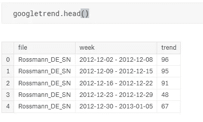

让我们看一看特征工程后的`googletrend` 。检查新列`Date ,State`和对`State`列所做的更改。


**以下步骤对特征工程非常重要:-**

正如我们在下面的快照中所看到的，我们已经向`googletrends` 添加了更多的列，这些列是使用上面的命令从`Date` 列形成的。

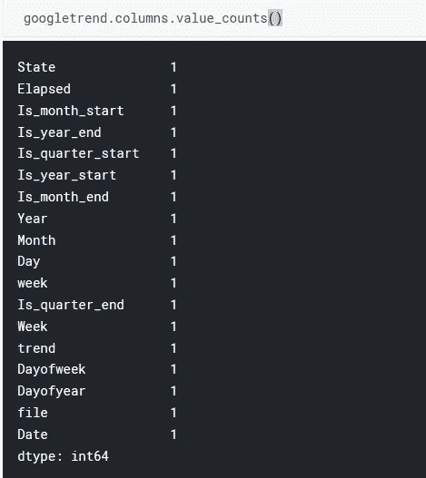

在上面的代码片段中，`joined` 是我们的训练数据，`joined_test` 是我们的测试数据。众所周知，一幅画胜过 1000 句话。让我描述一下我们如何通过合并多个表得到训练数据— `joined` 和测试数据— `joined_test`的流程图。以下快照与`joined` 和`joined_test`相同。

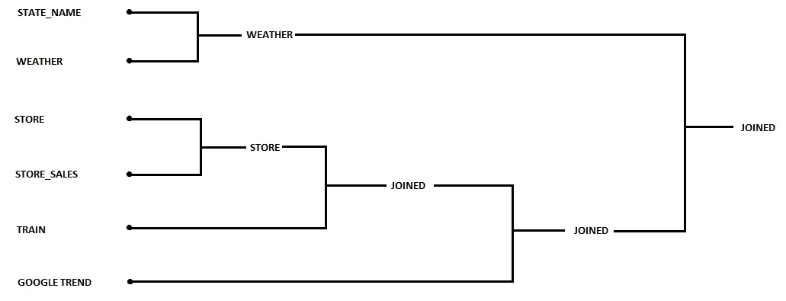

**删除额外变量前后的比较**

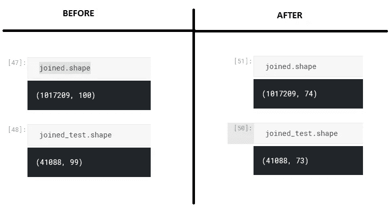

正如我们在下面的代码中看到的，我们将填充训练数据— `joined` 和测试数据— `joined_test`中出现的缺失值。

输出如下所示:-

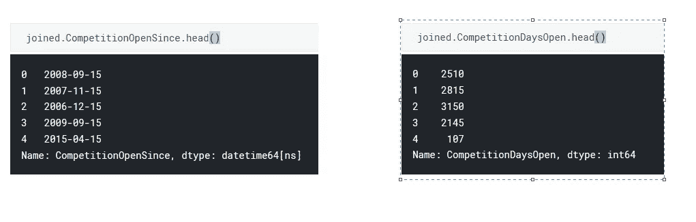

在下面的代码中，我们替换了离群值并做了更多的功能工程。

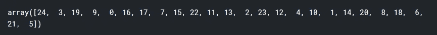

促销日期的相同功能工程。

**让我们关注一下持续时间:-**

这篇文章你已经看了一半了。干得好。继续走。从这里开始会很有趣。

现在，让我们关注分类变量和连续变量。

Categorical vs Continuous

**决定哪个变量是分类变量还是连续变量？**

在上面的代码中，我们已经分离了将被视为连续和分类的列。但是怎么做呢？这个需要详细解释。

因此，根据列/变量的基数**可以说该列/变量是连续的或分类的。基数**被定义为一个类别中级别的数量。例如,**基数**表示一周的天数=7

*   无论哪个变量已经以分类形式出现在数据中，都将是模型中的分类变量。
*   对于连续变量，我们必须检查它们的基数。如果它们的基数(不同级别的数量)太高，它将是连续的，否则它将被转换成分类变量。
*   连续变量应该具有连续平滑的函数。例如，年份虽然是一个连续变量，但没有很多不同的级别，因此最好将其作为一个分类变量。在这种情况下，连续的是类型为`floating point` 或数据类型为`int` 的那些。
*   我们可以绑定一个连续变量，然后将其转换为分类变量。有时候宁滨会很有帮助。

哪些变量是分类变量，哪些是连续变量，这是我们必须做出的建模决策之一。

在这个时间点上，我们的数据看起来像这样。它有一些连续的，一些布尔的，一些分类的等等。

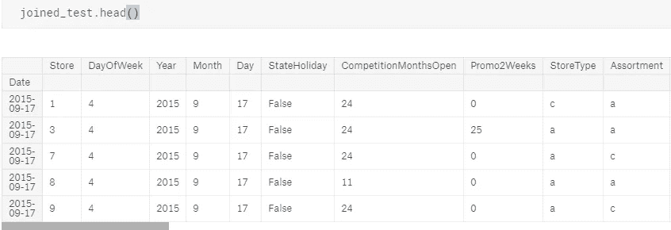

在上面的代码中，Fastai 有一个名为 process _ data frame(**proc _ df**)的函数。

*   它从数据帧**‘joined _ samp’**中取出因变量，即**‘Sales’**，并将其存储在单独的变量`**y**`中。
*   除了因变量' **Sales** '之外的其余数据帧保存在`**df**` **中。**
*   **nas** :返回它创建了哪个 **nas** 的字典，以及相关的中位数。
*   **映射器**:一个**数据帧映射器**，存储相应连续变量的平均值和标准偏差，然后用于测试期间的缩放。
*   它还处理缺失值，因此分类变量中的缺失值变为 0，其他类别变为 1，2，3，4，依此类推。
*   对于连续变量，它用中值替换缺失值，并创建一个新的布尔列，表示是否缺失。

现在输出 df 的所有变量都是连续的。分类列由等价的连续值表示。查看“年份”和“产品组合”栏在此之前和之后的变化。

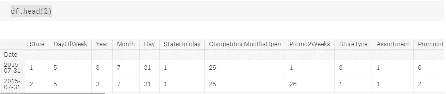

这样，所有的列都是连续的。

*   连续的列保持不变。它们被改成了`float32` ，因为这是 pytorch 接受的标准数字数据类型。
*   分类列被转换成等效的连续类型。

**验证数据集**

根据 Kaggle，我们在 Rossman 数据中的问题陈述是预测接下来两周的销售。由于它是一个时间序列数据，我们的验证数据集不是随机的。相反，它是我们实际应用中的最新数据。

**深度学习从这里开始。**

*   根据罗斯曼数据竞赛的 Kaggle 规则，我们将在 **RMSPE(均方根百分比误差)的基础上进行评估。**
*   **RMSPE** 将是度量而不是准确性，因此我们在下面的代码中对此进行了公式化:-

*   让我们创建我们的模型数据对象:-

*   早些时候是`ImageClassifierData` ,因为那时我们正在处理图像。现在在这种情况下，当我们处理纵列表格数据时，它是`ColumnarModelData`。
*   我们有了`from_data_frame`，而不是`from_Paths`。
*   `PATH` —存储模型文件的位置。
*   `val_idx` —要放入验证数据集中的行的索引列表。
*   `df` —数据框。
*   `y1` —由因变量组成。
*   `cat_flds` —将所有列视为分类变量，因为此时所有列都转换为数值。
*   `bs` —批量大小。

**对分类变量应用嵌入:**

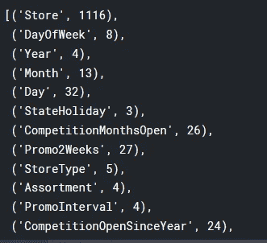

上面的代码所做的是，它遍历每个分类变量`(cat_vars)`并打印出它所拥有的不同级别或类别的数量。上面代码中带有类别的`+1` 是为缺失值保留的。**基本上，它打印每个变量的基数和变量名。**

我们用每个变量的基数来决定它的嵌入矩阵应该有多大。

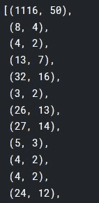

在上面的代码中，我们遵循一条经验法则，即嵌入大小是`cardinality size//2` ，但不大于 50。

**嵌入矩阵如何工作？**

*   当我们创建这些矩阵时，它有随机数。因此，我们将它们放入神经网络，并不断更新它们的值，以减少损失函数。这些嵌入矩阵可以与一组权重相比较，这些权重以减少损失的方式自我更新。这样，我们从这些权重的随机值到有意义的更新值。
*   客观地说，嵌入矩阵的值可以在 0 和该类别的最大层数之间。然后我们可以索引那个矩阵，找到一个特定的行，我们把它附加到所有的连续变量上，之后的一切都和之前一样。

**嵌入矩阵的图示:-**

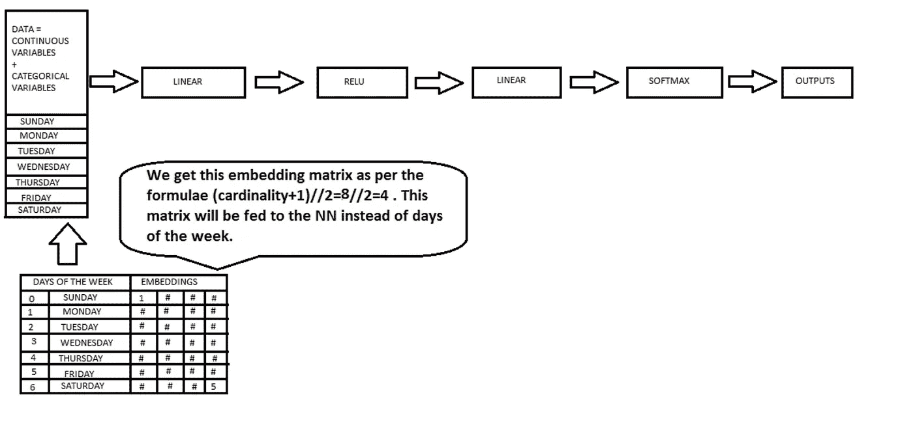

**将神经网络应用于连续变量:-**

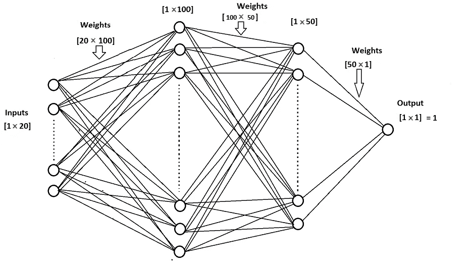

上图显示了神经网络如何处理连续变量。查看矩阵乘法如何工作并产生相应的输出。这是一个 2 隐层神经网络。假设有 20 列作为输入，并且我们已经设计了神经网络，使得第一隐藏层具有 100 个隐藏单元，第二隐藏层具有 50 个隐藏单元。因此，我们的输入[1，20]乘以维度为[20，100]的权重矩阵将得到[1，100]。然后，我们将 ReLU 应用于这个[1，100]维度值，这导致[1，100]的激活。然后，这个[1，100]维激活乘以[100，50]维的权重，这导致具有[1，50]维的激活。这个[1，50]激活然后乘以维度[50，1]的权重，这导致 1 输出。我们在最后一层应用 Softmax 来得到最终的输出。

*   **注意:-** 不要将 ReLU 放在最后一层，因为 Softmax 需要负值来创建更低的概率。ReLU 函数去掉了负值。在罗斯曼销售数据的情况下，我们试图预测销售，因此我们最终不需要 Softmax。

让我们创建我们的学习者。这就是我们如何建立我们的神经网络。

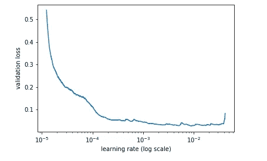

best lr = 1e-3

`get_learner()`中使用的参数。

*   `emb_s` —对每个分类变量使用此嵌入矩阵。
*   `len(df.columns)-len(cat_vars)` —表示连续变量的数量。
*   `0.04` —一开始就辍学。
*   `1` —最后一个线性层的输出。
*   `[1000,500]` —第一和第二线性层的激活次数。
*   `[0.001,0.01]` —用于第一和第二线性层的漏失。
*   `y_range=y_range` —前面已经介绍过了。
*   `tmp_name=f”{PATH_WRITE}tmp”` —(可选)仅在 kaggle 内核中使用。
*   `models_name=f”{PATH_WRITE}models”` —(可选)仅在 kaggle 内核中使用。

***？？？有什么问题吗？？？***

!!! Question Time !!!

Qs 1 :-星期嵌入中的四个值表示什么？

最初，我们从一些随机的四个值开始。它的功能与砝码相同。所以我们在最小化损失的同时更新这些值。当损失被最小化时，我们将以一些更新的四个值结束。此时，我们会发现这些特定的参数是人类可以解释的，而且非常有趣。

Qs 2 :-除了随机初始化，还有什么方法初始化嵌入矩阵？

如果罗斯曼有一个预先训练好的奶酪销售嵌入矩阵，我们可以用它来预测酒的销售。instacart 和 pinterest 正在使用这种技术。他们有产品和商店的嵌入矩阵，在组织内共享，这样人们就不必培训新的产品和商店。

Qs 3 :-使用嵌入矩阵比一键编码有什么优势？

以周日的一个热门编码向量为例:-

```
[1 0 0 0 0 0 0]
```

Sunday 的独热编码表示法的问题是它表示一个浮点数。它只代表一件事。更多的是线性行为。

有了嵌入，星期天就是一个四维空间的概念。更新这些值后我们得到的是丰富的语义概念。例如，如果结果是周末与工作日相比具有不同的行为，那么我们看到在这个嵌入矩阵中周六和周日的某个值会更高。通过拥有这些高维向量，我们给神经网络一个机会来学习这些潜在的丰富表示。正是这种丰富的表现让它能够学习如此有趣的关系。这种表示嵌入的思想被称为“分布式表示”。神经网络具有有时难以解释的高维表示。矩阵中的这些数字不一定只有一个意思。它可以随着上下文改变它的意思，因为它经历了丰富的非线性函数。

虽然一个热门的编码在一周的几天中有更多的维度，但它并不是有意义的高维。嵌入矩阵的使用有助于减小尺寸，并更恰当地表示变量。

问题 3:-嵌入适合某种类型的变量吗？

当我们遇到分类变量时，我们使用嵌入的概念。但是对于高基数的变量就不行了。

问题 4:`add_datepart()` 如何影响季节性？

fastai 库有一个`add_datepart()`函数，它接受一个数据帧及其表示日期的列。它可以选择删除日期列，而不是返回许多表示该日期有用信息的列。例如用`dayOfWeek`、 `MonthOfYear`、 `Year`、`Month`、 `Week`、 `Day`等代替`Date` 等。所以`daysOFWeek` 现在可以用一个【8，4】嵌入矩阵来表示。从概念上讲，这允许模型挑选一些有趣的特征和模式。

*   假设，有一个 7 天周期的东西，它在周一上涨，周四下跌，只有在柏林，它可以完全提取该模式，因为它有所有需要的信息。这是处理时间序列模型的好方法。我们只需要确保我们的时间序列模型中的周期指标或周期性应该以列的形式存在。

使用以下命令培养学习者并获得最佳的学习速度。

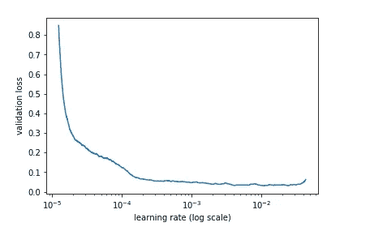

正如我们所看到的，最好的学习率在 10^-3.的某个地方所以我们将继续用 lr=10^-3.训练我们的神经网络

```
m.fit(lr, 3, metrics=[exp_rmspe])
[ 0\.       0.02479  0.02205  0.19309]                          
[ 1\.       0.02044  0.01751  0.18301]                          
[ 2\.       0.01598  0.01571  0.17248]m.fit(lr, 5, metrics=[exp_rmspe], cycle_len=1)
[ 0\.       0.01258  0.01278  0.16   ]                          
[ 1\.       0.01147  0.01214  0.15758]                          
[ 2\.       0.01157  0.01157  0.15585]                          
[ 3\.       0.00984  0.01124  0.15251]                           
[ 4\.       0.00946  0.01094  0.15197]m.fit(lr, 2, metrics=[exp_rmspe], cycle_len=4)
[ 0\.       0.01179  0.01242  0.15512]                           
[ 1\.       0.00921  0.01098  0.15003]                           
[ 2\.       0.00771  0.01031  0.14431]                           
[ 3\.       0.00632  0.01016  0.14358]                           
[ 4\.       0.01003  0.01305  0.16574]                           
[ 5\.       0.00827  0.01087  0.14937]                           
[ 6\.       0.00628  0.01025  0.14506]                           
[ 7\.       0.0053   0.01     0.14449] 
```

**注意:-** 从梯度推进切换到深度学习是好的，因为它需要更少的特征工程，并且它是需要更少维护的更简单的模型。这是使用深度学习方法的最大好处之一。使用这种方法，我们可以得到很好的结果，但工作量要少得多。

**总结:-**

**第一步:-** 列出分类变量名和连续变量名，放入数据框。

**步骤 2:-** 创建一个我们希望包含在验证集中的 row_indexes 列表。

**步骤 3:-** 创建柱状模型数据对象。

**步骤 4:-** 创建一个我们希望嵌入矩阵有多大的列表。

**步骤 5:-** 调用 get_learner 并使用确切的参数开始。

**第六步:-** 调用 m.fit()

我已经使用了[威廉姆·霍顿](https://twitter.com/hortonhearsafoo)的这篇[博文](/announcing-fast-ai-part-1-now-available-as-kaggle-kernels-8ef4ca3b9ce6)中提到的内核。

*！！！恭喜你在 fast.ai 上又学完了一课。干得好。！！！*

*如果你喜欢，那么****ABC****(****永远被击节*** *。***👏 👏👏👏👏😃😃😃😃😃😃😃😃😃*👏 👏👏👏👏👏*** *)*

如果您有任何问题，请随时在 [fast.ai 论坛](http://forums.fast.ai/)或 Twitter 上联系: [@ashiskumarpanda](https://twitter.com/ashiskumarpanda)

注:随着我继续学习其他课程，这篇博文将会更新和改进。更多有趣的东西，可以随时查看我的[*Github*](https://github.com/CaptainAshis)*账号。*

为了充分利用这个博客系列，请按照以下顺序随意探索这个系列的第一部分

1.  [狗 Vs 猫图像分类](/fast-ai-season-1-episode-2-1-e9cc80d81a9d)
2.  [犬种图像分类](/fast-ai-season-1-episode-2-2-dog-breed-classification-5555c0337d60)
3.  [多标签图像分类](/fast-ai-season-1-episode-3-a-case-of-multi-label-classification-a4a90672a889)
4.  [使用神经网络的时间序列分析](/fast-ai-season-1-episode-4-1-time-series-analysis-a23217418bf1)
5.  [IMDB 电影数据集上的 NLP-情感分析](https://geneashis.medium.com/nlp-sentiment-analysis-on-imdb-movie-dataset-fb0c4d346d23)
6.  [电影推荐系统基础](/fast-ai-season-1-episode-5-1-movie-recommendation-using-fastai-a53ed8e41269)
7.  [从零开始协同过滤](/fast-ai-season-1-episode-5-2-collaborative-filtering-from-scratch-1877640f514a)
8.  [使用神经网络的协同过滤](/fast-ai-season-1-episode-5-3-collaborative-filtering-using-neural-network-48e49d7f9b36)
9.  [像尼采一样写哲学](https://geneashis.medium.com/fast-ai-season-1-episode-6-1-write-philosophy-like-nietzsche-using-rnn-8fe70cfb923c)
10.  [不同神经网络在 Cifar-10 数据集上的性能](https://geneashis.medium.com/fast-ai-season-1-episode-7-1-performance-of-different-neural-networks-on-cifar-10-dataset-c6559595b529)
11.  [检测图像中最大物体的 ML 模型 Part-1](https://medium.com/hackernoon/single-object-detection-e65a537a1c31)
12.  [检测图像中最大物体的 ML 模型 Part-2](https://medium.com/hackernoon/single-object-detection-part-2-2deafc911ce7)

编辑 1:-TFW·杰瑞米·霍华德同意你的帖子。💖💖 🙌🙌🙌 💖💖。