# “电影推荐系统”

> 原文：<https://towardsdatascience.com/fast-ai-season-1-episode-5-1-movie-recommendation-using-fastai-a53ed8e41269?source=collection_archive---------7----------------------->


欢迎来到第五集 [Fastdotai](http://www.fast.ai/) ，在这里我们将处理**电影推荐系统**。在我们开始之前，我想感谢 [**【杰瑞米·霍华德】**](https://twitter.com/jeremyphoward) 和 [**雷切尔·托马斯**](https://twitter.com/math_rachel) 为民主化人工智能所做的努力。

为了充分利用这个博客系列，请按照以下顺序随意探索这个系列的第一部分

1.  [狗 Vs 猫图像分类](/fast-ai-season-1-episode-2-1-e9cc80d81a9d)
2.  [犬种图像分类](/fast-ai-season-1-episode-2-2-dog-breed-classification-5555c0337d60)
3.  [多标签图像分类](/fast-ai-season-1-episode-3-a-case-of-multi-label-classification-a4a90672a889)
4.  [使用神经网络的时间序列分析](/fast-ai-season-1-episode-4-1-time-series-analysis-a23217418bf1)
5.  [IMDB 电影数据集上的自然语言处理情感分析](https://geneashis.medium.com/nlp-sentiment-analysis-on-imdb-movie-dataset-fb0c4d346d23)
6.  [电影推荐系统的基础](/fast-ai-season-1-episode-5-1-movie-recommendation-using-fastai-a53ed8e41269)
7.  [从零开始协同过滤](/fast-ai-season-1-episode-5-2-collaborative-filtering-from-scratch-1877640f514a)
8.  [使用神经网络的协同过滤](/fast-ai-season-1-episode-5-3-collaborative-filtering-using-neural-network-48e49d7f9b36)
9.  [像尼采一样写哲学](https://geneashis.medium.com/fast-ai-season-1-episode-6-1-write-philosophy-like-nietzsche-using-rnn-8fe70cfb923c)
10.  [不同神经网络在 Cifar-10 数据集上的性能](https://geneashis.medium.com/fast-ai-season-1-episode-7-1-performance-of-different-neural-networks-on-cifar-10-dataset-c6559595b529)
11.  [检测图像中最大物体的 ML 模型 Part-1](https://medium.com/hackernoon/single-object-detection-e65a537a1c31)
12.  [ML 模型检测图像中最大的物体 Part-2](https://medium.com/hackernoon/single-object-detection-part-2-2deafc911ce7)

拿一份爆米花，我们开始吧。

首先，让我们导入所有需要的包。

```
%reload_ext autoreload
%autoreload 2
%matplotlib inlinefrom fastai.learner import *
from fastai.column_data import *
```

设置路径的位置

*   输入数据被存储。
*   将存储临时文件。(可选-在 kaggle 内核中使用)
*   模型重量将被存储。(可选-在 kaggle 内核中使用)

```
path='../input/'
tmp_path='/kaggle/working/tmp/'
models_path='/kaggle/working/models/'
```

*   数据的读取。

```
ratings = pd.read_csv(path+'ratings.csv')
ratings.head()
# This contains the userid , the movie that the userid watched , the time that movie has been watched , the ratings that has provided by the user .
```


```
movies = pd.read_csv(path+'movies.csv')
movies.head()
# This table is just for information purpose and not intended for         # modelling purpose
```


**创建热门电影和用户 ID 的交叉表:-**

```
g=ratings.groupby('userId')['rating'].count()
topUsers=g.sort_values(ascending=False)[:15]
# Users who have given most number of ratings to the movies are          # considered as top Users.g=ratings.groupby('movieId')['rating'].count()
topMovies=g.sort_values(ascending=False)[:15]
# Movies that have got most number of ratings are topMovies .top_r = ratings.join(topUsers, rsuffix='_r', how='inner', on='userId')
top_r = top_r.join(topMovies, rsuffix='_r', how='inner', on='movieId')
pd.crosstab(top_r.userId, top_r.movieId, top_r.rating, aggfunc=np.sum)
```

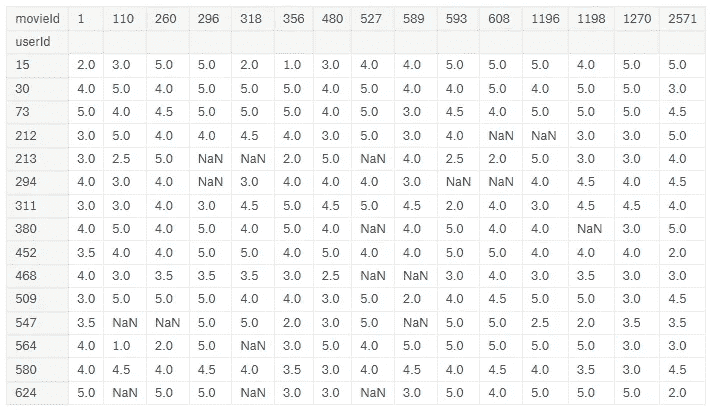

因此，我们将通过三种方式来处理电影推荐。

1.  **矩阵分解。**
2.  **从无到有的协同过滤。**
3.  **神经网络方法。**

首先，我们将深入研究矩阵分解方法:-

1.  **矩阵分解:-**


左侧方框中的表格显示了实际评级。这是我们的实际数据。

让我详细讨论一下右表是如何组成的，左表和右表是什么关系。

*   **制作预测收视率表(右表)**


*   右边的表以用户 id (users)为行，以电影 id (movies)为列。电影 id 和用户 id 用嵌入矩阵来描述。还记得我们在上一篇博文中讨论的嵌入矩阵吗？正如我们所知，嵌入矩阵是由嵌入向量组成的，在开始时，它们只是随机数。在上图中用紫色表示。
*   例如，用户 Id 14 由四个随机数表示。类似地，电影 Id 27 由 4 个随机数表示。这些数字乘积的总和产生了预测的等级。每个嵌入向量在开始时被随机初始化。换句话说，每个预测的评级是两个嵌入向量的矩阵乘积。
*   我们的目标函数是最小化预测评级和实际评级之间的 RMSE。如果我们看到下面的公式

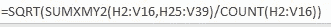

*   **SUMXMY2 函数**计算数组中相应项之间的差的平方和，并返回结果的总和。为了分解公式，它取预测值和实际值之间的 MSE(均方误差),然后求和，得出一个数字。然后将该数字除以评级数量的计数。然后我们取这个数的平方根。在上图中，这个数字用蓝色表示。这就是我们要最小化的目标函数。

***？？？有什么问题吗？？？***

**这些嵌入向量是什么意思？**

*   最初这些都是随机的，但是经过训练后，就开始有意义了。几个时期后，检查这些额定值。这些值会不断自我更新。因此，在几个时期之后，这些预测的额定值将接近实际额定值。据此，这些嵌入向量会自我调整。例如对于电影 Id 27(指环王):-由如下所示的 4 个数字组成的嵌入向量

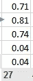

*   假设每个单元格表示(%科幻，%基于 CGI，%对话驱动，%现代，%喜剧)。它表示电影的类型。

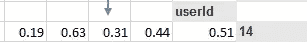

*   类似地，在用户 Id 嵌入向量的情况下，每个数字表示用户 Id 14 有多喜欢科幻电影、现代 CGI 电影、对话驱动电影等等。
*   我们将在后面讨论偏见。

**注意:-这里我们没有任何非线性激活函数或任何类型的隐藏层。因此，它会被认为是浅薄学习的一个例子。**

**Qs:-协同过滤与概率矩阵分解有何相同之处？**

这里我们得到的预测结果是两个不同向量的叉积。问题是，我们没有关于每个用户或电影的适当信息，所以我们假设这是理解系统的合理方式，并使用 SGD 来找到将工作的优化数字。

**Qs:-如何决定这些嵌入向量的长度？**

我们应该选择一个嵌入维数，它足以代表手头问题的真正复杂性。同时，它不应该太大，否则会有太多的参数，运行时间太长，或者即使进行正则化也会产生过度拟合的结果。

**Qs:-负数在嵌入向量中表示什么？**

电影 id 为负数表示特定电影不属于该特定类型。在用户 ID 为负数的情况下，表示特定用户不喜欢该特定类型的电影。

**问:-当我们有一部新电影或新用户时会发生什么？**

如果我们使用网飞作为新用户，它总是问我们喜欢什么电影。并且它重新训练它的模型以便给出好的推荐。

*   **协同过滤的时间到了:-**

**协同过滤推荐系统**方法是用户和项目的概念。假设有一个用户 Id -14 喜欢电影 Id- 24，那么协同过滤方法说，哪个其他用户喜欢那个电影- 24，那个用户 ID-14 也喜欢。然后，它浏览与用户 Id-14 有相同偏好的其他用户的电影列表，并将这些电影推荐给用户 Id-14。

所以它有两个部分:-

1.  用户 Id 和电影 Id
2.  评级值(因变量)

```
val_idxs = get_cv_idxs(len(ratings))
wd=2e-4  # L2 Regularization , helps in preventing overfitting
n_factors = 50 # Embedding dimensionalitiescf = CollabFilterDataset.from_csv(path, 'ratings.csv', 'userId', 'movieId', 'rating')
# 1\. path - where the file is stored.
# 2\. 'ratings.csv' - The excel file which contains the data to be read.
# 3\. 'userId' - What should be the rows .
# 4\. 'movieId' - What should be the columns .
# 5\. 'rating' - Values for predictions. learn = cf.get_learner(n_factors, val_idxs, 64, opt_fn=optim.Adam, tmp_name=tmp_path, models_name=models_path)# Finally, we train our model
learn.fit(1e-2, 2, wds=wd, cycle_len=1, cycle_mult=2)
```

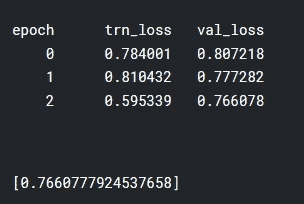

```
math.sqrt(0.766)
# 0.8752142594816426
# Let's compare to some benchmarks. Here's [some benchmarks](https://www.librec.net/release/v1.3/example.html) on the same   # dataset for the popular Librec system for collaborative filtering. They # show best results based on [RMSE](http://www.statisticshowto.com/rmse/) of 0.91\. We'll need to take the square # root of our loss, since we use plain MSE.preds = learn.predict()
```

**我们来分析一下结果:**

```
movie_names = movies.set_index('movieId')['title'].to_dict()
# Contains movieid and their title in form of dictionaries
```

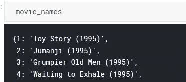

```
g=ratings.groupby('movieId')['rating'].count()
# Which  movie got how many ratings
```

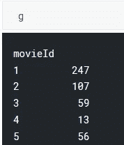

```
topMovies=g.sort_values(ascending=False).index.values[:3000]
# Take the movieid of 3000 movies which has got most number of ratings.
```

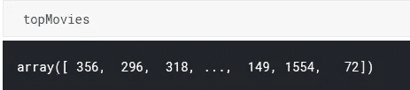

```
topMovieIdx = np.array([cf.item2idx[o] for o in topMovies])
# Replace the movieid with contigious ids.
# Check out our model below. It has 50 embedding vectors for each of movies and users . And a bias for each movie and each user.
```

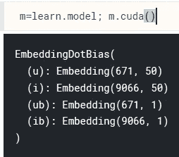

```
# First,  we'll look at the movie bias term. Here, our input is the movie # id (a  single id), and the output is the movie bias (a single float). movie_bias = to_np(m.ib(V(topMovieIdx)))
```

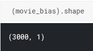

*   代码`to_np(m.ib(V(topMovieIdx)))`将在遍历嵌入层中的每个 MovieIds 并返回其偏差后给出一个变量。
*   `m.ib`指项目/电影的嵌入层，即偏置层。我们知道有 9066 部电影和与之相关的偏见。`m.ib`将返回该图层的值。
*   模型/层需要变量来跟踪梯度，因此有了`V(…)`。
*   使用`to_np()`将张量转换成数值。
*   为了推理的目的，将模型从 GPU 移动到 CPU，使用`m.cpu()`。并使用`m.cuda()`将其移动到 GPU。

```
movie_ratings = [(b[0], movie_names[i]) for i,b in zip(topMovies,movie_bias)]
# A list comprehension where movie_bias is stored in b and topMovies in  # movie_names. Check out the below output which returns a list of tuples # having movies and its bias .
```

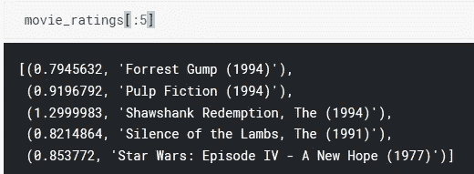

根据电影的倾向性对电影进行排序(即使用 lambda 函数对每个元组的第 0 个元素进行排序)。在检查中我们发现，偏见表明电影的质量。好电影有正面偏见，烂片有负面偏见。这就是如何解释偏见术语。

```
sorted(movie_ratings, key=lambda o: o[0], reverse=True)[:15]
# Sort the movies by its bias (i.e the 0th element of each tuple by using # lambda function). Reverse=True means in descending order of Bias       # values.
```

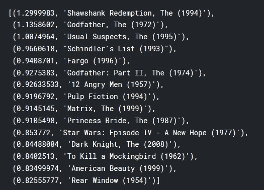

**让我们来解释嵌入向量:-**

```
movie_emb = to_np(m.i(V(topMovieIdx)))
# m.i(...) for item embeddings.movie_emb.shape
```

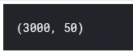

```
# Because it's hard to interpret 50 embeddings, we use [PCA](https://plot.ly/ipython-notebooks/principal-component-analysis/) to simplify    # them down to just 3 vectors.from sklearn.decomposition import PCA
pca = PCA(n_components=3)
movie_pca = pca.fit(movie_emb.T).components_
movie_pca.shape
```

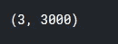

```
fac0 = movie_pca[0]
movie_comp = [(f, movie_names[i]) for f,i in zip(fac0, topMovies)]
# Here's the 1st component. It seems to be 'easy watching' vs 'serious'.# Its upto us to decide what does these Embeddings mean . Check the output belowsorted(movie_comp, key=itemgetter(0), reverse=True)[:10]
```

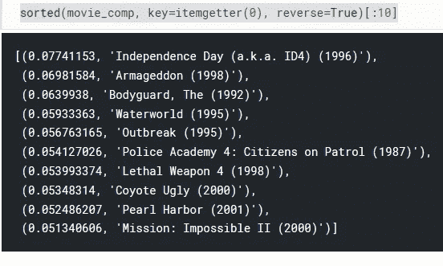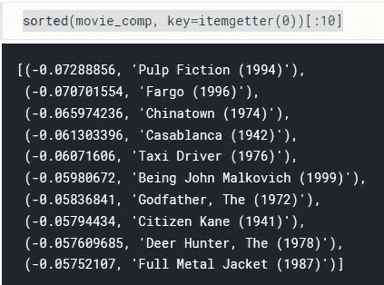

```
# Lets interpret the 2nd component
fac1 = movie_pca[1]
movie_comp = [(f, movie_names[i]) for f,i in zip(fac1, topMovies)]
#  It seems to be 'CGI' vs 'dialog driven'.
sorted(movie_comp, key=itemgetter(0), reverse=True)[:10]
```

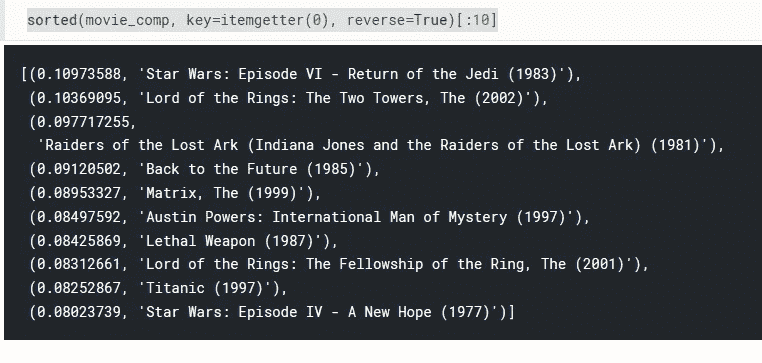

这就是我们如何分析一个电影推荐系统。评价标准是最小化 RMSE。早先的误差基准是 **0.91** 。使用 fastai，我们得到 **0.87。**

因此，这种模式表现良好。

在下一部分，我们将从头开始讨论[协同过滤](https://medium.com/p/1877640f514a/edit)。

*如果你喜欢，那么****ABC****(****永远被击节*** *。* ***👏 👏👏👏👏*😃😃😃😃😃😃😃😃😃*👏 👏👏👏👏👏*** *)*

如果您有任何问题，请随时联系 [fast.ai 论坛](http://forums.fast.ai/)或 Twitter:[@ ashiskumarpanda](https://twitter.com/ashiskumarpanda)

注:随着我继续学习其他课程，这篇博文将会更新和改进。更多有趣的东西，可以随时查看我的[*Github*](https://github.com/CaptainAshis)*账号。*

为了充分利用这个博客系列，请按照以下顺序随意探索这个系列的第一部分

1.  [狗 Vs 猫图像分类](/fast-ai-season-1-episode-2-1-e9cc80d81a9d)
2.  [犬种图像分类](/fast-ai-season-1-episode-2-2-dog-breed-classification-5555c0337d60)
3.  [多标签图像分类](/fast-ai-season-1-episode-3-a-case-of-multi-label-classification-a4a90672a889)
4.  [使用神经网络的时间序列分析](/fast-ai-season-1-episode-4-1-time-series-analysis-a23217418bf1)
5.  [对 IMDB 电影数据集的 NLP 情感分析](https://geneashis.medium.com/nlp-sentiment-analysis-on-imdb-movie-dataset-fb0c4d346d23)
6.  [电影推荐系统的基础](/fast-ai-season-1-episode-5-1-movie-recommendation-using-fastai-a53ed8e41269)
7.  [从无到有的协同过滤](/fast-ai-season-1-episode-5-2-collaborative-filtering-from-scratch-1877640f514a)
8.  [使用神经网络的协同过滤](/fast-ai-season-1-episode-5-3-collaborative-filtering-using-neural-network-48e49d7f9b36)
9.  [像尼采一样写哲学](https://geneashis.medium.com/fast-ai-season-1-episode-6-1-write-philosophy-like-nietzsche-using-rnn-8fe70cfb923c)
10.  [不同神经网络在 Cifar-10 数据集上的性能](https://geneashis.medium.com/fast-ai-season-1-episode-7-1-performance-of-different-neural-networks-on-cifar-10-dataset-c6559595b529)
11.  [检测图像中最大物体的 ML 模型 Part-1](https://medium.com/hackernoon/single-object-detection-e65a537a1c31)
12.  [检测图像中最大物体的 ML 模型 Part-2](https://medium.com/hackernoon/single-object-detection-part-2-2deafc911ce7)

编辑 1:-TFW·杰瑞米·霍华德同意你的帖子。💖💖 🙌🙌🙌 💖💖。