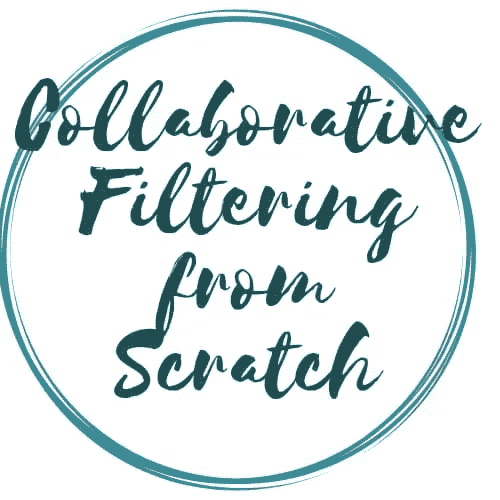
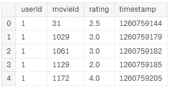
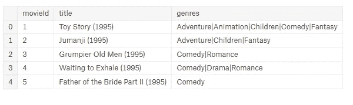
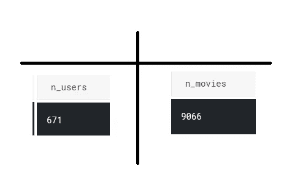
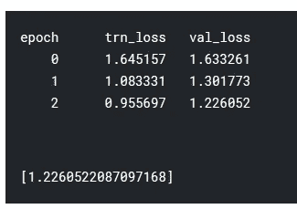
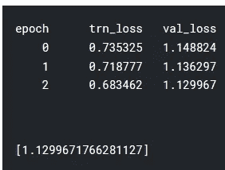
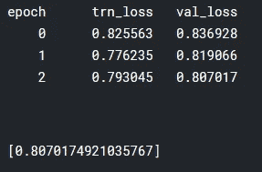
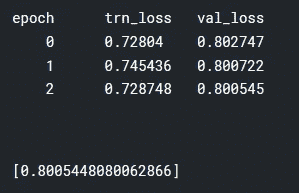

# “从零开始的协作过滤”

> 原文：<https://towardsdatascience.com/fast-ai-season-1-episode-5-2-collaborative-filtering-from-scratch-1877640f514a?source=collection_archive---------14----------------------->

## 从头开始构建电影推荐的协同过滤



欢迎来到第五集 [Fastdotai](http://www.fast.ai/) 的第二部分，我们将从零开始讲述**协同过滤——一种广泛应用于推荐系统的技术**。在我们开始之前，我想感谢 [**【杰瑞米·霍华德】**](https://twitter.com/jeremyphoward) 和 [**雷切尔·托马斯**](https://twitter.com/math_rachel) 为民主化人工智能所做的努力。

为了充分利用这个博客系列，请按照以下顺序随意探索这个系列的第一部分

1.  [狗 Vs 猫图像分类](/fast-ai-season-1-episode-2-1-e9cc80d81a9d)
2.  [犬种图像分类](/fast-ai-season-1-episode-2-2-dog-breed-classification-5555c0337d60)
3.  [多标签图像分类](/fast-ai-season-1-episode-3-a-case-of-multi-label-classification-a4a90672a889)
4.  [使用神经网络的时间序列分析](/fast-ai-season-1-episode-4-1-time-series-analysis-a23217418bf1)
5.  [IMDB 电影数据集上的自然语言处理情感分析](https://geneashis.medium.com/nlp-sentiment-analysis-on-imdb-movie-dataset-fb0c4d346d23)
6.  [电影推荐系统的基础](/fast-ai-season-1-episode-5-1-movie-recommendation-using-fastai-a53ed8e41269)
7.  [从零开始协同过滤](/fast-ai-season-1-episode-5-2-collaborative-filtering-from-scratch-1877640f514a)
8.  [使用神经网络的协同过滤](/fast-ai-season-1-episode-5-3-collaborative-filtering-using-neural-network-48e49d7f9b36)
9.  [像尼采一样写哲学](https://geneashis.medium.com/fast-ai-season-1-episode-6-1-write-philosophy-like-nietzsche-using-rnn-8fe70cfb923c)
10.  [不同神经网络在 Cifar-10 数据集上的性能](https://geneashis.medium.com/fast-ai-season-1-episode-7-1-performance-of-different-neural-networks-on-cifar-10-dataset-c6559595b529)
11.  [检测图像中最大物体的 ML 模型 Part-1](https://medium.com/hackernoon/single-object-detection-e65a537a1c31)
12.  [检测图像中最大物体的 ML 模型 Part-2](https://medium.com/hackernoon/single-object-detection-part-2-2deafc911ce7)

**网飞背后的原因和寒意。**

首先，让我们导入所有需要的包。

```
%reload_ext autoreload
%autoreload 2
%matplotlib inlinefrom fastai.learner import *
from fastai.column_data import *
```

设置路径的位置

*   输入数据被存储。
*   将存储临时文件。(可选-在 kaggle 内核中使用)
*   模型重量将被存储。(可选-在 kaggle 内核中使用)

```
path='../input/'
tmp_path='/kaggle/working/tmp/'
models_path='/kaggle/working/models/'
```

*   数据的读取。

```
ratings = pd.read_csv(path+'ratings.csv')
ratings.head()
# This contains the userid , the movie that the userid watched , the time that movie has been watched , the ratings that has provided by the user .
```



```
movies = pd.read_csv(path+'movies.csv')
movies.head()
# This table is just for information purpose and not intended for         # modelling purpose
```



```
u_uniq = ratings.userId.unique() 
user2idx = {o:i for i,o in enumerate(u_uniq)}
# Take every unique user id and map it to a contiguous user .
ratings.userId = ratings.userId.apply(lambda x: user2idx[x])
# Replace that userid with contiguous number.# Similarly, we do it for the movies. 
m_uniq = ratings.movieId.unique()
movie2idx = {o:i for i,o in enumerate(m_uniq)}
ratings.movieId = ratings.movieId.apply(lambda x: movie2idx[x]) 
```

将 movieId 和 userId 转换成连续的整数有助于我们决定嵌入矩阵。这些 userId 和 movieID 的值在开始时不连续。它可能从 100 万开始，并且不会是连续的。因此，如果我们使用这些值来决定我们的嵌入矩阵，那么嵌入矩阵的大小将会太大，这可能会导致缓慢的处理或过拟合。



```
class EmbeddingDot(nn.Module):
    def __init__(self, n_users, n_movies):
        super().__init__()
        self.u = nn.Embedding(n_users, n_factors)
        self.m = nn.Embedding(n_movies, n_factors)
        self.u.weight.data.uniform_(0,0.05)
        self.m.weight.data.uniform_(0,0.05)

    def forward(self, cats, conts):
        users,movies = cats[:,0],cats[:,1]
        u,m = self.u(users),self.m(movies)
        return (u*m).sum(1).view(-1, 1)model = EmbeddingDot(n_users, n_movies).cuda() # Class Instantiation
```

上述代码中涉及到 OOPs 的概念。所以我来详细解释一下。

*   `self` 是一个参考变量，当对象(即模型)被创建时，存储该对象。
*   `def __init__(self, n_users, n_movies):`是一个神奇的功能。每当为该类创建对象时，都会自动调用它。这种类型的函数被称为构造函数。
*   `model = EmbeddingDot(n_users, n_movies).cuda()`。这里创建了对象。随着它的创建，构造函数被自动调用。
*   但是物体是什么？一个对象(即模型)是一个具有一些属性和行为的实体。
*   这些行为是嵌入的形状和值，如下所示。

```
self.u = nn.Embedding(n_users, n_factors) # User Embeddings
self.m = nn.Embedding(n_movies, n_factors) # Movie Embeddings
self.u.weight.data.uniform_(0,0.05) # Values for User Embeddings
self.m.weight.data.uniform_(0,0.05) # Values for Movie Embeddings
```

*   为了获得这些嵌入的值，我们使用了从`nn.Module` 继承而来的`nn.Embedding` ，使用了 OOP 的`Inheritance` 概念，使用了下面这行代码:- `super().__init__()`。
*   `self.u`设置为嵌入类的实例。它有一个包含实际嵌入矩阵的 `.weight`属性。嵌入矩阵是一个变量。变量和张量一样，它会自动微分。
*   要访问张量使用，`self.u.weight.data`属性。
*   `self.u.weight.data.uniform_` :-末尾的下划线符号表示它是一个就地操作。`self.u.weight.data.uniform_`表示这个张量的适当大小的均匀随机数，不返回它，而是在适当的位置填充矩阵。
*   当我们稍后进行拟合时，前进功能开始起作用。但是，让我们来详细了解一下当调用 forward 函数时会发生什么。

```
def forward(self, cats, conts):
        users,movies = cats[:,0],cats[:,1]
        u,m = self.u(users),self.m(movies)
        return (u*m).sum(1).view(-1, 1)
```

*   `users,movies = cats[:,0],cats[:,1]` :-抓取用户和电影的迷你批次。
*   `u,m = self.u(users),self.m(movies)` :-对于小批量的用户和电影，使用`self.u(users),self.m(movies)`查找用户和电影的嵌入矩阵。
*   在得到用户和电影的嵌入后，我们将这两者进行叉积，得到一个数字，这就是预测的收视率。

```
x = ratings.drop(['rating', 'timestamp'],axis=1)
# The x contain movies and users from the dataframe. Independent     # variables.y = ratings['rating'].astype(np.float32)
# The y contains the dependent Variable i.e the ratings.data = ColumnarModelData.from_data_frame(path, val_idxs, x, y, ['userId', 'movieId'], 64)1# path :- path of the file.
2# val_idxs :- Validation data
3# x, y :- Described above as independent and dependent variable.
4# ['userId', 'movieId'] :- List of categorical variables.
5# 64 :- batch size.wd=1e-5 # Regularization parameter

opt = optim.SGD(model.parameters(), 1e-1, weight_decay=wd, momentum=0.9)
# Optimizer to be used to update the weights or model.parameters().
# model.parameters() is derived from nn.Module which gives list of all   # the weights that are needed to be updated and hence passed to optimizer # along with learning rate, weight decay and momentum.
```

为了拟合我们的数据，也就是为了训练，早先我们使用了`learner`，它是 fast.ai 的一部分，但是现在我们将使用 PyTorch 功能。当执行下面的`fit` 命令时，检查 fastai 文件夹中的`model.py` 文件，以了解 fit 命令的底层。基本上它做的是:-

*   通过调用正向函数`def forward(self, cats, conts):`进行正向传递
*   以及更新嵌入的反向传递，这是 PyTorch 的功能。

`fit(model, data, 3, opt, F.mse_loss)`



这里我们不会得到 SGDR 的功能，因此手动重置学习率，并检查损失。

`set_lrs(opt, 0.01)`

`fit(model, data, 3, opt, F.mse_loss)`

虽然我们的模型表现良好，但由于我们没有正确实施 SGDR，因此我们的损失比以前更高。



**如何进一步完善模型？？**

现在我们将考虑偏见。会有一些用户非常热情，平均来说会给所有的电影更高的评价。因此，我们将为电影和用户添加一个常量。这个常数被称为偏差。

```
min_rating,max_rating = ratings.rating.min(),ratings.rating.max()
min_rating,max_ratingdef get_emb(ni,nf): 
# Input is #User,#Factors i.e Embedding Dimensionality
    e = nn.Embedding(ni, nf) # Creation of Embedding matrix
    e.weight.data.uniform_(-0.01,0.01)
 # Fill it with randomly initialized values between (-0.01,0.01)
    return eclass EmbeddingDotBias(nn.Module):
    def __init__(self, n_users, n_movies):
        super().__init__()
# Creating an embedding for User (self.u) , Movies (self.m), 
# User bias (self.ub), Movie bias (self.mb) by calling get_emb().(self.u, self.m, self.ub, self.mb) = [get_emb(*o) for o in [
            (n_users, n_factors), (n_movies, n_factors), (n_users,1), (n_movies,1)
        ]]

    def forward(self, cats, conts):
        users,movies = cats[:,0],cats[:,1]
        um = (self.u(users)* self.m(movies)).sum(1)
        res = um + self.ub(users).squeeze() + self.mb(movies).squeeze()
# Add in user bias and movie bias. Using .squeeze() does a broadcasting. res = F.sigmoid(res) * (max_rating-min_rating) + min_rating
# This is gonna squish the value between 1 and 5 . What it does is if its # a good movie then it will get a really high number else a low number.
#  F.sigmoid(res) is gonna squish it between 0 and 1. return res.view(-1, 1)wd=2e-4
model = EmbeddingDotBias(cf.n_users, cf.n_items).cuda()
opt = optim.SGD(model.parameters(), 1e-1, weight_decay=wd, momentum=0.9)
fit(model, data, 3, opt, F.mse_loss)
```



```
set_lrs(opt, 1e-2)
fit(model, data, 3, opt, F.mse_loss)
```



最后，我们达到了 0.8 的损失，这相当不错。

*如果你喜欢，那么****ABC****(****永远被击节*** *。* ***👏 👏👏👏👏*😃😃😃😃😃😃😃😃😃*👏 👏👏👏👏👏*** *)*

如果您有任何问题，请随时联系 [fast.ai 论坛](http://forums.fast.ai/)或 Twitter:[@ ashiskumarpanda](https://twitter.com/ashiskumarpanda)

注:随着我继续学习其他课程，这篇博文将会更新和改进。更多有趣的东西，可以随时查看我的[*Github*](https://github.com/CaptainAshis)*账号。*

为了充分利用这个博客系列，请按照以下顺序随意探索这个系列的第一部分:- [狗与猫的图像分类](/fast-ai-season-1-episode-2-1-e9cc80d81a9d)

1.  [犬种图像分类](/fast-ai-season-1-episode-2-2-dog-breed-classification-5555c0337d60)
2.  [多标签图像分类](/fast-ai-season-1-episode-3-a-case-of-multi-label-classification-a4a90672a889)
3.  [使用神经网络的时间序列分析](/fast-ai-season-1-episode-4-1-time-series-analysis-a23217418bf1)
4.  [对 IMDB 电影数据集的 NLP 情感分析](https://geneashis.medium.com/nlp-sentiment-analysis-on-imdb-movie-dataset-fb0c4d346d23)
5.  [电影推荐系统的基础](/fast-ai-season-1-episode-5-1-movie-recommendation-using-fastai-a53ed8e41269)
6.  [从零开始协同过滤](/fast-ai-season-1-episode-5-2-collaborative-filtering-from-scratch-1877640f514a)
7.  [使用神经网络的协同过滤](/fast-ai-season-1-episode-5-3-collaborative-filtering-using-neural-network-48e49d7f9b36)
8.  [像尼采一样写哲学](https://geneashis.medium.com/fast-ai-season-1-episode-6-1-write-philosophy-like-nietzsche-using-rnn-8fe70cfb923c)
9.  [不同神经网络在 Cifar-10 数据集上的性能](https://geneashis.medium.com/fast-ai-season-1-episode-7-1-performance-of-different-neural-networks-on-cifar-10-dataset-c6559595b529)
10.  [ML 模型检测图像中最大的物体 Part-1](https://medium.com/hackernoon/single-object-detection-e65a537a1c31)
11.  [ML 模型检测图像中最大的物体 Part-2](https://medium.com/hackernoon/single-object-detection-part-2-2deafc911ce7)

编辑 1:-TFW·杰瑞米·霍华德同意你的帖子。💖💖 🙌🙌🙌 💖💖。