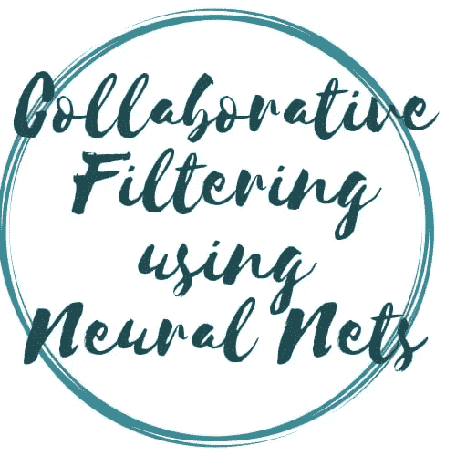
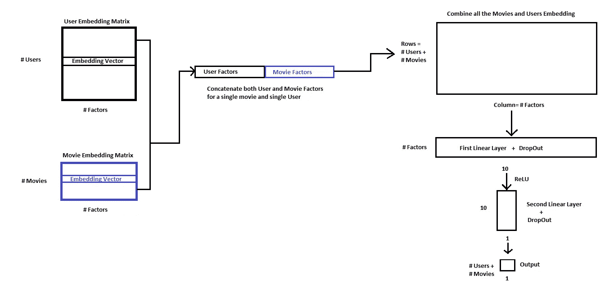
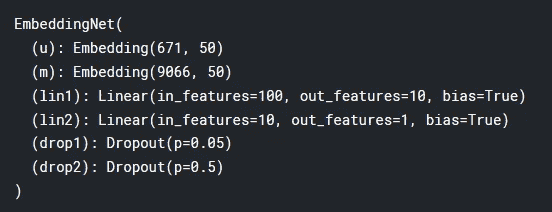
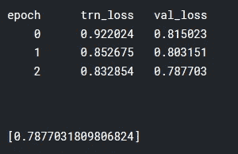

# “使用神经网络的协同过滤”

> 原文：<https://towardsdatascience.com/fast-ai-season-1-episode-5-3-collaborative-filtering-using-neural-network-48e49d7f9b36?source=collection_archive---------7----------------------->

## 利用神经网络构建电影推荐的协同过滤。



为了充分利用这个博客系列，请按照以下顺序随意探索这个系列的第一部分

1.  [狗 Vs 猫图像分类](/fast-ai-season-1-episode-2-1-e9cc80d81a9d)
2.  [犬种图像分类](/fast-ai-season-1-episode-2-2-dog-breed-classification-5555c0337d60)
3.  [多标签图像分类](/fast-ai-season-1-episode-3-a-case-of-multi-label-classification-a4a90672a889)
4.  [使用神经网络的时间序列分析](/fast-ai-season-1-episode-4-1-time-series-analysis-a23217418bf1)
5.  [对 IMDB 电影数据集的 NLP 情感分析](https://geneashis.medium.com/nlp-sentiment-analysis-on-imdb-movie-dataset-fb0c4d346d23)
6.  [电影推荐系统的基础](/fast-ai-season-1-episode-5-1-movie-recommendation-using-fastai-a53ed8e41269)
7.  [从零开始协同过滤](/fast-ai-season-1-episode-5-2-collaborative-filtering-from-scratch-1877640f514a)
8.  [使用神经网络的协同过滤](/fast-ai-season-1-episode-5-3-collaborative-filtering-using-neural-network-48e49d7f9b36)
9.  [像尼采一样写哲学](https://geneashis.medium.com/fast-ai-season-1-episode-6-1-write-philosophy-like-nietzsche-using-rnn-8fe70cfb923c)
10.  [不同神经网络在 Cifar-10 数据集上的性能](https://geneashis.medium.com/fast-ai-season-1-episode-7-1-performance-of-different-neural-networks-on-cifar-10-dataset-c6559595b529)
11.  [ML 模型检测图像中最大的物体 Part-1](https://medium.com/hackernoon/single-object-detection-e65a537a1c31)
12.  [ML 模型检测图像中最大的物体 Part-2](https://medium.com/hackernoon/single-object-detection-part-2-2deafc911ce7)

欢迎来到第五集 [Fastdotai](http://www.fast.ai/) 的第三部分，在这里我们将讨论使用神经网络的**协同过滤——一种在推荐系统中广泛使用的技术**。在我们开始之前，我想感谢 [**【杰瑞米·霍华德】**](https://twitter.com/jeremyphoward) 和 [**雷切尔·托马斯**](https://twitter.com/math_rachel) 为民主化人工智能所做的努力。

> 做好准备，因为表演时间到了。

首先，让我们导入所有需要的包。

```
%reload_ext autoreload
%autoreload 2
%matplotlib inlinefrom fastai.learner import *
from fastai.column_data import *
```

设置路径的位置

*   输入数据被存储。
*   将存储临时文件。(可选-在 kaggle 内核中使用)
*   模型重量将被存储。(可选-在 kaggle 内核中使用)

```
path='../input/'
tmp_path='/kaggle/working/tmp/'
models_path='/kaggle/working/models/'
```

*   数据的读取。

```
ratings = pd.read_csv(path+'ratings.csv')
ratings.head()
# This contains the userid , the movie that the userid watched , the time that movie has been watched , the ratings that has provided by the user .
```


```
movies = pd.read_csv(path+'movies.csv')
movies.head()
# This table is just for information purpose and not intended for         # modelling purpose
```


```
u_uniq = ratings.userId.unique() 
user2idx = {o:i for i,o in enumerate(u_uniq)}
# Take every unique user id and map it to a contiguous user .
ratings.userId = ratings.userId.apply(lambda x: user2idx[x])
# Replace that userid with contiguous number.# Similarly, we do it for the movies. 
m_uniq = ratings.movieId.unique()
movie2idx = {o:i for i,o in enumerate(m_uniq)}
ratings.movieId = ratings.movieId.apply(lambda x: movie2idx[x])
```

在我们之前的方法中，我们采用了一个电影嵌入和一个用户嵌入，并做了一个叉积来产生一个数字，这就是我们的预测评级。

同样的事情可以通过神经网络方法来完成。在神经网络方法中，我们将采用两种嵌入方式，将它们连接起来，并将其输入到神经网络中，以产生一个单一的数字，即评级。

流程图如下所示



**步骤 1:-** 从特定用户的用户嵌入矩阵中选取嵌入向量，并从特定电影的电影嵌入矩阵中选取嵌入向量。

**第二步:-** 连接两个向量。对所有的电影和用户做同样的事情，这是我们想要的。这将导致一个嵌入矩阵，其中每一行由电影和用户嵌入向量的连接组成。行数将与用户数和电影组合数相同。而列是由因子的个数决定的。与我们之前讨论的嵌入维度相同。所以我们现在拥有的维度是 **(#(用户+电影)组合，#因素)**

**步骤 3 :-** 把它喂给第一个线性层，线性层的维度是(#因子，10)。输出将是(#(用户+电影)组合，10)。

**步骤 4:-** 使其通过具有 ReLU 激活的第二线性层，其维度为(10，1)。输出将是(#(用户+电影)组合，1)。

第五步:- 这是我们想要的输出。之前我们为每个用户和电影做的是，我们做了他们嵌入的叉积，这给了我们一个单一的数字，即预测评级。在这里，我们使用神经网络来获得这个单一的数字，即预测评级。

**步骤 6:-** 然后，我们将尝试最小化预测评级和实际评级之间的损失，并进而更新模型参数(嵌入值)。这样我们可以使我们的预测更加准确。

让我们检查一下动手部分。

```
val_idxs = get_cv_idxs(len(ratings))
n_factors = 10min_rating,max_rating = ratings.rating.min(),ratings.rating.max()
min_rating,max_ratingclass EmbeddingNet(nn.Module):
    def __init__(self, n_users, n_movies, nh=10, p1=0.05, p2=0.5):
        super().__init__()
        (self.u, self.m) = [get_emb(*o) for o in [
            (n_users, n_factors), (n_movies, n_factors)]]
**# Getting the Embedding matrix for users and movies check out the output # below to know the Embedding dimensionality of User and Movies.** self.lin1 = nn.Linear(n_factors*2, nh)
**# The 1st Linear Layer dimensions is (100,10).** self.lin2 = nn.Linear(nh, 1)**# The 2nd Linear Layer dimensions is (10,1).**
        self.drop1 = nn.Dropout(p1)
        self.drop2 = nn.Dropout(p2)
**# Some drop-outs introduced in both the layer.** def forward(self, cats, conts):
        users,movies = cats[:,0],cats[:,1]
        x = self.drop1(torch.cat([self.u(users),self.m(movies)], dim=1))
        x = self.drop2(F.relu(self.lin1(x)))
        return F.sigmoid(self.lin2(x)) * (max_rating-min_rating+1) + min_rating-0.5wd=1e-5
model = EmbeddingNet(n_users, n_movies).cuda()
opt = optim.Adam(model.parameters(), 1e-3, weight_decay=wd)model
```



让我们训练我们的模型。

```
fit(model, data, 3, opt, F.mse_loss)
```



最后，我们优化了损失函数，得到了 0.78 的损失，这比我们之前在 [5.1](/fast-ai-season-1-episode-5-1-movie-recommendation-using-fastai-a53ed8e41269) 和 [5.2](/fast-ai-season-1-episode-5-2-collaborative-filtering-from-scratch-1877640f514a) 中讨论的方法要好得多。

如果您对代码感兴趣，请查看我的 [Github repositori](https://github.com/CaptainAshis/Deep_Learning-Experiment/tree/master/Movie%20Recommendation%20System) es。

*如果你喜欢，那么****ABC****(****永远被击节*** *。* ***👏 👏👏👏👏*😃😃😃😃😃😃😃😃😃*👏 👏👏👏👏👏*** *)*

如果您有任何问题，请随时联系 [fast.ai 论坛](http://forums.fast.ai/)或 Twitter:[@ ashiskumarpanda](https://twitter.com/ashiskumarpanda)

注:随着我继续学习其他课程，这篇博文将会更新和改进。更多有趣的东西，可以随时结账我的[*Github*](https://github.com/CaptainAshis)*账号。*

为了充分利用这个博客系列，请按照以下顺序随意探索这个系列的第一部分:- [狗和猫的图像分类](/fast-ai-season-1-episode-2-1-e9cc80d81a9d)

1.  [犬种图像分类](/fast-ai-season-1-episode-2-2-dog-breed-classification-5555c0337d60)
2.  [多标签图像分类](/fast-ai-season-1-episode-3-a-case-of-multi-label-classification-a4a90672a889)
3.  [使用神经网络的时间序列分析](/fast-ai-season-1-episode-4-1-time-series-analysis-a23217418bf1)
4.  [对 IMDB 电影数据集的 NLP 情感分析](https://geneashis.medium.com/nlp-sentiment-analysis-on-imdb-movie-dataset-fb0c4d346d23)
5.  [电影推荐系统的基础](/fast-ai-season-1-episode-5-1-movie-recommendation-using-fastai-a53ed8e41269)
6.  [从无到有的协同过滤](/fast-ai-season-1-episode-5-2-collaborative-filtering-from-scratch-1877640f514a)
7.  [使用神经网络的协同过滤](/fast-ai-season-1-episode-5-3-collaborative-filtering-using-neural-network-48e49d7f9b36)
8.  [像尼采一样写哲学](https://geneashis.medium.com/fast-ai-season-1-episode-6-1-write-philosophy-like-nietzsche-using-rnn-8fe70cfb923c)
9.  [不同神经网络在 Cifar-10 数据集上的性能](https://geneashis.medium.com/fast-ai-season-1-episode-7-1-performance-of-different-neural-networks-on-cifar-10-dataset-c6559595b529)
10.  [检测图像中最大物体的 ML 模型 Part-1](https://medium.com/hackernoon/single-object-detection-e65a537a1c31)
11.  [检测图像中最大物体的 ML 模型 Part-2](https://medium.com/hackernoon/single-object-detection-part-2-2deafc911ce7)

编辑 1:-TFW·杰瑞米·霍华德同意你的帖子。💖💖 🙌🙌🙌 💖💖。