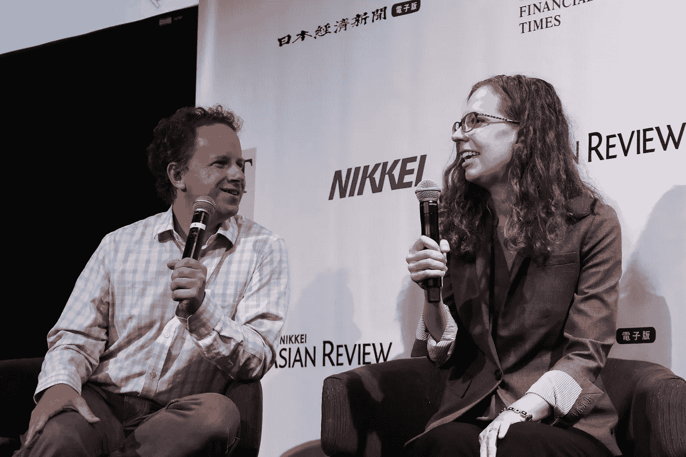

# fast.ai:生活中最好的东西总是免费的

> 原文：<https://towardsdatascience.com/fast-ai-the-best-things-in-life-are-always-free-3b05c54913cd?source=collection_archive---------1----------------------->

[Image[1] (Image courtesy: [https://pixabay.com](https://pixabay.com))]

“与朋友促膝谈心，回忆往事；忙碌一天后，在舒适的床上美美地睡上一觉；与家人共度美好时光；为你真正相信并且一直想帮助的事业做志愿者；看着那个人的眼睛，让他/她感觉到他/她对你来说是多么的特别……”这些都是我们生活中最美好的事情。有很多这样的情况确实有助于让我们发挥出最好的一面。如果你仔细观察这些事情，你会非常惊讶地发现，我们生活中所有这些美好的时刻都有一个共同的特点。是啊！如题，“人生最美好的东西，永远是免费的”。

保持冷静！这篇文章不是关于我们生活的哲学方面:d .在这篇文章中，我将对一个 100%免费的学习平台发表我的意见(是的！这是一个金矿)在这里你可以"**做和学习**"深度学习。是啊！**边做边学**。请不要离开我，我会解释你需要知道的关于这个学习平台的每一分钟的信息。让我们开始行动吧，:D

我一直想学习数据科学和数据工程。我是计算机科学出身，接触过“模式识别”、“数据挖掘和数据仓库”、“分布式系统”、“高性能计算”，我意识到这是一个把所有的点连接起来的问题。所以我开始认真“开始做”数据科学和数据工程。最终我降落在“[卡格尔](https://www.kaggle.com/)”上。我开始向同龄人学习，这给了我很大的推动。每当我试图开始一个新的问题时，我都不得不在以前的项目上来来回回(这完全没问题，:D)。我从“探索性数据分析”[1][2]开始，逐步学习建立模型和做“严肃的事情”。此时，我正在做“Python”和“R”之间的成本效益分析，我想到了坚持使用“Python”。

> Python 是众多入门方式之一。我最初想同时掌握 Python 和 R，然后在阅读了一些 Reddit 和 Quora 帖子后，我得出一个结论，目前，我打算坚持使用 Python。主要原因是，Python 更像是工程师的选择，而 R 是统计学家的选择。

Slow & Steady [Image[2] (Image courtesy:[http://cathjayasuriya.blogspot.sg/2011/02/learning-from-ants.html](http://cathjayasuriya.blogspot.sg/2011/02/learning-from-ants.html))]

一开始，这是一个缓慢但稳定的旅程。要做“严肃的事情”,我知道我必须伸出手指“努力工作”。“努力工作”意味着拓宽我对“数据科学”主题的理解(我总是试图在“数据科学”和“数据工程”之间取得平衡，因为我个人更喜欢全方位的工作)。

正是在这一点上，我意识到加深对神经网络理解的重要性。探索又开始了。我遇到了几个主要的领先在线课程，[杰弗里·辛顿](http://www.cs.toronto.edu/~hinton/)教授的[用于机器学习的神经网络](https://www.coursera.org/learn/neural-networks)、吴恩达[教授的](http://www.andrewng.org/)[深度学习专业化](https://www.coursera.org/specializations/deep-learning)以及 Udacity 的[人工智能——深度学习纳米学位。这些无疑是在神经网络中掌握和超越的最佳资源。你可以免费学习所有这些材料(如果你想获得证书，那么只有你需要付费)。尽管这些资源是许多人追随的最好和最流行的方法，我仍然继续寻找我的问题的正确答案。然后就碰到了“](https://www.udacity.com/course/artificial-intelligence-deep-learning--cx26) [Udemy](https://www.udemy.com/) ”平台。在彻底复习了 Udemy 课程后，我选择了“[深度学习 A-Z:动手操作人工神经网络](https://www.udemy.com/deeplearning/learn/v4/overview)”，因为这门课程直接跳到了实现，而没有深入数学。这个课程是 10 美元，我不介意花这么多钱来学习一个能给我很大帮助的材料。如果你想探索神经网络背后的深层概念和数学，你需要阅读额外的材料(本课程的讲师提供了这些材料的链接)。我对正确答案、学习神经网络的正确平台的追求仍然存在。那些日子里，我花了大量时间在 Reddit 和 Quora 上衡量每个用户的观点。

> 它发生在:D

我记不清这个故事了。我坚信，经过一番努力，我找到的学习平台是满足我需求的正确答案。

# fast.ai

我来自计算机科学背景，并在行业和计算机科学研究领域工作了 2 年多，我相信对我来说，学习“神经网络”必须是一种不同的方法，而不是先学习理论，然后实施，然后在 [Kaggle](https://www.kaggle.com/) 竞争，这是一种口语方法。“ [fast.ai](http://www.fast.ai/) 提供了一种通过直接编码和实现真实的 [Kaggle](https://www.kaggle.com/) 比赛来掌握深度学习的实用方法。然后慢慢地，它对“神经网络”的基本概念，如何将这些概念应用到现实世界的场景中，以及它们(神经网络)的局限性建立了坚实的理解。这门课真正让我着迷的是，这门课的老师分享了他们自己的经历，这些经历帮助我把我前面提到的点联系起来。

让我简单介绍一下这门课的老师。

“fast.ai”的创始人是“杰瑞米·霍华德”——旧金山大学的研究科学家(贪婪的凯格勒(# 1))；以及“瑞秋·托马斯”——她被[福布斯](https://www.forbes.com)选为[“推进人工智能研究的 20 位杰出女性”之一](https://www.forbes.com/sites/mariyayao/2017/05/18/meet-20-incredible-women-advancing-a-i-research/#78336fa426f9)。我鼓励你看看“[fast.ai/about](http://www.fast.ai/about/)”来获得更多关于这两个不可思议的角色的信息。这两个美丽的灵魂使这门课程对所有人完全免费，❤

Jeremy Howard and Rachel Thomas [Image[3] (Image courtesy: [http://www.fast.ai/](http://www.fast.ai/))]

让我带你浏览一下 via " [fast.ai](http://www.fast.ai/) 提供的课程

# [程序员实用深度学习，第 1 部分](http://course.fast.ai/lessons/lessons.html)

对于任何具有计算机科学(或其他相关学科)背景的人来说，这是开始神经网络之旅的正确起点。在这个初级课程中，你将进行真正的 Kaggle 比赛。开发环境是 Amazon Web Services (AWS)或 Paperspace。在 7 个视频结束时，您将对“**如何使用深度学习方法**处理研究问题”有一个透彻的理解。每周投资 6-10 个小时来理解内容将是你作为深度学习实践者在未来职业生涯中所做的早期投资。每个视频最多 2 小时，看的时候最好反复看同样的内容，直到你掌握了基本原理。它的回报更高。我仍在学习这门课程，我将简要回顾一下到目前为止我所学的内容。

# [程序员的前沿深度学习，第二部分](http://course.fast.ai/part2.html)

这是第一部分“程序员实用深度学习，第一部分”的继续。我还没有开始这个课程，所以让我来分享一下第 2 部分的内容。

> **程序员的前沿深度学习，第 2 部分**，在这里你将了解深度学习的最新发展，如何阅读和实现新的学术论文，以及如何解决具有挑战性的端到端问题，如自然语言翻译(摘自[http://course.fast.ai/lessons/lessons.html](http://course.fast.ai/lessons/lessons.html))

相当令人兴奋，对吧，:D，我热切地期待着在我完成第一部分后，马上“开始做”这一部分。

也许你会认为这门课只是深度学习。保持冷静！！！。Jeremy 和 Rachel 都是带着让每个人都可以使用深度学习的愿景开始“fast.ai”的。当我参加“ [fast.ai forums](http://forums.fast.ai/) ”的时候，我注意到这两个美丽的灵魂发布了一个关于机器学习的课程。

# [又一次请客！提前获得机器学习介绍视频](http://forums.fast.ai/t/another-treat-early-access-to-intro-to-machine-learning-videos/6826)

这是“ [fast.ai](http://fast.ai/) ”提供的第三个课程。我希望我在机器学习生涯的早期就发现了这一点。在本课程中，Jeremy 和 Rachel 讨论了如何通过 [Kaggle](https://www.kaggle.com) 竞赛掌握将机器学习概念应用于现实世界问题的技能。我开始跟踪这些材料，以便进一步加深我对机器学习的理解，将机器学习应用于现实世界的问题。

好了，现在让我跟随“ [fast.ai](http://fast.ai/) ”分享一些我的经验。我就不深入了。既然现在你知道了这个" [fast.ai](http://fast.ai/) "平台的价值，我鼓励你去体验这个平台。一言以蔽之，我要通过这个平台来反映我到目前为止学到的东西(我从开始的地方走了多远:P)。

# 狗 vs 猫

Dogs vs Cats[Image[4] (Image courtesy: [https://pixabay.com/](https://pixabay.com/))]

“[狗 vs 猫](https://www.kaggle.com/c/dogs-vs-cats)”是在 [Kaggle](https://www.kaggle.com/) 举办的一场比赛，这是“程序员实用深度学习，第 1 部分”试图通过最先进的方法找到解决方案的第一个任务。这个比赛是关于将图像分为两类，“猫”和“狗”。最初，我们得到了相应标记的训练数据集。我们的任务是使用这些训练数据集开发一个分类模型。最后，开发的模型需要正确分类未标记的测试数据集。好吧，这听起来很简单。但是当你“开始做”这项任务时，你会遇到大量以前从未遇到过的新事物。

以下是我在完成这个比赛后学到的东西:

*   为深度学习设置 AWS 这可能一开始听起来很奇怪。但我认为，对于当时像我这样的初学者来说，这听起来可能并不奇怪。为了训练和开发深度学习模型，你需要有很高的计算能力。我之前确实尝试过几个小规模的深度学习任务。但是我没有迁移到云基础架构的要求。为深度学习设置 AWS 给了我关于 AWS 基础设施的大量实践经验。我了解了“ **t2.xlarge** ”实例和“ **p2.xlarge** ”实例。在 **AWS IAM** 中设置角色，创建 **AWS 用户**，将**策略**应用于用户， **EC2** 实例， **S3 桶**，一个**认证者应用**登录时的安全 root 帐户， **VPC** ， **Dynamo DB** 以及更多++的应用(后四个是我通过简单地摆弄 AWS 管理控制台学会的)。
*   在本地机器中配置 AWS，并使用**别名**通过命令行别名**启动**、**停止**、**获取实例 id** 。
*   使用 **tmux** 进行多任务处理(以前没有使用过 tmux:(:P)
*   **VGG16** 模型和 **ImageNet** 竞赛——vgg 16 模型是使用各种标记图像的预训练模型。用于训练模型 VGG16 的这些图像的主要特征是，这些图像在图像本身上清晰可见。我的意思是，在训练图像中，除了一个可见的图像，没有其他对象可见。让我说得更清楚些。在图像的左侧，我们可以清楚地看到图像中的狗，而在右侧，我们可以看到两只狗，但这些狗不是景点的中心。VGG16 模型已经使用类似于左手侧的图像进行了训练。你可以参考[伊曼吉内特](http://www.image-net.org/)【3】【4】了解更多细节。

Dogs vs Dog image with other objects[Image[5] (Image courtesy: [G](https://pixabay.com/)oogle Images)]

*   将相同的技术应用于其他图像分类任务——您只需构建相同的文件夹结构。
*   理解和应用 VGG16 模型

我认为这足以让你明白为什么这个课程是“最好的”。本课程和本课程的第二部分现在已经发展到一个更复杂的层次。在最新的系列中，杰瑞米·霍华德使用“fastai”库作为所有项目的基础库。这一次(截至 2018 年)，云基础设施来自 [Paperspace](https://www.paperspace.com/) 。

现在，让我向您介绍一下我在完成“机器学习入门”视频系列的第一项任务后获得的一些关键学习成果。

# 推土机蓝皮书

Blue Book for Bulldozers [Image[6] (Image courtesy: [https://pixabay.com/](https://pixabay.com/))]

这是杰里米在“机器学习导论”系列中讨论的第一个 [Kaggle 项目](https://www.kaggle.com/c/bluebook-for-bulldozers)。这个项目的目标是预测“销售价格”，这是一个连续的价值因变量。这个项目有多年来收集的数据。任务中使用的算法是“随机森林”。Jeremy 直截了当地指出“[随机森林](https://en.wikipedia.org/wiki/Random_forest)”如何用于开发一个成功的预测模型。在做模型的时候和模型建立之后，他会更深入，覆盖广度和深度。

我鼓励你遵循这些令人敬畏的免费材料。你会发现这些非常有用。成为高度参与的社区论坛的一部分。我保证你会从同龄人那里学到很多特别的内容。我通过这篇文章的最终目的是让你们了解这个令人敬畏的平台“ [fast.ai](http://fast.ai) ”。这就是为什么我在阐述这个平台的价值时只考虑了两个场景。我坚信我成功地以有效的方式向你们传达了这一信息。

接下第一项任务后，我想强调以下几点:

*   首先，我学到了很多关于 Jupyter Notebook 的东西——主要是在笔记本上浏览功能实现和文档，快捷键，调试++
*   “日期”特征的值——“日期”可以由“年-月-日”格式或“年-月-日-时-分-秒”格式组成。在任何时间序列问题中，仔细检查“日期”参数是极其重要的。从“日期”我们可以派生出“一年中的星期”，“日期的星期”和许多其他功能。这些功能将有助于更广泛地了解我们的数据。我们都知道特征工程是机器学习中必不可少的一部分。如果你在“fast.ai”平台上看了这个视频，你会对特征工程感到惊讶和信服。
*   将“字符串变量”转换为分类变量的过程和重要性，以及一旦完成分类，Python 库的内部工作如何将数值分配给变量。
*   处理缺失值(数值和分类)
*   以保存在 RAM 中的格式保存数据——这种方法有助于快速检索项目
*   改进随机森林回归方程的方法

简而言之，这就是我完成第一个任务后学到的东西。

就此，我想以向你表示衷心的感谢来结束这篇文章。让我知道你对这篇文章的想法和评论。我很欣赏你的反馈。如果你觉得这篇文章很有收获，请在 Faceboook、Twitter、Google+和其他社交媒体平台上与你的朋友分享。请随意给我一拍、二拍、三拍或者热烈的掌声来激励我。这肯定会帮助我保持势头。

就像我在这篇文章的标题中提到的:

> 生活中最好的东西总是免费的！！！

【1】[https://www . ka ggle . com/omarelgabry/a-journey-through-titanic](https://www.kaggle.com/omarelgabry/a-journey-through-titanic)
【2】[https://www . ka ggle . com/MRIs dal/exploring-survival-on-the-titanic](https://www.kaggle.com/mrisdal/exploring-survival-on-the-titanic)
【3】[http://www.image-net.org/](http://www.image-net.org/)
【4】[http://image-net.org/explore](http://image-net.org/explore)