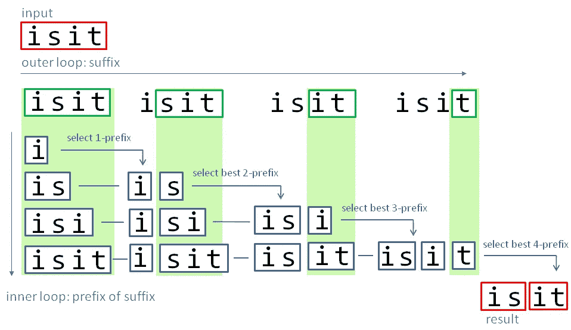
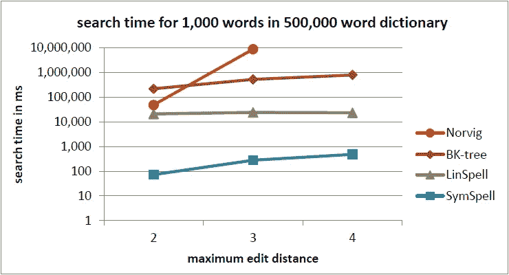

# 噪声文本的快速分词

> 原文：<https://towardsdatascience.com/fast-word-segmentation-for-noisy-text-2c2c41f9e8da?source=collection_archive---------3----------------------->


[Vergilius Vaticanus](https://de.wikipedia.org/wiki/Vergilius_Vaticanus#/media/File:Vergilius_Vat_Folio_31v.jpg)

# TL；速度三角形定位法(dead reckoning)

**更快**用三角矩阵代替动态规划分词。集成的**拼写纠正**允许**嘈杂的输入文本**。GitHub 上的 [C#源代码](https://github.com/wolfgarbe/SymSpell)。

对于西方人来说，单词之间用空格分隔似乎是显而易见的，而在汉语、日语、朝鲜语(CJK 语言)、泰语和爪哇语中，单词之间是没有空格的。

甚至古典希腊语和晚期古典拉丁语都没有这些空格。这被称为[continua](https://en.wikipedia.org/wiki/Scriptio_continua)脚本。

似乎我们还没有失去我们的能力:我们可以很容易地破译

**quickbrownfoxjumpsoverthelazydog**

如同

敏捷的棕色狐狸跳过懒惰的狗

我们的大脑以某种方式直觉地和无意识地做到这一点。我们的阅读速度稍微慢了一点，这是因为我们的大脑需要处理所有的背景信息。如果我们尝试以编程的方式来做，我们将会看到它到底有多少。

# 为什么？

但是，如果人们无论如何都能阅读未分段的文本，我们为什么要以编程方式实现分词呢？

***对于单词间没有空格的 CJK 语言来说*** *，*就更明显了。

像谷歌或百度这样的网络搜索引擎必须以一种允许高效快速检索的方式对文本进行索引。那些网络搜索引擎是基于倒排索引的。在抓取每个单词的过程中，会创建一个单独的链接列表。每个列表都包含指向出现该特定单词的所有网页的链接。

如果我们搜索一个单词，那么列表中包含的所有链接都是有效的搜索结果。如果我们对两个单词进行布尔搜索(AND ),那么这两个列表相交，并且只有包含在两个列表中的链接作为结果返回。

**拼写纠正**允许纠正拼错的单词。这是通过在字典中查找可能拼错的单词来完成的。如果找到该单词，则该单词被认为是正确的。如果没有找到该单词，那么字典中最接近候选的那些单词(根据编辑距离度量，如 [Damerau-Levenshtein](https://en.wikipedia.org/wiki/Damerau%E2%80%93Levenshtein_distance) )被呈现为拼写纠正建议。当然，计算每个字典条目的编辑距离的简单方法是非常低效的。[符号拼写](https://seekstorm.com/blog/symspell-vs-bk-tree/)是一个快得多的算法。但无论如何，前提条件是首先识别单词边界，以便首先为拼写校正算法提供输入。

**机器翻译，语言理解**，S **感知分析**等很多信息处理任务也是基于单词的。

但是对于单词之间已经有空格的语言，我们为什么还需要分词呢？嗯，即使在那些通常有空格的语言中，有时也会缺少空格！应用领域多得惊人:

*   **规范化书写可变的英语复合名词**:例如，ice box = ice-box = icebox 猪圈=猪圈=猪圈)进行搜索&索引。
*   **复合词分词:**原词和拆分词部分都应编入索引。
*   打字错误可能导致空格丢失。
*   **转换错误**:在转换过程中，word 之间的一些空格可能会丢失，例如，通过删除换行符而不是用空格替换它们。
*   **OCR 错误**:原始文档或手写文本的质量较差，可能会导致无法正确识别单词之间的所有空格。
*   **传输错误:**在噪声信道上传输期间，可能会丢失空格或引入拼写错误。
*   **关键字提取**从 URL 地址、域名、表格列描述或无空格书写的编程变量。
*   对于**密码分析**，可能需要从密码中提取术语。
*   **语音识别**，如果在口语中不能正确识别单词之间的空格。
*   **[**自动编程变量**](https://en.wikipedia.org/wiki/Camel_case) 。**

**但是，除了自然语言之外，单词分割也可能是令人感兴趣的，例如，将 DNA 序列分割成单词 (PDF)。**

# **分段变体生成**

**一个字符串可以用几种方式来划分。每个不同的分割变体被称为一个**组合**。存在多少种不同的成分？**

*   **在长度为 n 的字符串中，**潜在字边界的数量**是**n’= n-1**(在字符串的每个字符之间)。**
*   **这些位置中的每一个实际上都可以用作字边界，也可以不用作字边界。我们可以认为这是一个二进制形式的数字，其中每一位都可以设置或不设置。**
*   **在二进制数字系统中，一个 n 位数可以代表 x=2^n 数。因此，分割变体的数量也是**x=2^n'**(n’潜在单词边界的数量)**
*   **每个长度为 n 的字符串可以被分割成**个 2^n−1** 个可能的[个组合](https://en.wikipedia.org/wiki/Composition_(combinatorics))。**

**必须根据两个标准评估钻柱的成分:**

1.  **作文是否是有效的分词，即由真实的单词组成(我们将学习如何处理未知单词)。**
2.  **对于特定的输入字符串，哪个有效的单词分段(可能存在几个)具有最高的概率，并且将被选为最终结果。**

# **递归方法**

**最简单的方法是生成所有可能的变体，将字符串分割成子字符串(候选单词),并在字典中查找这些候选单词。所有子字符串都是有效单词的那些分段变量将作为结果返回。**

**以下递归算法枚举所有合成:**

**对于“ **isit** ”作为输入，它将生成所有 **8 个可能的组合**:**

```
i s i t
i s it
i si t
**i sit**
is i t
**is it**
isi t
isit
```

**两个作文由真正的英语单词组成，并且将是有效的分段建议。在**分段变量选择**部分，我们将学习如何确定两个变量中哪一个更有可能。**

**但是有一个问题。长度为 n 的每一串可以被分割成 **2^n−1** 可能的[成分](https://en.wikipedia.org/wiki/Composition_(combinatorics))。这是巨大的！**

> **朴素的算法是**指数**和**不会缩放**更长的字符串！**

**例如，我们的字符串**quickbrownfoxjumpsoverthelazydog**的长度为 35。这导致产生超过**170 亿**个切分变体，它们的所有单词都要在字典中进行验证，最后，这些变体按概率进行排序。**

**我们通常没有那么多时间和计算能力。我们需要想出更聪明、更有效的方法。**

# **局部最优的增量计算**

> **我们**不需要为了**找到最好的**而生成所有的**作文！**

**在朴素算法中，生成分割变量的整个树。对于**重复子串**，也重复生成**分段**。并且仅在最后，所有生成的完整分割被比较以找到最佳分割。**

**但是**每个特定的子串我们只需要分割一次**。我们只为每个子串计算一次最佳部分分割，并在整个输入串的增量分割期间重用它。**

**局部最优的**选择基于**假设连续的部分分割是独立的**。****

> **只计算一次每个子串的最佳分段并重用它**节省了生成和存储重复模式所需的大量时间和内存**。**

**下一节将介绍两种不同的方法来实现这一点。**

# **动态规划方法**

**改进算法的一种方法是使用[动态编程](https://en.wikipedia.org/wiki/Dynamic_programming):**

**这是一种解决复杂问题的方法，将复杂问题分解成一系列更简单的子问题，每个子问题只解决一次，然后存储它们的解。下一次出现相同的子问题时，不用重新计算它的解，只需查找先前计算的解，从而节省计算时间。每个子问题解都以某种方式被索引，通常基于其输入参数的值，以便于查找。将子问题的解存储起来而不是重新计算的技术叫做“ [*记忆化*](https://en.wikipedia.org/wiki/Memoization) *”。【来源:维基百科】***

**每次在我们的程序进行递归调用来分割剩余的字符串之前，我们都要检查这个精确的子串以前是否被分割过。如果是这样，我们只需消除递归调用，并从缓存中检索该子串的最佳分割结果(在特定子串第一次被分割时存储在缓存中)。**

**这种技术已经被多次用于分词:**

*   **彼得·诺维格的[分词 Python 代码](http://norvig.com/ngrams)详见本书 [*自然语言语料库数据*](http://oreilly.com/catalog/9780596157111/) *[*章节【优美数据*](http://norvig.com/ngrams/ch14.pdf)***
*   **grant Jenks[python _ word segment](https://github.com/grantjenks/python-wordsegment)。**
*   **杰昆[分词](https://jeremykun.com/2012/01/15/word-segmentation/)**

**由于我在网上找不到 C#端口，下面是我对动态编程方法的实现:**

**[WordSegmentationDP source code](https://gist.github.com/wolfgarbe/fd1d02d05b6da9828ed8fd9a28648338)**

# **三角矩阵方法**

****动态规划**方法使用**递归**和**字典**来记忆**剩余子串**的最佳分段。**

****三角矩阵方法**使用**嵌套循环**和**循环数组**来存储**前缀子串**的最佳分段。**

**生成长度递增的部件的三角形矩阵，组织成圆形阵列。此**允许恒定的 O(1)内存消耗**(与动态编程的线性 O(n)相比)，因为一旦不再需要中间分段变量，它们就会被覆盖。不是存储完整的分段串，而是仅使用潜在空间位置的**位向量。这**减少了存储分段变量的内存消耗**(1 位而不是 1 字符)并且**垃圾收集友好**。****

****

**Triangular Matrix algorithm**

**以及三角矩阵方法的 C#实现:**

**[WordSegmentationTM source code](https://gist.github.com/wolfgarbe/f2e04bcbb7b3d92c83466e0a9354348d)**

# **动态规划与三角矩阵**

**那么，这两种方法的相同点和不同点是什么呢？**

*   **两种算法提供**相同的结果**。**
*   **两者具有相同的线性计算复杂度 O(n)。**
*   **两者都存储特定子串的最佳分段变量，因此只需计算一次。**
*   **DP 连续计算特定**剩余子串****的所有分段变量。最好的变体是存储在缓存字典(哈希表)中的**。为了访问特定余数的分割结果，子串**被用作关键字**。******
*   **TM 在内部循环的特定位置计算特定**前缀子串** **非连续**的分段变量。最好的变体是存储在数组中的**。为了访问特定前缀子串的分割结果，循环位置被用作索引**。**
*   **TM 有一个**常量内存消耗** *(数组大小= O(1)= maxSegmentationWordLength)*，而 DP 有一个**线性内存消耗** *(缓存字典条目数= O(n) =输入文本长度)。***
*   **此外，即使对于相同数量的条目，数组(MT)的**内存消耗也低于字典(DP)的**内存消耗。**
*   **此外，TM 仅存储潜在空间位置的**位向量，而 DP 存储完整的分段串。这进一步**减少了存储分段变量的内存消耗**(1 位而不是 1 字符)并且**垃圾收集友好**。****
*   **通过索引(MT)访问数组的**比通过键(DP)访问缓存字典的**更快。**
*   **两者的词频词典的**查找号码类似于**。**
*   **迭代通常比递归快，并防止可能的递归限制(超过最大递归深度/堆栈溢出)。**

> **在我的基准测试中，**三角矩阵方法比动态编程方法快 2 倍。它有**更低的内存消耗**，**更好的可伸缩性**，并且**是 GC 友好的**。****

**最初我认为这两种方法完全不同。 *但在比较了它们的特点后，我认为三角矩阵方法是* ***只是一种特殊形式的动态编程*** *，它使用一个* ***数组代替字典*** *进行记忆，使用* ***循环代替递归*** *并增量优化* ***前缀字符串而不是*****

# **最大字长**

**候选单词是从最大长度的字符串中生成的。Norvig 将最大单词长度任意选择为 20。由于[最长的单词是语言相关的](https://en.wikipedia.org/wiki/Longest_words)(中文最多 6 个字符)，最好从字典中存在的最长单词中导出。虽然这是试探性的，但是不太可能存在大于字典中包含的最长单词的有效真实单词。它还可以防止查找我们已经知道不在字典中的单词，并创建包含这些不存在的单词的组合。这将确保最大的分割速度。**

# **计算的复杂性**

**动态规划和三角矩阵方法都有一个**线性运行时间 O(n)** 来寻找最佳组合。**

**文本长度 n 和运行时间的确切关系是 **O(n*Min(n，最大字典字长)/ 2)** 。**

# **分段变量选择**

**不过，将字符串拆分成单词可能有几种有效的方法:**

****isit** 可能是 **i sit** 或者是**it****

**词频(或单词出现概率)用于确定最可能的分段变量。**

> ****单词** **出现概率 P =字数 C /语料库规模 N****

**语料库大小 N 是用于生成频率词典的文本语料库中的总字数。只有当字典是完整的，n 才等于频率字典中所有计数 c 的和，但如果字典被截断或过滤，n 就不等于。**

# **朴素贝叶斯规则**

**我们假设两个单词的单词概率是独立的。因此，单词组合的朴素贝叶斯概率是两个单词概率的乘积:**

> ****P(AB)=P(A)*P(B)****

**使用**双词概率**代替**单字概率**可以进一步提高切分质量。**

# **对数标度**

**我们不是计算概率的**乘积**，而是计算概率对数的**和。因为单词的概率是关于 10^-10 的，所以许多这样的小数字的乘积可能超过(下溢)浮点数的范围并变成零。****

> ****log(P(AB))= log(P(A))+log(P(B))****

# ****已知单词****

**为了计算单词出现的概率，我们可以使用不同的方法:**

1.  **通过统计大型文本语料库中的单词来创建我们自己的词频词典。如果字典来源于与你要处理的文档相似的语料库，那么**相似词出现概率**分布将确保**最优结果**。**
2.  **使用包含字数的现有频率词典，例如 [Google Books Ngram 数据](http://storage.googleapis.com/books/ngrams/books/datasetsv2.html)。缺点是 Google Books Ngram 数据不仅包含有效单词，还包含拼写错误和其他片段。虽然许多拼写错误由于概率低，无论如何都不会有影响，但这并不总是有保证的。例如，常用词的频繁拼写错误可以战胜真正的稀有词。**
3.  **词典质量对于分段质量至关重要。为了实现这一点，两个数据源可以通过交集来组合:巨大的 [Google Books Ngram 数据](http://storage.googleapis.com/books/ngrams/books/datasetsv2.html)提供了**有代表性的词频**(但是包含许多有拼写错误的条目)**，甚至对于罕见的单词**和[SCOWL——面向拼写检查器的单词列表](http://wordlist.aspell.net/)，其**确保了真实的英语词汇**(但是不包含在相同编辑距离内对建议进行排序所需的词频)。**

**我已经决定使用变体 3，即真正的英语单词词典与来自 Google Books Ngram 语料库的词频的交集，因为即使对于罕见的单词也有相关的词频。但是**与变体 1 相比的缺点**是谷歌语料库来源于不同世纪的**书籍**。随着时间的推移，语言的使用已经发生了变化，语言的使用在不同的领域也有所不同(如医学、法律、散文、新闻、科学)。**

# **未知单词**

**我们不能完全依赖字典。没有一本字典是完整的。有生僻词、新词、外来词、人名、品牌名、产品名、缩略语、非正式用词、俚语、拼写错误。即使对于字典中不包含的单词，我们也希望分词算法选择最可能的分词变体。**

**因此，我们必须估计一个词出现的概率，以未知的词。我们拥有的甚至是未知单词的信息就是它们的长度。**

**乔治·金斯利·齐夫观察到单词的长度和它们的频率成反比。经常使用的词，如“the”，往往很短(Zipf g . The psycho biology of Language)。Zipf 用“最小努力原则”(Zipf g . Human Behavior and the Principle of less Effort)对此进行了解释。**

**[Peter Norvig 在《自然语言语料库数据》第 224 页](http://norvig.com/ngrams/ch14.pdf)中提出了以下计算未知单词概率的公式:**

> ****近似词出现概率 P=10 / (N * 10^word 长度 l)****

**我们必须意识到，这是一个包含**启发式参数**的**原始估计值**，可能需要针对除英语之外的**语言进行调整。关于单词长度和词频关系的更多信息可以在 Miller，Newmann，Friedmann 的[**书面英语的长度-频率统计**和 Strauss，Grzybek，Altmann](https://www.sciencedirect.com/science/article/pii/S0019995858902298) 的 [**【单词长度和词频】**中的不同语言方面找到。](http://www.peter-grzybek.eu/science/publications/2006/grzybek_us_ga_2006_word_length_frequency.pdf)****

**当然，我们可以想到更复杂的概率计算，例如，通过使用**马尔可夫链**或**已知前缀和后缀**来估计特定子串成为真正单词的概率。这将使正确分割连续的未知单词成为可能。**

# **语言**

**分词**算法本身是语言独立的**。但是**词频词典是特定于语言的**。为了对以某种语言编写的文本进行分词，需要该语言的频率词典。 [Google Books n-gram 数据](http://storage.googleapis.com/books/ngrams/books/datasetsv2.html)包括许多语言的词频。**

**此外，如上所述，根据未知单词的长度来估计未知单词的概率的公式包含启发式参数，必须针对每种语言单独调整这些参数，以获得最佳分割结果。**

# **分词和拼写纠正**

**如上所述，存在几种分词解决方案。**

> **符号拼写。分词**结合了分词和拼写纠正**。**

**在切分过程中，会生成许多潜在的候选单词，所有候选单词都需要进行拼写检查，并对候选建议进行排序。**

**这只有通过利用 SymSpell 的[极限查找速度才是可行的:](https://seekstorm.com/blog/symspell-vs-bk-tree/)**

****

**通过**最大编辑距离**的一个参数，我们可以控制允许多少拼写纠正。在 maxEditDistance=0 的情况下，我们有没有拼写校正的纯单词分割。在 maxEditDistance=2 的情况下，如果字典中的所有单词都在一个 [Damerau-Levenshtein](https://en.wikipedia.org/wiki/Damerau%E2%80%93Levenshtein_distance) 编辑距离≤2 的范围内，我们就认为它们是子字符串的有效候选词。**

**更高的最大编辑距离允许**校正更多的错误**，但是以**假阳性校正**和更低的分割性能为代价。实际的权衡取决于投入材料的质量。它可以使有错误的输入变得可读，但也可能给原本完美的输入带来错误。**

****例 1****

```
input:                 isit
Norvig segment:        is it             -> no spelling correction
WordSegmentation ed=0: is it             -> no spelling correction
**WordSegmentation ed=1: visit             -> spelling correction** LookupCompound ed=0:   i sit             -> no spelling correction
**LookupCompound ed=1:   visit** -**> spelling correction**
```

****例 2****

```
input:                 independend
Norvig segment:        in depend end      -> no spelling correction
WordSegmentation ed=0: in depend end      -> no spelling correction
**WordSegmentation ed=1: independent        -> spelling correction** LookupCompound ed=0:   independend        -> no spelling correction
**LookupCompound ed=1:   independent        -> spelling correction**
```

****例 3****

```
input:                 whocouqdn’tread
Norvig segment:        who couqdn’t read  -> no spelling correction
WordSegmentation ed=0: who co uqdn’t read -> no spelling correction
**WordSegmentation ed=1: who couldn’t read  -> segmentation+correction** LookupCompound ed=0:   whocouqdn’tread    -> more than 1 space/token
LookupCompound ed=1:   whocouqdn’tread    -> more than 1 space/token
```

****为了使 SymSpell 的算法具有可比性。分词和 Norvig 的分词相同* [*频词典*](https://github.com/wolfgarbe/SymSpell/blob/master/SymSpell/frequency_dictionary_en_82_765.txt) *一直在使用。***

# **单词分段与查找复合**

**[**SymSpell**](https://github.com/wolfgarbe/SymSpell) 拼写纠正和模糊搜索库附带一个方法[**lookup compound**](https://github.com/wolfgarbe/SymSpell#compound-aware-automatic-spelling-correction)。它支持多单词输入字符串的复合感知自动拼写纠正，有三种情况:**

1.  **在正确的单词中错误地插入空格导致了两个不正确的术语**
2.  **错误地省略了两个正确单词之间的空格，导致了一个不正确的组合术语**
3.  **有/无拼写错误的多个输入术语**

**拆分错误、连接错误、替换错误、换位错误、删除错误和插入错误可以混合在同一个单词中。**

****

**那么，**符号之间有什么区别呢。单词切分**和**符号拼写。LookupCompound** ，和什么相似？**

*   ****两个**都可以在多词输入字符串中插入和删除空格，以及纠正拼写错误。**
*   ****LookupCompound** 可以**只在令牌**中插入一个空格(由现有空格分隔的字符串片段)。它用于单词分段文本的拼写纠正，但可以修复偶尔丢失的空格。因为每个标记只有一个空格，所以要生成和评估的变量较少。因此，它更快，并且校正的质量通常更好。**
*   ****分词**可以**在一个令牌中插入任意多的空格**。因此，它也适用于没有任何空间的长字符串。缺点是速度和校正质量较慢，因为存在更多的潜在变量，需要生成、评估和从中选择。**

# **应用**

**CJK 语言文本或嘈杂文本的分词是搜索引擎和[搜索即服务搜索 API](https://seekstorm.com) 的文本处理管道的一部分，在这里你必须每秒索引数千个文档。在分词甚至不是主要处理任务，而只是文本预处理中许多组件之一的情况下，您需要最快的分词算法。**

# **源代码**

****分词** *无*拼写纠正 **:****

**[**worsegmentationtm**](https://github.com/wolfgarbe/WordSegmentationTM)**和**[**worsegmentationdp**](https://github.com/wolfgarbe/WordSegmentationDP)**并在 [GitHub](https://github.com/wolfgarbe/WordSegmentationTM) 上发布为**开源**在 **MIT 许可下。******

******分词** *同* **拼写更正:******

****[**WordSegmentation**](https://github.com/wolfgarbe/SymSpell)**和[**lookup compound**](https://github.com/wolfgarbe/SymSpell)**是 [**SymSpell**](https://github.com/wolfgarbe/SymSpell) 库的一部分，在 [GitHub](https://github.com/wolfgarbe/SymSpell) 上发布为**开源**在 **MIT 许可**下。********