# (几乎)实时检测物体:FasterRCNN 用代码解释

> 原文：<https://towardsdatascience.com/fasterrcnn-explained-part-1-with-code-599c16568cff?source=collection_archive---------1----------------------->

FasterRCNN 是一个做物体检测的网络。正如它的名字所解释的，它比它的后代 RCNN 和 FastRCNN 更快。有多快？几乎实时快速。这个网络在自动驾驶汽车、制造业、安全领域都有用例，甚至在 Pinterest 上也有使用。

这篇论文于 2015 年发表，有许多精彩的帖子解释了它是如何工作的(例如: [#1](https://docs.microsoft.com/en-us/cognitive-toolkit/object-detection-using-faster-r-cnn) 、 [#2](https://medium.com/@smallfishbigsea/faster-r-cnn-explained-864d4fb7e3f8) 、 [#3](https://arxiv.org/abs/1506.01497) )。所以我想探究它是如何处理这个回购协议提供的公共实现的:[https://github.com/jwyang/faster-rcnn.pytorch](https://github.com/jwyang/faster-rcnn.pytorch)

我们通过一个例子来了解一下 FastRCNN。让我们看一个给定的图像 x。

**使用 FastRCNN 的较慢过程将如下进行:** 1)在图像上使用类似选择性搜索的算法来生成感兴趣的框/区域
2)通过 CNN 运行图像来获得**特征图** 3)对于步骤 1 中生成的每个框，使用特征图和几个完全连接的层来输出类+边界框坐标(稍后将详细介绍)

**faster CNN 如何工作:** 1)通过 CNN 运行图像以获得**特征图** 2)通过称为区域提议网络(RPN)的独立网络运行激活图，该网络输出感兴趣的框/区域
3)对于来自 RPN 的感兴趣的框/区域，使用几个完全连接的层来输出类+边界框坐标

这里的不同之处在于，FasterRCNN 解决了第一步必须对每个图像进行选择性搜索的瓶颈。选择性搜索的大多数实现都是在 CPU 上进行的(很慢),它本质上是一个独立的算法，所以让我们去掉它吧！

> 直觉是:使用 FastRCNN，我们已经在 CNN 中计算了一个激活图，为什么不通过几个层来运行激活图以找到感兴趣的区域，然后通过预测类+ bbox 坐标来完成向前传递呢？

好了，现在让我们来看一些代码。

代码库用 Resnet101 和 VGG16 实现了 FasterRCNN。由于架构简单，我将使用 VGG16 进行解释。第一步，将网络定义为 RCNN_base，RCNN_top。RCNN_base 就是做第一步，从图像中提取特征。RCNN_top 是网络的其余部分，它通常使用提取的特征来分类/预测东西。

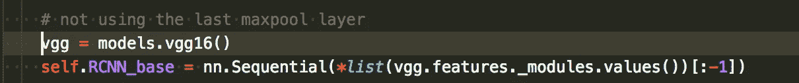

Get all the layers except the layers

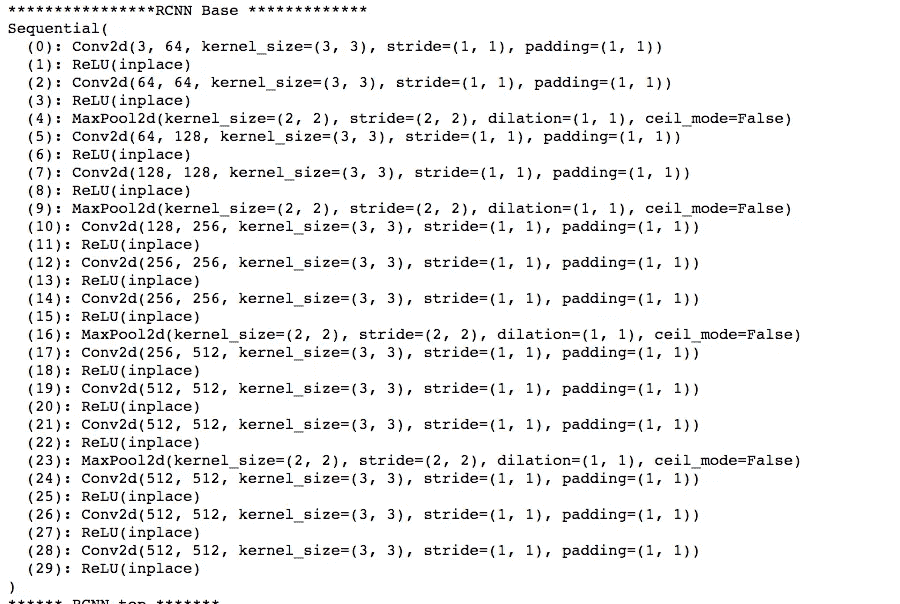

RCNN Base is the first part of the VGG

现在我们有了基本的特征地图，我们把它传递给区域提议网络，它应该找到感兴趣的区域。它返回感兴趣区域、关于是否找到对象的损失以及关于对象位置的损失。

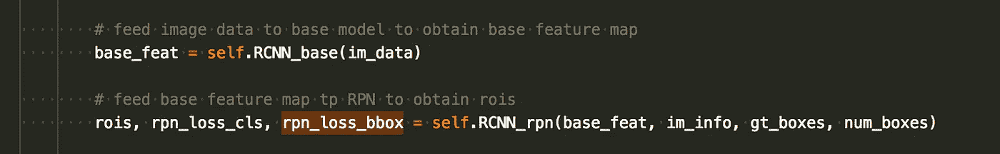

# 好吧，那 RPN 是怎么回事？

在我们谈论这个之前，我们必须定义**锚，**锚是不同大小的盒子，用于帮助检测各种大小的物体(例如，人、车辆等)。在默认配置中，有 3 个比例和 3 个比率，总共有 9 个锚。在我们的特征图中的每个点，我们将运行这 9 个锚点(稍后会详细介绍)。

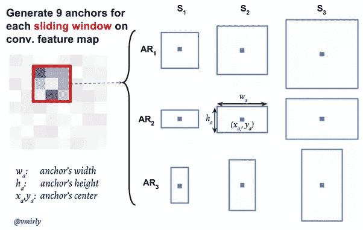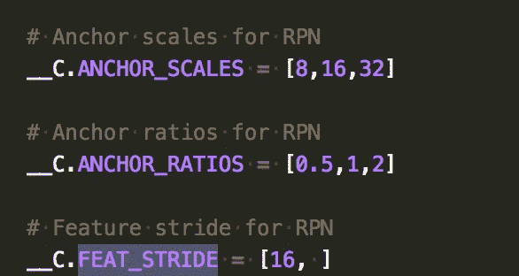

Picture Source: Vahid Mirjalili [https://www.quora.com/How-does-the-region-proposal-network-RPN-in-Faster-R-CNN-work](https://www.quora.com/How-does-the-region-proposal-network-RPN-in-Faster-R-CNN-work)

好了，让我们回到弄清楚 RPN 是干什么的。

rpn.py 中的第一行获取基本的特征地图，无论它是什么维度，都使用 3x3 内核将其缩放到 512 的固定维度。

结果然后被发送到两个不同的卷积层:让我们称它们为类层和 BBox 坐标层
1)类为每个**锚点**
预测 2 个类概率(对象存在/无对象)2) BBox 坐标预测一个边界框相对于每个**锚点**的 4 个坐标

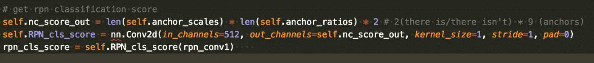

Code for above Layer 1,

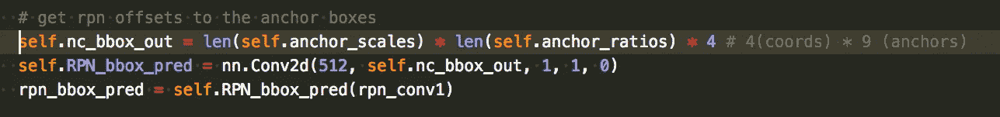

Code for above Layer 2

假设一个给定的图像是 600 x 891。到 RCNN_base 完成时，它将被整形为批量大小 x 1024 x 38 x 56。然后，它将被第一个 rpn conv 标准化为批量 x 512 x 38 x 56。

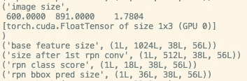

如上所示，对于 38 x 56 特征地图中的每个点:
1)conv 类图层的结果为每个点输出 18 个值。这是有意义的，因为 18 个值对应于(存在/缺失)* 9 个锚的 2 类概率。结果是批量 x 18 x 38 x 56

BBOX 层的结果为每个点输出 36 个值。这是有意义的，因为 36 个值对应于 4 个边界框坐标* 9 个锚点。

类别概率的注释:
类别概率为 0 - > 1，因为应用了软最大值函数

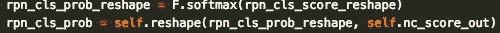

BBox 系数注意:
边界框坐标是相对于特定锚点的值[0，1]。x、y、w 和 h 表示盒子的中心坐标及其宽度和高度。*值=地面真相。例如，t_x 表示 x 的系数(方框中心)。你可以把 t_x 乘以 w_a，然后加上 x_a，得到预测的 x，反之亦然。

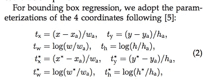

## 所以 RPN 计算类概率和 bbox 系数，我认为它应该找到感兴趣的区域？

好的，所以如果你有一个 38 x 56 x 9 个锚点的特征图，以 16 的步幅采样，那就有很多建议了！(38 x 56 x 9) / 16 =单个图像的 1192 个建议。显然，我们不能把它们都保存下来，一张图片上可能只有一些有趣的东西。

因此，RPN 对提议进行排序，以找到具有相应最高概率的提议。因为我们有如此多的提议，所以肯定会有认同相同对象的提议。我们应用非最大抑制，只保留最有把握的建议，并删除 IOU > 0.7 的所有其他建议。

[https://www.pyimagesearch.com/wp-content/uploads/2014/10/hog_object_detection_nms.jpg](https://www.pyimagesearch.com/wp-content/uploads/2014/10/hog_object_detection_nms.jpg)

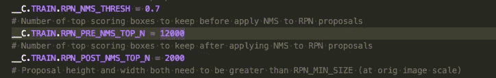

# 太好了。所以 RPN 提出建议，如何评价网络的其余部分？

因此，一旦 RPN 产生了感兴趣的区域，这些 ROI 的大小可能会不同。我们正计划将这些 ROI 输入另一个 CNN，该 CNN 预计有一个固定的大小，所以我们必须做**兴趣池区域。**

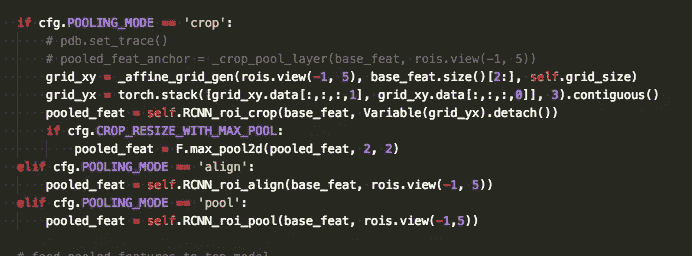

在汇集结束时，我们希望将大小为 38 x 56 x 512 的特征地图转换为大小为 7 x 7 x 512 的特征地图。有三种方法可以做到这一点: **ROI 裁剪**， **ROI 对齐**， **ROI 池**。在最初的论文中，他们使用了 [ROI Pooling](https://blog.deepsense.ai/region-of-interest-pooling-explained/) ，它将特征图分成 7×7 个部分，并获得每个部分的最大值。

然而，正如在这个[视频](https://www.youtube.com/watch?v=XGi-Mz3do2s)中所解释的那样，由于不均衡的划分，投资回报池似乎丢失了一些信息。实际的默认实现是 **ROI 对齐。**要阅读更多关于 ROI Align 的内容，请查看使用它的 [Mask-RCNN](https://arxiv.org/pdf/1703.06870.pdf) 论文，它通过标记其像素来完成更困难的检测对象的工作。

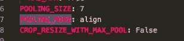

好了，现在我们有了名为 pooled_feat 的 7x7 要素地图，我们将它传递给我们之前定义的 RCNN_top！如下所示，_head_to_tail 函数首先将 7x7 展平为 1x49，然后将其传递给 RCNN_top。

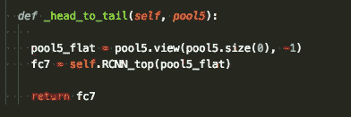

作为参考，这是 RCNN_top 的样子。是两个 fc 层。第一个图层包含 25088 个要素，因为我们的要素地图的形状是 7x7x512 = 25088。

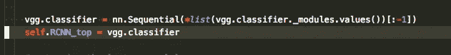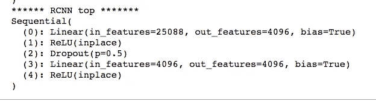

RCNN top

# **最后一步！**

我们采用 4096 特征，并通过两个独立的完全连接的层来运行它，以获得类分数和边界框预测。

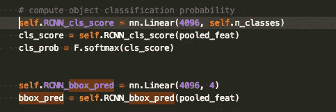

# **训练网络**

更快的 RCNN 由两个不同的网络组成:提出建议的**区域建议网络**，以及接受建议并评估类/bbox 的**评估网络**。这两个网络有两个不同的目标，所以你必须对它们进行稍微不同的训练。

对于地区提案网络，您希望教会它更好地提出这些提案。在代码中有一个**锚目标类**,它接受地面真相盒并获得相应的类分数/bbox 系数。如果锚和地面真实的 IOU 重叠超过 0.7，则锚目标得到“1”类，并且其 bbox 系数是 gt 的系数。如果小于 0.3，就是反面例子。

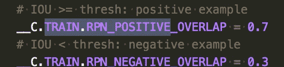

对于分类，我们使用交叉熵损失，它衡量输出为 0 到 1 的分类模型的性能。

对于 Bbox 回归，我们使用平滑的 L1 损失，它是预测值和实际值之间的绝对值。他们的理由是，与 L2 等损失相比，L1 损失对异常值不太敏感，这使误差平方。

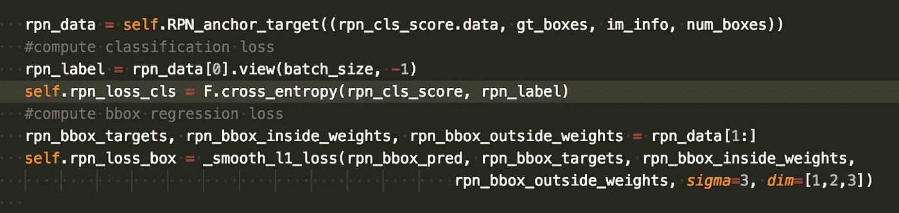

一旦 RPN 网络损失函数被定义，我们为**评估层定义另外两个损失函数。**逻辑完全相同，除了交叉熵损失是在多个类之间:“猫、狗、火鸡”而不是“在场/不在场”。bbox 回归是一样的。

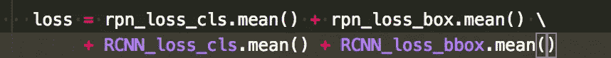

在 Pytorch 中，您可以将一个损耗定义为多个损耗的组合，因此这是 RPN 的两个损耗和评估层的两个损耗的组合。然后你可以同时优化这两层。

然而，在论文中，他们使用了一种在训练 RPN 和评估层之间交替的训练方案，但这是一个可选的细节。

【FasterRCNN 到此为止。感谢您花时间阅读我的文章！