# 使用移动 web 应用和 REST APIs 服务、演示和测试深度学习模型的最快方式

> 原文：<https://towardsdatascience.com/fastest-way-to-serve-demo-and-test-your-deep-learning-model-with-a-mobile-web-app-and-rest-apis-38cfbbf90a52?source=collection_archive---------8----------------------->

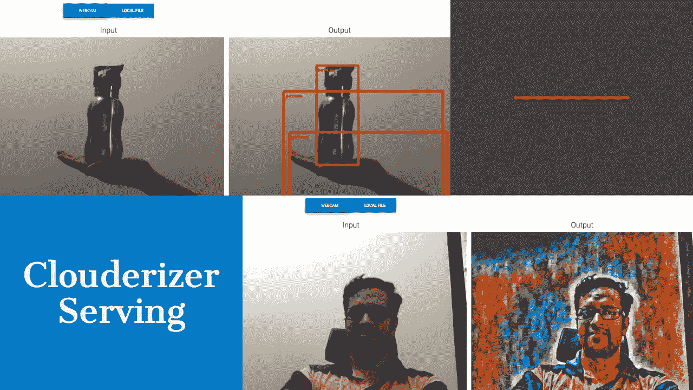

一旦我们设计、训练并完善了我们的深度学习模型，快速简单地部署该模型以用真实生活输入来评估它并向他人演示它的方法总是受欢迎的。虽然有许多全面的 DL 模型服务框架，如 Tensorflow 服务、MXNet 模型服务(MMS ),但其中大多数都是为可扩展的生产部署而设计的，编写脚本和设置都是资源密集型和耗时的。

寻找廉价和轻量级解决方案的 ML 开发人员通常最终使用 Flask 编写轻量级 RESTful 端点，并公开托管它，使用 curl 或一些定制客户端来消费这些 REST apis。

我们的团队从最近几个月开始一直致力于提出一个解决方案，它可以

1.  允许我们创建公共 RESTful 端点来服务我们的模型，而不需要或只需要很少的编码和设置。
2.  主机 a，即用型，web app，使用上述 REST api，快速评估模型。这个 web 应用程序应该能够接受各种类型的输入——图像、视频、音频、文本和其他文件，并直观地显示输出。
3.  上述 web 应用程序应响应迅速，移动友好，以便许多基于机器视觉的模型可以很容易地在现场评估，使用手机摄像头。

在我们继续致力于一个通用、灵活和无缝的解决方案的同时，我们很高兴地宣布服务于的 **Clouderizer 的首次发布。**

每个 Clouderizer 项目现在都有一个选项，在 SETUP 选项卡下启用 Clouderizer 服务。

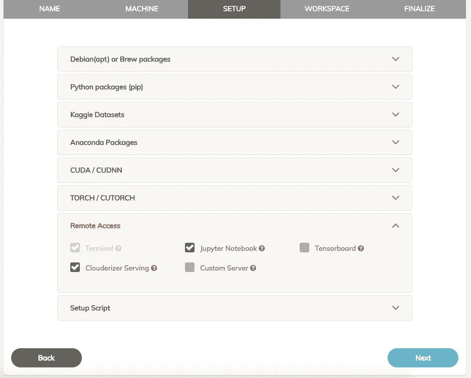

Image 1 : Clouderizer Serving option in project settings

一旦打开这个选项，Clouderizer 将自动在运行项目的机器上设置一个 Flask 服务应用程序。服务应用程序将可以从 Clouderizer 控制台访问，就像 Jupyter 笔记本和终端一样。

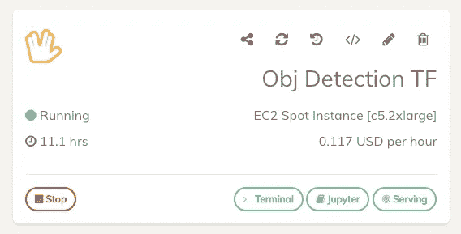

Image 2 : Clouderizer project running with Serving

Clouderizer 社区已经预配置了几个项目来演示 Clouderizer 服务。

1.  使用张量流的目标检测
2.  基于 PyTorch 的快速神经风格转换

在本文中，我们将使用对象检测模板进行演示。下面是让 Clouderizer 投入使用的步骤

*   如果你还没有一个帐户，请在[这里](https://console.clouderizer.com/auth/register)注册一个免费的 Clouderizer 帐户。
*   登录 Clouderizer 控制台并转到社区项目。
*   搜索 **Obj 检测 TF** 模板。本项目从[这里](https://github.com/tensorflow/models/tree/master/research/object_detection)开始设立官方 Tensorflow 物体检测项目。按克隆。

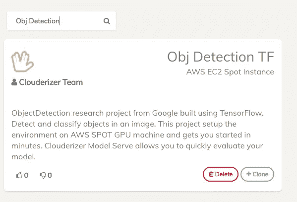

Image 3 : Tensorflow Object Detection community template

*   为您的项目指定一个名称，然后按下一步。
*   在 Machine Setup 选项卡上，此项目被预配置为在 AWS EC2 Spot 实例 c5.2xlarge 上运行(推荐)。如果您尚未将您的 AWS 帐户与 Clouderizer 关联，您可以遵循这些说明中的[。如果您希望从终端或 Google Colab 上手动运行，也可以在此选项卡中选择本地机器。](https://blog.clouderizer.com/aws-clouderizer-machine-learning-nirvana/)

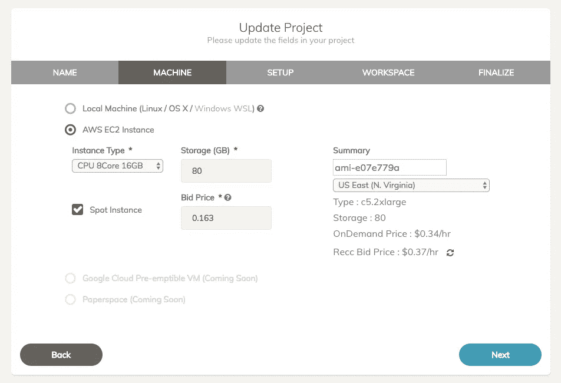

Image 4 : Machine setup for Object Detection project

*   在所有其他选项卡上单击“下一步”,完成向导。
*   现在从主控制台，按下这个项目的开始。Clouderizer 完全自动化基于 EC2 的项目，旋转一个新的 spot 实例并启动项目。对于基于本地机器的项目，您需要复制启动命令并将其粘贴到目标机器的终端上(或 Google Colab 代码块)。
*   一旦启动，您可以在控制台上看到自动安装进度。应该需要 5-6 分钟来设置一切和项目状态，以转向运行。

Image 5 : Object Detection project Running with Clouderizer Serving

*   我们在这里可以看到，这个项目现在有了一个新的按钮，**发球**。
*   按下此按钮将启动 Clouderizer 服务 web 应用程序。您也可以在移动网络浏览器上打开此 URL

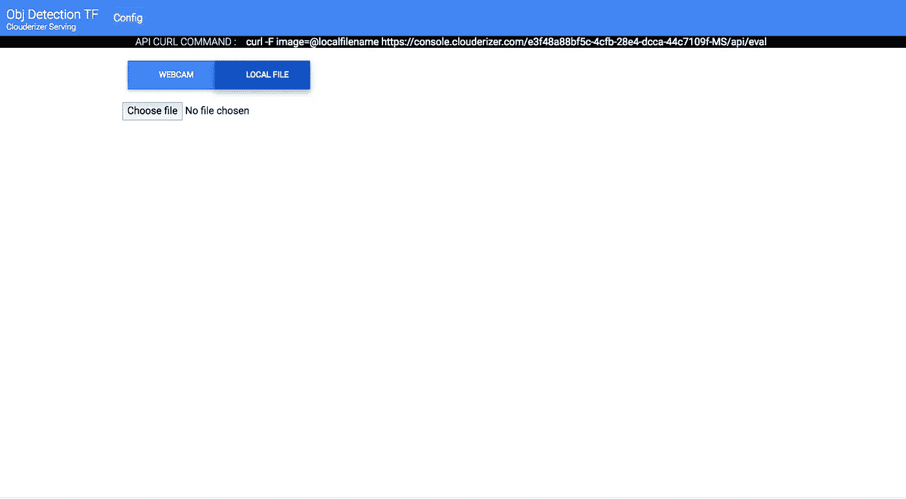

Image 6 : Clouderizer Serving web app for Object Detection project

*   按网络摄像头选项卡。这需要设备摄像头的许可。一旦允许，它应该允许您使用设备摄像头捕捉输入图像。将相机对准感兴趣的对象，然后按下 capture。这将设置输入图像。

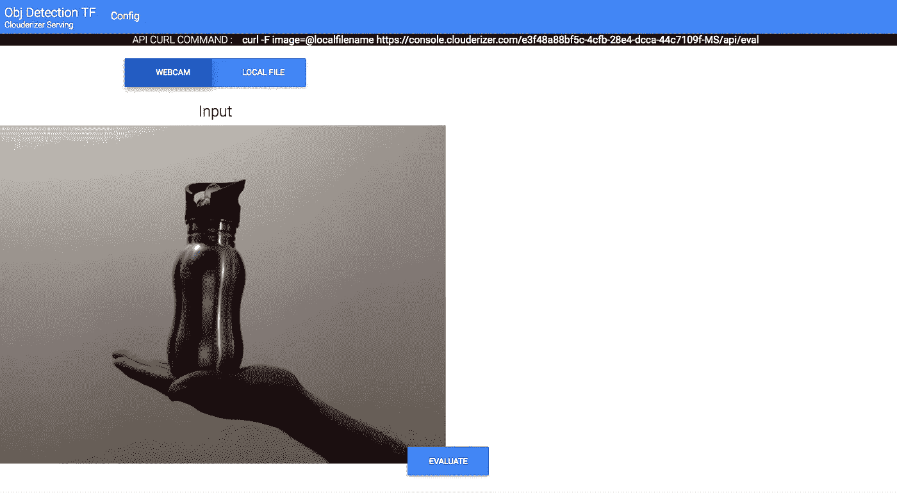

Image 7 : Captured input image from Clouderizer Serving web app

*   现在按评估键。这将调用 Flask app REST api 进行评估。瞧啊。！检测到物体的输出图像如下所示。

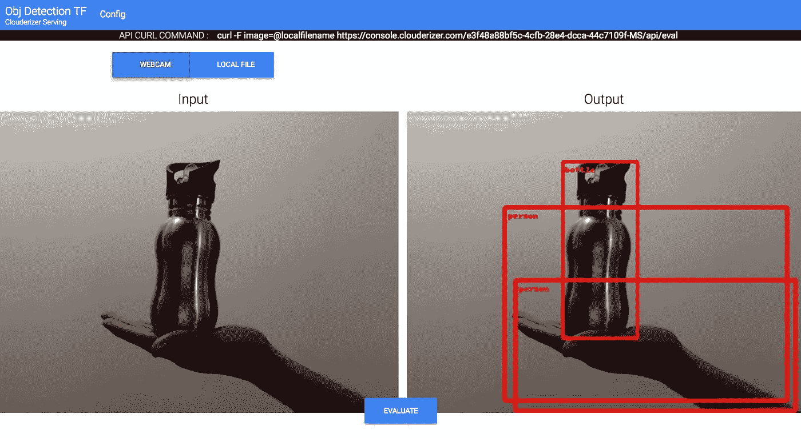

Image 8 : Output image from Clouderizer Serving REST endpoint

既然我们已经看到了魔术，让我们列出一些关于 Clouderizer 服务的细节

*   这个服务应用程序与您开发模型的 Clouderizer 项目运行在同一台机器上。
*   提供应用程序 web URL 不需要会话身份验证。这意味着您可以与他人共享该 URL，而无需共享您的 Clouderizer 控制台凭据。当您想要演示或与其他人共享您的模型结果时，这非常有用。
*   此外，上述网络应用程序完全响应，这意味着它真的很好地与手机网络浏览器和手机摄像头。这有助于使用您周围的真实生活图像和数据来评估您的模型。

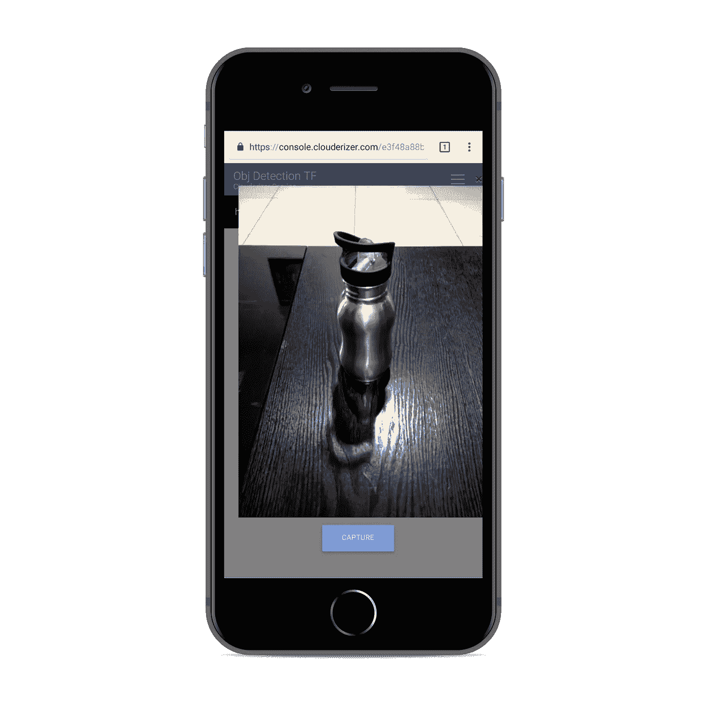

Image 9 : Clouderizer Serving web app in action on phone browser

*   输入图像也可以来自本地文件。只需选择本地文件标签和浏览文件从您的机器。

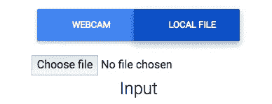

Image 10 : Local file as input

*   用于模型评估的直接 REST api 模式可以在页面顶部的黑色丝带中找到。我们可以从 CURL 调用它，或者用它来与其他客户端集成。

Image 11 : Flask REST endpoint curl command

*   可以通过顶部导航栏上的“配置”按钮访问此 web 应用程序的配置。此分区受用户名和密码保护。默认凭据是管理员/管理员。
    你可以从配置部分更新这些凭证(如果你打算与他人分享你的服务 URL，强烈推荐)。
*   Clouderizer 服务提供了两种评估模型的方法。

1.  Shell 命令:这是快速启动和运行服务的最简单方法。如果您的项目能够使用 bash shell 命令进行评估，那么您可以在这里指定它。以下特殊占位符可用于输入和输出图像
    **$IMG1$** - >输入图像路径。这在执行
    **$OIMG1$** - >输出图像路径之前被输入图像替换。这被服务输出文件夹所取代。当您的 bash 命令将输出文件放在这里时，Clouderizer Serving 返回这个文件作为对 REST 调用的响应。
2.  Python 代码:这允许您修改项目中 serve 子文件夹下的文件 script.py。该文件使用两个重要的函数
    **__init__** - >实现了一个 python 类 ClouderizerEval，该构造函数是应用程序启动时任何一次初始化的理想位置。现在是在这里加载模型的好时机。
    **eval** - >该函数接收 REST HTTP 请求表单参数。这个函数的输出可以是一个 json 对象或一个图像路径。

本文中的对象检测项目使用 Python 代码进行评估。这是它的要点。实现就是从这个[谷歌云项目](https://github.com/GoogleCloudPlatform/tensorflow-object-detection-example)衍生出来的。

神经风格转移是另一个预煮的模板，你可以很容易地克隆和尝试。这里是它看起来的一瞥

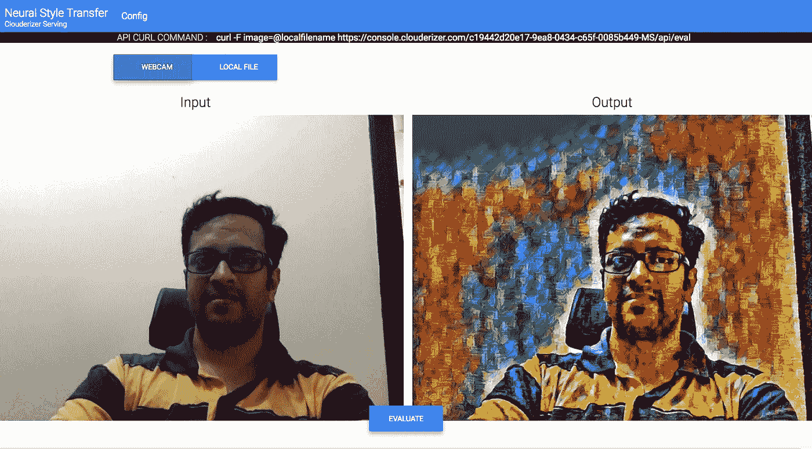

Image 12 : Clouderizer Serving for Neural Style Transfer

虽然 Clouderizer 服务的第一个版本更侧重于支持机器视觉项目，但我们的团队正在努力使它更加通用，以处理各种输入输出格式——文本、音频、视频、json。