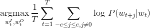
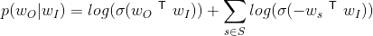
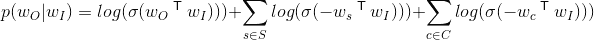
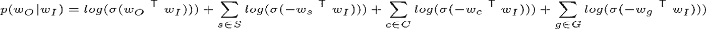

# fastText++包括电池

> 原文：<https://towardsdatascience.com/fasttext-batteries-included-fa23f46d52e4?source=collection_archive---------11----------------------->

在我的[上一篇文章](https://medium.com/@nishansubedi/fasttext-under-the-hood-11efc57b2b3)中，我概述了 fastText 是如何实现的，并阐明了一些设计决策。fastText 的主要创新是用子词信息丰富了 word2vec 模型。然而，我们不需要局限于仅仅学习单词。fastText 可以对任何符号序列进行建模，只要序列的顺序对它有一定的意义。例如用户穿越一个站点的旅程。我将更详细地讨论这一点，并指出为此使用 fastText word2vec 的一些限制。最后，我将通过[利用 word2vec 模型从语料库中提取语义结构](https://arxiv.org/pdf/1607.01869.pdf)以及在 [fastText](https://github.com/nishansubedi/fastText/releases/tag/v0.2.0) 中提供这些的实现，介绍一些有助于解决这些问题的巧妙研究。这目前在我的 fastText 分支中，但是如果我得到足够多的请求，我可能会合并到上游。我也很感激你对它的任何反馈。

fastText 主要是通过添加一包字符 n-grams 来扩展经典的 word2vec 模型。虽然这对于文本来说很好，其中单词的 n 元语法仍然有一些意义，但对于主要由 id 组成的语料库来说没有意义，因为这些单词的 n 元语法没有内在意义。

Word2vec 通过理解单词出现的上下文来捕捉单词的意思。类似地，如果我们在一系列事件上训练 word2vec，比如用户在网站上的旅程，我们可以学习这些事件的潜在质量以及它们彼此之间的关系。通过对一系列事件(用户执行的搜索、他们点击的项目等)训练 word2vec 模型，我们有效地学习了如何使用户在一个会话中选择的项目彼此相似。这是雅虎[可扩展语义匹配论文](https://arxiv.org/pdf/1607.01869.pdf)的总体思路。用 word2vec 的话说，这些跨站点的用户交互(搜索查询、点击等..)可以解释为一句话。所以每次互动都变成了一个词。

这个序列的 word2vec 公式允许我们在给定用户参与上下文(CBOW)或基于用户交互的上下文(Skip-gram)的情况下，对用户交互的概率进行建模。该模型可用于各种推荐、候选人选择以及搜索、广告和推荐问题的特征化。

以这种方式公式化序列有一些很好的特性:

1.  它也允许我们在我们的词汇表中考虑单词时有很大的灵活性。它可以是搜索会话查询、商品 id、市场、位置。
2.  我们可以为多种类型的对象创建一个共享的嵌入空间，给我们一个可能难以定义的跨多种事物的关系(例如，一个查询与一个地理区域的相似性)。
3.  我们可以利用当前问题空间之外的上下文(例如，利用搜索结果生成广告，或生成推荐)。

然而，传统的 word2vec 模型不允许我们表达这些丰富的语义关系。我们来看 word2vec 模型公式。跳格目标是最大化平均对数概率:



where w^I and w^O are the input and output vector representations of w.

使用[负采样损失(NEG)](https://papers.nips.cc/paper/5021-distributed-representations-of-words-and-phrases-and-their-compositionality.pdf) (2.2)，概率可以被分解为上下文和目标词的正和负对的和，其中负采样被应用以获得负词。



Where S is the set of negative samples drawn from the entire vocabulary

这个公式来自[噪声对比估计(NCE)](http://www.jmlr.org/papers/volume13/gutmann12a/gutmann12a.pdf) ，它假定一个好的模型应该能够通过逻辑回归来区分数据和噪声。进一步简化，学习任务变成从噪声分布图`w_s`中区分目标单词`w_o`。

让我们看一个例子。考虑以下用户旅程:

```
user u -> search query 'watch' -> saw items a, b, c -> clicked c -> purchased c
```

将用户的旅程建模为一系列动作，包括搜索查询和参与动作的 fastText 的输入将是:

```
query_watch item_c item_c
```

接下来，让我们看看使用 word2vec 来模拟用户旅程的一些限制。我们将继续讨论这个例子。

## 1.模拟隐含否定

word2vec 模型不允许我们捕捉的一个重要关系是隐含的负面信号。这些对于模拟用户的旅程尤其重要。例如，我们知道，如果搜索结果中的一个项目被点击，它左边的项目最有可能被用户看到，因此不相关。正如我们在上面的 NEG 公式中看到的，word2vec 不允许我们显式地对负数建模，所有的负数都是从整个分布中随机抽取的。

在这种形式中，改变损失函数的信号是简单的。对于引入的跳格损失，我们可以使用自定义负数扩展预测概率，如下所示:



Where C is the set of custom negatives for a particular positive token

这只是 NEG 公式的扩展，其中学习任务是将目标单词`w_o`与噪声分布的绘制`w_s` 以及所有隐含的否定`w_c`区分开来。

为了能够指定这一点，我们需要扩展 fastText 的词汇表，即它能够理解输入数据中的标记。fastText 的输入格式是一个文本文件，每个单词由一个空格字符分隔，每个句子由一个换行符分隔。对于监督学习，fastText 使用前缀`__label__`作为标签来标记单词。前缀可以通过`-label`标志定制。

在 [v0.2.0](https://github.com/nishansubedi/fastText/releases/tag/v0.2.0) 中，我扩展了这个词汇表以支持前缀`__neg__`。所有带有前缀`__neg__`的标记都是上下文特定的否定，可以添加到训练文件中。任何带有`__neg__`前缀的单词都作为否定词添加到它前面的最后一个肯定性单词，并且是损失函数中集合`C`的一部分。前缀可以通过`-negPrefix`标志定制。标志`-ignoreCNegs`可用于禁用自定义底片。如果禁用，这些令牌仍将被解析，但将在训练期间被丢弃。

上述示例输入将是，带有隐含否定的:

```
query_watch item_c __neg__item_a __neg__item_b item_c
```

## 2.应用全球背景

在为用户的旅程建模时，很难找到正确的归属。可能有多种因素导致最终结果，例如，对于一个电子商务网站，可能有多个用户查看的项目(多个推荐、内容页面等)，以及他们采取的行动(点击多个项目、发出不同的搜索、浏览多个类别等)最终导致他们做出最终决定。对于多点触摸属性模型，我们希望与整个用户动作序列共享最终动作的意图。这可以被建模为在该特定会话中应用所有动作的全局上下文。将全球背景加入到我们迄今为止累积的损失中:



where G is the set of global contexts for that particular sequence

[v0.2.0](https://github.com/nishansubedi/fastText/releases/tag/v0.2.0) 词汇表也支持前缀`__global__`。前缀为`__global__`的所有标记都是全局上下文标记，并且是损失函数中集合`G`的一部分。在模型训练期间，具有该前缀的单词被附加到该特定行的每个目标单词。前缀可以通过`-globalPrefix`标志定制。标志`-ignoreGContext`可用于禁用全局上下文令牌。如果禁用，这些令牌仍将被解析，但将在训练过程中被丢弃。

使用用户和购买的项目作为全局上下文，上面的示例变成:

```
__global__user_u __global__item_c query_watch item_c __neg__item_a __neg__item_b item_c
```

## 3.编码重要性

基于模型被训练用于的特定任务，不同的动作可以具有不同的相对重要性。在电子商务中，添加到购物车是比点击更清楚的用户购买意图的例子。因此，为了模拟购买意图，能够赋予购物车添加比点击更重要的意义是很有用的。

在 [v0.2.0](https://github.com/nishansubedi/fastText/releases/tag/v0.2.0) 中，您可以为每个带有后缀`:WEIGHT`的目标单词指定权重。权重的取值范围可以从`1`到`255`。如果指定权重，请确保您的学习率仍然合理，否则您可能会在训练过程中遇到爆炸梯度。通过平均权重缩小学习权重是一个很好的启发。

在每个特定项目上的停留时间也可以表示为指定给给定标记的权重。加权模式ηt = log(1 + t)在可扩展语义论文中指定[。我发现停留时间通常与购买率线性相关，直到某一点，所以设定最大值是一个好方法。这是使用`-parseWeights`参数指定的。这样，如果我们给点击一个权重`1`，购买一个权重`25`，训练示例看起来像这样:](https://arxiv.org/pdf/1607.01869.pdf)

```
__global__user_u __global__item_c query_watch item_c:1 __neg__item_a __neg__item_b item_c:25
```

## 4.控制词汇量

在同一个向量空间中嵌入多个对象真的很有用；它允许我们捕获不同实体之间的关系，比如特定查询与某个区域的关系。然而，这带来了一个困难。通常，语料库中的项目总数因实体而异，因此对不同的语料库使用相同的[阈值策略](https://medium.com/@nishansubedi/fasttext-under-the-hood-11efc57b2b3)(读取数据)可能不会给我们带来理想的结果。例如，如果我们将区域的嵌入和查询一起编码，区域的数量与用户发出的搜索查询数量级不同。 [v0.2.0](https://github.com/nishansubedi/fastText/releases/tag/v0.2.0) 提供了一些不同的选项来帮助解决这个问题。

使用`-maxVocabSize`参数可以指定控制词汇表大小的。这使得训练可以扩展到训练模型的机器的极限。

符合与`-minCountGlobal`分开的全局上下文令牌的令牌的最小计数。

通过使用`__cc__`前缀识别特定令牌并通过`-minCountCustom`标志控制计数，为任意令牌定制最小计数。

如果我们遇到具有多个前缀的同一个令牌，那么这个特定令牌的类型由下面的优先顺序决定:`customCountWord > globalContext > word`，也就是说，如果存在由`-minCountCustom`指定的计数，那么它就是优先的，以此类推。

除了这些之外，fastText [v0.2.0](https://github.com/nishansubedi/fastText/releases/tag/v0.2.0) 还有很多新增功能。下面是 v0.2.0 中跳过 gram 模型训练的选项列表，新标志以粗体显示。

```
$ fasttext skipgramEmpty input or output path.The following arguments are mandatory:-input              training file path
-output             output file pathThe following arguments are optional:-verbose            verbosity level [2]The following arguments for the dictionary are optional:**-minCount           minimal number of word occurences [5]****-minCountLabel      minimal number of label occurences [0]****-minCountGlobal     minimal number of global context occurences [1]****-minCountCustom     minimal number of custom token [5]**-wordNgrams         max length of word ngram [1]
-bucket             number of buckets [2000000]
-minn               min length of char ngram [3]
-maxn               max length of char ngram [6]**-maxVocabSize       max tokens in vocabulary. Pruning happens at 0.75 of this: [30000000]**-t                  sampling threshold [0.0001]
-label              labels prefix [__label__]**-negPrefix          negative token prefix [__neg__] negative tokens are associated with preceeding positive token****-globalPrefix       global context token prefix [__global__] global context is associated with all tokens in the line****-ccPrefix           token prefix for custom counts [__cc__]****-splitPrefix        prefix for tokens to split [__split__]  prefix stripped off when creating token****-splitChar          char to split text on [_] these tokens are considered words and not ngrams. Using splits and ngrams together is not supported****-ignoreCNegs        ignore negative tokens. Negatives tokens have [__neg__] preceding them [false]****-ignoreGContext     ignore global context tokens. Global cotext tokens have [__global__] preceding them [false]****-ignoreSplits       ignore split prefix. Only the original token is used, with prefix [__split__] stripped off [false]****-parseWeights       parse weights from word tokens, does not apply to neg, global or split. Weight is unsigned int in range [1-255], eg. word:3 [false]**The following arguments for training are optional:-lr                 learning rate [0.05]
-lrUpdateRate       change the rate of updates for the learning rate [100]
-dim                size of word vectors [100]
-ws                 size of the context window [5]
-epoch              number of epochs [5]
-neg                number of negatives sampled [5]
-loss               loss function {ns, hs, softmax} [ns]
-thread             number of threads [12]
-pretrainedVectors  pretrained word vectors for supervised learning []
-noSubsampling      disable subsampling [false]
-saveOutput         whether output params and vector should be saved [false]The following arguments for quantization are optional:-cutoff             number of words and ngrams to retain [0]
-retrain            whether embeddings are finetuned if a cutoff is applied [false]
-qnorm              whether the norm is quantized separately [false]
-qout               whether the classifier is quantized [false]
-dsub               size of each sub-vector [2]
```

## 承认

非常感谢[赵晓婷](http://dblp.uni-trier.de/pers/hd/z/Zhao:Xiaoting?q=Xiaoting%20Zhao)的合作，以及对 v0.2.0 的帮助， [Mihajlo Grbovic](https://medium.com/@mihajlo.grbovic) 对语义嵌入的澄清，[Giovanni Fernandez-kin cade](https://medium.com/u/9199bc6998f5?source=post_page-----fa23f46d52e4--------------------------------)对本文的反馈。