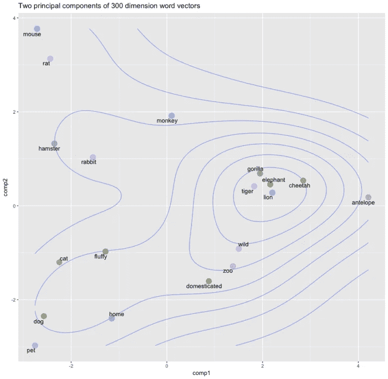
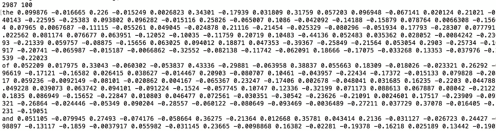
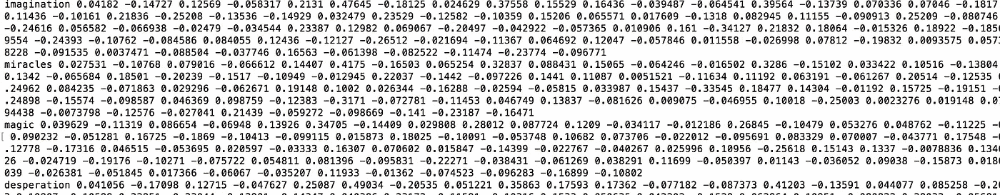
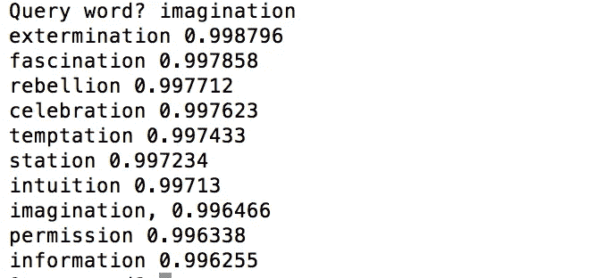
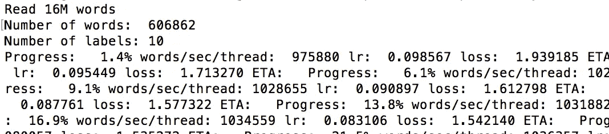
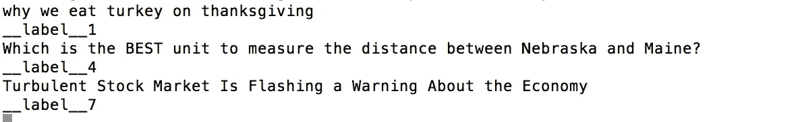
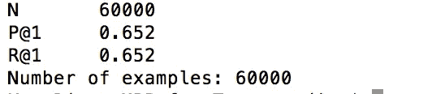

# 学习快速文本

> 原文：<https://towardsdatascience.com/fasttext-ea9009dba0e8?source=collection_archive---------5----------------------->

**一点个人背景**

这是我在学习机器学习上重新开始的自我折磨的尝试。几个月前，我从在线纳米学位工厂 udacity 获得了一名机器学习工程师`Nanodegree`。纳米可能意味着它是无限小和微不足道的。

不确定。

金钱方面，大约是 1000 美元；就努力而言，我在 6 个月内投入了大量的工作。我有时让我的 CPU 超时工作，满负荷运行；看到我自己的学习项目结出了果实，我感到非常满意:识别狗的品种，对肺炎进行分类，让一架虚拟四轴飞行器悬停在起飞点上方约 10 个像素处(这都是荣耀)。我现在认为自己是机器学习领域的“文盲”。像`CNN`这样的术语将不再仅仅代表“假”新闻作品；我可以让一个非 ML 的人听起来很聪明，比如说`RNNs`、`LSTM`、`GANs`、`reinforcement learning`等等。但除此之外，我的纳米学位对我没有任何影响。

尽管如此，在人工智能时代，不学习不是一个选项。所以我决定振作起来，继续前进，在机器学习理论、技术、突破和新前沿的洪流中跌跌撞撞。

为学习而学习。

我通过谷歌搜索“有趣的机器学习项目”来“发现”f[as text](https://github.com/facebookresearch/fastText)。找到文章[过去一年 30 个惊人的机器学习项目(v.2018)](https://medium.mybridge.co/30-amazing-machine-learning-projects-for-the-past-year-v-2018-b853b8621ac7) 。fastText 是数字 1。它拥有 16，185 颗 Github 星(这是数以万计的开发者的信任票),并且仍在上升。眼花缭乱。

所以我必须学习。

[*fast text*](https://fasttext.cc/)*是一个高效学习单词表示和句子分类的库。*

**词向量**

单词表示和句子分类是自然语言处理领域的基础。NLP 之于人工智能，就是语言之于人类文明。这是一个允许你的 Siri、Alexa、谷歌助手(Google assistant)和一群语音助手对你拼写错误、用词不当、不完整、可能令人尴尬的问题做出回应的领域，并给出聪明和信息丰富的答案(希望如此)。这就是为什么当你阅读一些关于烹饪、健身和其他一切的文章时，谷歌或脸书会用“智能”广告跟随你。

简单的单词表示将文本集视为一个不加选择的单词包，也称为`BoW`。`BoW`只关心 2 件事:a)已知单词列表；b)词频统计。它不关心句子中的单词、文本中的句子之间的句法(*结构*)和语义(*意义*)关系。对于某些目的，这种处理已经足够好了，例如，垃圾邮件检测。对其他人来说，`BoW`功亏一篑。相反，单词向量成为单词表示的最新形式。

> [单词向量将单词表示为多维连续浮点数，其中语义相似的单词被映射到几何空间中的邻近点。更简单地说， ***一个单词向量是一行实数值*** (与虚数值相反)，其中 ***每个点捕获单词含义的一个维度******其中语义相似的单词具有相似的向量*** *。*](https://medium.com/@jayeshbahire/introduction-to-word-vectors-ea1d4e4b84bf)

这是一大堆数学术语，代表了无限维度的数学宇宙。

当单词被矢量化时，它们可以被增加或减少。

> 妻子+丈夫+孩子=家庭(希望如此)

不确定以下数学公式是否正确:

> 妈妈*妈妈=奶奶？

反正在一个词向量里，``smart``和`intelligent`是相邻而坐的两个词，`cats`和`dogs`占据同一个动物球，`go`、`went`、`gone`平行于`eat`、`ate`和`eaten`

Word vector (From [Introduction to Word Vectors](https://medium.com/@jayeshbahire/introduction-to-word-vectors-ea1d4e4b84bf))

有两种主要的架构/模型用于将大量文献训练成单词向量:[一种*连续单词袋*模型(cbow)和*连续跳格*模型。](https://blog.acolyer.org/2016/04/21/the-amazing-power-of-word-vectors/)有许多文章和博客文章提供了关于技术实现和解释的细节，例如[单词向量的惊人力量](https://blog.acolyer.org/2016/04/21/the-amazing-power-of-word-vectors/)、 [Word2Vec 教程—Skip-Gram](http://mccormickml.com/2016/04/19/word2vec-tutorial-the-skip-gram-model/)、 [Word2Vec 教程第二部分:连续单词袋模型](http://mccormickml.com/assets/word2vec/Alex_Minnaar_Word2Vec_Tutorial_Part_II_The_Continuous_Bag-of-Words_Model.pdf)。

在一个过于简化和幼稚的版本中，给出一些例句:`the farmer takes the wife, the wife takes the kids, the kids take the cats`(摘自一首小孩儿的歌)。`skip-gram`使用一个随机单词作为输入，并输出单词列表中每隔一个单词成为所选单词的“邻近单词”的概率；相比之下，`cbow`模型使用一系列单词(上下文)作为输入，并输出每隔一个单词作为目标单词的概率。

所以把`take`这个词放进`skip-gram`机，它会粗制滥造出`farmer`、`wife`、`kids`、`cats`和`the`的概率；对于`cbow`，你需要喂它`the`、`farmer`、`wife`，它会尝试猜单词`take`。

FastText 支持连续`CBOW`和`skip-gram`两种模式。

**文本分类**

文本分类是基本的，因为它是不言自明的。文本分类的应用范围从垃圾邮件过滤、情感分析、内容标记/分类。它也是搜索和排名等复杂系统的核心。分类和归类是人类和机器处理数量和复杂性不断增加的文本的第一步。在数字信息的浩瀚宇宙中，这让你能够找到你感兴趣的主题，跟随你想要占据的回音室，等等。

传统上，文本分类使用纯数学/统计方法。开发了各种特征提取技术，例如`Principal Component Analysis (PDA).`

那么统计方法就会变得不充分、太慢、太少。因此出现了机器学习，它可以更好地理解互联网上数百万兆字节的信息。机器学习中的文本分类，根据数据模型遵循的学习原理，可以分为三类:[监督文本分类、非监督文本分类、半监督文本分类(Korde & Mahender，2012)。](http://www.ijikm.org/Volume13/IJIKMv13p117-135Thangaraj3803.pdf)

FastText 使用简单有效的基线进行句子分类(将句子表示为单词包(BoW)并训练线性分类器)。它使用`negative sampling`、`hierarchical softmax`和`N-gram`特征来降低计算成本和提高效率。

不得不说，所有的术语都让我晕头转向。

**实施**

以下是我跟随各地给出的例子学习和试用 fastText(例如[这里](https://github.com/facebookresearch/fastText))。

训练文集是加西亚·马尔克斯的《T4》一书

**训练单词向量**

使用`skipgram`

`**.**/fasttext skipgram -input file.txt -output model`

使用`cbow`

`./fasttext cbow -input file.txt -output model`

使用`skipgram`或`cbow`，将生成一个`.vec`和`.bin`文件。`.vec`文件包含了向量这个词，每行一个词，那是给我们人类的检查，`.bin`是给机器消耗的。

我们可以提前查看向量输出的内容:

`head -n 4 model.vec`

Sample output of fastText vector

有许多参数可以调整以微调字向量，最重要的是维度(`dim)`和子字的大小范围(`minn`，`maxn`)。

`./fasttext skipgram -input file.txt -output model -minn 3 -maxn 5 -dim 100`

阅读一个单词向量就像阅读二进制 0 和 1 一样有趣和有启发性。所以我可以直接输出我关心的花言巧语，这是一种解脱。

`echo “imagination miracles magic desperation” | ./fasttext print-word-vectors model.bin`

Word vector of a few choice words

还是不太好玩。所有这些数字只会让我头晕。

FastText 允许您查询最近的邻居，这允许我们查看单词向量是否正确地捕捉了单词之间的语义关系。

为此，我们运行`nn`命令。

`./fasttext nn model.bin`

Nearest Neighbors for the word “imagination”

我的训练词汇库可能太小，我不确定为什么`extermination`排在`imagination`的最近邻。无论如何也想象不到。那么我不经常理解机器的内部工作。

**文本分类**

对于文本分类，我使用了公开可用的`Yahoo Answers`数据([nider hoff](https://github.com/niderhoff)/[NLP-datasets](https://github.com/niderhoff/nlp-datasets)有一个完整的公共领域数据集列表，其中包含用于自然语言处理的文本数据)。

在将我的数据插入 fastText 的训练机器之前，我做了一些轻微的处理，所以格式符合要求(文本文件的每一行都包含一个标签列表，后面跟着相应的文档。所有标签都以`__label__`前缀开头)。

现在是训练时间。

`./fasttext supervised -input data/yahoo_answers_csv/train_modified.csv -output model_yahoo_answers`

预测时间:

`./fasttext predict model_yahoo_answers.bin -`

fastText Predictions After Training

所以 fastText 将第一个问题归类为`1\. Society & Culture`，第二个问题归类为`Education & Reference`，第三个问题归类为`7\. Business and Finance`

在我看来没错。

使用测试数据集，我们可以通过检查精度和召回值来衡量训练模型的质量。

`./fasttext test model_yahoo_answers.bin data/yahoo_answers_csv/test_modified.csv`

因此，在只有 60，000 个问题的测试数据集下，只需几秒钟的训练，fastText 的精度和召回率为 0.652。

**终于……**

fastText 确实又快又棒，但是，学习和写它几乎花了我一辈子的时间(不得不吃饭、睡觉、网飞等等)。又多了一个不要让我迟钝的生物大脑手动做任何事情的理由。