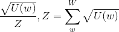
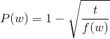
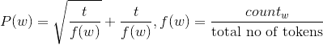
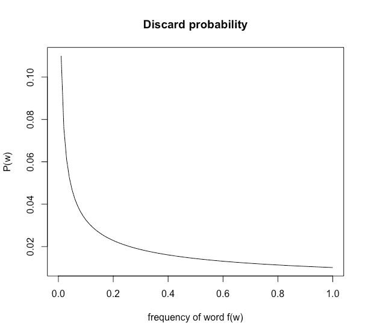

# 快速文本:引擎盖下

> 原文：<https://towardsdatascience.com/fasttext-under-the-hood-11efc57b2b3?source=collection_archive---------2----------------------->


[fastText](https://fasttext.cc/) 作为一个高效学习单词表示和句子分类的库。它是用 C++编写的，在训练时支持多重处理。FastText 允许您训练单词和句子的监督和非监督表示。这些表示(嵌入)可以用于数据压缩的许多应用，作为附加模型的特征，用于候选选择，或作为迁移学习的初始化器。

FastText 支持使用负采样、softmax 或分层 softmax 损失函数来训练连续单词包(CBOW)或跳格模型。我主要使用 fastText 来训练语义嵌入，用于几千万大小的语料库，我对它在这项任务中的表现和规模感到满意。除了[入门](https://fasttext.cc/docs/en/support.html)的文档之外，我很难找到其他文档，所以在这篇文章中，我将带你了解 fastText 的内部结构及其工作原理。期望对 word2vec 模型如何工作有所了解。克里斯·麦考密克的这篇文章很好地解释了这个问题。

## 运行快速文本

我们可以使用以下命令通过 fastText 训练一个跳格模型:

> $ fast text skip program-输入数据. txt-输出模型

其中`data.txt`是输入数据，可以是一个文本序列，输出模型保存在 model.bin 下，输入项的矢量表示保存在`model.vec`下。

## 表现

FastText 能够实现非常好的单词表示和句子分类性能，特别是在使用[字符级信息](https://arxiv.org/pdf/1607.04606.pdf)的罕见单词的情况下。

除了单词本身之外，每个单词都被表示为一包字符 n 元语法，因此，例如，对于单词`matter`，n = 3，字符 n 元语法的快速文本表示为`<ma`、`mat`、`att`、`tte`、`ter`、`er>`。<和>是作为边界符号加入的，用来区分单词的 ngram 和单词本身，所以比如 mat 这个词是词汇表的一部分，就用`<mat>`来表示。这有助于保留较短单词的含义，这些单词可能会显示为其他单词的组合。本质上，这也允许你捕捉后缀/前缀的含义。

您使用的 n-grams 的长度可以由分别用于最小和最大字符数的`-minn`和`-maxn`标志来控制。这些控制要获取 n 元语法的值的范围。该模型被认为是单词袋模型，因为除了 n 元语法选择的滑动窗口之外，不存在考虑用于特征化的单词的内部结构，即，只要字符落在窗口之下，字符 n 元语法的顺序就无关紧要。您也可以通过将 n-gram 嵌入都设置为 0 来完全关闭它们。当您的模型中的“单词”不是特定语言的单词，并且字符级 n 元语法没有意义时，这可能是有用的。最常见的用例是当你输入 id 作为你的单词时。在模型更新期间，fastText 学习每个 n 元语法以及整个单词标记的权重。

## 读取数据

虽然 fastText 的训练是多线程的，但是读入数据是通过单线程完成的。解析和标记化是在读取输入数据时完成的。让我们详细看看这是如何做到的:

FastText 通过输入数据的`-input`参数获取一个文件句柄。不支持从 stdin 读入数据。FastText 初始化两个向量来跟踪输入信息，内部称为`word2int_`和`words_`。`word2int_`在单词串的散列上被索引，并存储一个到`words_`数组(std::vector)的顺序 int 索引作为它的值。在读取输入时，`words_`数组按照唯一单词出现的顺序递增，并将封装了单词标记所有信息的 struct `entry`存储为其值。`entry`包含以下信息:

```
struct entry {
  std::string word;
  int64_t count;
  entry_type type;
  std::vector<int32_t> subwords;
};
```

这里需要注意一些事情，`word`是单词的字符串表示，`count`是输入行中相应单词的总计数，`entry_type`是`{word, label}`中的一个，标签仅用于被监督的情况。不管`entry_type`如何，所有的输入令牌都存储在同一个字典中，这使得扩展 fastText 以包含其他类型的实体变得容易得多(我将在后面的文章中详细讨论如何做到这一点)。最后，`subwords`是一个特定单词的所有单词 n-grams 的向量。这些也是在读取输入数据时创建的，并传递给训练步骤。

`word2int_`向量的大小为`MAX_VOCAB_SIZE`= 30000000；这个号码是硬编码的。在大型语料库上进行训练时，这个大小可能会受到限制，并且可以在保持性能的同时有效地增加。`word2int_`数组的索引是一个字符串到 int hash 的值，并且是 0 和`MAX_VOCAB_SIZE`之间的唯一数字。如果存在哈希冲突，并且已经向哈希中添加了一个条目，则该值会递增，直到我们找到一个唯一的 id 来分配给一个单词。

因此，一旦词汇表的大小达到`MAX_VOCAB_SIZE`，性能就会大大下降。为了防止这种情况，每当散列的大小超过`MAX_VOCAB_SIZE`的 75%时，fastText 就会修剪词汇表。这是通过首先增加一个单词的最小计数阈值以使其有资格成为词汇表的一部分，然后删除字典中计数小于该阈值的所有单词来实现的。当添加每个新单词时，会检查 75%阈值，因此这种自动修剪可以在文件读取过程的任何阶段进行。

除了自动修剪之外，作为词汇表一部分的单词的最小计数通过分别使用单词和标签的`-minCount`和`-minCountLabel` 标志(用于监督训练)来控制。基于这些标志的修剪发生在整个训练文件被处理之后。如果中的唯一单词总数触发了前面指定的自动修剪，则词典的阈值可能会高于手动指定的最小计数。然而，指定 minCount 的阈值将**始终**出现，有效地确保具有较低计数的单词不会成为您输入的一部分。

对于负采样损失，然后构建大小为`NEGATIVE_TABLE_SIZE` = 10000000 的负单词表。注意，这是⅓`MAX_VOCAB_SIZE`的大小。该表是通过绘制每个单词频率的平方根的一元分布来构建的，即。



where U(w) is the count of a particular word, W is the set of counts of all words

这确保了每个单词在否定表中出现的次数与其频率的平方根成正比。然后这张表被打乱以确保随机化。

接下来，如原始 word2vec 扩展论文的[第 2.3 节中所概述的，构建一个用于丢弃频繁单词的采样表。这背后的想法是，经常重复的单词比不常用的单词提供的信息少，并且在看到同一个单词的许多实例后，它们的表示不会有太大变化。](https://papers.nips.cc/paper/5021-distributed-representations-of-words-and-phrases-and-their-compositionality.pdf)

该论文概述了以下丢弃方法:以概率丢弃训练字



where t is the chosen threshold and f(w) is the frequency of occurrence of word w.

作者认为`t = 10e-5`是一个合理的默认值。该公式丢弃频率大于阈值的单词，并且有效地采样不太频繁的单词，同时仍然保持它们的相对频率，并且因此仅仅起到抑制频率的夸大效果的作用。

另一方面，FastText 将这种分布定义为



where t = 10e-4 is the chosen threshold, f(w) is the frequency of occurrence for word w

默认阈值可以通过`-t`参数手动编辑。阈值`t` 在 fastText 中的含义与在原始 word2vec 文件中的含义不同，应该根据您的应用进行调整。

仅当在训练阶段，从 0 和 1 之间的均匀分布中随机抽取的值大于丢弃的概率时，单词才被丢弃。下面是默认阈值范围从 0 到 1 的分布图。如图所示，听牌大于 P 的概率随着频率的增加而增加，因此，听牌被弃牌的概率也随着频率的增加而增加。这只适用于无监督的模型。对于监督模型，单词是**而不是**丢弃的。



Probability of discard in fastText with default threshold for frequency f(w)

如果我们用`-pretrainedVectors`标志初始化训练，来自输入文件的值被用来初始化输入层向量。如果未指定，则创建一个维度为 MxN 的矩阵，其中`M = MAX_VOCAB_SIZE + bucket_size`，`N = dim`。`bucket_size`对应于分配给所有 ngram 令牌的数组总大小。通过`-bucket`标志设置，默认设置为 2000000。

通过 ngram 文本的数字散列(相同的散列函数)初始化 ngram，并在对应于`MAX_VOCAB_SIZE + hash`的位置将该散列数的模拟合到初始化的矩阵上。注意，在 ngrams 空间中可能会有冲突，而对于原始单词来说冲突是不可能的。这也会影响模型性能。

Dim 代表训练中隐藏层的尺寸，因此也代表嵌入的尺寸，通过`-dim`标志设置。默认情况下，该值设置为 100。矩阵初始化为 0 和`1/dim`之间的均匀实数分布，在单位立方体中是均匀的。

## 培养

一旦输入和隐藏向量被初始化，多个训练线程被启动。线程数量由`-thread` arg 指定。所有的训练线程都有一个指向输入和隐藏向量矩阵的共享指针。所有线程都从输入文件中读取，用读取的每个输入行更新模型，即批处理大小为 1 的随机梯度下降。如果遇到换行符，或者如果我们读到的字数达到了最大允许的行数，输入行将被截断。这是通过`MAX_LINE_SIZE`设置的，默认为 1024。

连续单词包和 Skip-gram 模型都更新大小在 1 和由`-ws`确定的值之间的随机均匀分布的上下文的权重，即窗口大小是随机的。

损失函数的目标向量通过所有输入向量的归一化和来计算。输入向量是原始单词以及该单词的所有 n 元语法的向量表示。计算损失，设置前向传递的权重，前向传递一路传播回反向传播传递中输入层的向量。在反向传播过程中发生的输入向量权重的这种调整允许我们学习最大化同现相似性的表示。学习率`-lr`影响每个特定实例对权重的影响程度。


Topography of unsupervised Skip-gram fastText model

模型输入权重、隐藏层权重以及传入的参数保存在。bin 格式和`-saveOutput`标志控制是否也输出一个. vec 文件，该文件包含 word2vec 文件格式中隐藏层的矢量。

我希望这个演练有助于阐明 fastText 的内部工作原理。我个人在使用这个库方面取得了很多成功，并强烈推荐它来满足您的嵌入需求。在我的下一篇文章中，我将讨论我添加到 fastText 中的一些附加功能，以概括它的功能。敬请期待..

## 承认

非常感谢[Giovanni Fernandez-kin cade](https://medium.com/u/9199bc6998f5?source=post_page-----11efc57b2b3--------------------------------)对这篇文章的反馈。