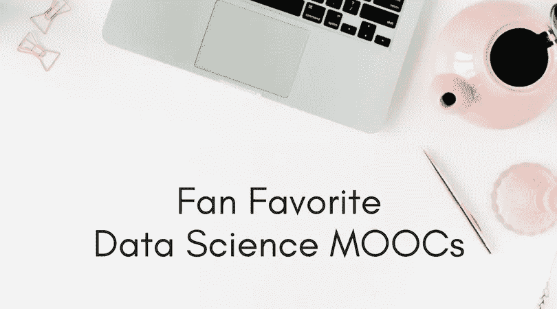
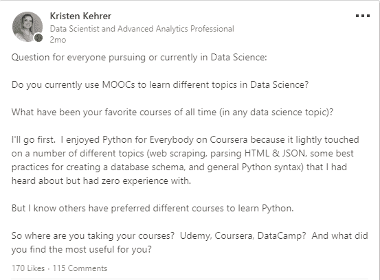
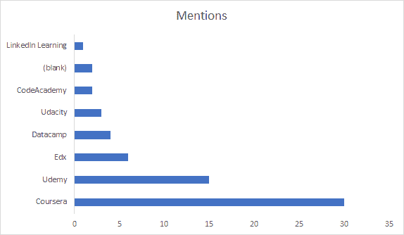

# 数据科学家最喜欢的 MOOCs

> 原文：<https://towardsdatascience.com/favorite-moocs-for-data-scientists-10b16a950e36?source=collection_archive---------9----------------------->

我最近在 LinkedIn 上询问了每个人最喜欢的数据科学 MOOCs。这个帖子引发了很多关于人们有经验的课程(和课程平台)的讨论。某些课程被多次提及，显然是由机构群体推荐的。

帖子是这样的:

最大的收获:

基里尔·叶列缅科或安德鲁·吴的作品受到高度评价并被频繁提及。

所以我决定重温这篇文章，并汇总分享的信息，以便那些正在寻找优秀课程来构建数据科学工具包的人可以使用这篇文章作为起点。

你会注意到在 Coursera 下面有最多的提及，这主要是由吴恩达的机器学习课程(仅该课程就有 11 次提及)和 Python For Everybody (6 次提及，也在 Coursera 上)推动的。同样，Kirill 在 Udemy 上有很多课程都被多次提及，这也让 Udemy 在评论中被多次提及。(课程链接在本文靠下)。

两个空白是由于一个特定的课程。这是斯坦福大学的一门课程。不幸的是，我无法在网上找到它。也许有人可以在评论中发布在哪里可以找到该课程？

**更新！** Tridib Dutta 和 Sviatoslav Zimine 在这篇文章发布后几分钟内联系了我们，分享了斯坦福课程的链接。

还有一个推荐的 Edx 课程，目前没有，“从数据中学习(机器学习入门)”，所以我不会链接到那个课程。

如果你熟悉 MOOCs，许多平台都允许你旁听课程(例如免费观看视频和阅读材料)，所以如果你不担心测验分数，一定要去看看这个选项。

要想上榜，一门课程必须得到至少两个人的推荐(涵盖 SQL 和机器学习基础数学的课程除外，因为这些课程没有被提及很多，但主题非常重要:)。

我整理了按主题提到的课程的链接。当课程的描述被方便地放在网站上时，它们被包括在内。

免责声明:这些链接中的一些是附属链接，这意味着如果你购买课程，我会收到佣金，而不需要你支付任何费用。

# 结构化查询语言

1.  [“saber metrics 101:棒球分析入门—Edx”](https://www.edx.org/course/sabermetrics-101-introduction-baseball-bux-sabr101x-0)*“saber metrics、棒球分析、数据科学、R 语言和 SQL 入门。”*
2.  [“数据基础”——uda city](https://eg.udacity.com/course/data-foundations-nanodegree--nd100)*“通过学习使用 Excel、SQL 和 Tableau 操作、分析和可视化数据，从今天开始培养您的数据技能。”*

# 数学

[《面向机器学习专业化的数学》——Coursera](https://click.linksynergy.com/deeplink?id=qBzelsuolGo&mid=40328&murl=https%3A%2F%2Fwww.coursera.org%2Fspecializations%2Fmathematics-machine-learning)*《面向机器学习的数学》。了解数据科学和机器学习应用的必备数学知识。”*

# （舞台上由人扮的）静态画面

[“Tableau 10 A-Z:数据科学实践 Tableau 培训！”— Udemy](https://click.linksynergy.com/deeplink?id=qBzelsuolGo&mid=39197&murl=https%3A%2F%2Fwww.udemy.com%2Ftableau10%2F) (这是一门基里尔·叶列缅科的课程)

# 稀有

1.  [“R 编程”——Coursera](https://click.linksynergy.com/deeplink?id=qBzelsuolGo&mid=40328&murl=https%3A%2F%2Fwww.coursera.org%2Flearn%2Fr-programming)*“本课程涵盖了统计计算中的实际问题，包括 R 编程、将数据读入 R、访问 R 包、编写 R 函数、调试、分析 R 代码以及组织和注释 R 代码。”*
2.  [“R Programming A-Z:R For Data Science With Real practices！”— Udemy](https://click.linksynergy.com/deeplink?id=qBzelsuolGo&mid=39197&murl=https%3A%2F%2Fwww.udemy.com%2Fr-programming%2F) (这是一门基里尔·叶列缅科的课程)*在 R 和 R 工作室学习编程。数据分析、数据科学、统计分析、软件包、函数、gg plot 2”*

# 计算机编程语言

1.  [“Python for Everybody Specialization”——Coursera](https://click.linksynergy.com/deeplink?id=qBzelsuolGo&mid=40328&murl=https%3A%2F%2Fwww.coursera.org%2Fspecializations%2Fpython)*“将使用 Python 编程语言介绍基本的编程概念，包括数据结构、网络应用程序接口和数据库。”*
2.  [“学习 Python”——code academy](https://www.codecademy.com/learn/learn-python)

# 用于数据科学的 Python

1.  [“Python 专业化的应用数据科学”——Coursera](https://click.linksynergy.com/deeplink?id=qBzelsuolGo&mid=40328&murl=https%3A%2F%2Fwww.coursera.org%2Fspecializations%2Fdata-science-python)
2.  [“用于数据科学的 Python”——Edx](https://www.edx.org/course/python-data-science-uc-san-diegox-dse200x)*“学习使用强大的开源 Python 工具，包括 Pandas、Git 和 Matplotlib，来操作、分析和可视化复杂的数据集。”*

# 机器学习

1.  [“机器学习”——Coursera](https://click.linksynergy.com/deeplink?id=qBzelsuolGo&mid=40328&murl=https%3A%2F%2Fwww.coursera.org%2Flearn%2Fmachine-learning)(这是吴恩达的课程)
2.  [“机器学习 A-Z:数据科学中的实践 Python&R”——Udemy](https://click.linksynergy.com/deeplink?id=qBzelsuolGo&mid=39197&murl=https%3A%2F%2Fwww.udemy.com%2Fmachinelearning%2F)(这是一门基里尔·叶列缅科的课程)
3.  [“Python for Data Science and Machine Learning boot camp”——Udemy](https://click.linksynergy.com/deeplink?id=qBzelsuolGo&mid=39197&murl=https%3A%2F%2Fwww.udemy.com%2Fpython-for-data-science-and-machine-learning-bootcamp%2F)*“了解如何使用 NumPy、Pandas、Seaborn、Matplotlib、Plotly、Scikit-Learn、Machine Learning、Tensorflow 等等！”*

# 深度学习

[“深度学习专业化”——Coursera](https://click.linksynergy.com/deeplink?id=qBzelsuolGo&mid=40328&murl=https%3A%2F%2Fwww.coursera.org%2Fspecializations%2Fdeep-learning)(这是一门吴恩达课程)*在五门课程中，你将学习深度学习的基础，了解如何构建神经网络，学习如何领导成功的机器学习项目。您将了解卷积网络、RNNs、LSTM、Adam、Dropout、BatchNorm、Xavier/He 初始化等等。”*

没有人对任何特定的课程有什么不好的看法，但是，有些人确实对平台有偏好。你可以自己[在这里](https://www.linkedin.com/feed/update/urn:li:activity:6407943319850147840)阅读原帖。

我希望这些课程能帮助你理清过多的选择(太多了！)我希望你能学到一些可以在职业生涯中应用的新知识。快乐学习！

如果你在寻找数据科学领域工作的帮助，或者需要简历方面的帮助，我想推荐你去找凯尔。我很了解凯尔，这是他的人生目标！。他帮助数据科学家获得数据科学职位。你可以在这里观看他谈论这个话题的视频。

*原载于 2018 年 8 月 1 日*[*【datamovesme.com】*](https://datamovesme.com/2018/08/01/favorite-moocs-for-data-scientists/)*。*