# 恐惧因素:枪支与恐怖主义

> 原文：<https://towardsdatascience.com/fear-factor-guns-vs-terrorism-e6b92ebb576d?source=collection_archive---------5----------------------->


几周前，我和一位在美国的家人(我是美国公民，目前居住在德国)聊天，我们讨论了最近袭击美国的一连串天气和其他自然灾害。当我们快完成的时候，他评论道，“虽然这里很疯狂，但我会把它放在任何一天，而不是你正在处理的事情。”

我对上下文有点困惑，问他指的是什么灾难。他澄清道，“不，我指的是所有开着卡车冲进人群，在火车上引爆炸弹的恐怖分子。”

啊，对了。自从我搬到欧洲后，这个故事我听了很多次，但一直不太明白。尽管恐怖袭击发生时毫无意义且令人毛骨悚然，但现实是，与其他死亡原因相比，欧洲和美国并没有太多与恐怖袭击相关的死亡。我确信美国的暴力犯罪率远远高于恐怖主义造成的伤亡率，于是回答说:“你知道，美国每天死于枪击的人数比欧洲每年死于恐怖主义的人数还要多。你应该害怕的是走出你的前门。”

我们同意保留不同意见，谈话友好地结束了。然而，这让我思考:我是对的吗？一个欧洲人受到恐怖分子威胁的风险是否比一个美国人受到另一个持枪美国人威胁的风险小？如果不是，为什么来自恐怖主义的恐惧因素比枪支暴力大得多？

第一个问题听起来像是一个非常直接的数据分析练习，所以我拿出一个 Jupyter 笔记本来探索，抓取了一些数据并挑战了这个假设。

为了分析恐怖主义，我选择了[全球恐怖主义数据集(GTD)](https://www.start.umd.edu/gtd/) ，这是过去半个世纪以来全球恐怖主义的一个非常全面的集合。枪支暴力数据集更难获得，部分原因是美国步枪协会(NRA)成功的游说努力阻止了政府对枪支暴力的研究，所以我选择与[疾病控制中心](https://www.cdc.gov/) [多种死亡原因数据集](https://wonder.cdc.gov/mcd.html)合作，该数据集对美国所有死亡进行分类，包括枪支死亡。GTD 和疾病预防控制中心设定的完全重叠的最近一年是 2015 年，所以我选择这一年作为重点。

# 恐怖主义

让我们先来看看恐怖主义。在世界范围内，近十年来恐怖主义活动激增，其中绝大多数来自中东、非洲和南亚。

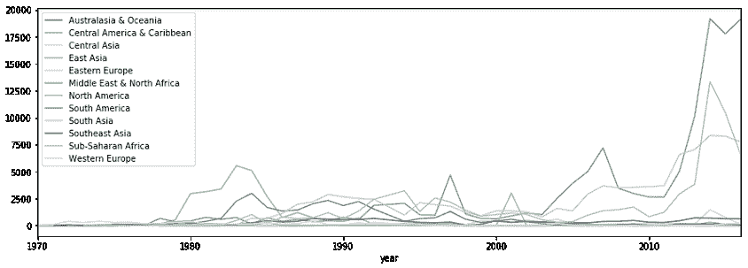

如果我们放大到这十年，只看美国和西欧，这就是我们看到的情况:

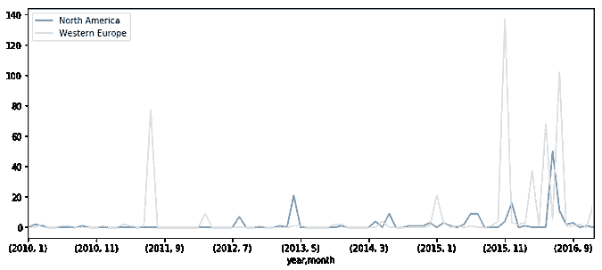

当你看上面两张图中 Y 轴的刻度时——世界其他地方是几万，西方是几十——很明显，在欧洲或美国比世界其他地方安全得多(安全两个数量级)。如果你生活在西方，这是个好消息，但对其他人来说就不是了。

尽管自 2015 年底以来，欧洲与恐怖主义相关的死亡人数相对激增，但欧洲的人口也是美国的两倍左右。为了更好地了解这与美国的死亡人数相比如何，我们需要看看每百万人的死亡人数。以下是我们得到的结果:

```
2015 terror deaths EU: 171.0 total, or 0.23 per million residents
```

因此，在 2015 年，一个欧洲人死于恐怖袭击的概率大约是 400 万分之一。听起来很小。出于好奇，我研究了这与美国本土的恐怖袭击有何不同:

```
2015 terror deaths US: 44.0 total, or 0.14 per million residents
```

我讨厌写这个，因为一些傻瓜会断章取义地引用它，但在 2015 年，欧洲人成为恐怖主义受害者的概率大约是美国人的两倍。但这就像说一个人被熊杀死的可能性是被鲨鱼杀死的两倍——两个数字都很低，差异在很大程度上是无关紧要的，因为两者都属于同一个“极不可能”的桶。(事实上，死于鲨鱼或熊袭击的几率与死于恐怖分子袭击的几率相差不远，但那是另一篇文章了。)

让我们看看问题的另一面。

# 美国的枪支死亡(第一轮)

好吧，这和在美国死于枪下的风险相比如何？以下是 2015 年美国枪支死亡人数的详细分析:

```
suicide     22060
homicide    13018
accident      489
other         284
```

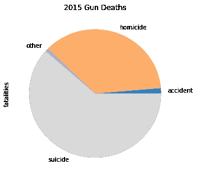

这与近年来被引用的数字和比率相一致——每年大约有 3.5 万人死于枪支，其中约 1/3 是杀人，约 2/3 是自杀——所以没什么好惊讶的。

因为恐怖袭击本质上是谋杀，所以让我们排除自杀，只看每百万人中的枪支谋杀，并将其与恐怖威胁进行比较:

```
2015 gun homicides US: 13018 total, or 40.29 per million residents
```

因此，以每百万居民约 40 起持枪杀人案计算，**美国人死于持枪杀人案的可能性是欧洲人死于欧洲恐怖分子的约 175 倍。嗯。**

但是……可以说这不是一个公平的比较。我听到过一些类似这样的观点:“恐怖分子倾向于随机袭击，杀害无辜的、毫无防备的受害者。美国的枪支暴力大多发生在贫困的市中心，涉及帮派和罪犯。换句话说，美国的枪支暴力是关于‘他们’，我们不是‘他们’，所以这种比较并不适用。”(*注:我不赞同这种想法，我完全了解种族和社会经济的污名化；这是我的观察。*)

那么，我们如何使分析适应“不是他们”的模糊概念呢？

# 美国的枪支死亡(第二轮)

让我们看看在深入研究疾控中心的数据时能发现什么…

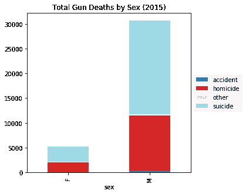

从绝对数字来看，美国男性成为枪支暴力受害者的可能性要高出 6 倍，而从百分比来看，男性和女性的根本原因相似，自杀是主要原因。

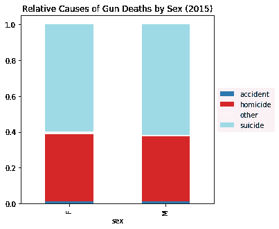

种族怎么样？

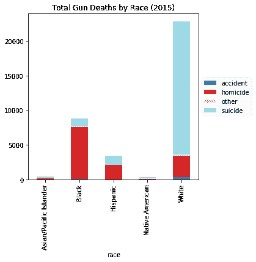

这里的差异是惊人的——白人数量最多，其次是黑人和西班牙裔，但自杀占白人枪支死亡的绝大多数(尽管这不是按总人口的百分比标准化的)。让我们以百分比为基础查看这些相同的数字，以获得不同的视角:

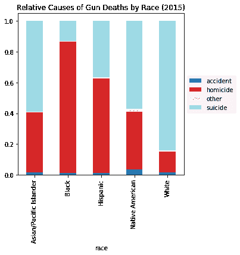

不同种族群体在意图上的显著差异在这里显而易见:黑人面临着被杀的巨大风险，而白人则面临着自杀的风险。

好吧，也许教育在其中扮演了一个角色，或者是直接的，或者是社会经济地位的代表:

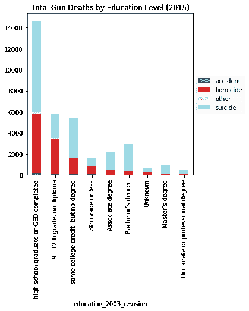

同样，这也是一个很强的相关性。

现在让我们看看年龄。这里有两种观点，一种根据意图，另一种根据种族:

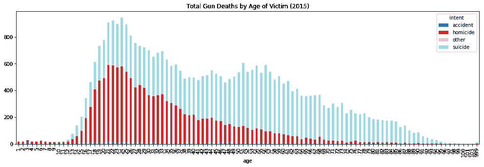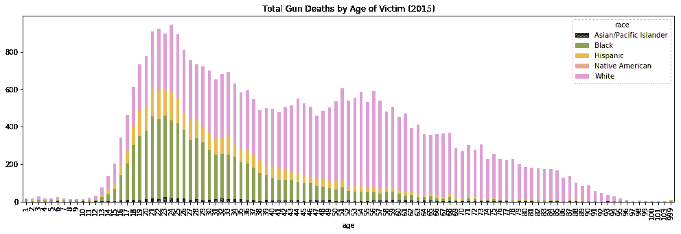

*(注意:50 岁左右的增长是由于白人男性自杀率的上升…记住，记住 11 月…)*

虽然悲剧，“自杀”、“事故”和“原因不明”事件与此分析无关，因此我们将排除那些专门关注杀人的事件，并从这个角度重新审视年龄与种族的关系图:

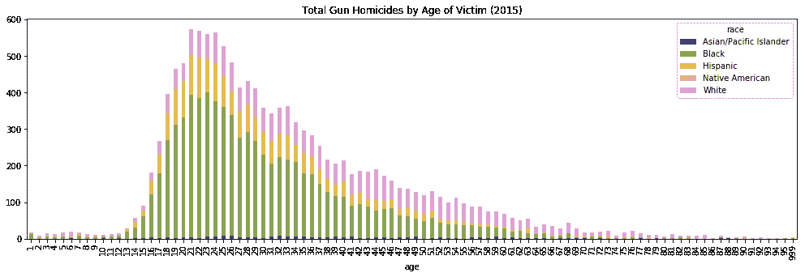

显而易见，美国的枪支死亡严重倾向于年轻的黑人和没有大学学位的西班牙裔男性。显然，这是一件非常糟糕的事情，也是美国需要解决的一个大问题。也就是说，我听到的大多数“欧洲如此危险”的担忧都来自年龄较大、受过大学教育的白人，因此在这次分析中，我将筛选 30 岁以上、拥有大学学位的白人:

```
2015 gun homicides US (white, over 30, college degree): 392 total, or 1.21 per million residents
```

所以，即使这个有限的人口统计数据仍然是**~ 5X 在美国死于枪击的可能性比欧洲人死于恐怖袭击的可能性更大。**

# 结论

好了，我们来回顾一下:

*   2015 年，欧洲一个人被恐怖分子杀害的几率远低于百万分之一。
*   同年，一个美国人被另一个美国人用枪杀死的几率在百万分之一到百万分之四十之间(取决于你把谁包括在分析中)。

在这一点上，我想我可以非常自信地说我最初的假设是正确的:**一个美国人被另一个美国人用枪杀死的风险比一个欧洲人被恐怖分子杀死的风险更高。**

在探索这些数据的过程中，我不得不承认我对我发现的一些事情感到惊讶，并希望进一步探索它们，例如:

*   世界其他地方的恐怖主义是怎么回事？我承认我不知道每年有成千上万的人被恐怖分子杀害。
*   枪支和恐怖主义的伤亡率与其他可预防的死亡相比如何？
*   为什么恐惧因素与实际风险的现实正交？

敬请关注。

*(注 1:有兴趣可以看看* [*上分析的代码这个 Kaggle 内核*](https://www.kaggle.com/ecodan/fear-factor-guns-vs-terrorists/notebook) *。)*

*(注 2:这是博客*[*【http://www.dancripe.com*](http://www.dancripe.com)*对原文章的更新转载。)*