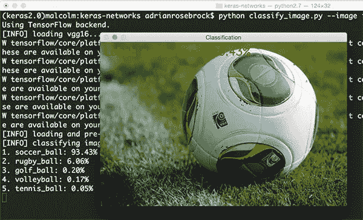

# 机器学习时代的恐惧

> 原文：<https://towardsdatascience.com/fear-in-the-age-of-machine-learning-87ee33b5b264?source=collection_archive---------7----------------------->

这是我关于人工智能和大数据系列的第三篇文章。最近完成了这个主题的博士学位，我计划涵盖几个与人工智能相关的有争议的话题，以及我为公司实施这项技术所做的工作。不用担心，没有违反保密协议，也没有公司机密通过这些帖子泄露出去。

这篇特别的文章是关于不确定性的。这是关于在面对机器学习对科技公司的统治时承认并拥抱恐惧。

# 我们所知道的< What we don’t

The **悲观主义者**说“一切都很糟糕，不可能变得更糟了”，而**乐观主义者**说“哦，是的，会的。”(白宫风云第五季第 21 集)

我对悲观主义持乐观态度。我必须这样。大多数创业公司都会失败。在加拿大，我们有一个“普通”规模公司的口头禅:中小型企业(SMEs)。这些中小企业通常不到 100 名员工。[精益阶段门](http://www.stage-gate.com/)和其他[快速失效方法](http://theleanstartup.com/)已经对这些试图生存的中小企业构成了挑战。在冒险创办或发展一家小型科技企业时，已经有足够多的恐惧了。例如，获得种子资金并不容易。将机器学习(ML)添加到组合中确实打乱了许多早期公司的计划，这些公司现在需要了解人工智能以及成功的标准蛋糕烘焙配方(云、SaaS、REST 等)。等等。)

不要说理解它是如何工作的，许多中小企业根本不明白机器学习有什么好处，而他们的利益相关者要求知道他们将如何抵御即将到来的人工智能机器大军。

假装我们有权力帮助我们感到安全。这是泻药。但由于人工智能的冲击，中小企业的处境将变得艰难。让我们来谈谈这些公司在 2 年内面临的情况。

# 海啸到达海岸

对 ML 服务的需求远远超过了供给，并且大多数 ML 服务的购买者对于在组织内哪里最适合应用 ML 缺乏了解。未来几年将会看到大量的创造性破坏，以及科技巨头为保护其寡头垄断而进行的收购。我喜欢市场分析师用方这个词来谈论这些巨头(脸书、亚马逊、网飞、谷歌)。如果你是一个典型的 100 人公司，动态对你不利。高素质的数据科学家很难找到，因为他们正在大量穿梭于承诺大笔股权的初创公司或提供大笔现金的大巨头之间。你坐在这里，夹在中间，对你的中小企业没有什么好的选择。当然，两年后情况会稳定下来。更多的数据科学家和工程师正在努力填补这个空白，并将在某个时候上线…但现在呢？

有一种有害的贪婪对恐惧的计算[，甚至对于像我这样的顾问](http://lsci.io)，他们进入公司来填补这个资源缺口。供求定律意味着低供给和高需求的交叉会推高价格，因此顾问也更喜欢与成熟的公司或有资金支持的初创公司合作。学术界没有给中小企业多少喘息的机会。公司直接进入大学招聘人才，与大学合作进行非研究核心开发对一个项目来说不是好兆头。大学项目的运行时间可能比预期的要长，并且不能保证成功。如果项目失败，你拿不回你的钱。学生来来去去。事情发生了。

从公司和工人的角度来看，让我们来看看技术方面的事情。**不确定性**也困扰着数学机器学习世界。你可能**没有**注意到机器学习如何编码不确定性的一些奇怪之处。看看下面这张来自 Adrian Rosebrock 优秀的 [pyimagesearch 博客](http://www.pyimagesearch.com/2017/03/20/imagenet-vggnet-resnet-inception-xception-keras/)的图片。

What’s wrong with this picture?

这里有点不对劲。有些不太对劲。你看到了吗？如果你是科学家，或者经常处理不确定性，你会注意到预测是标量的。没有误差线。因此，像*“我看到一个足球，有 93%的把握”*这样的预测应用到现实生活中就变得荒谬了。比如*“99%的降雨概率”*的预测，当你发现真正的降雨概率是*“99 25%的降雨概率”*或者可能是*“99 1%的降雨概率”*时，可信度会降低吗？不过，这也不全是坏消息。Yarin Gal 和其他人最近在解决机器学习中的这个问题方面做了一些令人兴奋的工作。更多见[此处](http://mlg.eng.cam.ac.uk/yarin/blog_2248.html)。

# **结论**

不确定性是当今的主流。它不会消失。它会一直留在这里。随着我们都习惯于广泛采用 ML，公司、人甚至机器学习模型都需要更好地量化、容忍和规划不确定性。

祝我们所有人好运！

-丹尼尔
[丹尼尔@lemay.ai](mailto:daniel@lemay.ai) ←打个招呼。
[LEMAY . AI](https://lemay.ai)
1(855)LEMAY-AI

您可能喜欢的其他文章:

*   [人工智能和不良数据](/artificial-intelligence-and-bad-data-fbf2564c541a)
*   [人工智能:超参数](/artificial-intelligence-hyperparameters-48fa29daa516)
*   [人工智能:让你的用户给你的数据贴上标签](https://medium.com/towards-data-science/artificial-intelligence-get-your-users-to-label-your-data-b5fa7c0c9e00)