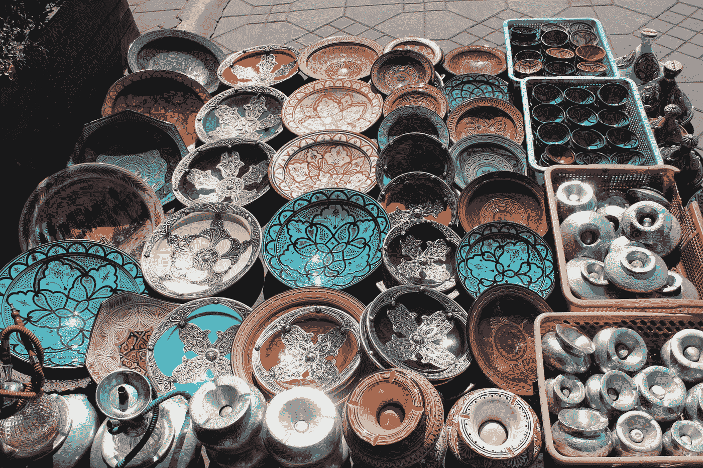
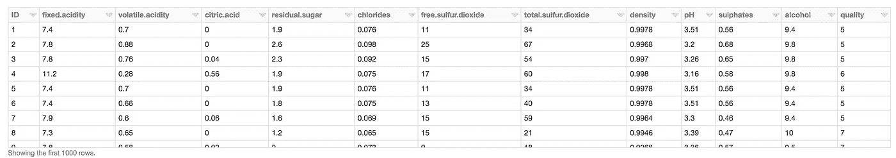
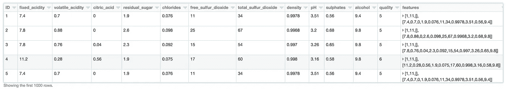
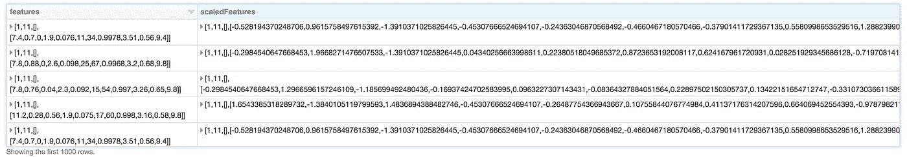
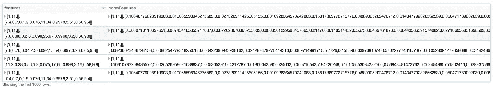
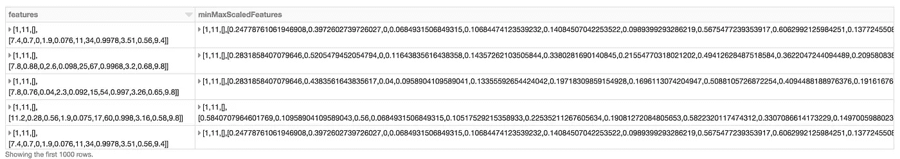
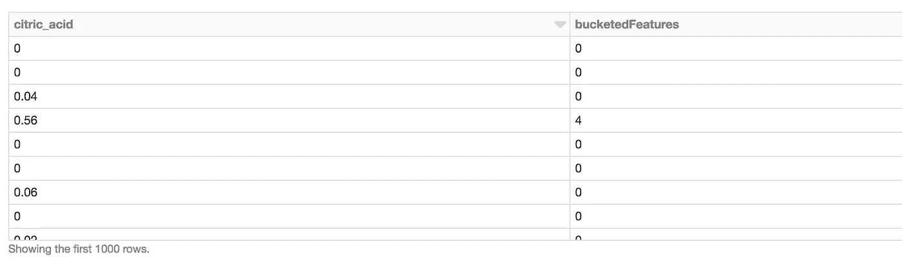
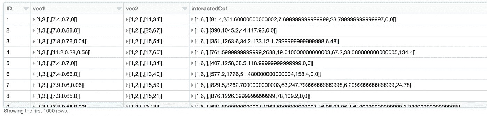

# Spark 2.3.0 简化了特征编码—第 2 部分

> 原文：<https://towardsdatascience.com/feature-encoding-made-simple-with-spark-2-3-0-part-2-5bfc869a809a?source=collection_archive---------8----------------------->

> "人工智能的关键一直是表现."~杰夫·霍金斯



这是最新的 Spark 2.3.0 特性编码技巧系列的第 2 部分。请参考之前的[第一部分](https://medium.com/@roshinijohri/feature-encoding-with-spark-2-3-0-part-1-9ede45562740)，因为那里的很多概念在这里都会用到。如前所述，我假设您对 spark 及其数据类型有基本的了解。如果没有，spark 有一个惊人的[文档](https://spark.apache.org/docs/latest/ml-guide.html)，如果能通过就太好了。关于 spark 本身的背景，请点击这里查看[摘要](https://medium.com/@roshinijohri/spark-diaries-ad9eec6d9266)。

我们在[之前的文章](https://medium.com/@roshinijohri/feature-encoding-with-spark-2-3-0-part-1-9ede45562740)中讨论过分类编码。在本帖中，我们将主要关注数字特征的各种转换。对于这个例子，我将使用[葡萄酒数据集](https://www.kaggle.com/piyushgoyal443/red-wine-dataset)。([我这里有一个小帖子，看看如何在 databricks 上做到这一点。](https://medium.com/@roshinijohri/adding-a-custom-dataset-to-databricks-community-edition-22104ab7fcfe))

假设数据现在已经上传到 databricks 上(或者您喜欢的任何地方)，让我们来看看数据。

```
**val** wineData = spark.read.table("winequalityreds_csv")
.**withColumnRenamed**("_c0", "ID")
.**withColumnRenamed**("fixed.acidity", "fixed_acidity")
.**withColumnRenamed**("volatile.acidity", "volatile_acidity")
.**withColumnRenamed**("citric.acid", "citric_acid")
.**withColumnRenamed**("residual.sugar", "residual_sugar")
.**withColumnRenamed**("free.sulfur.dioxide", "free_sulfur_dioxide")
.**withColumnRenamed**("total.sulfur.dioxide", "total_sulfur_dioxide")**display**(wineData)//note: had to change the names here because spark had a problem with recognising "." as a column name.
```



Wine Dataset Preview

Spark 为我们提供了许多转换选项来标准化/规范化数据。我将在这里讨论标准缩放器、规格化器和最小最大缩放器。为了实现上述任何一种变换，我们需要将这些特征组合成一个特征向量。猜猜我们能在这里用什么？正确，矢量装配工！

让我们在应用变换之前将特征变换为特征向量。

```
**val** wineFeatures = wineData.columns.filterNot(_.contains("ID"))
                                   .filterNot(_.contains("quality"))**val** wineVectorAssembler = **new** VectorAssembler()
                      .setInputCols(wineFeatures)
                      .setOutputCol("features")**val** pipelineVectorAssembler = **new** Pipeline().setStages(Array(wineVectorAssembler))**val** result_df = pipelineVectorAssembler.fit(wineData).transform(wineData)result_df.show()
```



Note: the features vector generated here is a dense vector but if there are too many zeros then spark can change that to a sparse vector

## [**标准缩放器:**](https://spark.apache.org/docs/2.1.0/ml-features.html#standardscaler)

应用这种转换的格式与我们在编码分类特征时看到的非常相似。它转换矢量行的数据集，将每个要素归一化为单位标准差和零均值。

然而，spark 中的标准化有一个警告。不幸的是，标准定标器不会在内部将稀疏向量转换为密集向量。**因此，在运行此步骤**之前，将稀疏向量转换为密集向量非常重要。虽然我们的数据帧没有真正的稀疏向量，但 spark 有时会将向量汇编器的输出更改为稀疏向量，这可能会给出一些不正确的结果，因为这不会真正引发错误。

它可以应用于我们的葡萄酒数据集，如下所示:

```
**import** org.apache.spark.ml.feature.StandardScaler//convert the sparse vector to a dense vector as a fail safe
**val** sparseToDense = **udf**((v : Vector) => v.toDense)
**val** result_df_dense = result_df.withColumn("features", sparseToDense($"features"))**val** scaler = new StandardScaler()
  .setInputCol("features")
  .setOutputCol("scaledFeatures")
  .setWithStd(true)
  .setWithMean(true)// Compute summary statistics by fitting the StandardScaler.
**val** scalerModel = scaler.fit(result_df_dense)// Normalize each feature to have unit standard deviation.
**val** scaledData = scalerModel.transform(result_df_dense)**display**(scaledData.select("features", "scaledFeatures"))
```



## [规格化器:](https://spark.apache.org/docs/2.1.0/ml-features.html#normalizer)

规格化器将每个向量规格化为单位范数。它接受参数 p(默认值=2 ),该参数指定用于归一化的 p 范数。当您的稀疏数据集包含不同比例的要素时，这通常很有用。不要忘记使用密集向量作为输入！

```
**import** org.apache.spark.ml.feature.Normalizer
**import** org.apache.spark.ml.linalg.Vectors// Normalize each Vector using $L^1$ norm.
**val** normalizer = new Normalizer()
  .setInputCol("features")
  .setOutputCol("normFeatures")
  .setP(1.0)**val** l1NormData = normalizer.transform(result_df_dense)**display**(l1NormData.select($"features", $"normFeatures"))
```



L1-Norm features

## [**MinMaxScaler:**](https://spark.apache.org/docs/2.1.0/ml-features.html#minmaxscaler)

通过将每个要素缩放到给定范围来变换要素。这通常在数据遵循的分布不是高斯分布时使用，如标准定标器所假设的那样。

```
**import** org.apache.spark.ml.feature.MinMaxScaler
**import** org.apache.spark.ml.linalg.Vectors**val** scaler = new MinMaxScaler()
  .setInputCol("features")
  .setOutputCol("minMaxScaledFeatures")// Compute summary statistics and generate MinMaxScalerModel
**val** minMaxScalerModel = scaler.fit(result_df_dense)// rescale each feature to range [min, max].
**val** minMaxScaledData = minMaxScalerModel.transform(result_df_dense)

**display**(minMaxScaledData.select("features", "minMaxScaledFeatures"))
```



以上三种一般是最常用的特征缩放方法。我想通过一些其他的火花转换，当我们必须处理连续的特征时，我们可以这样做。

## [](https://spark.apache.org/docs/2.1.0/ml-features.html#bucketizer)****:****

**bucketizer 将一列连续特征转换为一列特征桶。存储桶由参数“splits”决定。由分割 x，y 定义的存储桶保存范围[x，y]内的值，除了最后一个存储桶也包含 y。此处的分割应该严格递增。如果上限/下限未知，则应提供无穷大作为最小值和最大值，以避免任何超出存储桶界限的异常。这并不处理 NAN 值，所以最好在此之前去掉这些值。**

**让我们将它应用于葡萄酒数据集中的一列。**

```
**import** org.apache.spark.ml.feature.Bucketizer//define the splits that I want **val** splits = Array(0.0, 0.1, 0.2, 0.3, 0.5, 1.0) **val** bucketizer = new Bucketizer()
  .setInputCol("citric_acid") //example column from wineData
  .setOutputCol("bucketedFeatures")
  .setSplits(splits)// Transform original data into its bucket index.
**val** bucketedData = bucketizer.transform(wineData)**display**(bucketedData.select($"citric_acid", $"bucketedFeatures"))
```

****

**n buckets defined for n+1 splits**

## **[**分位数离散化:**](https://spark.apache.org/docs/latest/ml-features.html#quantilediscretizer)**

**这非常类似于 bucketizer，在您没有真正定义拆分时非常有用。它也可以处理 NANs。当遇到时，有一个“handleInvalid”设置器来选择移除 NAN 或引发异常。如果设置了 nan，那么将创建一个特殊的桶来处理它们。**

**将此应用于 wineData 中的相同柠檬酸列**

```
**import** org.apache.spark.ml.feature.QuantileDiscretizer**val** discretizer = new QuantileDiscretizer()
  .setInputCol("citric_acid")
  .setOutputCol("quantileBins")
  .setNumBuckets(10)
  .setHandleInvalid("skip")**val** result = discretizer.fit(wineData).transform(wineData)
**display**(result.select($"citric_acid", $"quantileBins"))
```

****

**其他有趣的变形金刚，我不打算做太多的细节(因为它们非常简单，在[文档](https://spark.apache.org/docs/latest/ml-features.html)中有很好的解释)，是[二进制化器](https://spark.apache.org/docs/latest/ml-features.html#binarizer)、[估算器](https://spark.apache.org/docs/latest/ml-features.html#imputer)、、[多项式展开](https://spark.apache.org/docs/latest/ml-features.html#polynomialexpansion)和 [PCA](https://spark.apache.org/docs/latest/ml-features.html#pca) 。请随意建议在评论区添加一些例子，我很乐意添加一些。我会谨慎对待估算者，因为估算缺失值是一个需要彻底调查的过程。缺少数据并不意味着丢失数据，我们应该始终小心不小心在数据中添加了某种偏差。**

**另一个我没怎么合作过的变形金刚，但在[互动](https://spark.apache.org/docs/latest/ml-features.html#interaction)中似乎很有趣。除了输出更多的是输入向量的叉积之外，它的功能类似于向量汇编器。这可能会在我们的数据中产生不同的特征交互。我将在实际管道中对此进行更多的评估，以了解使用它的好处，并更新本文。如果我们将它应用到我们的数据集，我们将会看到:**

```
**import** org.apache.spark.ml.feature.Interaction
**import** org.apache.spark.ml.feature.VectorAssembler**val** assembler1 = new VectorAssembler()
  .setInputCols(Array("fixed_acidity", "volatile_acidity", "citric_acid")) //taking features indicating acidity
  .setOutputCol("vec1")**val** assembled1 = assembler1.transform(wineData)**val** assembler2 = new VectorAssembler()
  .setInputCols(Array("free_sulfur_dioxide", "total_sulfur_dioxide")) //taking features indicating sulfur content
  .setOutputCol("vec2")**val** assembled2 = assembler2.transform(assembled1).select("ID", "vec1", "vec2")**val** interaction = new Interaction()
  .setInputCols(Array("ID", "vec1", "vec2"))
  .setOutputCol("interactedCol")**val** interacted = interaction.transform(assembled2)**display**(interacted)
```

****

**我希望这篇文章对开始使用 spark 进行特性转换有所帮助。您可以为您的管道构建的定制转换的类型是无限的，spark 提供了一个可伸缩的、快速的和几乎可靠的( :) )基础设施来做到这一点。请提出你认为有助于这篇文章更好的改进意见。我将很高兴相应地更新。**

**我将在下一篇文章中用 kaggle 数据集处理特征提取器和端到端管道。快乐阅读！！**

**ps:如果你喜欢，请鼓掌！帮助我知道它帮助了你，提升了文章！**