# Spark 2.3.0 简化了特征编码—第 1 部分

> 原文：<https://towardsdatascience.com/feature-encoding-with-spark-2-3-0-part-1-9ede45562740?source=collection_archive---------4----------------------->

***“每一次解码都是另一次编码”~戴维·洛奇***

正如在[之前的博客](https://medium.com/@roshinijohri/spark-diaries-ad9eec6d9266)中提到的，接下来的几篇博客将关注特性工程。机器学习项目中的许多工作都归结于此。不管我们喜不喜欢，我们都要花 95%的时间来生成特征向量，这将使我们的数据发挥最大作用。

Spark 为我们如何优化这一流程提供了很多余地。我将简要介绍一下我发现有用的编码类型，然后更详细地讨论使用大数据时可能会遇到的问题。出于这篇博文的目的，我假设您对 spark 函数及其数据类型有基本的了解。如果不是，为了合理的背景理解，请参考此[文档](https://spark.apache.org/docs/latest/ml-features.html)。

## **管道:**

我将从管道开始，因为它使您的特性转换更加容易。管道背后的主要概念是结合复杂的算法和转换来创建工作流。假设您必须对一些分类特征进行热编码，并运行 xgboost 模型。您应该采取以下步骤。

*   索引类别特征
*   编码成一个热点向量
*   集合成一个特征向量
*   火车模型

这四个步骤可以作为一系列管道阶段运行，以形成工作流。数据预处理部分将是一组适合输入数据帧的转换器(如 one hot 编码器)和估算器。可以按如下方式创建管道对象:

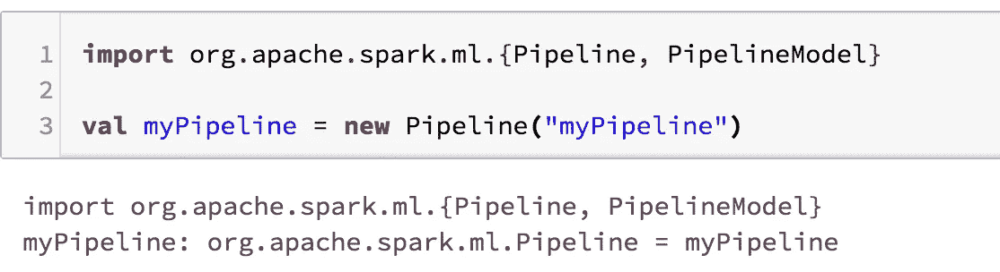

Note: the uid here “myPipeline” is optional

让我们看看如何包含阶段并使管道模型适合输入数据帧。我们可以使用 spark 中称为字符串索引器的一种特性索引方法来理解字符串索引器和管道。

## 字符串索引器:

字符串索引器将一列字符串标签/类别编码为一列索引。索引的**排序是基于流行度**完成的，范围是[0，numOfLabels。让我们举一个简单数据帧的玩具例子。

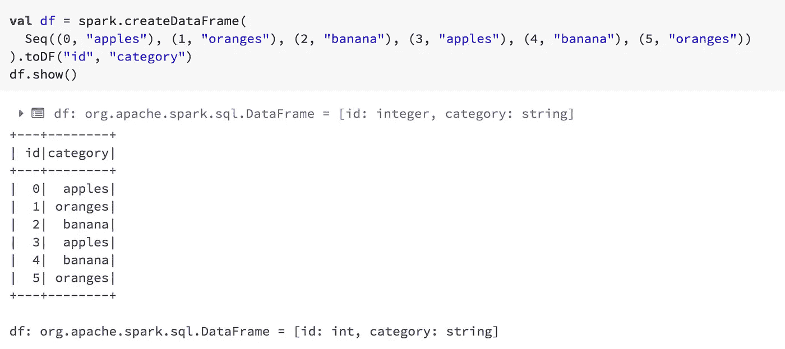

Toy Data Frame

要使用字符串索引器索引类别，您需要执行以下操作:

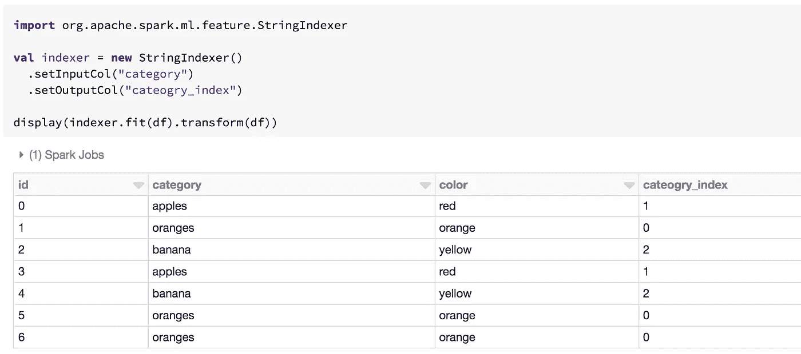

Transformed Dataframe

请注意如何指定希望列输出被调用的名称。当您拥有包含大量需要编码的分类特征的大数据时，这非常有用。使用一点 scala 和 spark magic，这可以在几行代码中完成。让我们将另一列追加到我们的玩具数据帧中。

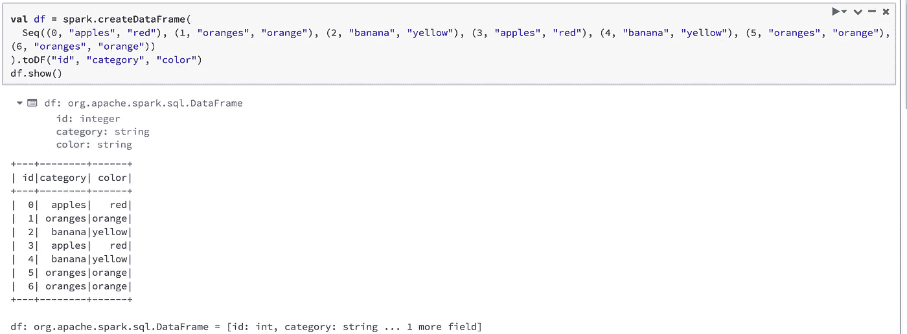

Toy Dataframe with a extra column

现在，一点火花管道和 scala 魔术…

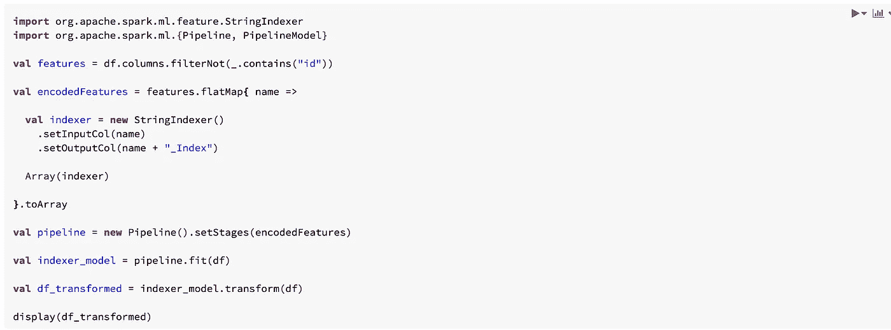

并且如下所示的结果数据帧具有颜色和类别索引。整洁！这里的编码特征可以被设置为流水线阶段。然后，可以将其与输入数据进行拟合，以创建管道模型。我们使用这个模型将数据帧转换成如下所示的结果数据帧。

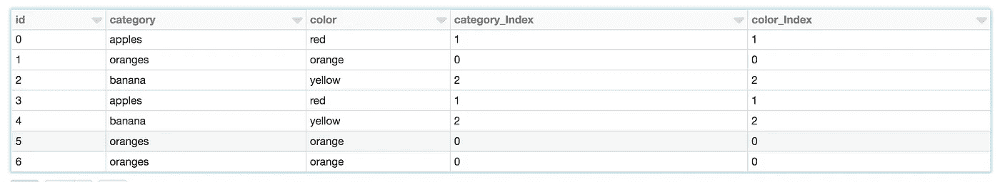

Note: You can retrieve the labels that were transformed by the string indexer by using the inverse called [IndexToString](https://people.apache.org/~pwendell/spark-nightly/spark-master-docs/latest/ml-features.html#indextostring).

让我们在 spark 中探索更多的编码方法，并在我们的管道中添加更多的阶段！

## 一个热编码器:

一个 hot 编码器将标签索引映射到至多具有单个 1 值的二进制向量表示。当我们需要使用分类特征但算法期望连续特征时，通常使用这些方法。spark one hot 编码器从字符串索引器获取索引标签/类别，然后将其编码为稀疏向量。这与通常的虚拟列创建风格略有不同。让我们在上面的例子中添加一个热编码器，看看它是如何工作的。

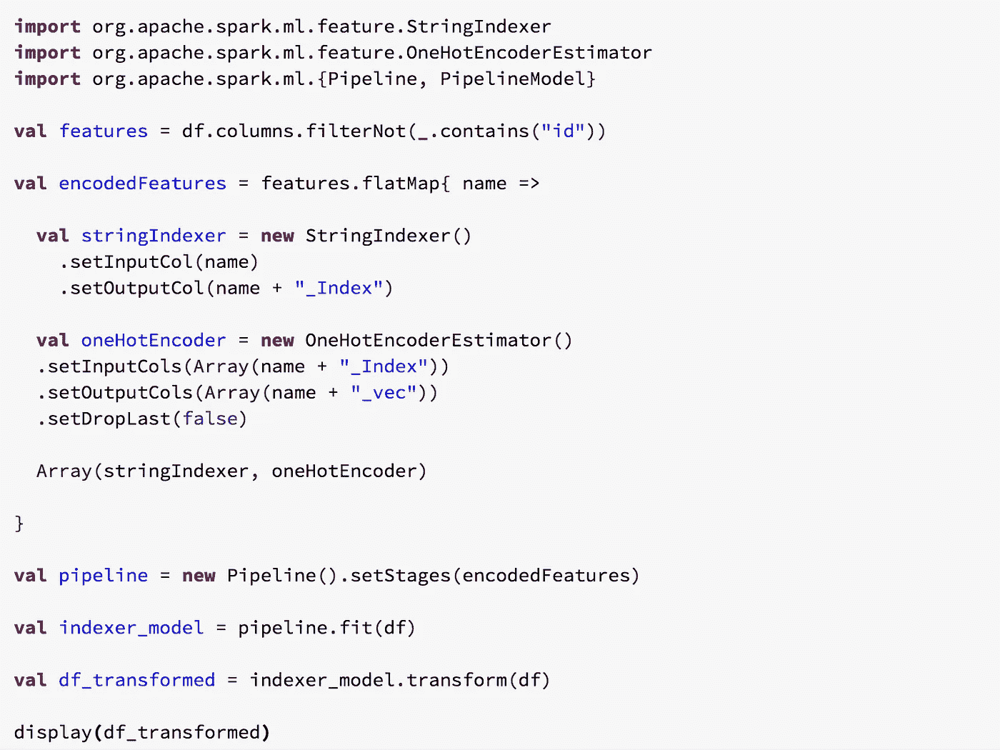

并且产生的数据帧…

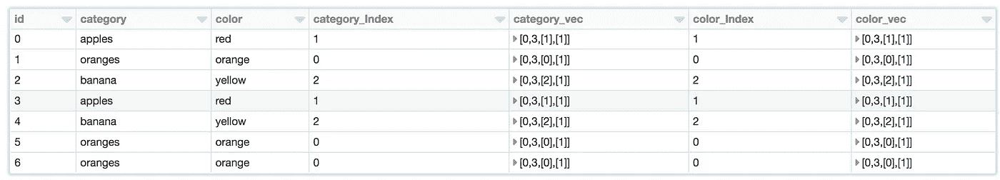

在这一点上，对于那些不熟悉 spark 中矢量类型的人，我想指出上面数据帧中看到的稀疏矢量有 4 个不同的组成部分。第一个为 0 的分量表示它是一个稀疏向量。第二部分是关于向量的大小。第三个组件讨论填充向量的索引，而第四个组件讨论这些索引是什么值。这将截断向量，当您有非常大的向量表示时非常有效。如果你想看到它的密集向量表示，很容易使用 udf 来转换它。类似这样的操作示例如下:

Note: Spark has two vector types, org.apache.spark.mllib.linalg.Vector is also valid.

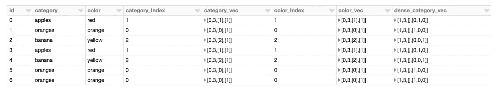

Both sparse and dense representations for category_vec

到目前为止，我们已经讨论了管道、分类特性的一些索引和编码。我们现在有两个索引和编码的特征。spark 中的大多数机器学习算法都期望一个编码的数字向量作为输入。为了做到这一点，我们使用了一种叫做[矢量汇编器的东西。](https://people.apache.org/~pwendell/spark-nightly/spark-master-docs/latest/ml-features.html#vectorassembler)

## 向量汇编程序:

[矢量组装器](https://people.apache.org/~pwendell/spark-nightly/spark-master-docs/latest/ml-features.html#vectorassembler)的工作是将原始特征和各种变换生成的特征组合成一个单一的特征矢量。它接受布尔型、数字型和矢量型输入。让我们修改前面的代码，将类别和颜色向量合并成一个特征向量。

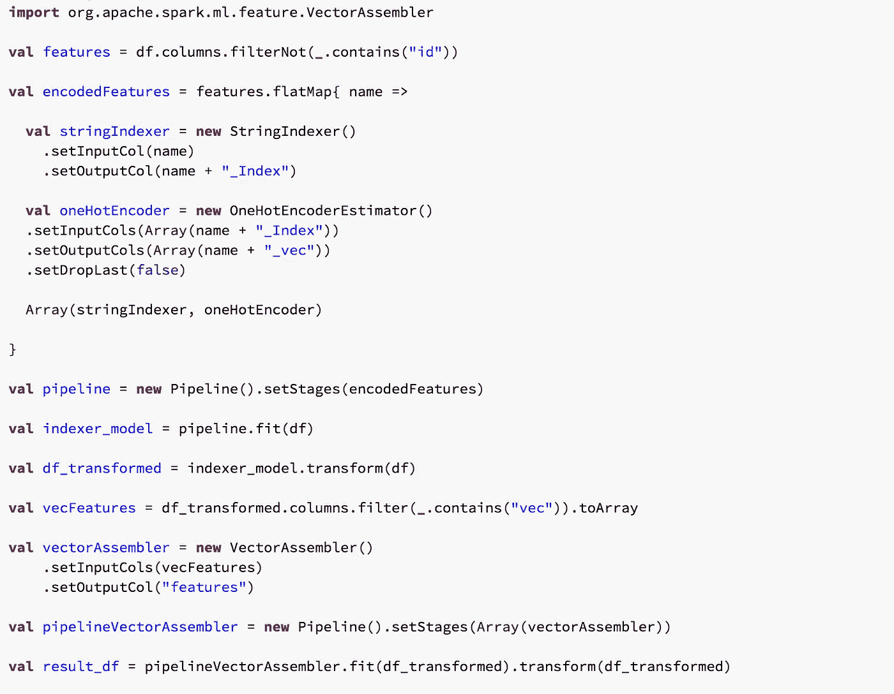

Adding vector assembler to get the final feature vector

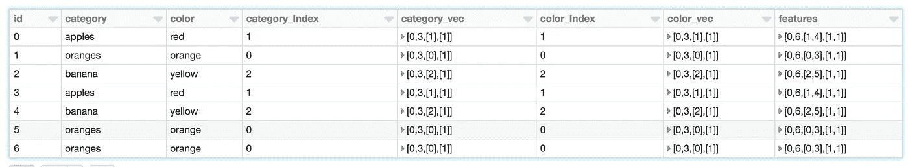

Resulting data frame

通常，当您希望在训练模型或对模型评分之前组合所有功能时，Vector assembler 将始终出现在您的工作流中。spark 中也存在的一种转换是矢量索引器。

## 向量索引器:

在我们的例子中，向量索引器将让我们跳过对分类特征进行编码的一个热编码阶段。该算法基于特征值自动进行推断，并进行变换以获得最终的特征向量。我们可以改变上面的例子，添加向量索引器如下:

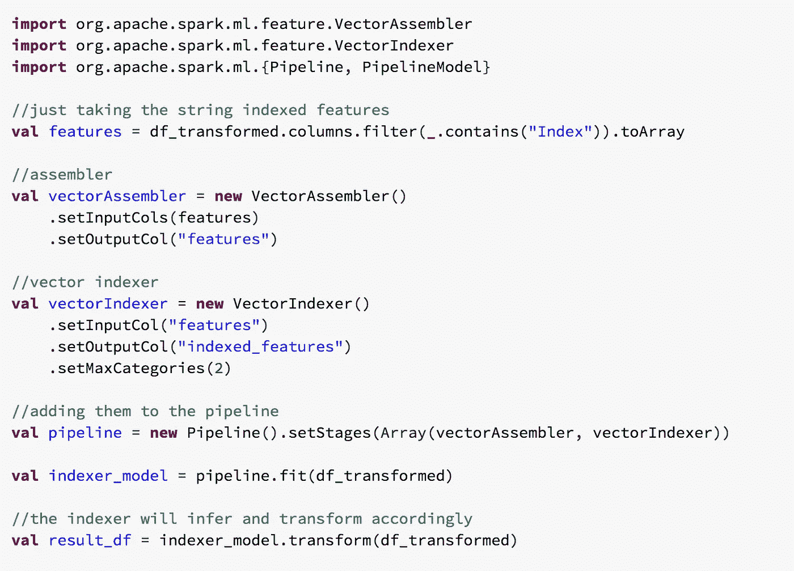

Applying vector indexer to the string indexer’s output

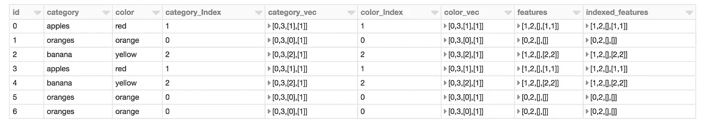

Feature is the output of the assembler but the categorical features are not encoded yet. The vector indexer will do this and produces indexed_features as the final feature vector

以上几点评论。在不明显的情况下，直接使用字符串索引器的输出作为一个特征是没有意义的，因为如果苹果被索引为 1，而桔子被索引为 2，这可能被推断为苹果比桔子等级高，或者桔子比苹果大。这些都没有意义，因此我们不对它们进行编码。向量索引器做同样的事情，但是在后端。我通常更喜欢在自己的工作流程中直接使用 one hot 编码器。

到目前为止，我们只涉及了分类特性和一些关于管道和向量组装器的概念。在[第二部分](/feature-encoding-made-simple-with-spark-2-3-0-part-2-5bfc869a809a)中，我将介绍一些数字特征编码的概念。我们还将涉及如何处理高基数分类特征。请随时提问或指出任何可能没有意义的事情。^_^

ps:如果你喜欢，请鼓掌！让我知道它帮助了你！