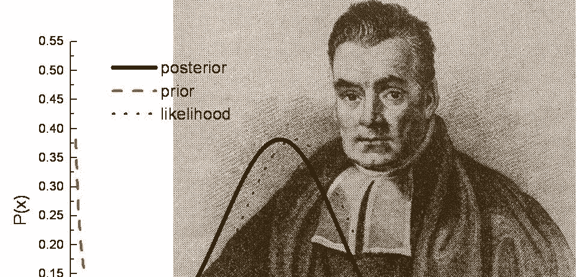
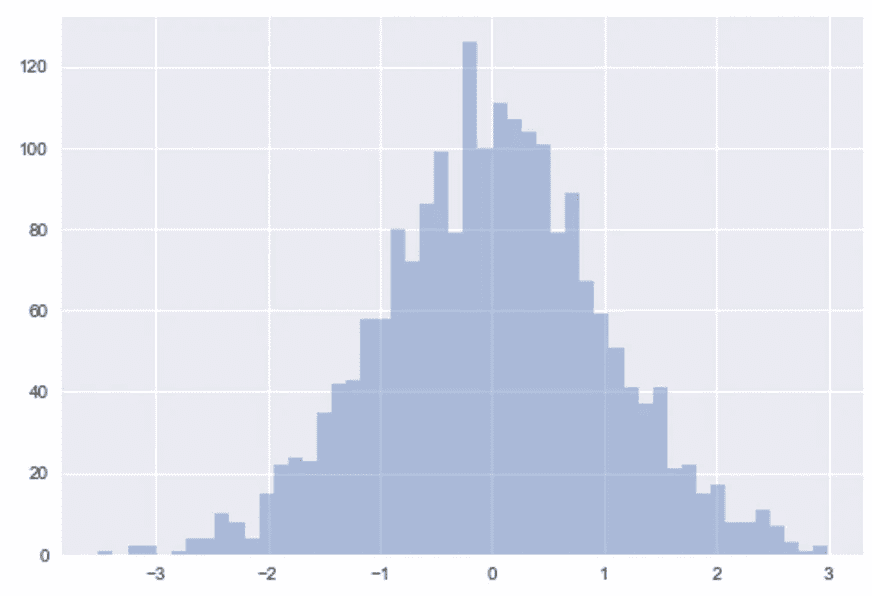
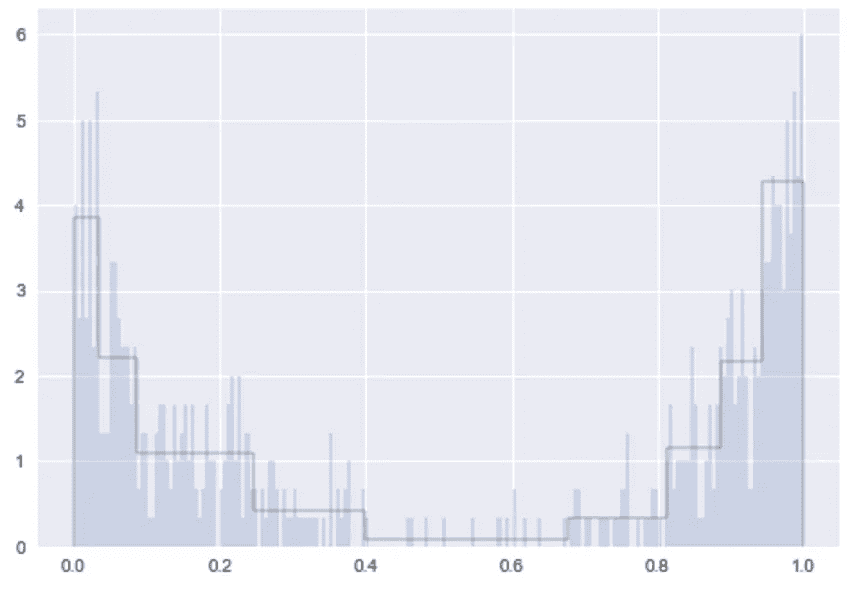
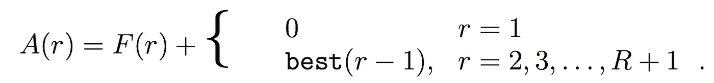

# 特征工程:宁滨的贝叶斯方法

> 原文：<https://towardsdatascience.com/feature-engineering-bayesian-methods-for-binning-38d29a29bb88?source=collection_archive---------0----------------------->

任何数据科学难题中最关键的一块，或许也是最不迷人的一块:特征工程。这可能是漫长而令人沮丧的，但如果做得不好，它可能会给随后的任何建模或分析带来灾难。在这篇文章中，我希望揭示一种令人愉快的推理技术。

> “应用机器学习”基本上是特征工程——吴恩达

将数据点“组合”在一个特征中是一种常见的策略。根据您对某个特性的期望，它可以从简单到复杂。考虑这样一种情况，您想要对具有大量不同值的要素进行热编码。基于每个不同值的分桶可能会给你留下很大的特征空间，并且将来的模型容易过度拟合。

那么怎么斗呢？已经提出了几种经验法则，包括*斯科特法则*、*克努特法则*和*弗里德曼-迪康尼斯法则*。这些方法的问题是它们都假设相同大小的箱，这是有问题的，并且不一定是最佳的。

是时候打破一些神话了。首先，数据点必须被分类以使它们有意义。第二，容器必须大小相等。第三，箱必须足够大，以便每个箱都有“统计上显著的”样本量。

许多人陷入了一种思维定势，认为减少噪音的最佳方式是平滑他们的数据，处理数据点的最佳方式是将数据存储起来。这种宁滨方法是有问题的，因为它们丢弃了信息并引入了对以下参数的依赖:(1)平滑度和(2)面元大小——并且指定参数是不好的。理想情况下，面元宽度应该仅取决于数据本身的属性，并且所得到的直方图不应该是先验固定的。

"一定有我们能做的事情！"我听见你哭泣，睁大眼睛，长着爱因斯坦般的头发。有。

## 贝叶斯块

贝叶斯块框架是一种自适应的方法，用于自动识别容器大小和划分数据。像其他非参数方法一样，贝叶斯块寻求一种通用的表示，避免提供先验限制的关于平滑度和形状的假设。

最佳分割是一个简单而有效的优化问题，其目标是最大化标准的定量表达，或者最小化误差测量。更重要的是，它能够计算全局最优值，而不仅仅是局部最优值。

在高层次上:给定一个任意但固定的*块*大小的直方图，如左图所示，我们可以使用贝叶斯似然框架，该框架使用一个*适应度函数*，该函数仅取决于(1)每个块的宽度和(2)每个块内数据点的数量。*最佳*宁滨模式将是块配置，基于块之间的边缘(称为*改变点*，其将变化)，具有最大的适应性。

*注意:任何尝试扩大这种方法的暴力版本都是徒劳的。可能的配置数量按 2^N.的顺序呈指数级增长，如果不是因为动态编程技术的美丽，这是不可能的。*

为了澄清，变化点是序列中经历突然转变的点，其一个或多个参数瞬间跳到新值。这里，我们将块适应度作为相对于块高度的最大相关可能性

适应度函数是对恒定水平表示块内数据有多好的方便测量，它也仅取决于该块内的数据，而不取决于除了指定块边缘位置的模型参数之外的模型参数。有不同的方法来定义适应度函数，其价值将根据最适合手头数据的方式而有所不同。

接下来本质上是数学归纳法。首先，我们对数据进行排序。接下来，我们从第一个数据单元格开始，并进行迭代。在每一步，增加一个单元，直到所有数据点都被分析完(为了优化，在下面链接的论文中描述了一个触发器，当检测到第一个变化点时停止)。在步骤 R，对于前 R 个单元，我们识别出*最佳单元划分*，在每个步骤存储最佳*适应度*(在称为**最佳**的数组中表示为 F(r ))和最佳划分的最后变化点的位置(在称为**最后**的数组中)。

Bayesian Blocks fitted to two concatenated, randomly sampled beta distributions

对于给定的单元位置 R，可以通过首先考虑前 R+1 个单元的所有分区的集合，并使用该集合中唯一可能是最佳的成员是第一个 R 的最佳分区，然后是 R+1 处的最后一个块的知识，来计算单元位置 R+1 处的最佳分区。这个划分的适合度是 F(r)的和。

现在存储了在范围 r 上可能是最优的所有分区的适合度。产生最优解的 r 值可以通过找到最大值 A(r)简单地计算出来。

迭代完所有点后，我们现在需要获取最佳分区的变点位置。为此，我们使用 **last** 数组中的最后一个值来确定最佳分区的最后一个变化点。我们“剥离”对应于最后一个块的部分并重复。

差不多就是这样。

谢谢你过来。要了解更多关于贝叶斯块的信息，一定要看看 Jeffrey D. Scargle 的原始论文和 Jake Vanderplas *的酷帖。*

[天文时间序列分析研究。不及物动词贝叶斯块表示法](https://arxiv.org/pdf/1207.5578.pdf) —杰弗里·d·斯卡格尔

Python 中的动态编程:贝叶斯块