# 在大型金融数据集上使用机器学习的特征工程

> 原文：<https://towardsdatascience.com/feature-engineering-using-machine-learning-on-large-financial-datasets-8584dacd3a4d?source=collection_archive---------3----------------------->

对于在银行处理大型金融数据集的数据科学家和分析师来说，计算出信用违约或坏账的概率是他们所做的最重要的活动之一。这一行动的重要任务是确定银行的信贷政策、风险管理和信贷操作，这是银行向潜在客户销售信贷产品的真正竞争优势。

然而，对于大型数据集，对于分析师来说，这变成了一个非常基于判断的判断(并且通常是不准确的),会对下游财务产生影响。此外，如果不消除决策的非关键特征，最先进的机器学习算法也会变得无能为力，因为它们被提供了“无意义”的数据。

最近的机器学习范例提供了使用内置算法的解决方案，这些算法可以帮助数据分析师为销售和运营团队提供业务见解，以便在客户获取和活动管理方面采取主动行动。

以下流程是使用来自 [Lending Club](https://www.lendingclub.com/info/download-data.action) 的真实客户数据(公开信息)开发的。当然，这不包括客户的机密信息，如姓名、地址、联系方式和社会保障信息。但是，出于此活动的目的，我们不需要任何机密的客户信息。公共数据集中提供的特征应该足够好，足以让我们提出我们想要的见解。

我们将使用 Jupyter Notebook 编写一个简短的 python 程序，涵盖以下活动——

*   数据采购
*   数据探索和清理
*   特征重要性
*   绘图和可视化

让我们开始吧。

**第一步——获取数据**

我们可以使用公共领域中的 Lending club 数据，这些数据包含真实世界的贷款和信用违约数据点。数据(csv 文件)下载完成后，可以上传到 Jupyter notebook 的相应文件夹中。

*注:*如果没有 Jupyter 笔记本，强烈推荐下载/安装和 anaconda([https://www.anaconda.com/download/](https://www.anaconda.com/download/))

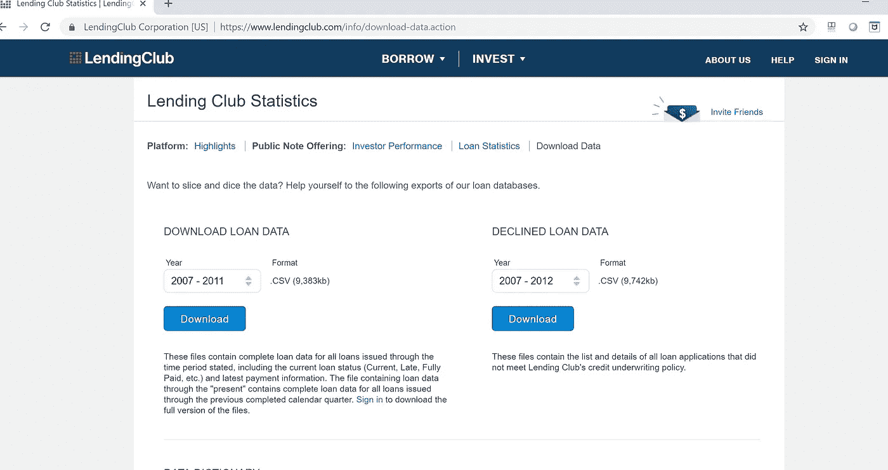

**步骤 2 —数据探测&清理**

导入必要的包并读取数据集

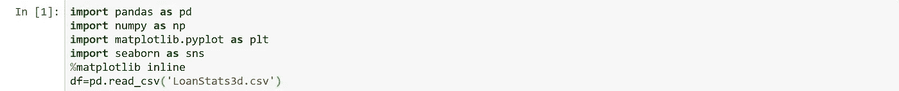

删除不相关的字段

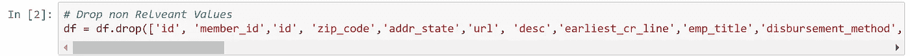

做一些基础的探索

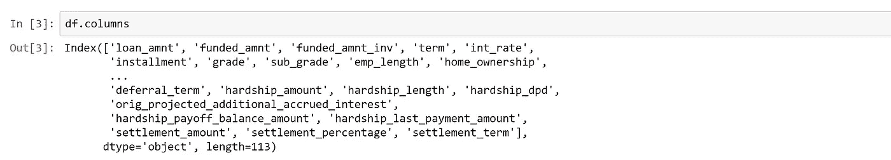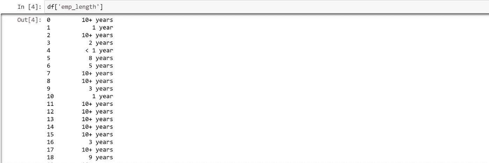

作为这一领域的人，雇佣期是信用管理的关键因素之一，雇佣期的数据是完全混乱的，这是很直观的。我们需要清理一下。

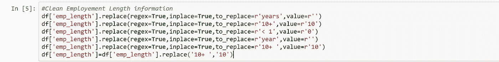

类似地，清理条款和利率的可用信息。

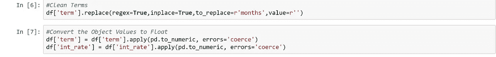

使用 dummy 将关键分类值转换为相关数字


现在开始处理目标特性，即“贷款状态”。除了“全额付款”和“当前”客户，我们可以让其余所有客户处于拖欠状态，因此具有更高的违约倾向。

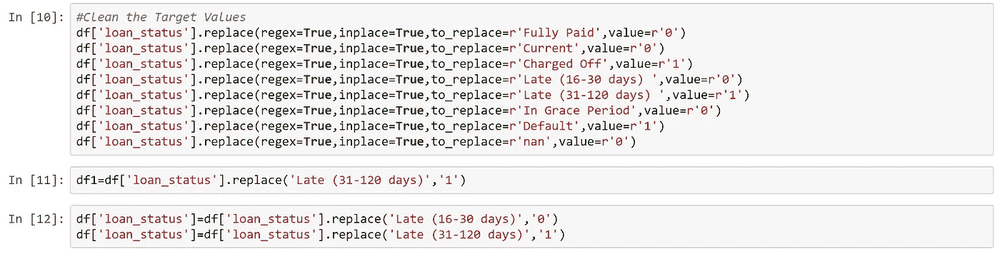

利率领域似乎完全混乱了，我们需要清理一下。

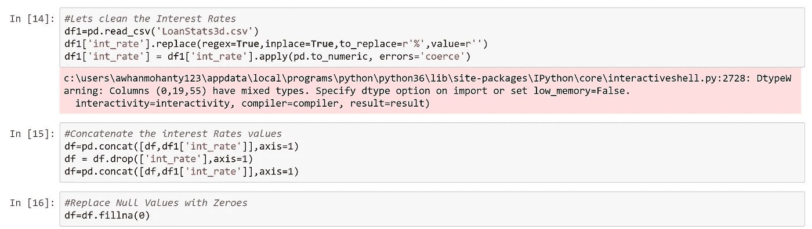

现在看起来我们有了一个相当干净的数据，我们可以在这个数据的基础上用算法得到一些下降的结果。但在此之前，最好以 csv 格式备份干净的文件，以供将来参考和离线报告。

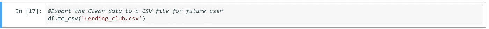

让我们做一些基本的探索，使用一些绘图技术来研究数据属性。

```
plt.hist(df['loan_amnt'],histtype='bar', align='mid', color='red', label=None, stacked=False, normed=None,data=df)
```

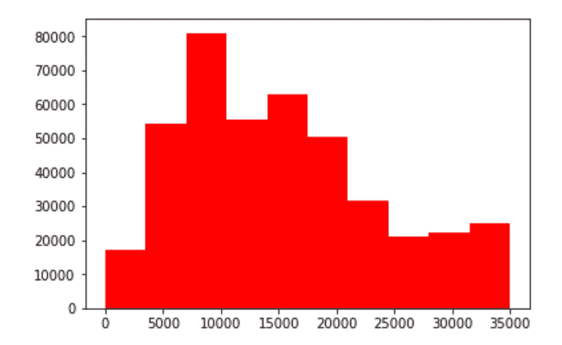

```
plt.figure(figsize=(10,6))
df[df['loan_status']==0]['int_rate'].hist(alpha=0.5,color='blue',bins=30,label='loan_status=0')
df[df['loan_status']==1]['int_rate'].hist(alpha=0.5,color='orange',bins=30,label='loan_status=1')
plt.legend()
plt.xlabel('int_rate')
```

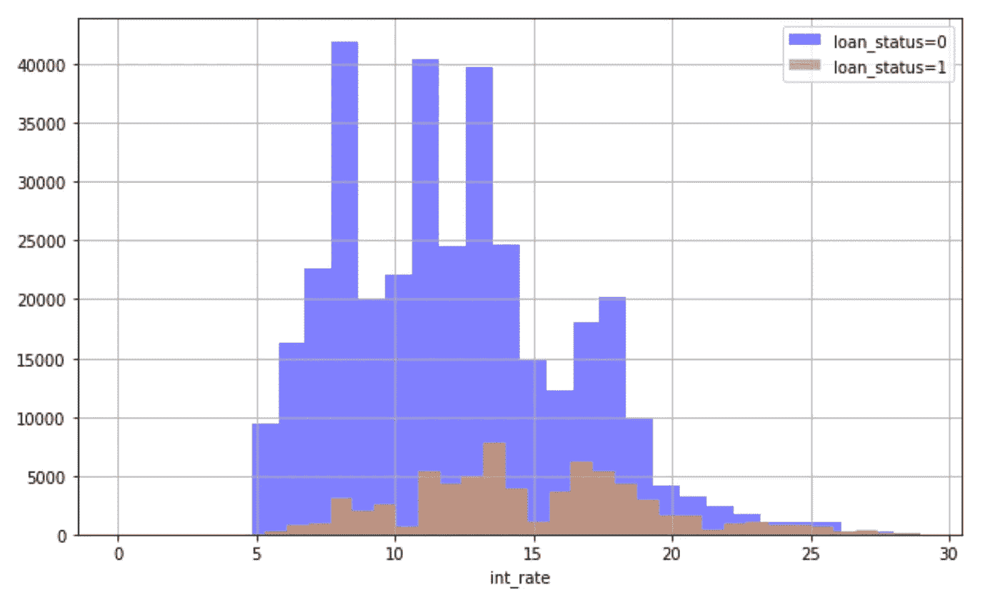

**步骤 3 —使用随机森林的重要特性**

这是本文中最重要的一步，它强调了使用随机森林找出最重要的分析特性的技术。这对于评估机器学习任务中特征的重要性非常有用，尤其是当我们处理大量特征时。换句话说，我们可以说这是数据清理的一个高级阶段，删除那些对我们的目标特性没有任何意义的非必要数据。

```
#### Use Random Forests for Plot the Importance of Featuresprint(__doc__)from sklearn.datasets import make_classification
from sklearn.ensemble import ExtraTreesClassifierX=np.array(df.drop('loan_status',axis=1))
y=np.array(df['loan_status'])# Build a forest and compute the feature importances
forest = ExtraTreesClassifier(n_estimators=250,
                              random_state=0)forest.fit(X, y)
importances = forest.feature_importances_
std = np.std([tree.feature_importances_ for tree in forest.estimators_],
             axis=0)
indices = np.argsort(importances)[::-1]# Print the feature ranking
print("Feature ranking:")for f in range(X.shape[1]):
    print("%d. feature %d (%f)" % (f + 1, indices[f], importances[indices[f]]))Feature ranking:
1\. feature 20 (0.124970)
2\. feature 24 (0.074578)
3\. feature 23 (0.070656)
4\. feature 19 (0.067598)
5\. feature 18 (0.066329)
6\. feature 16 (0.055700)
7\. feature 17 (0.054894)
8\. feature 25 (0.053542)
9\. feature 0 (0.044944)
10\. feature 1 (0.044642)
11\. feature 2 (0.044474)
12\. feature 4 (0.043504)
13\. feature 105 (0.027864)
14\. feature 3 (0.019966)
15\. feature 106 (0.015091)
16\. feature 21 (0.015081)
17\. feature 104 (0.012508)
18\. feature 121 (0.012266)
19\. feature 107 (0.008324)
20\. feature 111 (0.006282)
21\. feature 22 (0.006171)
22\. feature 108 (0.005095)
23\. feature 110 (0.003950)
24\. feature 112 (0.003154)
25\. feature 49 (0.002939)
26\. feature 118 (0.002719)
27\. feature 109 (0.002582)
28\. feature 7 (0.002469)
29\. feature 77 (0.002402)
30\. feature 56 (0.002310)
31\. feature 72 (0.002296)
32\. feature 79 (0.002294)
33\. feature 55 (0.002291)
34\. feature 52 (0.002280)
35\. feature 66 (0.002280)
36\. feature 70 (0.002266)
37\. feature 6 (0.002249)
38\. feature 84 (0.002242)
39\. feature 65 (0.002238)
40\. feature 68 (0.002235)
41\. feature 9 (0.002233)
42\. feature 67 (0.002215)
43\. feature 58 (0.002212)
44\. feature 51 (0.002210)
45\. feature 71 (0.002208)
46\. feature 14 (0.002203)
47\. feature 15 (0.002199)
48\. feature 62 (0.002198)
49\. feature 69 (0.002175)
50\. feature 57 (0.002153)
51\. feature 60 (0.002148)
52\. feature 45 (0.002145)
53\. feature 5 (0.002130)
54\. feature 83 (0.002115)
55\. feature 12 (0.002114)
56\. feature 73 (0.002112)
57\. feature 82 (0.002102)
58\. feature 85 (0.002088)
59\. feature 50 (0.002071)
60\. feature 33 (0.002038)
61\. feature 10 (0.001880)
62\. feature 78 (0.001859)
63\. feature 59 (0.001828)
64\. feature 120 (0.001733)
65\. feature 63 (0.001660)
66\. feature 27 (0.001549)
67\. feature 32 (0.001509)
68\. feature 61 (0.001481)
69\. feature 117 (0.001448)
70\. feature 64 (0.001417)
71\. feature 11 (0.001401)
72\. feature 115 (0.001389)
73\. feature 8 (0.001366)
74\. feature 119 (0.001329)
75\. feature 13 (0.001158)
76\. feature 80 (0.001037)
77\. feature 100 (0.000837)
78\. feature 76 (0.000823)
79\. feature 97 (0.000781)
80\. feature 116 (0.000766)
81\. feature 113 (0.000741)
82\. feature 99 (0.000681)
83\. feature 81 (0.000679)
84\. feature 44 (0.000572)
85\. feature 26 (0.000486)
86\. feature 40 (0.000466)
87\. feature 102 (0.000458)
88\. feature 43 (0.000440)
89\. feature 42 (0.000400)
90\. feature 98 (0.000398)
91\. feature 38 (0.000395)
92\. feature 101 (0.000348)
93\. feature 41 (0.000345)
94\. feature 48 (0.000344)
95\. feature 35 (0.000343)
96\. feature 103 (0.000343)
97\. feature 39 (0.000342)
98\. feature 37 (0.000333)
99\. feature 34 (0.000305)
100\. feature 47 (0.000272)
101\. feature 53 (0.000272)
102\. feature 46 (0.000271)
103\. feature 36 (0.000264)
104\. feature 31 (0.000135)
105\. feature 54 (0.000131)
106\. feature 75 (0.000103)
107\. feature 30 (0.000052)
108\. feature 29 (0.000045)
109\. feature 74 (0.000034)
110\. feature 28 (0.000004)
111\. feature 114 (0.000000)
112\. feature 93 (0.000000)
113\. feature 91 (0.000000)
114\. feature 90 (0.000000)
115\. feature 89 (0.000000)
116\. feature 96 (0.000000)
117\. feature 88 (0.000000)
118\. feature 87 (0.000000)
119\. feature 95 (0.000000)
120\. feature 86 (0.000000)
121\. feature 94 (0.000000)
122\. feature 92 (0.000000)
```

根据大小，运行此步骤可能需要相当长的时间。所以有点耐心:-)

现在，所有 122 个特性都按照重要性降序排列&作为一名在这个领域工作的数据分析师/科学家，删除非关键特性应该不是一件难事。

**步骤 4——绘图&可视化**

尽管我们有一个重要功能的列表，但出于各种操作或管理目的，提供该列表的视觉确认总是可取的。

```
# Plot the feature importances of the forest
plt.figure()
plt.title("Feature importances")
plt.bar(range(X.shape[1]), importances[indices],
       color="r", yerr=std[indices], align="center")
plt.xticks(range(X.shape[1]), indices)
plt.xlim([-1, X.shape[1]])
plt.show()
```

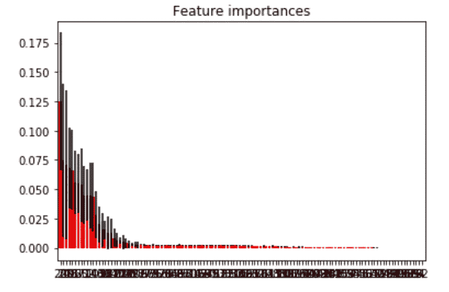

因为我们有 122 个特征，所以上面的情节看起来又脏又丑。让我们试着探索 10 个最重要的特性，看看它是如何出现的

```
# Plot to show the most important 10 Featuresp = importances[indices][:10]
q=indices[:10]
plt.figure()
plt.title("Feature importances")
plt.bar(range(10), p,
    color="r", yerr=std[q], align="center")
plt.xticks(range(10), q)
plt.xlim([-1,10])
plt.show()
```

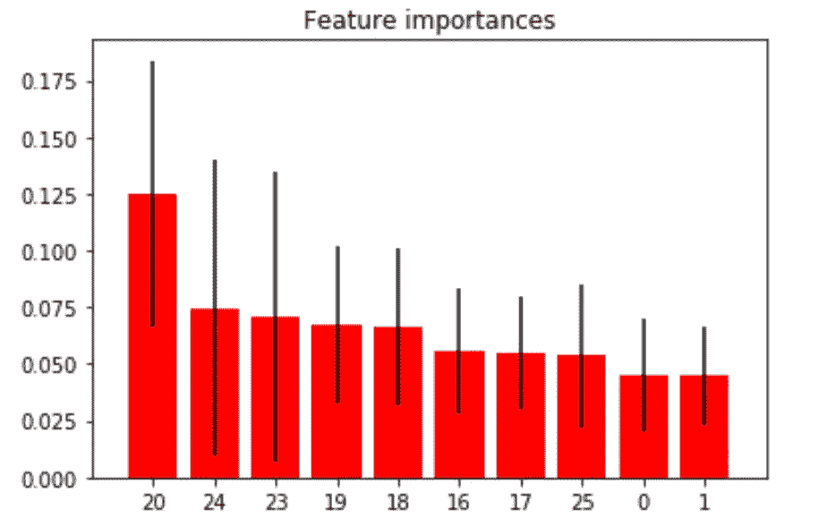

现在有了这个，我们或多或少可以假设特征 20 是决定贷款违约的最关键的特征。您可以根据您的组织的要求来处理该图。你也可以通过这种机制将功能的数量从“几千”减少到不到一百。这确实为银行提供了一个强大的选择，在数据被送入复杂的机器/深度学习算法之前，对数据进行优化。

*感谢阅读——如果你觉得这篇文章有趣并想保持联系，你可以在 Twitter 上找到我* [*这里*](https://twitter.com/awhanmohanty) *或*[*LinkedIn*](https://www.linkedin.com/in/awhanmohanty/)