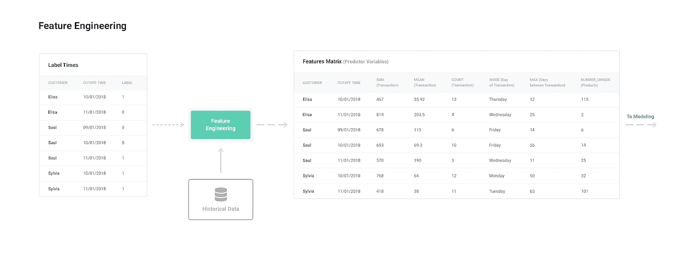
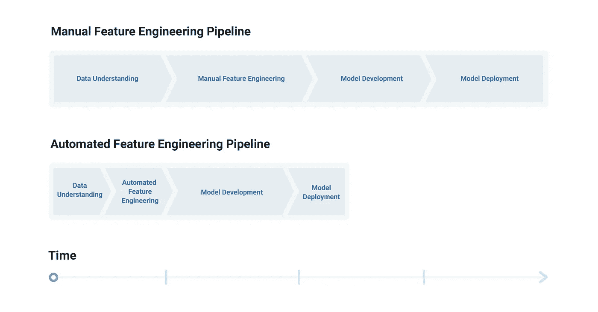
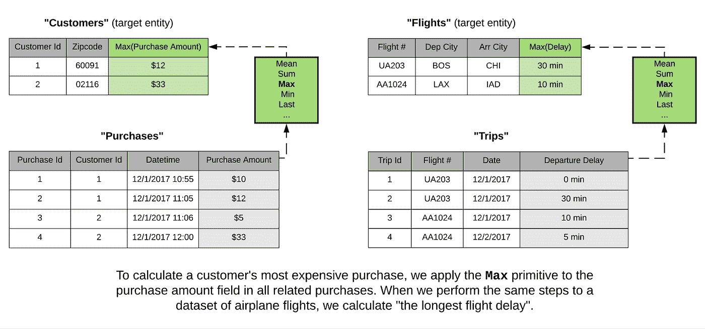
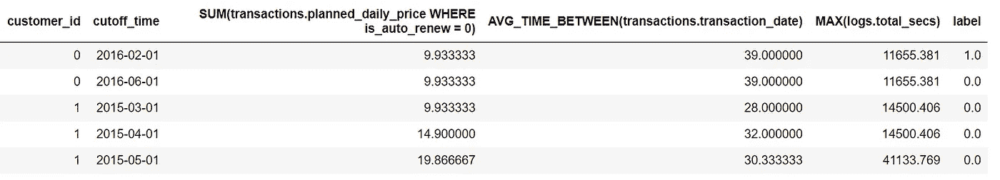
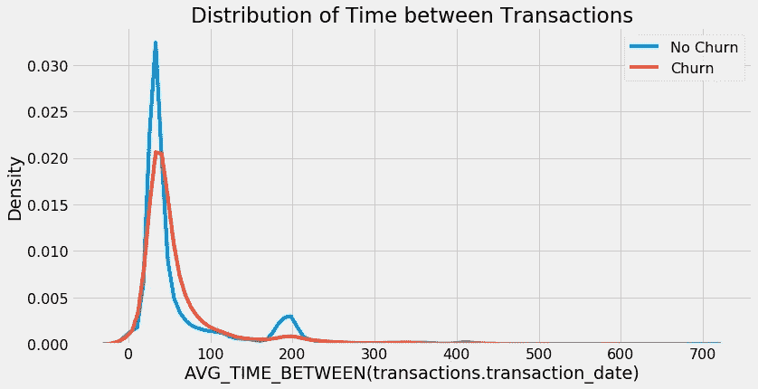

# 特征工程:机器学习的动力是什么

> 原文：<https://towardsdatascience.com/feature-engineering-what-powers-machine-learning-93ab191bcc2d?source=collection_archive---------2----------------------->

## 如何从原始数据中提取特征用于机器学习

这是我们如何在功能实验室进行机器学习的四部分系列中的第三部分。整套文章是:

1.  [概述:机器学习的通用框架](https://medium.com/@williamkoehrsen/how-to-create-value-with-machine-learning-eb09585b332e)
2.  [预测工程:如何设置你的机器学习问题](https://medium.com/@williamkoehrsen/prediction-engineering-how-to-set-up-your-machine-learning-problem-b3b8f622683b)
3.  特征工程(本文)
4.  [建模:教授一种算法进行预测](https://medium.com/@williamkoehrsen/modeling-teaching-a-machine-learning-algorithm-to-deliver-business-value-ad0205ca4c86)

这些文章涵盖了应用于预测客户流失的概念和完整实现。project [Jupyter 笔记本在 GitHub](https://github.com/Featuretools/predicting-customer-churn/tree/master/churn) 上都有。(完全披露:我在 [Feature Labs](https://www.featurelabs.com/) 工作，这是一家初创公司开发工具，包括 [Featuretools](https://github.com/Featuretools/featuretools) ，用于解决机器学习的问题。这里记录的所有工作都是用开源工具和数据完成的。)

# 特征工程

常说“[数据是机器学习的燃料](https://www.salon.com/2018/11/04/why-data-is-the-new-oil-what-we-mean-when-we-talk-about-deep-learning/)”这并不完全正确:数据就像机器学习的*原油*，这意味着它必须被提炼为*特征*——预测变量——才能对训练模型有用。没有相关特征，就无法训练出准确的模型，无论机器学习算法有多复杂。从原始数据集中提取特征的过程称为 [*特征工程*](https://en.wikipedia.org/wiki/Feature_engineering) *。*

## 特征工程过程

特征工程是[机器学习管道](/how-to-create-value-with-machine-learning-eb09585b332e)中的第二步，它从第一步——预测工程——中获取[标签次数，以及需要提炼的原始数据集。特征工程意味着为每个标签构建特征，同时*根据标签的截止时间*过滤用于特征的数据，以生成有效的特征。这些特征和标签然后被传递到建模，在那里它们将被用于训练机器学习算法。](/prediction-engineering-how-to-set-up-your-machine-learning-problem-b3b8f622683b)

The process of feature engineering.

虽然特征工程需要标签时间，但是在[我们的通用框架](/how-to-create-value-with-machine-learning-eb09585b332e)中，对于仅对应于一个预测问题的特定标签，它*不是硬编码的*。如果我们为单个问题编写特征工程代码——就像传统的特征工程方法一样——那么每次参数改变时，我们都必须重复这个费力的步骤。

相反，我们使用像 [Featuretools](https://github.com/Featuretools/featuretools) 这样的 API，可以为*任何标签集构建特性，而不需要修改代码。*这意味着对于客户流失数据集，我们可以使用完全相同的功能工程代码解决多个预测问题——预测每月、每隔一周或提前两个月而不是一个月的流失。

> 这符合我们机器学习方法的原则:我们 ***分段*** 流水线的每一步，同时标准化输入和输出。这种独立性意味着我们可以改变预测工程中的问题，而不需要改变下游的特征工程和机器学习代码。

使机器学习过程的这一步在预测问题上可重复的关键是*自动化特征工程*。

# 自动化特征工程:更快地构建更好的预测模型

传统上，[特性工程是手工完成的](https://www.kaggle.com/willkoehrsen/introduction-to-manual-feature-engineering)，利用领域知识一次构建一个特性。然而，这种手动过程*容易出错，繁琐，必须对每个数据集*从头开始，最终*受到人类创造力*和*时间*的限制。此外，在依赖于时间的问题中，我们必须根据截止时间过滤每个特征，这很难避免会使整个机器学习解决方案无效的错误。

[自动化特征工程](/automated-feature-engineering-in-python-99baf11cc219)通过一种可重用的方法从关系数据集中自动构建数百个相关特征，从而克服了这些问题。此外，该方法[基于截止时间](https://docs.featuretools.com/automated_feature_engineering/handling_time.html)过滤每个标签的特征，创建丰富的有效特征集。简而言之，自动化特征工程使数据科学家能够在很短的时间内建立更好的预测模型。

Manual vs Automated Feature Engineering Pipelines.

## 自动化特征工程的动机

在解决了一些机器学习的问题后，很明显[许多用于构建特征的操作在数据集上重复](https://www.featurelabs.com/blog/deep-feature-synthesis/)。例如，我们通常会找到某个事件的工作日—无论是交易还是航班—然后找到每个客户或航空公司一周中某天的平均交易金额或航班延误。一旦我们意识到这些操作*不依赖于底层数据*，为什么**不将**这个过程抽象成一个框架，可以为任何关系数据集构建特性？

这是自动化特征工程背后的思想。我们可以将相同的基本构建模块(称为[特征原语](https://docs.featuretools.com/automated_feature_engineering/primitives.html))应用于不同的关系数据集，以构建预测变量。作为一个具体的例子，应用于客户交易的“max”特征原语也可以应用于航班延误。在前一种情况下，这将为每个客户找到*最大的交易，在后一种情况下，将为给定航班号*找到*最长的航班延误。*

[Source: How Deep Feature Synthesis Works](https://www.featurelabs.com/blog/deep-feature-synthesis/)

这是抽象的[思想的一个体现:通过构建利用许多问题共有操作的更高级工具，消除处理细节的需要——为每个数据集编写特定代码。](https://en.wikipedia.org/wiki/Abstraction_(computer_science))

> 最终，[自动化特征工程让我们作为数据科学家更加高效](/why-automated-feature-engineering-will-change-the-way-you-do-machine-learning-5c15bf188b96),因为我们不再需要重复繁琐的问题操作。

# 特征工程的实施

目前，唯一使用多表进行自动化特征工程的开源 Python 库是由[特征实验室](https://www.featurelabs.com)开发和维护的[特征工具](https://github.com/Featuretools/featuretools)。对于客户流失问题，我们可以使用 Featuretools 为我们在预测工程中创建的标签时间快速构建功能。(完整代码可在本 [Jupyter 笔记本](https://github.com/Featuretools/predicting-customer-churn/blob/master/churn/3.%20Feature%20Engineering.ipynb)中获得)。

我们有三个数据表[数据](https://www.kaggle.com/c/kkbox-churn-prediction-challenge/data):客户背景信息、交易和用户收听日志。如果我们使用手工特征工程，我们会头脑风暴，手工构建特征，例如*客户交易的平均值*，或者她去年周末的总支出*。对于每个特征，我们首先必须在标签的截止时间之前将数据过滤到*。相比之下，在我们的框架中，我们利用 Featuretools 在几行代码中自动构建数百个相关特性。**

*我们不会讨论 Featuretools 的细节，但该库的核心是一种称为[深度特征合成](https://www.featurelabs.com/blog/deep-feature-synthesis/)的算法，该算法堆叠了称为[原语](https://docs.featuretools.com/automated_feature_engineering/primitives.html#)的特征工程构建块(像“max”或找到事务的“weekday”这样的简单操作)，以构建“深度特征”。该库还会根据截止时间自动过滤要素数据。*

*有关 Featuretools 中自动化特征工程的更多信息，请参见:*

*   *[Python 中的自动化特征工程](/automated-feature-engineering-in-python-99baf11cc219)*
*   *功能工具[文档](https://docs.featuretools.com/)和 [GitHub](https://github.com/Featuretools/featuretools)*

*Featuretools 需要一些后台代码来[通过关系](https://docs.featuretools.com/loading_data/using_entitysets.html)将表链接在一起，但是我们可以使用以下代码自动为客户流失创建特性(参见[笔记本以了解完整的详细信息](https://github.com/Featuretools/predicting-customer-churn/blob/master/churn/3.%20Feature%20Engineering.ipynb)):*

**这一行代码为`cutoff_times`中的每个标签*提供了 200 多个特性。每个特征是特征基元的组合，仅使用相关截止时间之前的*数据构建。**

**

*Sample of features from Featuretools automated feature engineering.*

*Featuretools 构建的特性可以用自然语言来解释，因为它们是从基本操作中构建的。例如，我们看到特征`AVG_TIME_BETWEEN(transactions.transaction_date)`。这表示每个客户的平均交易间隔时间。当我们用标签的颜色来绘制这个图时，我们看到，频繁交易的客户的平均交易间隔时间似乎稍长。*

**

*Distribution of time between transactions colored by the label.*

*除了获得数百个有效的相关特征之外，在 Featuretools 中开发自动化的特征工程管道意味着我们可以对数据集的不同预测问题使用相同的代码。我们只需要将正确的标签时间传递给`cutoff_times`参数，就能够为不同的预测问题构建特征。*

> *自动化特征工程意味着我们可以在通常完成一个问题所需的时间内解决多个问题。参数的改变意味着调整几行代码，而不是实现一个全新的解决方案。*

*为了解决不同的问题，而不是重写整个管道，我们:*

1.  *调整预测工程代码以创建新的标签时间*
2.  *输入要素工程和输出要素的标注时间*
3.  *使用特征来训练和监督机器学习模型*

*(简单说明:特性工程代码可以使用 Dask 或 Spark 和 PySpark 并行运行。对于后一种方法，请参见功能实验室工程博客上的[这本笔记本](https://github.com/Featuretools/predicting-customer-churn/blob/master/churn/4.%20Feature%20Engineering%20on%20Spark.ipynb)或[这篇文章](https://medium.com/feature-labs-engineering/featuretools-on-spark-e5aa67eaf807)。)*

## *后续步骤*

*正如来自预测工程的标注时间流入特征工程一样，特征用作下一阶段的输入，即建模:训练算法根据特征预测标注。[在本系列的最后一篇文章](https://medium.com/@williamkoehrsen/modeling-teaching-a-machine-learning-algorithm-to-deliver-business-value-ad0205ca4c86)中，我们将看看如何使用机器学习模型来训练、调整、验证和预测，以解决客户流失问题。*

*作为预览，图中是机器学习调整后的精确召回曲线。(GitHub 上有完整的笔记本[。](https://github.com/Featuretools/predicting-customer-churn/blob/master/churn/5.%20Modeling.ipynb))*

**

*Precision Recall Curve for Machine Learning*

# *结论*

*特征工程往往是用机器学习解决问题的一个单调乏味的方面，也是妨碍解决方案成功实施的错误来源。通过在通用机器学习框架中使用自动化特征工程，我们可以:*

*   ***为任何关系数据集自动构建数百个特征***
*   ***通过过滤截止时间的数据仅创建有效特征***

*此外，*特征工程代码不是针对来自预测工程*的输入而硬编码的，这意味着*我们可以使用相同的精确代码为多个预测问题*制作特征。在结构化框架中应用自动化特征工程，我们能够将特征工程从一个痛苦的过程转变为一个快速、可重用的过程，使我们能够解决许多有价值的机器学习问题。*

*如果构建有意义的高性能预测模型是您关心的事情，那么请联系我们的[功能实验室](https://www.featurelabs.com/contact/)。虽然这个项目是用开源的 Featuretools 完成的，但是[商业产品](https://www.featurelabs.com/product)为创建机器学习解决方案提供了额外的工具和支持。*