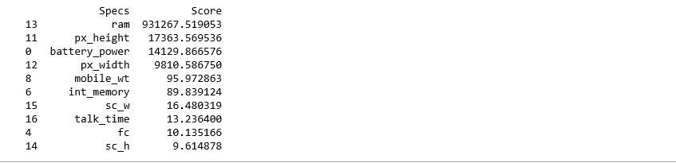
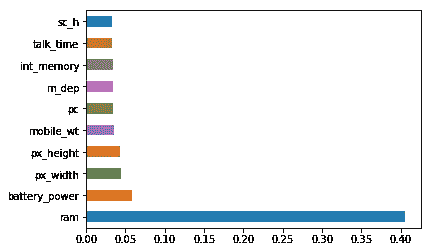
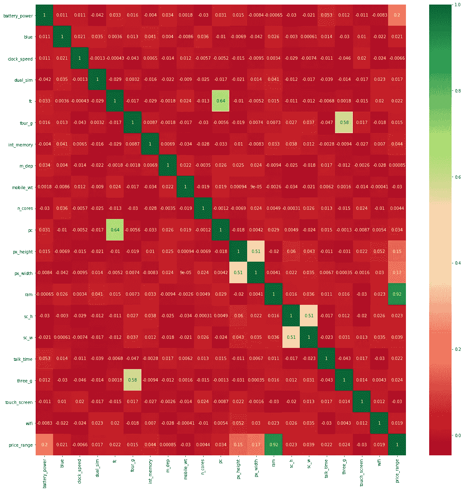

# Python 机器学习中的特征选择技术

> 原文：<https://towardsdatascience.com/feature-selection-techniques-in-machine-learning-with-python-f24e7da3f36e?source=collection_archive---------0----------------------->

新的一天带来了新的力量和新的思想——**埃莉诺·罗斯福**


我们都可能面临这样的问题:从一组数据中识别相关特征，并删除不相关或不太重要的特征，而这些特征对我们的目标变量没有太大贡献，以便实现我们模型的更高精度。

**特征选择是机器学习的核心概念之一，它会极大地影响模型的性能。**您用来训练机器学习模型的数据特征对您可以实现的性能有着巨大的影响。

不相关或部分相关的特征会对模型性能产生负面影响。

特征选择和数据清理应该是模型设计的第一步，也是最重要的一步。

在这篇文章中，你会发现可以在机器学习中使用的特征选择技术。

特征选择是自动或手动选择对您感兴趣的预测变量或输出贡献最大的那些特征的过程。

数据中包含不相关的要素会降低模型的准确性，并使模型基于不相关的要素进行学习。

**如何选择特征，在对数据建模之前执行特征选择有什么好处？**

**减少过度拟合**:冗余数据越少，基于噪声做出决策的机会就越少。

**提高精度**:误导性数据少意味着建模精度提高。

**减少训练时间**:数据点越少，算法复杂度越低，算法训练越快。

**我想借此分享一下我的亲身经历。**

我通过选择所有功能准备了一个模型，我得到了大约 65%的准确性，这对于预测模型来说不是很好，在做了一些功能选择和功能工程后，没有对我的模型代码做任何逻辑更改，我的准确性跃升至 81%，这非常令人印象深刻

现在你知道为什么我说特征选择应该是你的模型设计的第一步，也是最重要的一步。

**特征选择方法:**

我将分享 3 个易于使用且效果良好的特征选择技巧。

1.单变量选择

2.特征重要性

3.热图相关矩阵

让我们用一个例子来逐一看看这些技术

**您可以从这里下载数据集**[**https://www . ka ggle . com/iabhishekofficial/mobile-price-class ification # train . CSV**](https://www.kaggle.com/iabhishekofficial/mobile-price-classification#train.csv)

**上述文件中变量的描述**

battery_power:电池一次可以储存的总能量，单位为毫安

蓝色:有无蓝牙

clock_speed:微处理器执行指令的速度

dual_sim:是否支持双 sim 卡

fc:前置摄像头百万像素

四 _g:有没有 4G

int_memory:以千兆字节为单位的内部内存

m_dep:移动深度，单位为厘米

mobile_wt:手机重量

n_cores:处理器的内核数量

电脑:主摄像头百万像素

px _ 高度

像素分辨率高度

像素分辨率宽度

ram:以兆字节为单位的随机存取存储器

sc_h:手机屏幕高度，单位为厘米

sc_w:手机屏幕宽度，单位为厘米

talk_time:单次电池充电持续的最长时间

三 _g:有没有 3G

触摸屏:有无触摸屏

wifi:有没有 wifi

price_range:这是目标变量，值为 0(低成本)，1(中等成本)，2(高成本)，3(非常高成本)。

**1。单变量选择**

统计测试可用于选择那些与输出变量关系最密切的特征。

scikit-learn 库提供了 [SelectKBest](http://scikit-learn.org/stable/modules/generated/sklearn.feature_selection.SelectKBest.html#sklearn.feature_selection.SelectKBest) 类，该类可用于一套不同的统计测试，以选择特定数量的特性。

以下示例使用非负特征的卡方(chi)统计测试从移动价格范围预测数据集中选择 10 个最佳特征。

```
import pandas as pd
import numpy as np
from sklearn.feature_selection import SelectKBest
from sklearn.feature_selection import chi2data = pd.read_csv("D://Blogs//train.csv")
X = data.iloc[:,0:20]  #independent columns
y = data.iloc[:,-1]    #target column i.e price range#apply SelectKBest class to extract top 10 best features
bestfeatures = SelectKBest(score_func=chi2, k=10)
fit = bestfeatures.fit(X,y)
dfscores = pd.DataFrame(fit.scores_)
dfcolumns = pd.DataFrame(X.columns)
#concat two dataframes for better visualization 
featureScores = pd.concat([dfcolumns,dfscores],axis=1)
featureScores.columns = ['Specs','Score']  #naming the dataframe columns
print(featureScores.nlargest(10,'Score'))  #print 10 best features
```



Top 10 Best Features using SelectKBest class

## 2.特征重要性

通过使用模型的要素重要性属性，可以获得数据集每个要素的要素重要性。

要素重要性为数据的每个要素提供一个分数，分数越高，要素对输出变量越重要或越相关。

特征重要性是一个内置的类，带有基于树的分类器，我们将使用额外的树分类器来提取数据集的前 10 个特征。

```
import pandas as pd
import numpy as np data = pd.read_csv("D://Blogs//train.csv")
X = data.iloc[:,0:20]  #independent columns
y = data.iloc[:,-1]    #target column i.e price range
from sklearn.ensemble import ExtraTreesClassifier
import matplotlib.pyplot as plt
model = ExtraTreesClassifier()
model.fit(X,y)
print(model.feature_importances_) #use inbuilt class feature_importances of tree based classifiers
#plot graph of feature importances for better visualization
feat_importances = pd.Series(model.feature_importances_, index=X.columns)
feat_importances.nlargest(10).plot(kind='barh')
plt.show()
```



top 10 most important features in data

## **3。与热图相关的矩阵**

相关性说明了特征之间或与目标变量之间的关系。

相关性可以是正的(增加一个特征值会增加目标变量的值)，也可以是负的(增加一个特征值会减少目标变量的值)

热图便于识别哪些要素与目标变量最相关，我们将使用 seaborn 库绘制相关要素的热图。

```
import pandas as pd
import numpy as np
import seaborn as snsdata = pd.read_csv("D://Blogs//train.csv")
X = data.iloc[:,0:20]  #independent columns
y = data.iloc[:,-1]    #target column i.e price range
#get correlations of each features in dataset
corrmat = data.corr()
top_corr_features = corrmat.index
plt.figure(figsize=(20,20))
#plot heat map
g=sns.heatmap(data[top_corr_features].corr(),annot=True,cmap="RdYlGn")
```



看一下最后一行，即价格范围，看看价格范围与其他特性的关系，ram 与价格范围的关系最密切，其次是电池功率、像素高度和宽度，而 m_dep、clock_speed 和 n_cores 似乎与价格范围的关系最不密切。

在本文中，我们发现了如何使用单变量选择技术、特征重要性和相关矩阵从数据中选择相关特征。

如果你觉得这篇文章很有用，请给它鼓掌并与他人分享。

— *谢谢你*