# 对手中稀疏的数据感到气馁？给因式分解机一个机会(1)

> 原文：<https://towardsdatascience.com/feel-discouraged-by-sparse-data-in-your-hand-give-factorization-machine-a-shot-1-7094628aa4ff?source=collection_archive---------11----------------------->

如果你是一名工业界的数据科学家，你是否有过这样的经历:面对你的客户，告诉他们由于数据稀疏，项目可能无法实现他们的期望？

的确，没有人能无草制砖。准确地说， ***中的 ***大量*** 名副其实的*** 数据是数据科学家期待的‘稻草’。然而，事实并不总是如此。我们应该让数据的弱点阻止我们进行我们的项目吗？不要！

今天，我将介绍一个高性能模型，即使没有理想的数据，它也能产生出色的结果。就是 ***因式分解机*** (FM)。

***因式分解机*** 是 2012 年 Steffen Rendle 在日本大阪大学工作期间想出的。它已经成为推荐系统和文本分析的主流模型。

作者强调了 FM 的三大优势:

**1。** **对稀疏数据友好。**

**2。** **线性计算复杂度。**

**3。** **一个通用的预测器。**

在阐明因式分解机之前，让我们用一个应用场景来描述这个模型。

“电子商务网站要求你根据每个顾客的历史评分数据，预测他们对每件商品的评分。”

该比率从 1 到 5 递增，适用于来自 ***非常差*** 、 ***差、一般到好以及优秀*** 的印象。

现在，让我们来看一下历史数据。

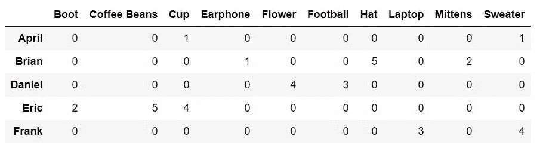

historical rated data by users to merchandises

***列*** 表示商品名称，包括“靴子”、“咖啡豆”、“杯子”、“耳机”、“花”、“足球”、“帽子”、“笔记本电脑”、“连指手套”和“毛衣”。 ***行*** 指的是用户名包括 April、Brian、Daniel、Eric 和 Frank。

**矩阵中的每个值都是用户对该行中该列商品的评分。**

然而，在实际场景中，网站通常需要支持数百万用户和商品的高吞吐量。只有用户购买的商品才能从顾客那里得到分数。很有可能我们会得到一个非常 ***大的稀疏矩阵*** ，其中的大部分值都是零。

在继续之前，让我们将问题简化为"**基于用户如何与他/她购买的商品(X)** 进行交互来对分数(Y)建模。"

这里来 2 度因式分解机的模型方程。

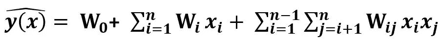

The model equation of factorization machine of 2 degrees

***看着眼熟？*** 是的，它是在线性回归的基础上增加了自变量之间的相互作用这一项而发展起来的。该等式中的 ***Wij*** 是在我们的示例中量化用户和机构之间的交互的系数。

如何估计相互作用系数 ***Wij*** 也是本文讨论的重点，也是因式分解机的显著特点。

**回到我们讨论的大型稀疏数据，如果我们直接进行系数估计会发生什么？**不难知道，由于历史数据中没有交互(用户和机构之间),大量系数将被估计为零。

如果我们还陷入直接从已知去研究未知的思维习惯，怎么给一个用户从来不评分的项目打分呢？这就是 ***因式分解机*** 的用武之地。

**“因式分解在机器中通过因式分解对交互进行建模，这允许在稀疏性下对高阶交互进行高质量的参数估计。”**

听起来很抽象？

现在就让 ***用更多的角色来丰富用户*** 的描述吧。April 是一名 26 岁的亚洲女性，是一名科学家，住在洛杉矶。四月的形象通过她的 ***性别、年龄、职业、种族和居住地*** *变得具体。*

***同样，*** 她评价的杯子是为圣诞节设计的绿色陶瓷杯，70 美元，星巴克的。杯子的更多细节被考虑进去，如 ***颜色、质地、类型、季节、价格和公司*** 。

**在系数估计中描述两个具有多重特征的自变量的过程就是因式分解的过程。**

因此，在数学中，独立变量表示如下。

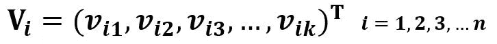

The feature vector representing independent variables

***k*** 是描述自变量的数量特征。 ***i*** 是自变量的个数。在圣诞杯四月得分的例子中，用户和商品分别有 6 个特征。

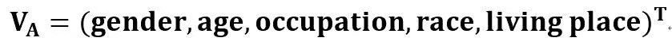

The feature vector of user

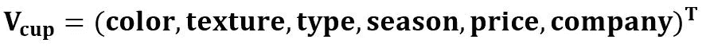

The feature vector of merchandise

因此，用户和商品之间的交互可以用下面的格式表示。

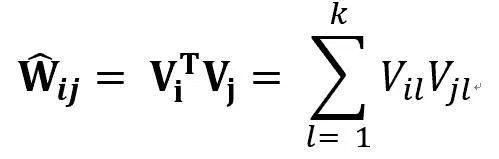

The interactions between i-th and j-th variable

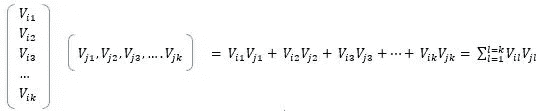

The calculation process of the interaction coefficient

模型方程可以重写如下。

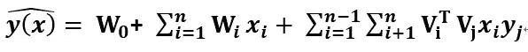

The model equation of factorization machine of 2 degrees

到目前为止，你可能想知道为什么要费心通过特征向量将变量扩展到多堆维度？痛点和策略有什么关系？

因为它们通过分解相互作用参数打破了它们的独立性。一般来说，这意味着一个相互作用的数据也有助于估计相关相互作用的参数。”

让我用我们掌握的数据来说明这一点。

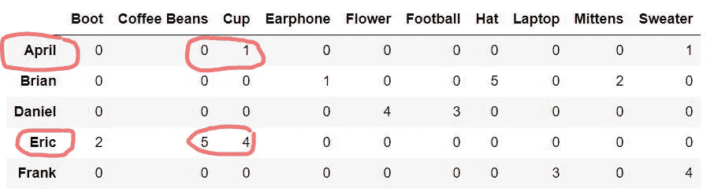

historical rated data by users to merchandises

从上面的观察来看，由**埃里克**对 ***咖啡豆*** 和 ***杯*** 的费率差不多，分别是 5(***【W(埃里克，咖啡豆)*** )和 4(***【W(埃里克，杯)*** )。于是特征向量 ***V(咖啡豆)*** 和 ***V(杯子)*** 可以视为大致相同， ***V(咖啡豆)*** = ***V(杯子)*** 。

因此 ***W(四月，咖啡豆)*** ，四月率到咖啡豆，可以推断为与***W(四月，杯)*** 相同，即 1 *。*

完美解决痛点。哈？

让我们把独立变量的所有特征向量放入矩阵。

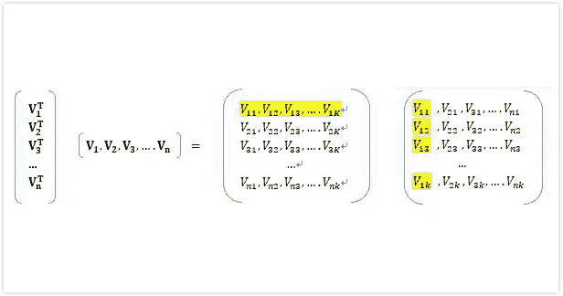

The matrix containing all feature vectors

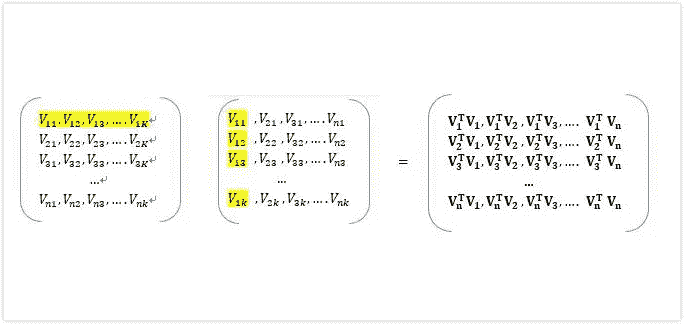

The feature vectors in matrix

***左边两个矩阵*** 是自变量特征向量的展开。

***右矩阵*** 包含两个特征向量相乘的交互系数。

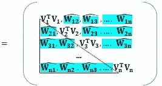

The interaction matrix of 2-degree Factorization Machine

标有蓝色的那一半矩阵正是要估计的相互作用项。

那么如何估计模型的系数呢？为什么说计算复杂度是线性的？让我们把它们放在下一篇文章中。

***简报:***

本文通过推荐系统中的一个应用场景来介绍因式分解机，通过矩阵分解来解决稀疏数据下的系数估计问题。

paper . DVI[https://www.csie.ntu.edu.tw/~b97053/paper/Rendle2010FM.pdf](https://www.csie.ntu.edu.tw/~b97053/paper/Rendle2010FM.pdf)

如果您有任何问题，请随时留下您的评论。