# 对手中稀疏的数据感到气馁？给因式分解机一个机会(2)

> 原文：<https://towardsdatascience.com/feel-discouraged-on-the-sparse-data-in-your-hand-give-factorization-machine-a-shot-2-b2e54d670cf8?source=collection_archive---------11----------------------->

打好矩阵分解的基础，你对矩阵分解概念***衍生出的一系列高级模型 ***的探索就会顺利很多，比如 LDA、LSI、PLSA、张量分解等等*** 。***

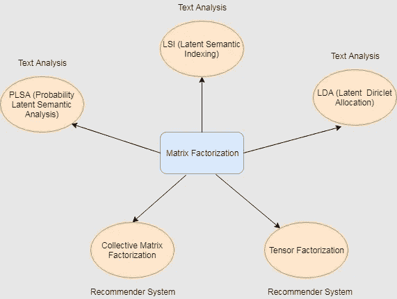

The models derived from the concept of Matrix Factorization

在[上一节](/feel-discouraged-by-sparse-data-in-your-hand-give-factorization-machine-a-shot-1-7094628aa4ff)中，我们讲过 ***因式分解机*** 背后的基础理论。今天让我们揭示模型背后的技术细节和数学。

本文将讨论两个问题:

1.  如何估算 ***因式分解机*** 的系数？随机梯度下降(SGD)？交替最小二乘法(ALS)？
2.  为什么计算复杂度是线性的？

在陷入系数估计的深渊之前，让我们先回顾一下 ***因式分解机*** 的模型[方程。](/feel-discouraged-by-sparse-data-in-your-hand-give-factorization-machine-a-shot-1-7094628aa4ff)

The model equation of Factorization Machine

***我们的目标*** 是找到最优化的系数，使得变量和真实反应之间的关系可以用最准确的方式描述。

机器 ***通过最小化*** ***损失函数*** 来学习模型的系数，该损失函数描述真实响应(地面真实值)与设计模型的估计值之间的距离。为了使概念形象化，系数更新的数学表达式如下。

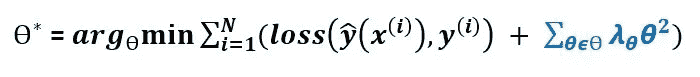

The goal of machine learning / model training

ѳ*是一组系数。标为蓝色的项目是[***L2-诺姆***](https://machinelearningmastery.com/vector-norms-machine-learning/) ***，惩罚模型的复杂性，避免*** [***过拟合***](https://machinelearningmastery.com/overfitting-and-underfitting-with-machine-learning-algorithms/) ***。*** 为了简化数学推导，下图中省略了 L2 范数。

第一个需要回答的问题就这样呈现在我们面前。 ***模型的损失函数是什么？***

1.  ***回归:*** 我们通常用最小二乘误差来处理回归问题。

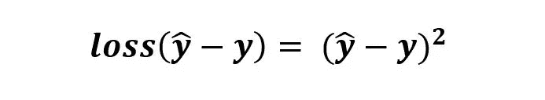

The equation of least square error

**2*。二进制分类*** : y = [-1，+1]

铰链损失或对数损失作为损失函数应用于二元分类。

***铰链损耗:***

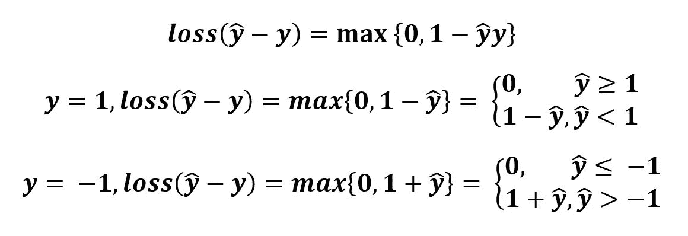

The equation of hinge loss

(y = 1)和(y = -1)下的铰链损耗如下图所示。

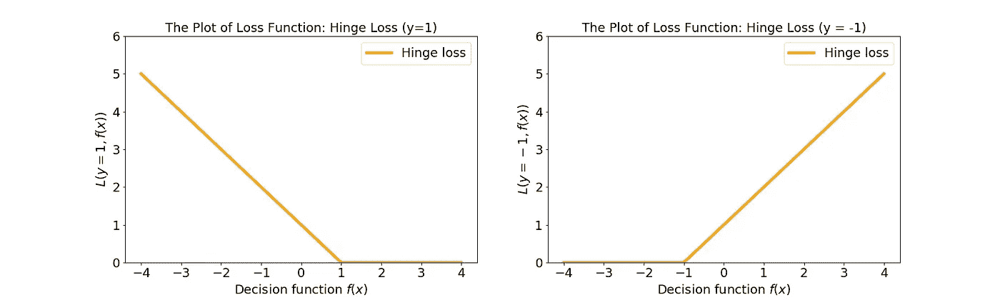

The hinge loss plot for y = 1 and y = -1

***日志丢失:***

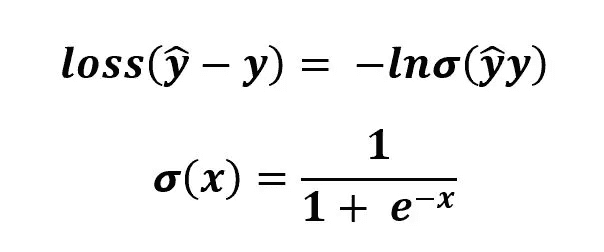

The equation of log loss

σ(x)是 sigmoid 函数。

下面是铰链损耗和对数损耗的对比图。随着估计值逐渐接近真实值，损耗变得越来越小。

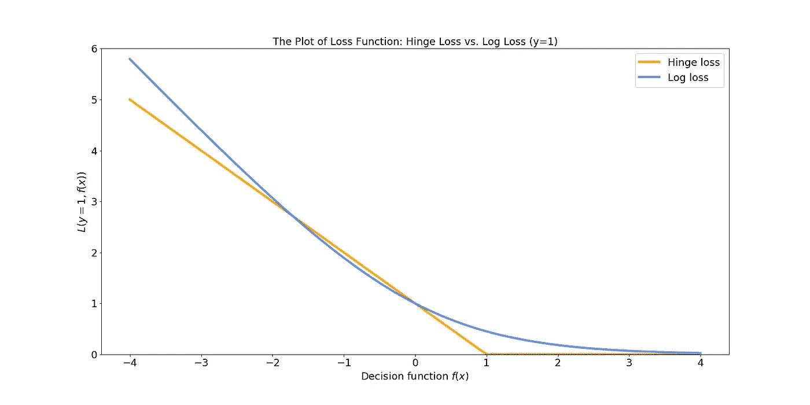

the plot of hinge loss and log loss (y = 1)

在阐明损失函数之后，**如何最小化它成为我们研究的第二个关注点。**

how to reach the bottom of valley within the shortest time?

随机[梯度下降](https://en.wikipedia.org/wiki/Gradient_descent)因其在系数优化方面的出色表现而被引入。 ***关于方法的一个很棒的比喻*** 到达谷底的最快方法(*损失函数的最小值*)就是沿着最陡的方向迈步(*迭代梯度下降法*)(*梯度的负值*)。

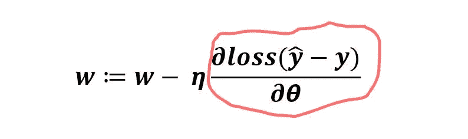

The equation of gradient descent

这个想法是以数学的方式实现的。 ***损失函数的导数*** 用红色标记圈起来代表步长方向。 ***η*** 是要走的步幅。 **w** 是要更新的权重集。

同时，**因式分解机中系数的导数/梯度成为第三个焦点**。

1.  ***对原木损耗进行分类的导数:***

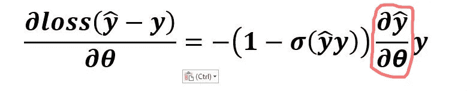

The derivative of log loss for classification

你可能想知道如何得到它。下面用 4 个步骤来说明演绎过程。

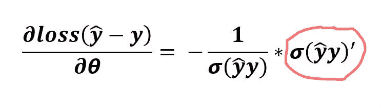

step 1

顺着逻辑， ***sigmoid 函数σ(x)*** 的导数是什么？

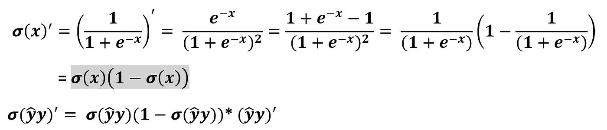

step 2

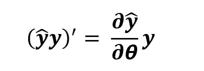

step 3

step 4

**2。*回归损失函数的导数:***

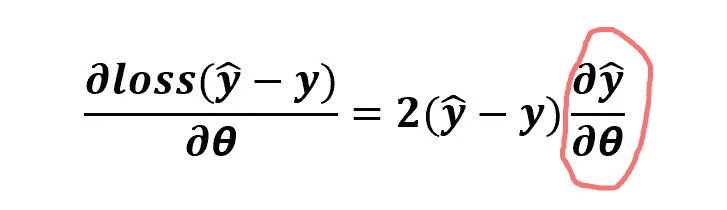

The derivative of loss function for regression

**因此，到目前为止，在**上方用红色标记圈起来的估计响应的导数被置于聚光灯下。

FM 模型的一个重要性质，**多重线性，**可以对回答这个问题做出很大的贡献。让我们重新表述方程来形象化这个概念。

1.  ***关于 FM 对* W0** 的偏导数:把 **W0** 放到一边，重新组织公式。

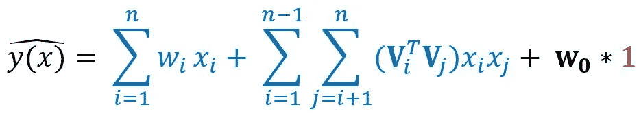

The model equation of Factorization Machine

**W0** 的 FM 的梯度/偏导数为 1。

2. ***至于 FM 对* W** *l:* 把**W** *l* 放在一边重新组织公式。

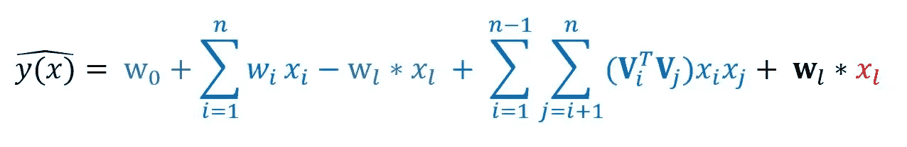

The model equation of Factorization Machine

FM 对**W**l 的梯度/偏导数为**X**l .

3.***至于 FM 对*****lm*的偏导数:把**lm*放到一边，重新组织公式。**

**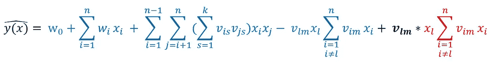**

**The model equation of Factorization Machine**

**FM 对***V****lm*的梯度/偏导数就是上式中标记为红色的项目。**

**综上所述，FM 的导数为:**

**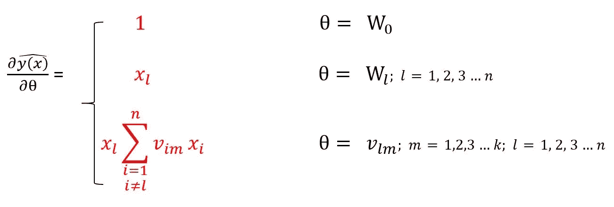**

**估计响应的导数集在随机梯度下降系数学习过程中起着重要作用。**

**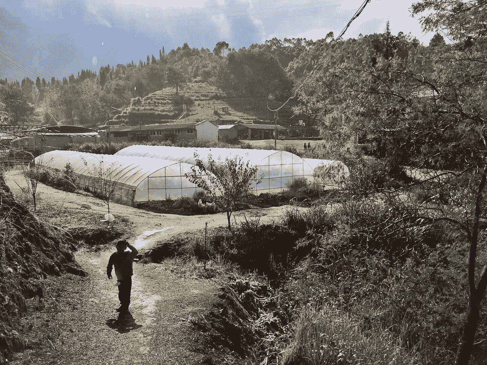**

****随机梯度下降训练因式分解机怎么样？****

**通过回顾算法中待估计的所有参数，收集了其中的 3 组参数。**

****a. W** 0:全局偏差**

****b. W** i:第 I 个变量的强度**

****c.** < **V** i， **V** j >:第 I 个和第 j 个变量之间的相互作用**

**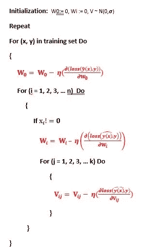**

**Iterate until stopping criterion is met**

**迭代直到满足停止标准。**

**到目前为止，接下来是关于计算次数的讨论。特征向量带来了参数数量的增加，从而增加了计算量。 ***线性时间复杂度*** 大大缓解了这个问题。**

**让我们快速反思一下模型方程(度= 2)。**

**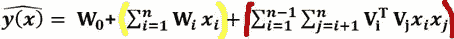**

**The model equation of Factorization Machine**

**复杂度的直接计算在 *O (k n )* 中，因为必须计算所有成对的相互作用。**

**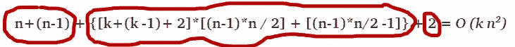**

**Time complexity of machine factorization**

**让我把时间复杂度的方程拿到显微镜下，进行详细的推导。将复杂性公式分为三部分:**

****a. n + (n-1):****

**在上述模型方程中，自变量权重的计算时间用黄色标出。**

****b . {[k+(k-1)+2]*[(n-1)* n/2]+[(n-1)* n/2-1]}:****

**模型方程中用红色表示的交互项的计算时间。**

****c. 2:****

**3 个项目的 2 次添加**

**模型方程中交互项的复杂性可能最吸引你的眼球。下面的推论会清楚地梳理你的想法。**

**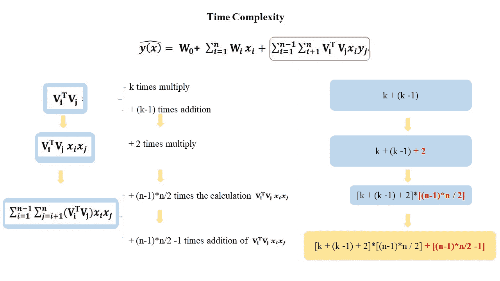**

**The deduction of complexity for interaction items in model equation**

**把其他项目的复杂程度加起来，我们就得到了整个计算结果。**

**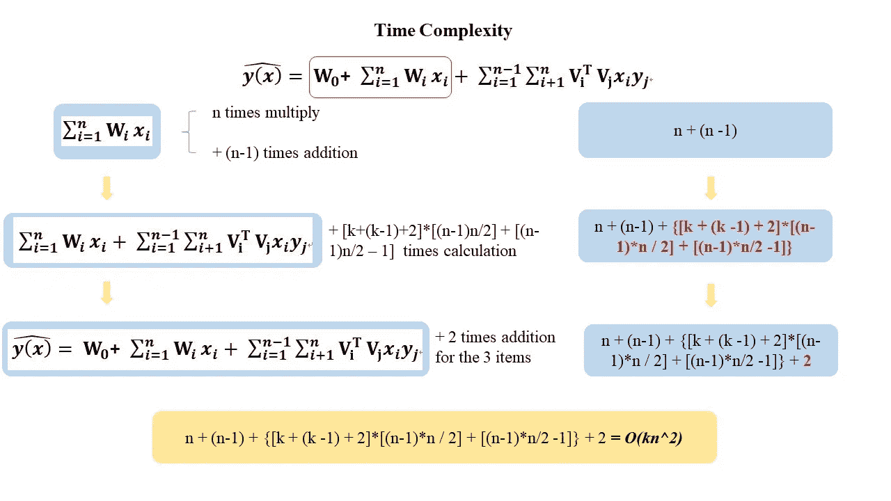**

**The deduction of complexity for the FM model**

**但是正如我们之前提到的，通过重构交互项，复杂度下降到 ***线性*** 运行时间。**

**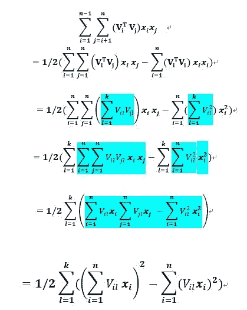**

**The reformulation of interaction items**

**方程现在在 k 和 n 中只有线性复杂度 ***O(kn)*** 。我会留给读者一个问题。遵循上面类似的逻辑，如何得到基于方程重构后的线性复杂度？稍后我会在评论区附上答案。欢迎你在这里给我留下你的评论或想法。**