# 女性 CEO 的薪酬中位数较高，但这与她们的性别有关吗？

> 原文：<https://towardsdatascience.com/female-ceos-have-a-higher-median-pay-but-is-it-related-to-their-gender-40d0662b7d4f?source=collection_archive---------1----------------------->

T 何《华尔街日报》2017 年 5 月 31 日发表文章，标题为 [*虽然寡不敌众，但女性首席执行官的收入却超过了男性首席执行官*](https://www.wsj.com/articles/women-ceos-dont-get-paid-less-than-men-in-big-business-they-make-more-1496223001) 。《华尔街日报》的分析显示，女性首席执行官的收入一再超过男性。去年，21 位女性首席执行官的薪酬中值为 1，380 万美元，而 382 位男性首席执行官的薪酬中值为 1，160 万美元。

我很好奇，也有点怀疑。当我仔细观察时，我注意到他们报告了收入的中位数。中位数比平均数更稳健，但我很好奇女性首席执行官的薪酬分布情况，并想知道这是否有所不同。由于今年标准普尔 500 公司中只有 23 名女性首席执行官，很可能这些女性只是在正确的公司，所以这一统计数据是真实的。

例如，我从数据中随机抽取了 10 个样本(占总人口的 4.6%，相当于 500 名首席执行官中的 23 名女性)，最终得出的平均值为 1397 万美元，标准差为 71 万美元，平均值为 1800 万美元，标准差为 148 万美元。从这个例子中，我们可以看到中值更加稳健，但是，仍然存在足够大的误差，足以导致 WSJ 结果中值的差异。

如果我可以建立一个 CEO 薪酬模型，这个模型是否能够使用公司排名作为输入，准确预测首席执行官的薪酬？

为了检验我的假设，我需要一些数据。我从美国劳工联合会-产业工会联合会关于首席执行官薪酬的页面上找到了一些数据，为了节省时间，我使用 ImportIO 来搜集这些数据。AFL-CIO 的数据有点大杂烩，包含 2015 年、2016 年和 2017 年的薪酬数据，所以我无法直接复制《华尔街日报》的分析，但我认为这将是一个不错的近似值。使用的所有代码(和数据！)可从我的 [GitHub repo](https://github.com/kaumaron/Data_Science/blob/master/CEO_Compensation/CEO_Compensation.ipynb) 获得。

# 快速浏览数据

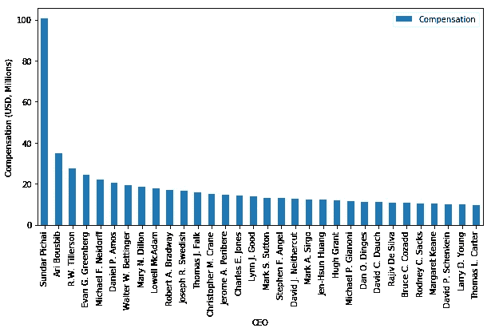

A representation of the compensations of our top 500 CEOs. We can see there’s a rapid drop off after Sundar Pichai leading to a much lower compensation package for Thomas L Carter. This representation is every 16th CEO in the data, which gives us 32 CEOs. (Interesting side note: Rex Tillerson happened to make it into this figure.)

乍一看，我很惊讶地发现数据集包含 3031 个条目，尽管我正在查看标准普尔 500 的数据。将数据限制在 500 强公司之后，是时候看一眼数据了。看左边的补偿分布，首先想到的是来自化学或者物理的[阿伦尼乌斯方程](https://en.wikipedia.org/wiki/Arrhenius_equation)(可能是因为我的生物物理化学背景)。

T 阿伦尼乌斯方程是一个指数函数，可以让你预测给定温度下的反应平衡常数(上图方程)。这个方程可以线性化，使它成为一些 OLS 回归(底部方程)的一个很好的候选。

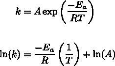

# 准备数据

在进一步考虑这个模型之前，我需要做一些数据清理。为了将数据分段，按性别区分首席执行官，我需要找出哪些是女性首席执行官。我使用[维基百科](https://en.wikipedia.org/wiki/List_of_women_CEOs_of_Fortune_500_companies)和 [Catalyst](http://www.catalyst.org/knowledge/women-ceos-sp-500?page=1) 获得了女性 CEO 的名单。使用这两个名单的理由是名字的变化，即玛丽·巴拉对玛丽·t·巴拉或帕蒂·波佩对帕特里夏·k·波佩。使用这组组合名称的目的是为了在屏蔽熊猫数据帧以找到女性首席执行官的特定数据时，最大限度地提高匹配的机会。这种方法只给了我 23 个 CEO 中的 16 个。为了找出我遗漏的数据，我用《财富》( Fortune)杂志(T10)找到了哪些公司有女性首席执行官，这最终让我找到了另外 4 家公司的数据。最终，卫报人寿保险公司的数据似乎丢失了。美国公司、格雷巴电气公司和 CH2M 希尔公司。

我们的数据中包括的女性首席执行官有:马克·v·赫德、V.M 罗梅蒂、卢英德、玛丽·t·巴拉、菲比·n·诺瓦科维奇、玛丽琳·a·休森、艾琳·罗森菲尔德、乌苏拉·m·伯恩斯、林恩·j·古德、苏珊·m·卡梅隆、维基·霍卢伯、丹尼斯·m·莫里森、芭芭拉·伦特勒、a·格雷格·伍德林、黛布拉·l·里德、伊琳·s·戈登、玛丽·a·拉辛格、谢里·麦考伊、金伯利·s·卢贝尔和约翰·p·塔格。值得注意的是，这些首席执行官中有一些是男性。我假设男性首席执行官的薪酬足够接近，我们可以直接进行替换。

# 描述数据集

H 薪酬方案的价值如何比较？使用 Pandas `describe()`函数，我们看到男性 CEO 数据包含 480 名成员，平均薪酬为 1646 万美元，中值薪酬为 1347 万美元，最小值和最大值分别为 975 万美元和 1.0063 亿美元。女性首席执行官数据包含 20 名成员，平均薪酬为 1605 万美元，中值薪酬为 1322 万美元，最小值和最大值分别为 946 万美元和 4112 万美元。

绘制样本分布和数据直方图为我们提供了这个漂亮的图形:

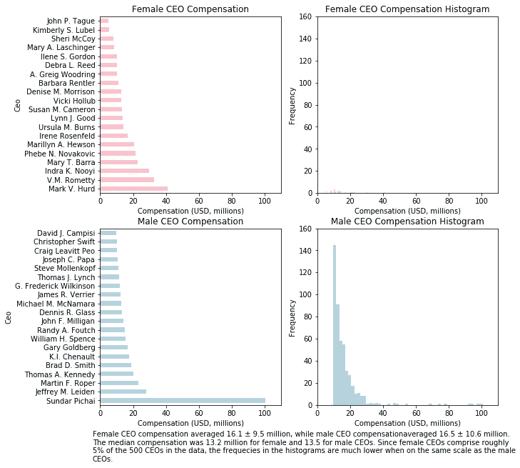

男性和女性首席执行官直方图的差异是最令人震惊的特征之一。当以同样的比例看这两张图表时，女性首席执行官的条形图几乎看不到，这戏剧性地显示了顶级公司中女性首席执行官的数量是多么少。

# 描述模型

正如我上面提到的，我怀疑阿伦尼乌斯方程是描述数据的良好基础。然而，等式本身的符号对我们的情况毫无意义。我改写了这个等式，使其采用以下形式之一:

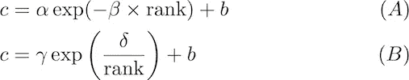

在该模型中， *c* 是高管的薪酬， *b* 是基本薪酬(最低薪酬的下限，在一些图中有时表示为 *c_0* )，α、β、γ和δ是模型中的调整参数。当我们线性化方程时，形式(A)和(B)之间的主要区别将是显而易见的。这些模型的图表看起来与数据相似。

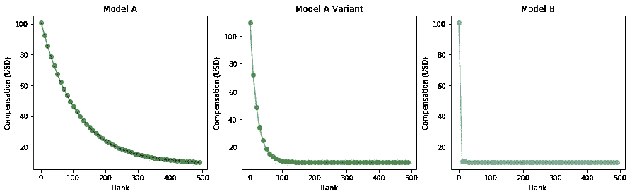

Model (A) was plotted with two different values for alpha and beta and Model (B) was only plotted for a single gamma and delta value. The values for the parameters were set by using the maximum compensation and the minimum compensation along with their respective ranks.

当我们将数据线性化时，我们得到以下方程和相应的曲线图:

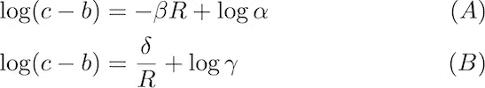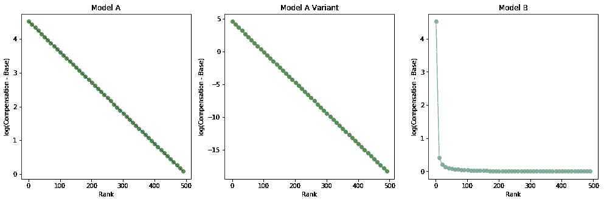

在查看线性化方程和图表后，很明显我们可以从线性回归分析中排除模型(B ),因为它与*1/等级*成比例，而不是与*等级*成比例。

# 建立回归模型

I 通过从补偿中减去基数，将补偿数据转换为线性形式，并取对数。由于基数是最低补偿的下限，我们避免了 log(0)未定义的问题。log( *c-b* )对*排名*的曲线大部分是线性的，但对于前 50 名左右的公司来说，有一些非常非线性的点。

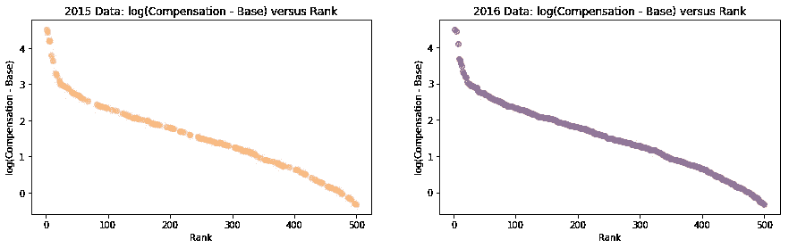

Plots of the 2015 and 2016 CEO data after being linearized.

转换完数据后，我把数据集分成两部分。我做了一份只有女性 CEO 数据的副本，另一份有男性 CEO 数据的副本。女性首席执行官的数据将被用作抵制测试集。我还使用了样本量为 33%的 sci-kit 的`train_test_split`函数来创建使用男性 CEO 数据的训练和测试集。

通过使用训练数据和 sci-kit learn `LinearRegression(normalize=True)`模型拟合归一化的 OLS 模型。模型的最佳拟合线是 log *(c-b) = -0.00636 秩+ 3.108* 。使用测试数据，模型的均方误差为 0.0487，r 平方值为 0.957。使用女性首席执行官抵制测试数据，模型表现稍好，均方误差为 0.0198，r 平方值为 0.9581。

看一看残差显示，在排名分布的末端，即前 10%和后 10%的公司，肯定存在一些非线性行为。

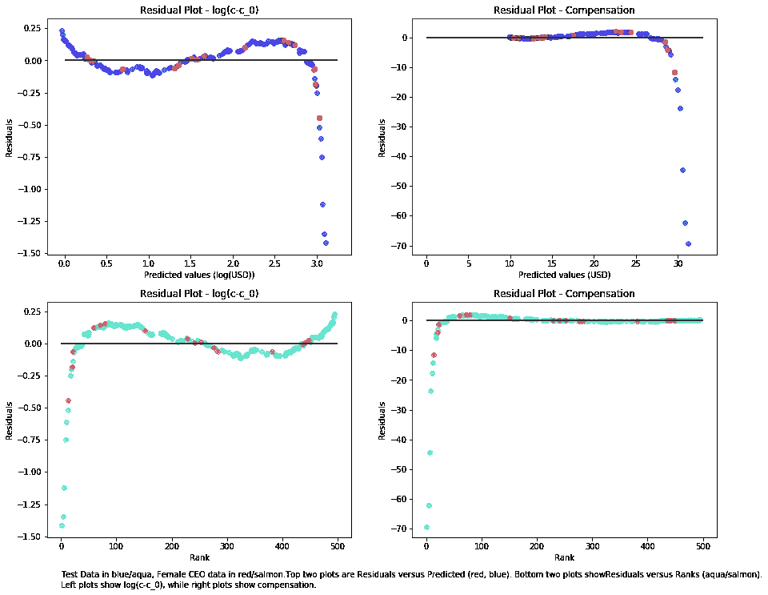

为了改进模型，我决定尝试一个更稳健的回归变量，Huber 回归变量。我交叉验证了ε和α参数并选定了

`HuberRegressor(alpha=71.428600000000003, epsilon=9.2000000000000064,
fit_intercept=True, max_iter=100, tol=1e-05, warm_start=False)`。(alpha 和 epsilon 值的长尾是浮点伪像。)

以与之前相同的方式拟合`HuberRegressor`，我们得到 log(*c-b*)=*-0.00636 rank+3.108*！这和我们在 OLS 得到的模型一样。我计划尝试 RANSAC 和 Theil-Sen 回归，但考虑到 Huber 模型与 OLS 模型相同，我觉得没有必要。创建 OLS 模型的下一步可能是利用一些高阶项或使用`[sklearn.preprocessing](http://scikit-learn.org/stable/modules/classes.html#module-sklearn.preprocessing).[PolynomialFeatures](http://scikit-learn.org/stable/modules/generated/sklearn.preprocessing.PolynomialFeatures.html#sklearn.preprocessing.PolynomialFeatures)`对数据进行预处理。

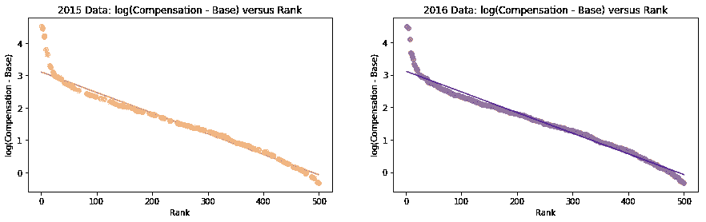

The 2015 and 2016 CEO data plotted with the Huber/OLS model as a solid line.

# 更进一步:树模型

我想看看我是否能使用不同类别的模型做出更好的估计。我选择决策树有两个原因:数据的非线性无关紧要，决策树可以产生容易理解的输出。

开始时，我使用了 sci-kit 的`tree.DecisionTreeRegressor`，其`max_depth`为 4。完整的回归变量看起来是
`DecisionTreeRegressor(criterion='mse', max_depth=4, max_features=None,
max_leaf_nodes=None, min_impurity_split=1e-07, min_samples_leaf=1, min_samples_split=2, min_weight_fraction_leaf=0.0, presort=False, random_state=None, splitter='best')`

当模型符合数据时，树看起来像这样:

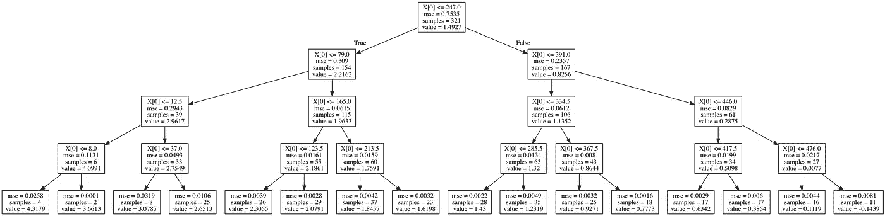

它给出的预测也不是那么糟糕:

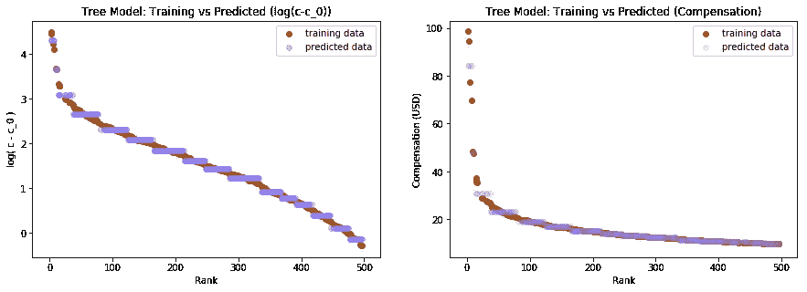

模型的 MSE 对于测试数据是 8.29 x 10⁴，对于维持数据是 0.0164。

在使用交叉验证优化树模型的`max_depth`之后，我发现最佳数量在 10 到 11 个决策层之间变化。该模型的图形是

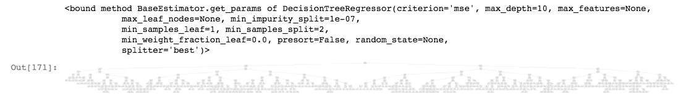

A screenshot of the model. The actual image was way too big to put on Medium. You can view the rotated version on the [GitHub page](https://github.com/kaumaron/Data_Science/blob/04c650884f76920b10ce00ad27fce42e771c9f34/CEO_Compensation/TreeDepth11_rot.png).

这个模型的预测要好得多。测试数据的模型 MSE 为 0.000994，维持数据的模型 MSE 为 0.00213。数据用下面的预测绘制:

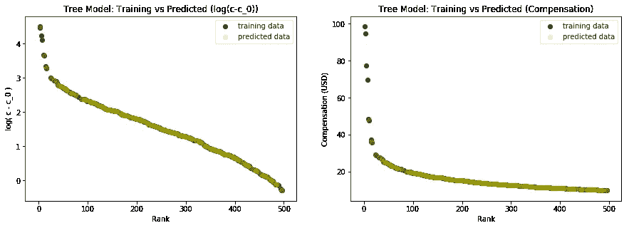

Predicted values (mustard yellow) overlaid on the training data (hunter green) for the tree model with a max_depth of 11.

# 结论

基于线性和 Huber 回归模型以及树形模型的预测质量，我认为数据表明公司的排名是 CEO 薪酬的良好预测指标。这并不能证明 CEO 的性别没有影响，但这确实降低了这一论点的分量。

为了进一步分析，我将使用 sci-kit 的`PolynomialFeatures`进行实验，看看这是否会提高线性模型的拟合度。我还会添加一个虚拟变量来表示 CEO 的性别，并探究该术语的权重大小。看看回归模型是否可以通过使用树模型作为管道的一部分来改进也是很有趣的。

**有什么建议吗？我很想听听你的想法，无论如何，我可以改进我的分析。请留言评论！**还记得**吗，我在项目的 [GitHub Repo](https://github.com/kaumaron/Data_Science/tree/04c650884f76920b10ce00ad27fce42e771c9f34/CEO_Compensation) 中包含了我使用的数据和全部代码。**