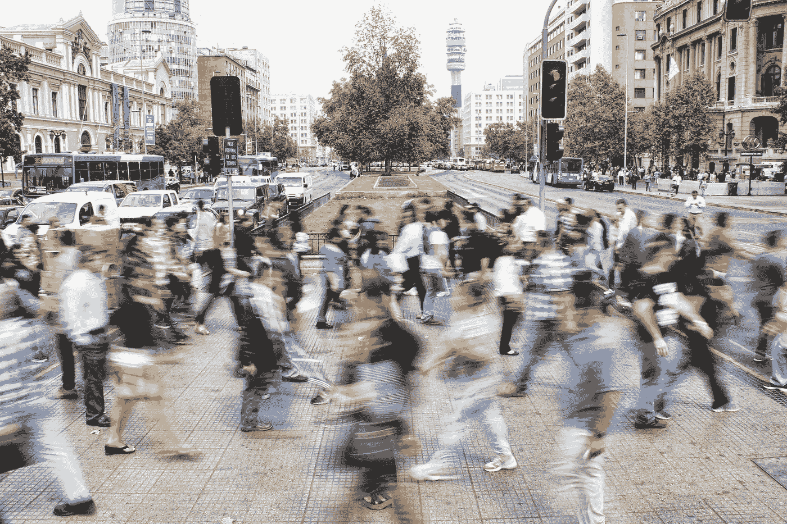
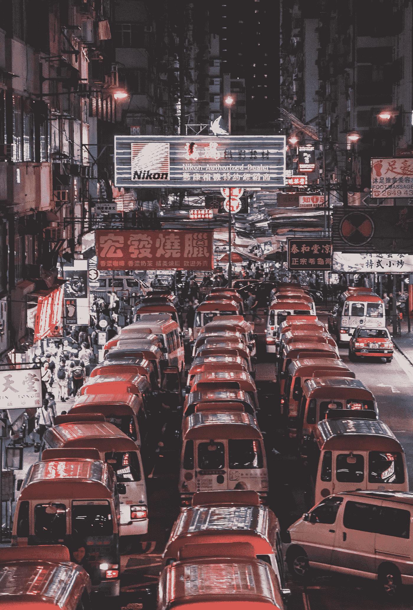

# 人工智能和大数据可以改变交通违法区域的几种未来方式开始遵守交通规则

> 原文：<https://towardsdatascience.com/few-futuristic-ways-ai-and-big-data-can-convert-law-breaking-regions-of-traffic-start-following-ba11574681ed?source=collection_archive---------15----------------------->

由**赛卡特** [和**苏坎特**库拉纳](https://medium.com/u/6d41261644a8?source=post_page-----ba11574681ed--------------------------------)

Photo by [mauro mora](https://unsplash.com/photos/31-pOduwZGE?utm_source=unsplash&utm_medium=referral&utm_content=creditCopyText) on [Unsplash](https://unsplash.com/search/photos/traffic?utm_source=unsplash&utm_medium=referral&utm_content=creditCopyText)

自 1912 年莱斯特·威尔发明了第一个交通灯以来，情况已经发生了变化，当时他希望它能够向行人和车辆发出信号，要求他们遵循和遵守新制定的道路运输规则和条例。虽然信号传递被证明是成功的，但另一半却没有。

在当今时代，交通已经成为一个经常发展的问题，更是一个所有人口高度密集的主流城市都面临的危险问题。每天，人口呈指数级增长，而道路的大小和管理它们的人员却没有增加，将像班加罗尔这样有湖泊、花园和宁静气氛的城市变成了一个负担过重的城市，无法应对沸腾的权力。

那么，是交通专家睡着了，导致了这场混乱吗？不，这不是所有地方的问题。例如，正如文章“米佐拉姆的驾车者如何遵循一个简单的规则来避免交通堵塞&确保道路无拥堵”[1]中所述，我们可以从视频中推断出那里的交通管理比混乱的印度其他地方更好，其中包括四轮车和两轮车在他们应该驶入的地方有自己的一侧。不用着急，因为所有的车辆都保持稳定的速度，不会互相超车，这足以让任何一辆来自另一条车道的摩托车小心翼翼地开到属于摩托车手的右车道。这种理解的表现是我们解决这一全球性问题的一种方式。

但是，这真的能在各地推行吗？让我们以印度为例，它是人口密度最高的国家之一，却缺乏交通纪律。在德里、班加罗尔、加尔各答、孟买等许多城市，来自不同文化背景的人们在沟通和合作方面仍然存在差距，每个人都有不同的思维方式和需要解决的不同问题。要开发一个中央集权的系统并解决这个问题，我们需要比简单的人类警察管理或人民教育更多的力量。

让我们思考一下这个问题，因为它不仅仅是“交通管理”。我们谈论的是当今城市中非常缺乏的刑事执法。就在最近，我们读到了一篇新闻报道——“一辆汽车在 Wawa 外被盗，车内有两个孩子”[2]。一名妇女将车停在停车场，带着两个孩子快速跑进一家商店，当她五分钟后到达时，车和孩子都不见了。

在最近的交通规则执行调查[3]中，古吉拉特邦 83%的人懒得遵守交通规则，比如戴头盔，这最终会导致他们“把脑袋埋在沙子里”。2016 年，古吉拉特邦有 8136 人在街头事故中丧生，大量死亡是由于伤亡人员没有戴帽子或安全带。

虽然在某些领域人口过多是不利的，但在交通管理领域可能并非如此。直到最近，我们一直试图用人力来解决交通管理问题，虽然我们在一些地方取得了成功，但我们大多都失败了。然而，在这个领域采取大数据和人工智能的方法可以为我们提供不同的结果。

Photo by [Richard Lee](https://unsplash.com/photos/y2Xli0JFaCc?utm_source=unsplash&utm_medium=referral&utm_content=creditCopyText) on [Unsplash](https://unsplash.com/search/photos/traffic?utm_source=unsplash&utm_medium=referral&utm_content=creditCopyText)

我们人类相信我们个人是理性的，然而在集体的场景中，非理性似乎扮演了主要角色，交通管理问题就是证明。为了个人利益的一次自私的超车，或者甚至是一次刹车合并，它会发出一连串的刹车，形成一个链条，吞没所有的交通。然而，人工智能(AI)可以提供帮助。

在迈克尔·伯恩的一篇题为“新的人工智能算法击败了世界上最糟糕的交通”[4]的文章中。他写道，只有 10%的汽车必须连接到网络才能工作。但是这到底是怎么回事呢？

判断力对驾驶有很大影响。人们是贪婪的，他们倾向于主要为自己而不是全人类做好事。这是交通堵塞首先发生的原因之一。但是，如果有一天我们完全从这个系统中移除人类思维，并引入另一个复杂的网络，该网络将连接到运行在其上的每一辆汽车，做出对所有汽车都最优的决策，每一秒钟提供最佳解决方案，会怎么样？那不是很神奇吗？

大多数情况下，事故的发生是因为一些人在开车时睡着了，在酒精或睡意的影响下。然而，假设我们将整个系统自动化，使其根据特定的环境做出正确的决定，并根据以前的经验进行学习，这些问题就永远不会出现。

人工智能需要大数据来做出判断。假设，有一辆自动驾驶汽车在人工智能上运行，它可以规划路线，并相应地在街道上安全移动。这种自动驾驶汽车将如何做出判断，例如从哪里左转，如何避免碰撞，交通信号的状态如何，是否应该根据道路上的交通密度停止或继续移动或加速？对于这些场景和许多其他场景，人工智能需要大量数据的输入——主要来自传感器，来自它所属的网络，反馈机制，等等。所有这些数据都不是相同的格式，因为我们从不同的来源获取数据，因此不能以相同的方式处理。要分析如此大量的非结构化数据，会成为一个大数据问题。

随着世界的增长，数据也在增长，人工智能是一种让连接的机器能够学习、进化和增长的技术，而这只能通过“通过递归实验和人类干预重复和持续更新数据库”来实现[5]。

让我们看看迄今为止一些成功的尝试。Drive.ai 是一家使用深度学习的自主自动驾驶车辆软件创业公司。它专注于“汽车理解周围环境并做出决策所必需的软件”[6]。通过深度学习，人类大脑的工作可以被复制，以便产生可以解决复杂问题的程序。

但是这一切和犯罪有什么关系呢？让我们看看 AI 与大数据结合时的潜力。我们处理的是不遵守规则的流量，这是因为我们给了他们遵守或不遵守规则的选择。如果我们取消这个选项，让一切都自主化，那么人们将不得不接受正在发生的事情，系统非常详细，交通问题的几率将趋于零。现在，这种情况可能只是一个梦想，但不会太久。有些人甚至会认为这是一场噩梦。

你可能会问，我们如何强迫人们只使用自动驾驶汽车，如果他们中的一些人不同意，他们想自己驾驶汽车怎么办？是的，可能是这样。人们大多不会很快接受变化。必须向他们证明，如果建立新系统，它将比现有系统更好，这样它将防止各种不可预见的事件，并降低整体犯罪率。这可能不仅仅是为了驾驶，有了人工智能和大数据，我们可以让车辆的所有部分都变得智能。接下来会发生什么，假设有人试图闯入你的车，他们打破了窗户，你的车会自动向你发出警告信号或某种信息，或者会启动某种紧急协议，阻止罪犯实现他/她想要的。

通过适当的强化学习，这些汽车将被训练在所有类型的地形上行驶，从而消除了我们驾驶它的麻烦。

现在想象一下这样一个系统可以实现什么。如果我们能制造自动警车或机器人，我们就能阻止整个城市的几乎所有犯罪。这是一个遥远的乌托邦或反乌托邦的未来，但却是一个有趣的想法。通过适当的数据挖掘，我们可以实时分析过去几年发生的和现在正在发生的犯罪，可以构建一个系统来分析和发现什么类型的犯罪发生在城市的什么区域。将警力分配到适当的位置并不像我们上面想的那样超前，而是可以很容易实现的事情。这是初创企业应该抓住的一个想法，否则我们可能会自己动手。

这个系统不仅仅可以用于犯罪，我们可以将这个人工智能集成到救护车上。在过去几年中，由于救护车延误，数千人已经死亡。这个人工智能可以做的是，当救护车在街上时，增加救护车的优先级，因此周围的所有其他车辆都将减速并有效地定位自己，以构建一条无障碍的路径，使救护车比平时更快地到达医院。这将在拥挤的城市如加尔各答、孟买、班加罗尔等每年拯救数百人的生命。

不管我们愿不愿意，下一代即将到来。人口每月呈指数增长，只有一种方法可以优化我们的生存——通过智能，即使是人工的。我们很多人不会马上接受这些变化，因为我们已经习惯了。但我们都不得不同意——人类是不可靠的。现在我不是说机器不是，而是改变所有人类的行为和改变少数机器的行为——我们都知道哪一个是可行的。

参考资料:

[1]

[https://www . thebetterindia . com/98500/mizo ram-traffic-management/](https://www.thebetterindia.com/98500/mizoram-traffic-management/)

米佐拉姆的司机如何遵循一个简单的规则来避免交通堵塞&确保道路畅通

经过

Lekshmi Priya S

[2]

[https://www . Delaware online . com/story/news/crime/2018/01/05/car-stopped-two-kids-inside/1006445001/](https://www.delawareonline.com/story/news/crime/2018/01/05/car-stolen-two-kids-inside/1006445001/)

车在瓦瓦外面被偷，里面有两个孩子

经过

约瑟芬·彼得森，新闻杂志

[3]

[https://timesofindia . India times . com/city/vado Dara/83-gujaratis-don ' t-give-two-hoots-to-traffic-rules/articleshow/62360310 . CMS](https://timesofindia.indiatimes.com/city/vadodara/83-gujaratis-dont-give-two-hoots-to-traffic-rules/articleshow/62360310.cms)

83%的古吉拉特人根本不在乎交通规则

经过

图沙尔泰雷| TNN

[4]

[https://motherboard . vice . com/en _ us/article/jp3d n7/new-ai-algorithm-beats-even-the-world-worst-traffic](https://motherboard.vice.com/en_us/article/jp3dn7/new-ai-algorithm-beats-even-the-worlds-worst-traffic)

新的人工智能算法甚至打败了世界上最糟糕的交通

经过

迈克尔·伯恩

[5]

[https://hacker noon . com/how-big-data-is-empowering-ai-and-machine-learning-4e 93 a 1004 c8 f](https://hackernoon.com/how-big-data-is-empowering-ai-and-machine-learning-4e93a1004c8f)

大数据是如何赋能 AI 和机器学习的？

经过

史蒂文·汉森

[6]

[https://Mashable . com/2017/09/28/drive ai-lyft-deal/# k 0 ugocxpmmqr](https://mashable.com/2017/09/28/driveai-lyft-deal/#k0UGocXpMmqr)

Drive.ai 是自动驾驶汽车领域炙手可热的新公司

经过

贾森

—

关于:

Saikat Bhattacharyya 先生是一名研究人员，与 Sukant Khurana 博士一起研究人工智能和大数据在打击犯罪中的应用。

Sukant Khurana 博士经营着一个学术研究实验室和几家科技公司。他也是著名的艺术家、作家和演说家。你可以在 www.brainnart.com[或 www.dataisnotjustdata.com](http://www.brainnart.com)了解更多关于苏坎特的信息，如果你希望从事生物医学研究、神经科学、可持续发展、人工智能或数据科学项目，为公众谋福利，你可以在 skgroup.iiserk@gmail.com 联系他，或者通过 LinkedIn[https://www.linkedin.com/in/sukant-khurana-755a2343/](https://www.linkedin.com/in/sukant-khurana-755a2343/)联系他。

这里有两个关于 Sukant 的小纪录片和一个关于他的公民科学努力的 TEDx 视频。

 [## Sukant khu Rana(@ Sukant _ khu Rana)|推特

### Sukant Khurana 的最新推文(@Sukant_Khurana)。创始人:https://t.co/WINhSDEuW0 和 3 家生物技术创业公司…

twitter.com](https://twitter.com/Sukant_Khurana)